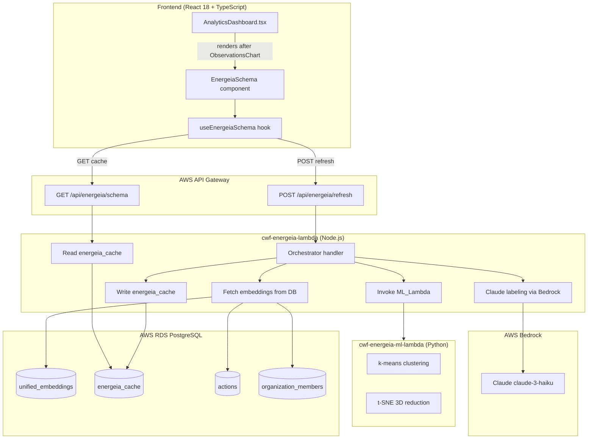
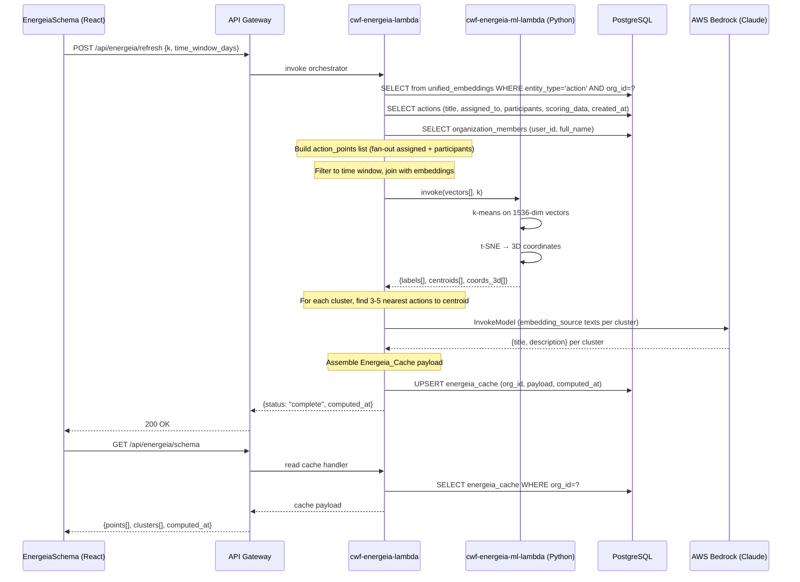
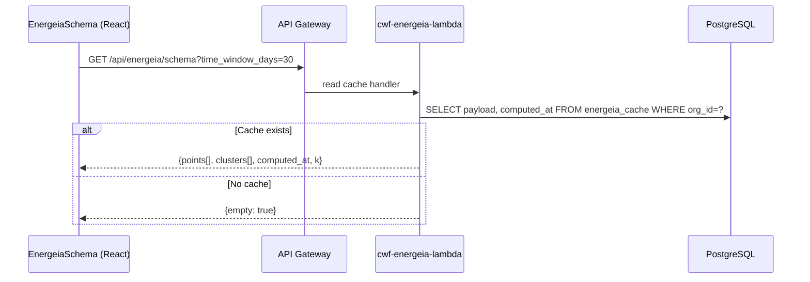

# Design Document: The Energeia Schema (action-inferred-roles)

## Overview

The Energeia Schema is an analytics visualization that reveals the visible shape of organizational energy — what people are actually doing, not what they could do. It clusters all organizational actions within a configurable time window using k-means on existing 1536-dimensional embeddings from the `unified_embeddings` table, reduces them to 3D coordinates via t-SNE, and renders the result as an interactive point cloud in the Analytics Dashboard.

Each point in the cloud represents one action-person relationship (either `assigned` or `participant`). Clusters are labeled by Claude (AWS Bedrock) with inferred role titles and energeia descriptions, surfacing the emergent roles the organization is actually performing.

### Key Design Decisions

1. **Python ML_Lambda for ML math only** — k-means and t-SNE are implemented in a new Python Lambda (`cwf-energeia-ml-lambda`) using `scikit-learn`. All other pipeline logic (data fetching, Claude labeling, cache writes) stays in Node.js, consistent with the existing stack.
2. **Reuse `unified_embeddings`** — No new embedding generation. The pipeline reads existing 1536-dim vectors from `unified_embeddings` where `entity_type = 'action'`.
3. **Database cache** — Results are stored in a new `energeia_cache` table (org-scoped, JSONB payload). Page loads read from cache; Refresh triggers a new compute run.
4. **On-demand compute** — No scheduled jobs. The user clicks Refresh to trigger the pipeline.
5. **React Three Fiber** — The 3D visualization uses `@react-three/fiber` + `@react-three/drei`, consistent with the agreed design decisions.
6. **New Node.js orchestration Lambda** — A new `cwf-energeia-lambda` handles the orchestration: fetching embeddings, invoking ML_Lambda, calling Claude, writing cache. This keeps the analytics Lambda focused on its existing responsibilities.

---

## Architecture

### System Component Diagram



### Data Flow: Refresh Pipeline



### Data Flow: Page Load (Cache Read)



---

## Components and Interfaces

### Backend: Lambda Functions

#### `cwf-energeia-lambda` (Node.js — new)

Handles two routes:

| Method | Path | Description |
|--------|------|-------------|
| GET | `/api/energeia/schema` | Read energeia_cache for org |
| POST | `/api/energeia/refresh` | Trigger full pipeline |

**Directory:** `lambda/energeia/`

**Handler structure:**
```
lambda/energeia/
  index.js          — route dispatcher
  handlers/
    getSchema.js    — read cache
    refresh.js      — orchestrate full pipeline
  lib/
    db.js           — pg client (shared pattern from analytics lambda)
    mlClient.js     — invoke cwf-energeia-ml-lambda via AWS SDK
    bedrockClient.js — Claude labeling
    cacheWriter.js  — upsert energeia_cache
  package.json
```

**`POST /api/energeia/refresh` request body:**
```json
{
  "k": 8,
  "time_window_days": 30
}
```

**`GET /api/energeia/schema` response:**
```json
{
  "data": {
    "computed_at": "2025-01-31T10:00:00Z",
    "k": 8,
    "time_window_days": 30,
    "points": [
      {
        "id": "action-uuid::person-uuid",
        "action_id": "uuid",
        "person_id": "uuid",
        "person_name": "Alice",
        "relationship_type": "assigned",
        "cluster_id": 3,
        "x": 1.23,
        "y": -0.45,
        "z": 2.11,
        "bloom_level": 4,
        "action_title": "Prune banana trees"
      }
    ],
    "clusters": [
      {
        "id": 3,
        "title": "Field Cultivation",
        "description": "Hands-on agricultural work focused on crop maintenance and soil health.",
        "centroid_x": 1.1,
        "centroid_y": -0.3,
        "centroid_z": 2.0
      }
    ]
  }
}
```

#### `cwf-energeia-ml-lambda` (Python — new)

Performs only ML math. Invoked synchronously by `cwf-energeia-lambda` via `lambda:InvokeFunction`.

**Directory:** `lambda/energeia-ml/`

```
lambda/energeia-ml/
  handler.py        — entry point
  ml/
    clustering.py   — k-means via scikit-learn
    reduction.py    — t-SNE via scikit-learn
  requirements.txt  — scikit-learn, numpy
```

**Input event:**
```json
{
  "vectors": [[0.1, 0.2, ...], ...],
  "entity_ids": ["uuid1", "uuid2", ...],
  "k": 8
}
```

**Output:**
```json
{
  "labels": [3, 0, 1, ...],
  "centroids": [[0.05, 0.18, ...], ...],
  "coords_3d": [[-1.2, 0.4, 2.1], ...]
}
```

**Runtime:** Python 3.12  
**Memory:** 1024 MB (scikit-learn + numpy for potentially large vector arrays)  
**Timeout:** 5 minutes (t-SNE on large datasets can be slow)  
**Deploy:** `./scripts/deploy/deploy-lambda-with-layer.sh energeia-ml cwf-energeia-ml-lambda` (Python layer with scikit-learn)

### Frontend Components

#### Component Tree

```
AnalyticsDashboard.tsx
└── EnergeiaSchema/
    ├── EnergeiaSchema.tsx          — top-level card, controls, state
    ├── EnergeiaMap.tsx             — React Three Fiber canvas
    │   ├── ActionPointCloud.tsx    — instanced mesh for all action points
    │   ├── CentroidStars.tsx       — glowing star nodes for cluster centroids
    │   ├── HoverTooltip.tsx        — 3D-to-2D projected tooltip overlay
    │   └── SceneControls.tsx       — OrbitControls + auto-rotation logic
    ├── EnergeiaControls.tsx        — k slider, color mode, filter panel
    └── EnergeiaEmptyState.tsx      — empty state when no cache exists
```

#### `EnergeiaSchema.tsx`

Top-level component. Reads from `useEnergeiaSchema` hook. Renders the Card wrapper, controls, and the Three.js canvas. Placed after `<ObservationsChart />` in `AnalyticsDashboard.tsx`.

Props: `startDate: string`, `endDate: string`, `selectedUsers: string[]`

#### `EnergeiaMap.tsx`

The React Three Fiber `<Canvas>` component. Receives the processed point data and renders the 3D scene.

```tsx
interface EnergeiaMapProps {
  points: ActionPoint[];
  clusters: ClusterInfo[];
  colorMode: 'cluster' | 'person' | 'accountable';
  filters: EnergeiaFilters;
  onPointClick: (actionId: string) => void;
}
```

#### `useEnergeiaSchema` hook

Manages all data fetching and refresh state. Follows the existing TanStack Query patterns in the codebase.

```typescript
interface UseEnergeiaSchemaOptions {
  timeWindowDays?: number;
  k?: number;
}

interface UseEnergeiaSchemaResult {
  data: EnergeiaSchemaData | null;
  isLoading: boolean;
  isRefreshing: boolean;
  isEmpty: boolean;
  computedAt: string | null;
  refresh: () => Promise<void>;
}
```

**Query key:** `['energeia-schema', organizationId]`

On mount: fires `GET /api/energeia/schema` to read cache.  
On `refresh()`: fires `POST /api/energeia/refresh`, then invalidates the query key to re-read the updated cache.

---

## Data Models

### New Database Table: `energeia_cache`

```sql
CREATE TABLE energeia_cache (
  id              UUID PRIMARY KEY DEFAULT gen_random_uuid(),
  organization_id UUID NOT NULL REFERENCES organizations(id),
  k               INTEGER NOT NULL,
  time_window_days INTEGER NOT NULL DEFAULT 30,
  payload         JSONB NOT NULL,
  computed_at     TIMESTAMP WITH TIME ZONE NOT NULL DEFAULT NOW(),
  created_at      TIMESTAMP WITH TIME ZONE NOT NULL DEFAULT NOW(),
  updated_at      TIMESTAMP WITH TIME ZONE NOT NULL DEFAULT NOW(),
  UNIQUE (organization_id)
);

CREATE INDEX idx_energeia_cache_org_id ON energeia_cache(organization_id);
```

One row per organization (UNIQUE constraint). Refresh does an `INSERT ... ON CONFLICT (organization_id) DO UPDATE`.

### `payload` JSONB Schema

```typescript
interface EnergeiaPayload {
  k: number;
  time_window_days: number;
  points: ActionPoint[];
  clusters: ClusterInfo[];
}

interface ActionPoint {
  id: string;              // "{action_id}::{person_id}"
  action_id: string;
  person_id: string;
  person_name: string;
  relationship_type: 'assigned' | 'participant';
  cluster_id: number;
  x: number;
  y: number;
  z: number;
  bloom_level: number;     // 0–6, derived from scoring_data
  action_title: string;
}

interface ClusterInfo {
  id: number;
  title: string;           // Claude-generated, 2-3 words
  description: string;     // Claude-generated, one sentence
  centroid_x: number;
  centroid_y: number;
  centroid_z: number;
}
```

### Bloom Level Derivation

The `bloom_level` is derived from `actions.scoring_data` (JSONB). The existing scoring system stores Bloom taxonomy levels. The orchestration Lambda extracts the highest Bloom level present in `scoring_data.bloom_levels` (or `scoring_data.level`), defaulting to 1 if absent. This maps to point size in the visualization (level 1 = smallest, level 6 = largest).

### TypeScript Types (Frontend)

```typescript
// src/types/energeia.ts

export interface ActionPoint {
  id: string;
  action_id: string;
  person_id: string;
  person_name: string;
  relationship_type: 'assigned' | 'participant';
  cluster_id: number;
  x: number;
  y: number;
  z: number;
  bloom_level: number;
  action_title: string;
}

export interface ClusterInfo {
  id: number;
  title: string;
  description: string;
  centroid_x: number;
  centroid_y: number;
  centroid_z: number;
}

export interface EnergeiaSchemaData {
  computed_at: string;
  k: number;
  time_window_days: number;
  points: ActionPoint[];
  clusters: ClusterInfo[];
}

export interface EnergeiaFilters {
  personIds: string[];
  relationshipTypes: ('assigned' | 'participant')[];
  timeWindowDays: number;
}
```

---

## React Three Fiber Implementation

### Canvas Setup

```tsx
// EnergeiaMap.tsx
import { Canvas } from '@react-three/fiber';
import { OrbitControls, Stars } from '@react-three/drei';

<Canvas
  camera={{ position: [0, 0, 30], fov: 60 }}
  style={{ background: '#050510', height: '600px' }}
  gl={{ antialias: true }}
>
  <ambientLight intensity={0.3} />
  <pointLight position={[10, 10, 10]} intensity={1} />
  <Stars radius={100} depth={50} count={3000} factor={4} fade />
  <ActionPointCloud points={filteredPoints} colorMode={colorMode} onPointClick={onPointClick} />
  <CentroidStars clusters={clusters} />
  <HoverTooltip hoveredPoint={hoveredPoint} hoveredCluster={hoveredCluster} />
  <SceneControls />
</Canvas>
```

### `ActionPointCloud` — Instanced Mesh

Uses `THREE.InstancedMesh` for performance with potentially thousands of points. Each instance is a small sphere. Color and scale are set per-instance via `setColorAt` and `setMatrixAt`.

```tsx
// ActionPointCloud.tsx
import { useRef, useMemo } from 'react';
import { useFrame } from '@react-three/fiber';
import * as THREE from 'three';

// Point size: bloom_level maps to radius 0.08 (level 1) → 0.22 (level 6)
const bloomToSize = (level: number) => 0.06 + (level / 6) * 0.16;

// Color palettes per color mode
const CLUSTER_COLORS = [/* 12 distinct hues */];
const PERSON_COLORS  = [/* derived from person_id hash */];
```

Raycasting for hover/click is handled via `onPointerMove` and `onClick` on the instanced mesh, using `instanceId` to look up the corresponding `ActionPoint`.

### `CentroidStars` — Glowing Nodes

Each cluster centroid is rendered as a `<mesh>` with a `THREE.SphereGeometry` and a custom emissive material to create a glow effect. `@react-three/drei`'s `<Html>` component renders the cluster label as a DOM tooltip on hover.

```tsx
// CentroidStars.tsx — one glowing sphere per cluster centroid
// Uses drei <Html> for label overlay on hover
// Emissive color matches the cluster's color in the point cloud
```

### `SceneControls` — Auto-rotation + Orbital Controls

```tsx
// SceneControls.tsx
import { OrbitControls } from '@react-three/drei';
import { useRef, useState } from 'react';
import { useFrame } from '@react-three/fiber';

// Auto-rotation: rotates the scene group at 0.002 rad/frame
// Pauses on pointer down, resumes after 3s idle
// OrbitControls: drag=rotate, scroll=zoom, right-drag=pan
```

### `HoverTooltip` — 2D Overlay

The tooltip is rendered as a positioned `<div>` outside the canvas (absolute positioned over it), using `useThree`'s `camera` and `size` to project the 3D point position to 2D screen coordinates. This avoids Three.js HTML-in-canvas complexity.

Tooltip content for Action_Point hover:
- Action title
- Person name
- Relationship type badge (`assigned` / `participant`)
- Cluster label (AI-generated title)

Tooltip content for Centroid hover:
- Cluster title (2-3 words)
- Cluster description (one sentence)

---

## Caching Strategy

### Cache Lifecycle

1. **Page load**: `GET /api/energeia/schema` reads `energeia_cache` for the org. If a row exists, return it immediately. If not, return `{ empty: true }`.
2. **Refresh**: `POST /api/energeia/refresh` runs the full pipeline. On completion, `UPSERT` into `energeia_cache`. The frontend then re-fetches via `GET /api/energeia/schema`.
3. **Stale display**: While a Refresh is in progress, the frontend continues displaying the previous cache. The new cache only replaces the display after the Refresh completes and the GET re-fetches.

### Cache Invalidation

The cache is never automatically invalidated. It is only replaced when the user explicitly clicks Refresh. The `computed_at` timestamp is displayed in the UI so users know how fresh the data is.

### Frontend Cache (TanStack Query)

```typescript
// Query key scoped to org
queryKey: ['energeia-schema', organizationId]

// staleTime: Infinity — never auto-refetch; only refresh on explicit user action
// gcTime: 30 minutes
```

---

## API Endpoints

### `GET /api/energeia/schema`

Returns the most recent cached Energeia Schema for the authenticated organization.

**Auth:** CWFAuthorizer (Cognito JWT, org context from authorizer)  
**Query params:** none (org_id from authorizer context)

**Response 200:**
```json
{
  "data": {
    "computed_at": "2025-01-31T10:00:00Z",
    "k": 8,
    "time_window_days": 30,
    "points": [...],
    "clusters": [...]
  }
}
```

**Response 200 (no cache):**
```json
{ "data": null }
```

### `POST /api/energeia/refresh`

Triggers the full Energeia pipeline for the authenticated organization.

**Auth:** CWFAuthorizer  
**Request body:**
```json
{
  "k": 8,
  "time_window_days": 30
}
```

**Response 200:**
```json
{
  "data": {
    "status": "complete",
    "computed_at": "2025-01-31T10:05:00Z",
    "point_count": 247,
    "cluster_count": 8
  }
}
```

**Response 400:** `{ "error": "k must be between 2 and 20" }`  
**Response 500:** `{ "error": "Pipeline failed: <reason>" }`

**Lambda timeout:** 5 minutes (the ML step can be slow for large orgs)

---

## Error Handling

### ML_Lambda Failures

If `cwf-energeia-ml-lambda` returns an error or times out, the orchestration Lambda returns a 500 to the frontend. The existing cache is preserved. The frontend displays a toast error and keeps showing the stale cache.

### Claude Labeling Failures (Per-Cluster)

If Claude returns an error for a specific cluster, the orchestration Lambda stores a fallback label: `{ title: "Cluster N", description: "A group of related actions." }`. Labeling continues for remaining clusters. The pipeline does not fail.

### Missing Embeddings

Actions without a row in `unified_embeddings` are silently excluded from the clustering run. The orchestration Lambda logs the count of excluded actions for observability.

### Empty Org (No Actions / No Embeddings)

If the org has no actions with embeddings in the time window, the orchestration Lambda returns a 400: `{ "error": "No embeddings found for the selected time window." }`. The frontend displays this as an informational message rather than an error toast.

### k > Number of Points

If the user requests k clusters but there are fewer data points than k, the ML_Lambda returns an error. The orchestration Lambda catches this and returns a 400: `{ "error": "k (8) exceeds the number of available action embeddings (3). Reduce k or expand the time window." }`.

### Frontend Error States

- Refresh failure: toast with error message, stale cache preserved
- Load failure: toast with error message, empty state shown if no cache
- Empty org: informational empty state with guidance

---

## Testing Strategy

### Unit Tests

Unit tests cover pure logic functions:

- `buildActionPoints(actions, members)` — fan-out logic (assigned + participants)
- `deriveBloomLevel(scoring_data)` — Bloom level extraction from JSONB
- `filterActionPoints(points, filters)` — relationship type and person filtering
- `getPointColor(point, colorMode, clusterColors)` — color assignment per mode
- `getPointSize(bloomLevel)` — size mapping function
- `buildTooltipContent(point, clusters)` — tooltip data assembly
- `findNearestActions(vectors, centroid, n)` — nearest-neighbor selection (Euclidean distance)
- `buildClaudePrompt(embeddingSources)` — prompt template construction
- `assembleCachePayload(points, clusters, k, timeWindowDays)` — cache payload construction

### Property-Based Tests

Property-based tests use **fast-check** (already in `node_modules/fast-check` — confirmed present in the project) for frontend/Node.js logic, and **Hypothesis** for the Python ML_Lambda.

Each property test runs a minimum of **100 iterations**.

Tag format: `// Feature: action-inferred-roles, Property N: <property_text>`

### Integration Tests

- `GET /api/energeia/schema` returns null when no cache exists
- `POST /api/energeia/refresh` with valid k and time_window_days completes and writes cache
- `POST /api/energeia/refresh` with k > point count returns 400
- ML_Lambda invocation with known vectors produces correct cluster count

### Smoke Tests

- `cwf-energeia-lambda` deploys and responds to health check
- `cwf-energeia-ml-lambda` deploys and responds to a minimal invocation
- `energeia_cache` table exists with correct schema

---

## Correctness Properties

*A property is a characteristic or behavior that should hold true across all valid executions of a system — essentially, a formal statement about what the system should do. Properties serve as the bridge between human-readable specifications and machine-verifiable correctness guarantees.*

### Property 1: Action-Point Fan-Out Completeness

*For any* action with an `assigned_to` person and a `participants` array of length M, the `buildActionPoints` function SHALL produce exactly `1 + M` Action_Points — one with `relationship_type = 'assigned'` and M with `relationship_type = 'participant'`.

**Validates: Requirements 1.3, 1.4, 1.5**

### Property 2: Relationship Type Correctness

*For any* action and any resulting Action_Point, if the Action_Point's `person_id` equals the action's `assigned_to` field then `relationship_type` SHALL be `'assigned'`; if the `person_id` appears in the action's `participants` array then `relationship_type` SHALL be `'participant'`.

**Validates: Requirements 1.3, 1.4**

### Property 3: Time Window Filter Completeness

*For any* set of actions with varying `created_at` timestamps and any time window `[start, end]`, the filtered set of Action_Points SHALL contain exactly those whose action's `created_at` falls within `[start, end]` — no more, no fewer.

**Validates: Requirements 1.1**

### Property 4: Relationship Type Filter Correctness

*For any* set of Action_Points and any non-empty subset of relationship types selected in the filter, the visible Action_Points SHALL contain only points whose `relationship_type` is in the selected subset.

**Validates: Requirements 1.7**

### Property 5: k-means Cluster Count

*For any* valid input of N vectors (N ≥ k) and a requested cluster count k, the ML_Lambda SHALL return exactly k cluster labels (0 through k-1) and exactly k centroid vectors.

**Validates: Requirements 3.2, 3.5**

### Property 6: t-SNE Output Dimensionality

*For any* set of input embedding vectors, the ML_Lambda SHALL return 3D coordinates (arrays of length 3) for every input vector, with the output array length equal to the input array length.

**Validates: Requirements 3.3**

### Property 7: Cluster Assignment Consistency

*For any* ML_Lambda output, every Action_Point's `cluster_id` SHALL equal the k-means label assigned to that point's embedding vector, and every `cluster_id` SHALL be a valid cluster index in `[0, k-1]`.

**Validates: Requirements 3.4**

### Property 8: Nearest-Neighbor Representative Selection

*For any* cluster with a known centroid and a set of action vectors, the `findNearestActions(vectors, centroid, n)` function SHALL return the n actions with the smallest Euclidean distance to the centroid, and no returned action SHALL have a greater distance than any non-returned action.

**Validates: Requirements 4.1**

### Property 9: Claude Fallback Completeness

*For any* pattern of Claude successes and failures across k clusters, the labeling pipeline SHALL produce exactly k Cluster_Labels — using Claude's response for successful clusters and a fallback label `"Cluster N"` for failed clusters — and the pipeline SHALL complete without throwing.

**Validates: Requirements 4.6**

### Property 10: Cache Payload Round-Trip

*For any* compute result containing points and clusters, serializing the result to the `energeia_cache` JSONB payload and deserializing it SHALL produce an object where every `ActionPoint` and `ClusterInfo` field is preserved with the same value (no data loss through JSON serialization).

**Validates: Requirements 5.4**

### Property 11: Bloom Level Size Monotonicity

*For any* two Bloom levels `a` and `b` where `a > b`, the `getPointSize(a)` function SHALL return a value greater than or equal to `getPointSize(b)` — higher competency engagement always produces a point size that is at least as large.

**Validates: Requirements 6.7**

### Property 12: Tooltip Content Completeness

*For any* Action_Point with known `action_title`, `person_name`, `relationship_type`, and `cluster_id`, the `buildTooltipContent` function SHALL return a string or object that contains all four values.

**Validates: Requirements 6.10**

### Property Reflection

After reviewing the 12 properties above:

- Properties 1 and 2 are complementary, not redundant: Property 1 tests *count* (fan-out completeness), Property 2 tests *correctness* of the type tag. Both are needed.
- Properties 5 and 7 are complementary: Property 5 tests cluster count, Property 7 tests per-point assignment consistency. Both are needed.
- Properties 6 and 5 are independent: dimensionality (Property 6) vs. cluster count (Property 5).
- Property 8 (nearest-neighbor) and Property 9 (fallback) are independent.
- No redundancies identified. All 12 properties provide unique validation value.
