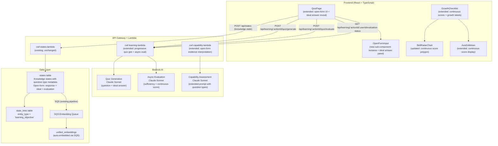
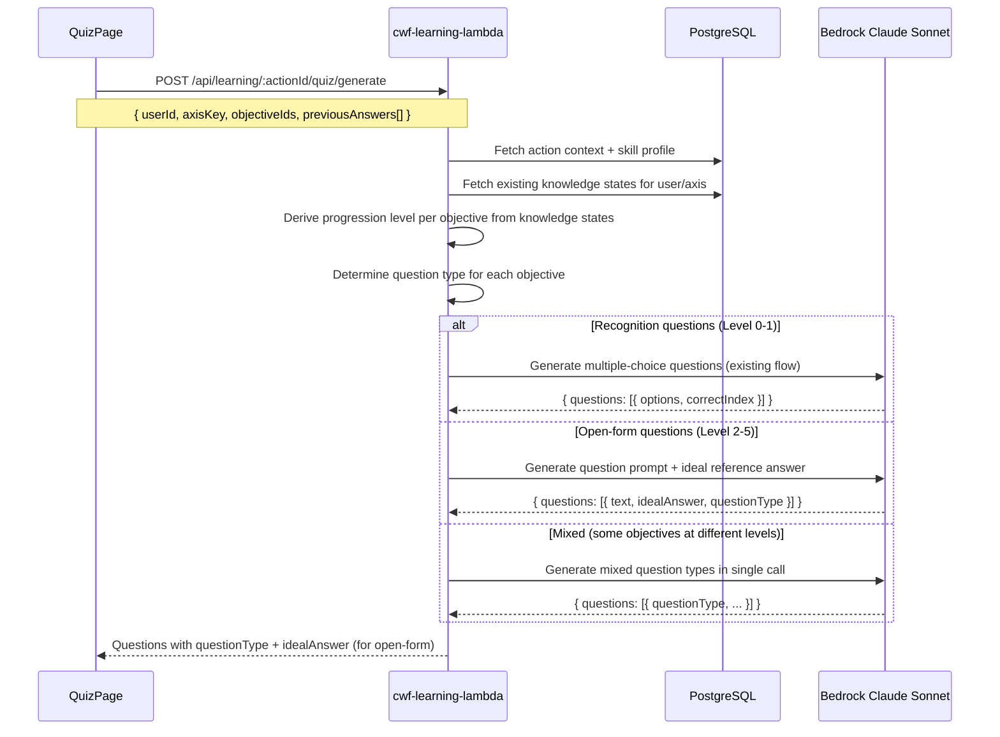
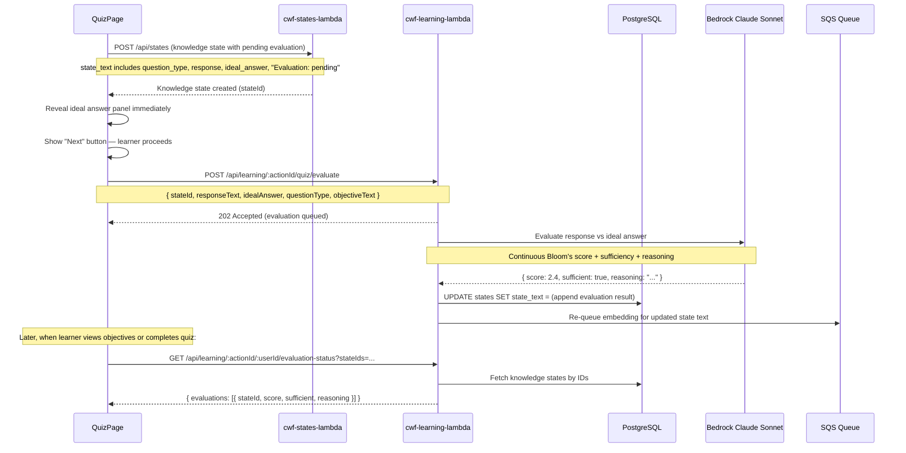
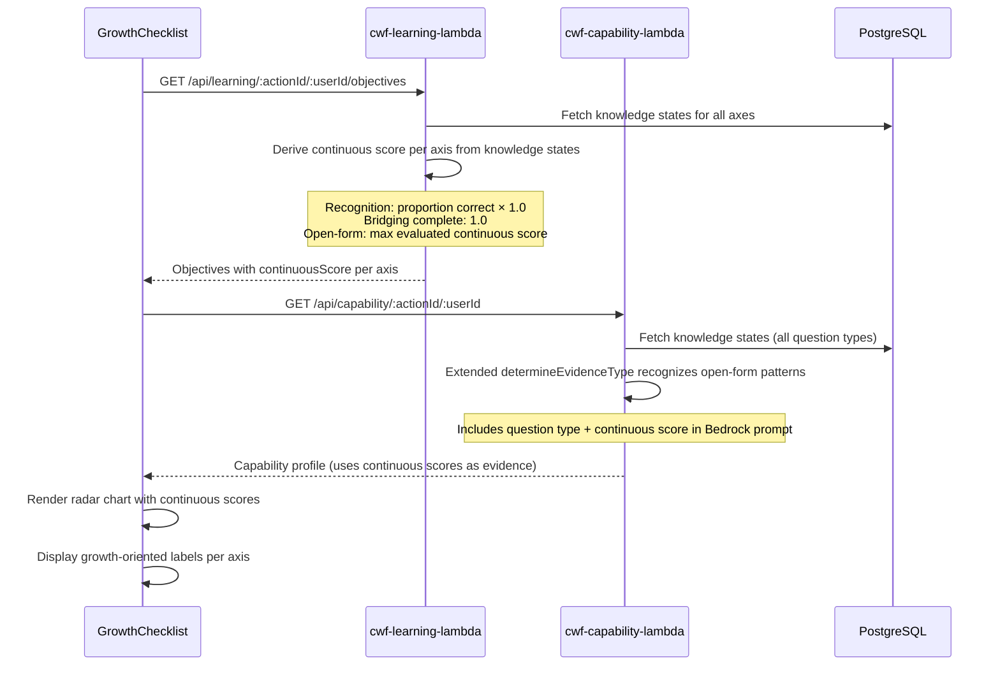
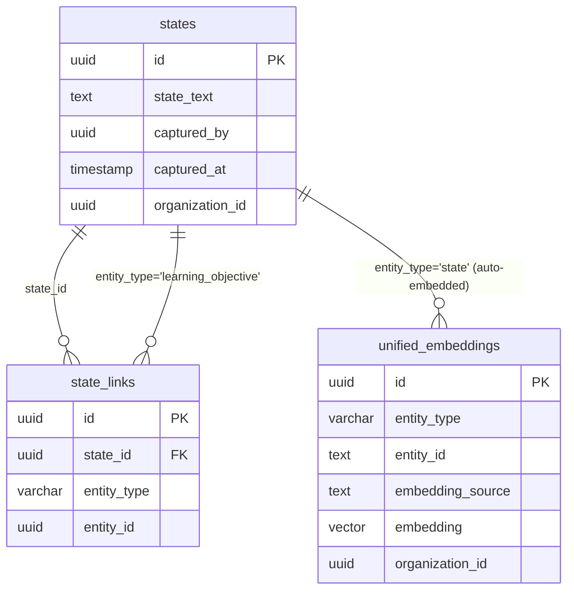

# Design Document: Bloom's Progression Questions

## Overview

Bloom's Progression Questions extends the existing quiz system from single-type multiple-choice (Recognition) questions to a progressive ladder of question types mapped to Bloom's taxonomy levels. The system introduces open-form questions (Self-Explanation, Application, Analysis, Synthesis) with AI-generated ideal answers shown immediately for self-comparison, asynchronous AI evaluation with continuous Bloom's scoring, and a Bridging question that transitions learners from Recognition to open-form work.

Key design decisions:

- **Extend existing patterns** — The learning Lambda, quiz generation, knowledge state storage, and QuizPage component are extended, not replaced. New question types use the same `states` + `state_links` + `unified_embeddings` pipeline.
- **No new tables or columns** — Open-form responses are stored as knowledge states in the existing `states` table with an extended natural language `state_text` format that includes question type, response text, ideal answer, and evaluation results.
- **Ideal answer pre-generated** — The quiz generation Bedrock call produces both the question prompt and an ideal reference answer in a single call, delivered to the frontend alongside the question. No second round-trip needed.
- **Async evaluation, non-blocking** — Open-form responses are stored immediately with `pending` status. Evaluation happens asynchronously via a separate Lambda invocation. The learner proceeds without waiting.
- **Continuous Bloom's scoring** — AI evaluation produces a decimal score (e.g., 2.4) rather than an integer. The score reflects actual demonstrated depth regardless of question type — a strong Self-Explanation response can score 3.0+.
- **Progression derived from knowledge states** — No separate progression cache. The system examines stored knowledge states to determine which question types have been successfully completed, then offers the next level.
- **Bridging question per axis** — One open-ended bridging question per axis (not per objective) after Recognition completion, asking the learner to connect concepts to their action context.
- **Growth-oriented framing** — All UI copy uses development language ("You're ready to explain your understanding") rather than testing language ("Moving to harder questions").

## Architecture



### Request Flow: Progressive Quiz Generation



### Request Flow: Open-Form Response Submission + Async Evaluation



### Request Flow: Continuous Score Derivation for Radar Chart



## Components and Interfaces

### 1. Extended Lambda: `cwf-learning-lambda`

#### Extended Endpoint: POST `/api/learning/:actionId/quiz/generate`

The existing quiz generation endpoint is extended to support progressive question types.

**Extended Request (unchanged shape, new behavior):**
```json
{
  "userId": "user-uuid",
  "axisKey": "chemistry_understanding",
  "objectiveIds": ["state-uuid-1", "state-uuid-3"],
  "previousAnswers": [...]
}
```

**Extended Response (new fields for open-form questions):**
```json
{
  "data": {
    "questions": [
      {
        "id": "q-uuid-1",
        "objectiveId": "state-uuid-1",
        "type": "concept",
        "questionType": "recognition",
        "bloomLevel": 1,
        "text": "Why does adding too much water weaken concrete?",
        "photoUrl": null,
        "options": [
          { "index": 0, "text": "...", "explanation": "..." },
          { "index": 1, "text": "...", "explanation": "..." },
          { "index": 2, "text": "...", "explanation": "..." },
          { "index": 3, "text": "...", "explanation": "..." }
        ],
        "correctIndex": 1,
        "idealAnswer": null
      },
      {
        "id": "q-uuid-2",
        "objectiveId": "state-uuid-3",
        "type": "concept",
        "questionType": "self_explanation",
        "bloomLevel": 2,
        "text": "Explain in your own words why the water-to-cement ratio is critical for concrete strength.",
        "photoUrl": null,
        "options": null,
        "correctIndex": null,
        "idealAnswer": "The water-to-cement ratio determines the porosity of cured concrete. Excess water creates voids as it evaporates during hydration, reducing compressive strength. The ideal ratio (~0.45-0.55) provides enough water for complete cement hydration while minimizing void formation. Understanding this helps predict how mix adjustments affect structural performance."
      }
    ]
  }
}
```

**Generation flow changes:**

1. Fetch existing knowledge states for the user on this axis
2. Call `deriveProgressionLevel(knowledgeStates, axisKey)` to determine the current Bloom's level per objective
3. For each objective, determine the appropriate question type based on progression level
4. Build a Bedrock prompt that generates the correct question type per objective:
   - Recognition: existing multiple-choice format (options + correctIndex)
   - Bridging: open-ended prompt scoped to the axis + ideal answer
   - Self-Explanation/Application/Analysis/Synthesis: open-ended prompt + ideal answer
5. Return questions with `questionType`, `bloomLevel`, and `idealAnswer` fields

#### New Endpoint: POST `/api/learning/:actionId/quiz/evaluate`

Triggers asynchronous evaluation of an open-form response.

**Request:**
```json
{
  "stateId": "knowledge-state-uuid",
  "responseText": "The water-to-cement ratio matters because...",
  "idealAnswer": "The water-to-cement ratio determines the porosity...",
  "questionType": "self_explanation",
  "objectiveText": "Understand why the water-to-cement ratio affects concrete strength",
  "questionText": "Explain in your own words why the water-to-cement ratio is critical..."
}
```

**Response:** `202 Accepted` (evaluation runs asynchronously)

**Evaluation flow:**
1. Call Bedrock with the response, ideal answer, question context, and objective
2. Bedrock returns: `{ score: 2.4, sufficient: true, reasoning: "The response demonstrates..." }`
3. Update the knowledge state's `state_text` to append evaluation results
4. Re-queue embedding generation via SQS for the updated text

#### New Endpoint: GET `/api/learning/:actionId/:userId/evaluation-status`

Checks evaluation status for one or more knowledge states.

**Query params:** `stateIds=uuid1,uuid2,uuid3`

**Response:**
```json
{
  "data": {
    "evaluations": [
      {
        "stateId": "uuid1",
        "status": "evaluated",
        "score": 2.4,
        "sufficient": true,
        "reasoning": "The response demonstrates clear understanding of..."
      },
      {
        "stateId": "uuid2",
        "status": "pending"
      }
    ]
  }
}
```

#### Extended Endpoint: GET `/api/learning/:actionId/:userId/objectives`

The existing objectives endpoint is extended to include continuous scores per axis.

**Extended response per axis:**
```json
{
  "axisKey": "chemistry_understanding",
  "axisLabel": "Chemistry Understanding",
  "requiredLevel": 3,
  "currentLevel": 0,
  "continuousScore": 2.4,
  "progressionLevel": "self_explanation",
  "objectives": [...]
}
```

New fields:
- `continuousScore`: Decimal Bloom's score derived from all knowledge states on this axis
- `progressionLevel`: The current question type the learner is working at (derived from knowledge states)

### 2. Extended Lambda: `cwf-capability-lambda`

#### Extended `determineEvidenceType` function

The existing function is extended to recognize open-form response patterns in state text.

**Current behavior:**
- Text containing "which was the correct answer" → `'quiz'`
- Everything else → `'observation'`

**Extended behavior:**
- Text containing "which was the correct answer" → `{ type: 'quiz', questionType: 'recognition' }`
- Text matching open-form pattern (contains "and self_explanation question" etc.) → `{ type: 'quiz', questionType: 'self_explanation', score: 2.4 }`
- Text matching bridging pattern → `{ type: 'quiz', questionType: 'bridging' }`
- Everything else → `{ type: 'observation' }`

For backward compatibility, the function returns a string when called in the existing context and an enriched object when called with an `enriched: true` flag.

#### Extended Bedrock prompt

The capability assessment prompt is extended to include question type and continuous score for each knowledge state evidence item:

```
EVIDENCE TYPE INTERPRETATION:
- "recognition" (quiz): Multiple-choice correct answer. Demonstrates at minimum Bloom's level 1 (Remember).
- "bridging" (quiz): Open-ended connection to action context. Demonstrates level 1 completion.
- "self_explanation" (quiz, score: 2.4): Open-form explanation. Score indicates demonstrated depth.
- "application" (quiz, score: 3.1): Scenario-based transfer. Score indicates demonstrated depth.
- "analysis" (quiz, score: 4.0): Tradeoff evaluation. Score indicates demonstrated depth.
- "synthesis" (quiz, score: 4.8): Design/teaching response. Score indicates demonstrated depth.
- "observation": Field observation. Bloom's level varies based on content.
- "pending": Open-form response awaiting evaluation. Include as evidence but note evaluation is in progress.
```

### 3. Frontend Components

#### Extended `QuizPage`

The existing QuizPage is extended with a new `OpenFormInput` sub-component for open-form questions. The quiz state machine gains new states for the open-form flow.

**Extended quiz state machine:**
```
objectives_selection → generating → quiz_in_progress → round_complete → quiz_complete
                                         ↓
                                   (for open-form questions)
                                   open_form_input → ideal_answer_reveal → (next question)
```

**Changes to QuizPage:**
1. Check `currentQuestion.questionType` to render either `QuestionView` (Recognition) or `OpenFormInput` (open-form)
2. For open-form questions, the "Next" button appears after the ideal answer is revealed (no waiting for evaluation)
3. On open-form submission: save knowledge state immediately, reveal ideal answer, fire-and-forget evaluation call
4. Display growth milestone messages when transitioning to a new question type
5. Poll for evaluation results when quiz completes or when returning to objectives view

**New sub-component: `OpenFormInput`**

```typescript
interface OpenFormInputProps {
  question: QuizQuestion;
  onSubmit: (responseText: string) => void;
  onNext: () => void;
  idealAnswer: string;
  evaluationResult?: { score: number; sufficient: boolean; reasoning: string } | null;
  isSubmitted: boolean;
  isSaving: boolean;
}
```

Renders:
1. Question prompt with Bloom's level context badge (e.g., "Explain in your own words")
2. Photo above question text (if present)
3. Multi-line textarea with soft guidance ("A few sentences is enough")
4. Submit button → reveals ideal answer panel
5. Ideal answer in a visually distinct card ("Here's a strong example")
6. If evaluation completes while viewing: inline sufficiency badge + reasoning
7. "Next" button to proceed

#### Extended `GrowthChecklist`

**Changes:**
1. Display continuous Bloom's score per axis (e.g., "2.4") instead of integer
2. Show growth-oriented label alongside score (e.g., "2.4 — Deepening understanding")
3. Pass continuous scores to `SkillRadarChart` for granular polygon rendering

#### Extended `SkillRadarChart`

**Changes:**
1. Accept continuous (decimal) capability levels for the capability polygon
2. The chart already uses floating-point math for polygon rendering — no structural changes needed, just pass decimal values instead of integers

#### Extended `AxisDrilldown`

**Changes:**
1. Display continuous score with growth label
2. Show progression level indicator (e.g., "Currently working on: Self-Explanation questions")

### 4. Pure Utility Functions

#### `progressionUtils.ts` (new file in `src/lib/`)

```typescript
/** Question types in Bloom's progression order */
type QuestionType = 'recognition' | 'bridging' | 'self_explanation' | 'application' | 'analysis' | 'synthesis';

/** Map question type to its Bloom's taxonomy level */
function questionTypeToBloomLevel(questionType: QuestionType): number

/** Classify a question type as closed-form or open-form */
function isOpenFormQuestion(questionType: QuestionType): boolean

/** Derive the current progression level for an axis from knowledge states */
function deriveProgressionLevel(
  knowledgeStates: ParsedOpenFormState[],
  axisKey: string
): { currentLevel: QuestionType; bloomLevel: number }

/** Check if bridging is complete for an axis */
function isBridgingComplete(
  knowledgeStates: ParsedOpenFormState[],
  axisKey: string
): boolean

/** Compute continuous Bloom's score for an axis from all knowledge states */
function computeContinuousScore(
  knowledgeStates: ParsedOpenFormState[],
  axisKey: string,
  totalRecognitionObjectives: number,
  correctRecognitionCount: number
): number

/** Map a continuous score to a growth-oriented label */
function scoreToGrowthLabel(score: number): string
```

#### Extended `learningUtils.ts`

New state text format functions for open-form responses:

```typescript
interface ParsedOpenFormState {
  objectiveText: string;
  questionType: QuestionType;
  questionText: string;
  responseText: string;
  idealAnswer: string;
  evaluationStatus: 'pending' | 'sufficient' | 'insufficient' | 'error';
  continuousScore: number | null;
  reasoning: string | null;
}

/** Compose open-form knowledge state text */
function composeOpenFormStateText(
  objectiveText: string,
  questionType: QuestionType,
  questionText: string,
  responseText: string,
  idealAnswer: string
): string

/** Parse open-form knowledge state text */
function parseOpenFormStateText(stateText: string): ParsedOpenFormState | null

/** Update state text with evaluation result */
function appendEvaluationToStateText(
  stateText: string,
  evaluation: { score: number; sufficient: boolean; reasoning: string }
): string

/** Update state text with error status */
function appendEvaluationErrorToStateText(stateText: string): string
```

#### Extended `capabilityUtils.js`

```javascript
/** Extended evidence type detection for open-form responses */
function determineEvidenceTypeEnriched(stateText) → {
  type: 'quiz' | 'observation',
  questionType: 'recognition' | 'bridging' | 'self_explanation' | 'application' | 'analysis' | 'synthesis' | null,
  continuousScore: number | null,
  evaluationStatus: 'pending' | 'sufficient' | 'insufficient' | 'error' | null
}
```

### 5. Route Configuration

No new routes needed. The existing `/actions/:actionId/quiz/:axisKey` route handles all question types — the QuizPage component determines rendering based on `questionType`.

### 6. API Gateway Configuration

Two new endpoints for the learning Lambda:

```bash
./scripts/add-api-endpoint.sh /api/learning POST cwf-learning-lambda  # Already exists
# The new evaluate and evaluation-status endpoints use the same Lambda with path-based routing
```

The learning Lambda's internal router is extended:

| Method | Path | Description |
|--------|------|-------------|
| GET | `/api/learning/:actionId/:userId/objectives` | Existing — extended with continuousScore |
| POST | `/api/learning/:actionId/quiz/generate` | Existing — extended with progressive types |
| POST | `/api/learning/:actionId/quiz/evaluate` | **New** — async evaluation trigger |
| GET | `/api/learning/:actionId/:userId/evaluation-status` | **New** — poll evaluation results |
| POST | `/api/learning/:actionId/verify` | Existing — unchanged |

## Data Models

### Knowledge State Formats

#### Recognition (existing, unchanged)

```
For learning objective '{objective}' and question '{question}', I selected '{answer}' which was the correct|incorrect answer.
```

#### Open-Form Response (new format)

```
For learning objective '{objective}' and {question_type} question '{question}', I responded: '{response_summary}'. Ideal answer: '{ideal_summary}'. Evaluation: pending.
```

After evaluation completes:

```
For learning objective '{objective}' and {question_type} question '{question}', I responded: '{response_summary}'. Ideal answer: '{ideal_summary}'. Evaluation: sufficient (score: 2.4). {reasoning_summary}.
```

Or on evaluation failure:

```
For learning objective '{objective}' and {question_type} question '{question}', I responded: '{response_summary}'. Ideal answer: '{ideal_summary}'. Evaluation: error.
```

#### Bridging Response (new format)

```
For learning objective '{objective}' and bridging question '{question}', I responded: '{response_summary}'. Ideal answer: '{ideal_summary}'. Evaluation: sufficient (score: 1.0). {reasoning_summary}.
```

### Entity Relationship (Extended Elements)



No new tables or columns. The `state_text` field carries all metadata (question type, response, ideal answer, evaluation) in the natural language format. The existing SQS embedding pipeline processes these states identically to Recognition knowledge states.

### Data Flow: Open-Form Response Lifecycle

1. Learner submits open-form response on QuizPage
2. Frontend composes state_text with `pending` evaluation status
3. Frontend creates knowledge state via `POST /api/states` with `state_links` to learning objective
4. States Lambda stores state → SQS pipeline embeds it (initial embedding with response + ideal)
5. Frontend calls `POST /api/learning/:actionId/quiz/evaluate` (fire-and-forget)
6. Learning Lambda calls Bedrock for evaluation → updates state_text with score + sufficiency + reasoning
7. Learning Lambda re-queues embedding via SQS (updated embedding with evaluation context)
8. Frontend polls `GET /api/learning/:actionId/:userId/evaluation-status` when needed

### Data Flow: Progression Level Derivation

1. Frontend requests quiz generation for an axis
2. Learning Lambda fetches all knowledge states for the user on this axis
3. For each knowledge state, parse the state_text to extract question type and evaluation status
4. Determine the highest completed level:
   - All Recognition objectives correct → Level 1 complete
   - Bridging response with sufficient evaluation → Level 1 fully complete
   - Self-Explanation with sufficient evaluation (score ≥ 2.0) → Level 2 complete
   - Application with sufficient evaluation (score ≥ 3.0) → Level 3 complete
   - Analysis with sufficient evaluation (score ≥ 4.0) → Level 4 complete
   - Synthesis with sufficient evaluation → Level 5 complete
5. Generate questions at the next uncompleted level


## Correctness Properties

*A property is a characteristic or behavior that should hold true across all valid executions of a system — essentially, a formal statement about what the system should do. Properties serve as the bridge between human-readable specifications and machine-verifiable correctness guarantees.*

### Property 1: Question type taxonomy mapping

*For any* valid question type string (recognition, bridging, self_explanation, application, analysis, synthesis), the `questionTypeToBloomLevel` function should return the correct integer Bloom's level (1, 1, 2, 3, 4, 5 respectively), and the `isOpenFormQuestion` function should return `false` for recognition and `true` for all other types. The two functions should be consistent: every question type maps to exactly one Bloom's level and exactly one form classification. For any invalid question type string, `questionTypeToBloomLevel` should return 0.

**Validates: Requirements 1.1, 1.3**

### Property 2: Progression level derivation from knowledge states

*For any* set of knowledge states for an axis (with varying question types, evaluation statuses, and continuous scores), the `deriveProgressionLevel` function should return a question type whose Bloom's level is at most 1 higher than the highest level with a sufficient evaluation. Specifically:
- If no knowledge states exist, return `recognition` (Level 1)
- If Recognition is complete but no bridging exists, return `bridging` (Level 1)
- If bridging is sufficient but no Self-Explanation is sufficient, return `self_explanation` (Level 2)
- The function should never skip a level (e.g., jump from recognition to application)
- Knowledge states with `pending` or `error` evaluation status should not count as completing their level
- A continuous score at or above the next level's threshold (e.g., 2.8 on a Self-Explanation) should advance to the next level

**Validates: Requirements 2.1, 2.2, 2.3, 2.4, 2.5, 7.7, 7.9**

### Property 3: Bridging question scoped to axis

*For any* set of knowledge states, the `isBridgingComplete` function should return `true` if there exists at least one knowledge state with `questionType = 'bridging'` and `evaluationStatus = 'sufficient'` for the given axis key, regardless of which specific learning objective it is linked to. It should return `false` if no such state exists or if the only bridging states have `pending` or `error` status.

**Validates: Requirements 2.7**

### Property 4: Open-form knowledge state round-trip

*For any* valid open-form response data (objective text, question type, question text, response text, ideal answer), composing the state text via `composeOpenFormStateText` and parsing it back via `parseOpenFormStateText` should recover the original objective text, question type, question text, and ideal answer. The initial evaluation status should be `'pending'` and the continuous score should be `null`. The composed text should contain the question type as a metadata indicator.

**Validates: Requirements 3.4, 3.8, 5.1, 5.2, 5.4, 7.1**

### Property 5: Knowledge state evaluation update

*For any* valid open-form knowledge state text with `pending` status and any evaluation result (score in [0.0, 5.0], sufficient boolean, reasoning string), applying `appendEvaluationToStateText` should produce a state text that:
- Parses back to the same objective text, question type, question text, response text, and ideal answer as the original
- Has evaluation status `'sufficient'` or `'insufficient'` matching the input
- Has the continuous score matching the input score
- Contains the reasoning summary

For any evaluation error, `appendEvaluationErrorToStateText` should produce a state text with evaluation status `'error'` while preserving all other fields.

**Validates: Requirements 3.6, 7.4, 7.5**

### Property 6: Open-form questions include ideal answer

*For any* quiz generation response containing open-form questions (questionType ≠ 'recognition'), every such question should have a non-null, non-empty `idealAnswer` field. For recognition questions, `idealAnswer` should be `null` and `options` + `correctIndex` should be present. Every question should have a valid `questionType` field from the set {recognition, bridging, self_explanation, application, analysis, synthesis}.

**Validates: Requirements 3.1, 6.6**

### Property 7: Extended evidence type classification

*For any* state text string, the `determineEvidenceTypeEnriched` function should:
- Return `{ type: 'quiz', questionType: 'recognition' }` for texts matching the existing Recognition format ("which was the correct answer")
- Return `{ type: 'quiz', questionType: '<type>', continuousScore: <score> }` for texts matching the open-form format with a completed evaluation
- Return `{ type: 'quiz', questionType: '<type>', evaluationStatus: 'pending' }` for texts matching the open-form format with pending evaluation
- Return `{ type: 'observation' }` for texts not matching any quiz pattern
- The function should be backward compatible: existing Recognition state texts should produce the same classification as the current `determineEvidenceType` function

**Validates: Requirements 5.7, 9.4, 9.6**

### Property 8: Continuous Bloom's score derivation

*For any* set of knowledge states on an axis with varying question types and evaluation scores, the `computeContinuousScore` function should return:
- A value in [0.0, 5.0]
- During Recognition phase: a value proportional to correct first-attempt answers (e.g., 4 of 5 correct = 0.8)
- After bridging completion: at least 1.0
- For open-form phases: the maximum continuous score from all evaluated (non-pending, non-error) knowledge states on the axis
- The score should never decrease when additional sufficient evaluations are added (monotonically non-decreasing with new evidence)

**Validates: Requirements 8.2, 8.3**

### Property 9: Growth-oriented label mapping

*For any* continuous score in [0.0, 5.0], the `scoreToGrowthLabel` function should return exactly one of six labels:
- [0.0, 1.0): "Building foundations"
- [1.0, 2.0): "Developing recall"
- [2.0, 3.0): "Deepening understanding"
- [3.0, 4.0): "Applying knowledge"
- [4.0, 5.0): "Analyzing and evaluating"
- 5.0: "Creating and teaching"

The six ranges should be mutually exclusive and exhaustive over [0.0, 5.0].

**Validates: Requirements 10.4**

## Error Handling

### Open-Form Response Evaluation Errors

| Scenario | Handling |
|----------|----------|
| Bedrock evaluation call fails or times out | Mark evaluation status as `'error'` in the knowledge state. Log the failure. The learner's response remains stored and the quiz flow is not affected. |
| Bedrock returns malformed evaluation (missing score or sufficiency) | Retry once. If still invalid, mark as `'error'`. Log warning. |
| Evaluation produces score outside [0.0, 5.0] | Clamp to [0.0, 5.0]. Log warning about unexpected score. |
| State update fails after evaluation | Log error. The evaluation result is lost but the original response is preserved. Frontend will see `'pending'` status indefinitely — a manual re-evaluation can be triggered. |
| SQS re-queue fails after evaluation update | Log error. The embedding will be stale (missing evaluation context) but the state text is correct. Not critical — the embedding pipeline can be re-run. |

### Progressive Quiz Generation Errors

| Scenario | Handling |
|----------|----------|
| Progression derivation finds no knowledge states | Default to Recognition (Level 1). This is the normal starting state. |
| Bedrock fails to generate ideal answer for open-form question | Retry once with a more explicit prompt. If still missing, generate a placeholder: "An ideal response would demonstrate understanding of [objective]." Log warning. |
| Mixed question types in a single round cause prompt to exceed token limit | Split into two Bedrock calls: one for Recognition questions, one for open-form. Log the split. |
| All objectives are at different progression levels | Generate questions at each objective's individual level. The prompt handles mixed types. |

### Evaluation Status Polling Errors

| Scenario | Handling |
|----------|----------|
| Frontend polls for evaluation status but state not found | Return empty evaluation for that stateId. Frontend treats as still pending. |
| Evaluation has been pending for > 5 minutes | Frontend shows "Evaluation is taking longer than expected" with option to continue without it. |
| Network error during polling | Frontend silently retries on next poll interval. No user-facing error. |

### Capability Assessment with Open-Form Evidence

| Scenario | Handling |
|----------|----------|
| Knowledge state has `pending` evaluation | Include in Bedrock prompt with note: "Evaluation in progress — response text available but not yet scored." |
| Knowledge state has `error` evaluation | Include response text as evidence but note evaluation failed. Bedrock can still interpret the response content. |
| `determineEvidenceTypeEnriched` encounters unexpected state text format | Fall back to existing `determineEvidenceType` behavior (returns `'quiz'` or `'observation'`). Log warning. |

### Frontend Error Handling

- Open-form submission shows loading state while saving knowledge state
- If knowledge state creation fails, show error toast with retry — do not reveal ideal answer until state is saved
- Evaluation status polling uses exponential backoff (2s, 4s, 8s, max 30s)
- If evaluation returns `'error'`, show "We couldn't evaluate this response automatically. Your answer has been saved and will be reviewed." with growth-oriented framing
- Network errors during quiz show "You're offline" banner — open-form responses are queued for retry (leveraging existing offline-first architecture)

## Testing Strategy

### Property-Based Tests (Vitest + fast-check)

Property-based tests use [fast-check](https://github.com/dubzzz/fast-check) with Vitest. Each property test runs a minimum of 100 iterations and is tagged with its design property reference.

| Property | Target Function | Tag |
|----------|----------------|-----|
| Property 1 | `questionTypeToBloomLevel`, `isOpenFormQuestion` | Feature: bloom-progression-questions, Property 1: Question type taxonomy mapping |
| Property 2 | `deriveProgressionLevel` | Feature: bloom-progression-questions, Property 2: Progression level derivation from knowledge states |
| Property 3 | `isBridgingComplete` | Feature: bloom-progression-questions, Property 3: Bridging question scoped to axis |
| Property 4 | `composeOpenFormStateText`, `parseOpenFormStateText` | Feature: bloom-progression-questions, Property 4: Open-form knowledge state round-trip |
| Property 5 | `appendEvaluationToStateText`, `appendEvaluationErrorToStateText` | Feature: bloom-progression-questions, Property 5: Knowledge state evaluation update |
| Property 6 | Quiz generation response validation | Feature: bloom-progression-questions, Property 6: Open-form questions include ideal answer |
| Property 7 | `determineEvidenceTypeEnriched` | Feature: bloom-progression-questions, Property 7: Extended evidence type classification |
| Property 8 | `computeContinuousScore` | Feature: bloom-progression-questions, Property 8: Continuous Bloom's score derivation |
| Property 9 | `scoreToGrowthLabel` | Feature: bloom-progression-questions, Property 9: Growth-oriented label mapping |

### Unit Tests (Vitest)

**Progression logic:**
- `questionTypeToBloomLevel` with each valid type and invalid strings
- `isOpenFormQuestion` with each type
- `deriveProgressionLevel` with: no states, Recognition only, Recognition + bridging, mixed levels, pending evaluations
- `isBridgingComplete` with: no bridging, pending bridging, sufficient bridging, multiple bridging states
- `computeContinuousScore` at boundary cases: 0 correct, all correct, partial Recognition, bridging only, open-form scores at boundaries

**State text formatting:**
- `composeOpenFormStateText` with various question types and content
- `parseOpenFormStateText` with valid and invalid formats
- `appendEvaluationToStateText` with sufficient/insufficient results
- `appendEvaluationErrorToStateText` preserves original content
- Backward compatibility: `parseKnowledgeStateText` still works for Recognition format
- `composeOpenFormStateText` with special characters in response text (quotes, newlines)

**Evidence type classification:**
- `determineEvidenceTypeEnriched` with Recognition state text, each open-form type, pending states, error states, observation text
- Backward compatibility: existing `determineEvidenceType` returns same results for Recognition states

**Growth labels:**
- `scoreToGrowthLabel` at each boundary: 0.0, 0.9, 1.0, 1.9, 2.0, 2.9, 3.0, 3.9, 4.0, 4.9, 5.0

### Integration Tests

- Progressive quiz generation: user at Recognition level gets multiple-choice, user at Self-Explanation level gets open-form with ideal answer
- Open-form response storage: knowledge state created with correct format, linked to objective via state_links
- Async evaluation: response stored → evaluation triggered → state text updated with score
- Evaluation status polling: returns correct status for pending, evaluated, and error states
- Continuous score derivation: objectives endpoint returns correct continuousScore per axis
- Capability assessment with open-form evidence: Bedrock prompt includes question types and continuous scores
- Backward compatibility: Recognition-only quiz flow unchanged
- Multi-tenant isolation: evaluation results scoped to organization

### Frontend Component Tests (Vitest + React Testing Library)

- `OpenFormInput` renders textarea for open-form questions
- `OpenFormInput` reveals ideal answer panel after submission with "Here's a strong example" framing
- `OpenFormInput` shows "Next" button after ideal answer reveal (no waiting for evaluation)
- `OpenFormInput` displays evaluation result inline when available
- `QuizPage` renders `QuestionView` for Recognition, `OpenFormInput` for open-form
- `QuizPage` shows growth milestone message when transitioning to new question type
- `GrowthChecklist` displays continuous scores with growth labels
- `SkillRadarChart` renders continuous (decimal) values in capability polygon
- `AxisDrilldown` shows continuous score and progression level
- No "fail" or "incorrect" language appears for insufficient open-form responses
- Evaluation polling: component updates when evaluation completes
