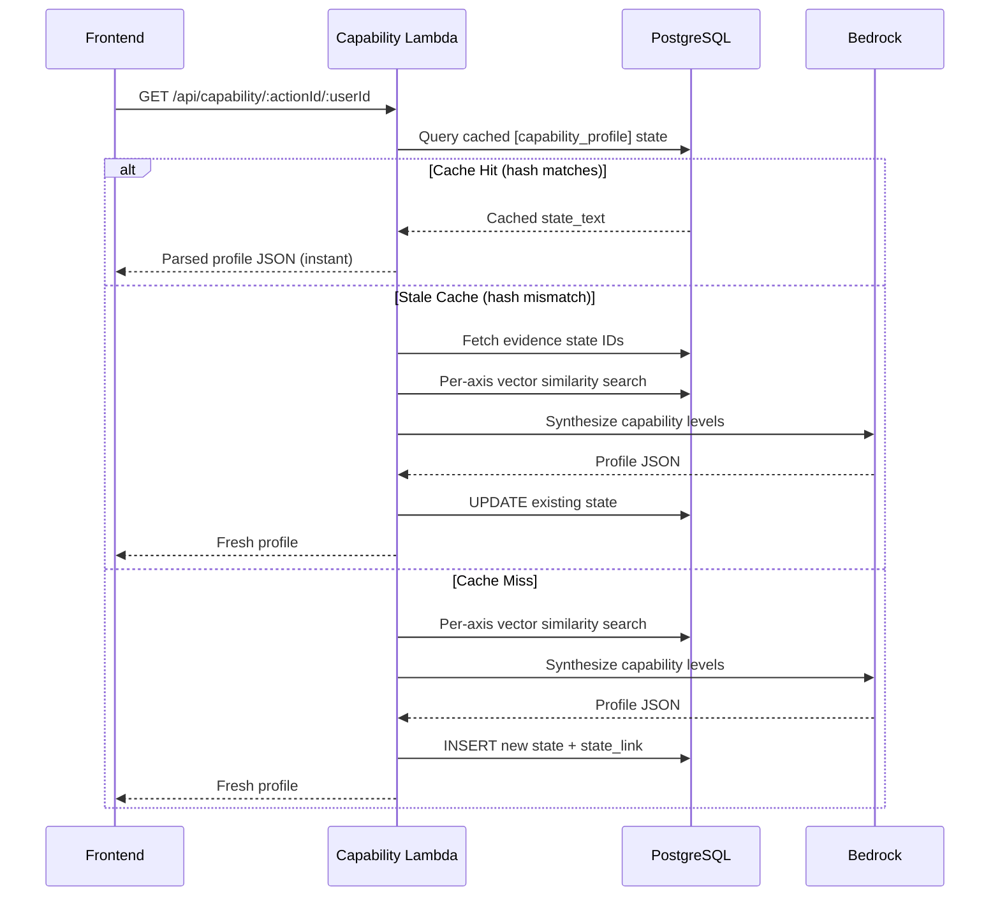
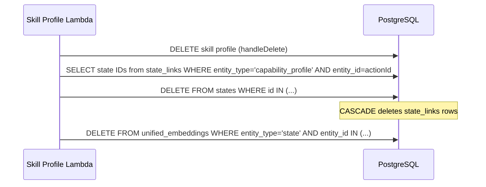
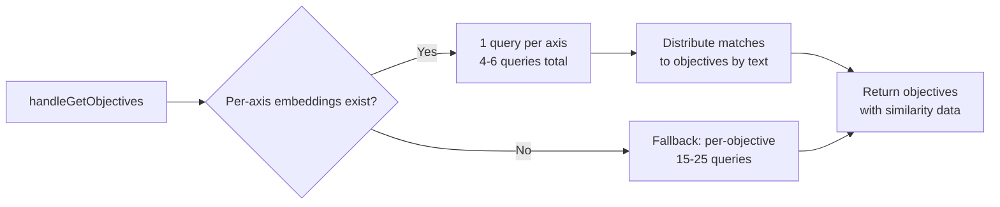

# Design Document: Capability Profile Caching

## Overview

This feature adds a caching layer to the capability assessment system by storing computed profiles as states in the existing `states` table. Currently, every page load triggers 4-6 vector similarity queries and a Bedrock Claude Sonnet call (3-8 seconds). With caching, subsequent reads return instantly from the stored state, with recomputation triggered only when new evidence is added or the skill profile changes.

The design follows the existing states infrastructure pattern — the same tables (`states`, `state_links`, `unified_embeddings`), the same SQS embedding pipeline, and the same `[prefix]` state_text convention used by learning objectives and knowledge states. No new tables, columns, or infrastructure are needed.

Additionally, the learning Lambda's `handleGetObjectives` is optimized to run one vector similarity query per axis (4-6 queries) instead of one per objective (15-25 queries), using the existing `skill_axis` embeddings already in `unified_embeddings`.

## Architecture

The caching layer sits between the API request and the existing Bedrock computation flow in the capability Lambda. The read path becomes:

```
GET /api/capability/:actionId/:userId
  │
  ├─ 1. Query states table for cached [capability_profile] state
  │     (matched by captured_by + state_links to action)
  │
  ├─ 2. Compute current evidence hash (lightweight: sorted state IDs + learning count)
  │
  ├─ CACHE HIT (hash matches):
  │     └─ Parse profile JSON from state_text → return immediately
  │
  ├─ STALE CACHE (hash mismatch):
  │     └─ Recompute via Bedrock → UPDATE existing state → return
  │
  └─ CACHE MISS (no state found):
        └─ Compute via Bedrock (existing flow) → INSERT new state → return
```



### Cache Invalidation Flow

When a skill profile is deleted or regenerated in the skill-profile Lambda, all `capability_profile` states linked to that action are deleted. The `ON DELETE CASCADE` on `state_links.state_id → states.id` handles cleanup, and the unified_embeddings entries are explicitly deleted.



### Per-Axis Similarity Search Optimization

The learning Lambda's `handleGetObjectives` currently runs one vector similarity query per objective (15-25 queries). This is replaced with one query per axis (4-6 queries) using the existing `skill_axis` embeddings, then distributing matches to objectives via text comparison.



## Components and Interfaces

### 1. Capability Profile State Text Format

The `state_text` follows the existing `[prefix]` convention:

```
[capability_profile] action=<actionId> user=<userId> hash=<evidenceHash> computed_at=<ISO8601> | <profileJSON>
```

Example:
```
[capability_profile] action=abc-123 user=def-456 hash=a1b2c3d4 computed_at=2025-01-15T10:30:00Z | {"user_id":"def-456","user_name":"Maria","narrative":"...","axes":[...],"total_evidence_count":12}
```

For organization profiles, `user` is set to the sentinel value `organization`:
```
[capability_profile] action=abc-123 user=organization hash=e5f6g7h8 computed_at=2025-01-15T10:30:00Z | {"user_id":"organization","user_name":"Organization",...}
```

### 2. New Pure Functions (lambda/capability/cacheUtils.js)

```javascript
/**
 * Compose a capability profile state_text in the canonical format.
 * @param {string} actionId
 * @param {string} userId - user ID or 'organization'
 * @param {string} evidenceHash
 * @param {Object} profile - the full capability profile object
 * @returns {string}
 */
function composeCapabilityProfileStateText(actionId, userId, evidenceHash, profile)

/**
 * Parse a capability profile state_text back to its components.
 * Returns null if format doesn't match.
 * @param {string} stateText
 * @returns {{ actionId, userId, evidenceHash, computedAt, profile } | null}
 */
function parseCapabilityProfileStateText(stateText)

/**
 * Compute a deterministic evidence hash from the current evidence set.
 * Hash inputs: sorted array of evidence state IDs + learning completion count.
 * Uses Node.js crypto.createHash('sha256') truncated to 16 hex chars.
 * @param {string[]} evidenceStateIds - state IDs used as evidence
 * @param {number} learningCompletionCount - count of completed learning objectives
 * @returns {string} - 16-char hex hash
 */
function computeEvidenceHash(evidenceStateIds, learningCompletionCount)

/**
 * Determine the cache action based on cached state and current evidence.
 * @param {{ evidenceHash: string } | null} cachedState - parsed cached state or null
 * @param {string} currentHash - current evidence hash
 * @returns {'hit' | 'stale' | 'miss'}
 */
function determineCacheAction(cachedState, currentHash)
```

### 3. New Pure Functions (lambda/learning/objectiveMatchUtils.js)

```javascript
/**
 * Distribute per-axis similarity matches to individual objectives.
 * For each match, finds the objective whose text is most similar
 * (simple substring/keyword overlap scoring).
 * @param {Array<{ entity_id, embedding_source, similarity }>} axisMatches
 * @param {Array<{ id, text }>} objectives
 * @returns {Map<string, Array<{ similarity, embedding_source }>>} - objectiveId → matches
 */
function distributeMatchesToObjectives(axisMatches, objectives)

/**
 * Compose an axis-aware embedding source for a knowledge state.
 * Prepends the axis label to the state text for better axis-level matching.
 * @param {string} axisLabel
 * @param {string} stateText
 * @returns {string}
 */
function composeAxisAwareEmbeddingSource(axisLabel, stateText)
```

### 4. Modified Functions

**lambda/capability/index.js:**
- `handleIndividualCapability` — add cache-first logic at the top, store result after computation
- `handleOrganizationCapability` — same cache-first pattern with `captured_by = 'organization'`

**lambda/skill-profile/index.js:**
- `handleDelete` — add deletion of capability_profile states linked to the action
- `handleApprove` — add deletion of existing capability_profile states before storing new profile

**lambda/learning/index.js:**
- `handleGetObjectives` — replace per-objective similarity queries with per-axis queries + distribution

### 5. Evidence Hash Computation

The evidence hash is computed from two lightweight queries (no vector searches):

```sql
-- 1. Get evidence state IDs: states captured by this user in this org
SELECT s.id::text
FROM states s
WHERE s.captured_by = :userId
  AND s.organization_id = :orgId
  AND s.state_text NOT LIKE '[capability_profile]%'
  AND s.state_text NOT LIKE '[learning_objective]%'
ORDER BY s.id;

-- 2. Get learning completion count
SELECT COUNT(*) as completion_count
FROM states s
INNER JOIN state_links sl ON sl.state_id = s.id
WHERE sl.entity_type = 'learning_objective'
  AND sl.entity_id IN (
    SELECT s2.id FROM states s2
    INNER JOIN state_links sl2 ON sl2.state_id = s2.id
    WHERE sl2.entity_type = 'action' AND sl2.entity_id = :actionId
      AND s2.state_text LIKE '[learning_objective]%'
      AND s2.state_text LIKE '%user=' || :userId || '%'
  )
  AND s.state_text LIKE '%which was the correct answer%'
  AND s.organization_id = :orgId;
```

The hash is `sha256(sortedStateIds.join(',') + ':' + completionCount)` truncated to 16 hex characters.

For organization profiles, the evidence hash uses all states in the organization (no user filter) and sums learning completions across all users.

### 6. Cache Lookup Query

```sql
SELECT s.id, s.state_text
FROM states s
INNER JOIN state_links sl ON sl.state_id = s.id
WHERE sl.entity_type = 'capability_profile'
  AND sl.entity_id = :actionId
  AND s.captured_by = :userId
  AND s.state_text LIKE '[capability_profile]%'
  AND s.organization_id = :orgId
LIMIT 1;
```

### 7. Cache Store (INSERT or UPDATE)

On cache miss (INSERT):
```sql
INSERT INTO states (organization_id, state_text, captured_by, captured_at)
VALUES (:orgId, :stateText, :userId, NOW())
RETURNING id;

INSERT INTO state_links (state_id, entity_type, entity_id)
VALUES (:stateId, 'capability_profile', :actionId);
```

On stale cache (UPDATE):
```sql
UPDATE states
SET state_text = :stateText, updated_at = NOW()
WHERE id = :existingStateId;
```

### 8. Cache Invalidation (in skill-profile Lambda)

```sql
-- Find all capability_profile states for this action
SELECT s.id
FROM states s
INNER JOIN state_links sl ON sl.state_id = s.id
WHERE sl.entity_type = 'capability_profile'
  AND sl.entity_id = :actionId
  AND s.organization_id = :orgId;

-- Delete the states (CASCADE handles state_links)
DELETE FROM states WHERE id IN (:stateIds);

-- Clean up unified_embeddings
DELETE FROM unified_embeddings
WHERE entity_type = 'state'
  AND entity_id IN (:stateIdStrings)
  AND organization_id = :orgId;
```

## Data Models

### Capability Profile State

Uses the existing `states` table — no schema changes:

| Field | Value | Notes |
|-------|-------|-------|
| `id` | UUID (auto-generated) | Primary key |
| `organization_id` | From auth context | Multi-tenancy scope |
| `state_text` | `[capability_profile] action=... user=... hash=... computed_at=... \| {JSON}` | Structured text with prefix |
| `captured_by` | `userId` or `'organization'` | Scopes to user; sentinel for org profiles |
| `captured_at` | NOW() | When the profile was computed |

### State Link

Uses the existing `state_links` table:

| Field | Value |
|-------|-------|
| `state_id` | FK to states.id |
| `entity_type` | `'capability_profile'` |
| `entity_id` | The action ID |

### Evidence Hash

Not stored in a separate column — embedded in the `state_text` as the `hash=` field. Computed from:
- Sorted list of evidence state IDs (states captured by the user, excluding `[capability_profile]` and `[learning_objective]` prefixed states)
- Count of completed learning objectives for the action

