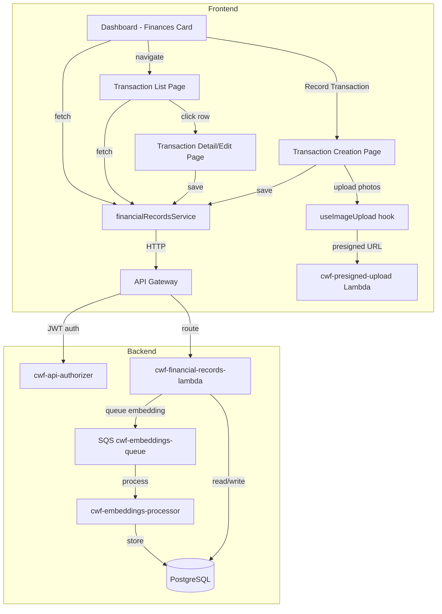

# Design Document: Cash Tracking

## Overview

The cash tracking feature adds a financial record tracking system to CWF, replacing the existing Google Sheet workflow. It introduces a `financial_records` table and `financial_record_edits` audit table, a new `cwf-financial-records-lambda` Lambda function, and frontend components for record creation (observation-like data collection), listing, editing, and a dashboard Finances card.

The design follows existing CWF patterns:
- Lambda handler with route-based dispatch (like `cwf-explorations-lambda`, `cwf-actions-lambda`)
- TanStack Query hooks + service layer for frontend data access
- Presigned URL photo uploads via `cwf-presigned-upload`
- Unified embeddings via SQS queue for semantic search
- Authorizer context for RBAC and multi-tenancy

Key design decisions:
- **Separate Lambda**: A dedicated `cwf-financial-records-lambda` keeps the handler focused and deployable independently, consistent with the pattern of `cwf-explorations-lambda` and `cwf-actions-lambda`.
- **Photos stored as JSONB**: Record photos (receipt/evidence) are stored as a JSONB array on the record row rather than a separate join table. This simplifies queries and aligns with the `key_photos` pattern on explorations. The photo count per record is small (typically 1-3), making JSONB appropriate.
- **Running balance computed server-side**: The balance is calculated via a SQL aggregate on each list request rather than stored as a materialized value. This avoids consistency issues when records are edited or deleted.
- **Edit audit trail**: A `financial_record_edits` table records field-level changes, similar to how action scoring tracks history, providing accountability without complicating the main records table.
- **Shared PhotoUploadPanel component**: Photo upload UI is currently duplicated across AddObservation, StatesInline, and issue dialogs. This feature extracts a reusable `PhotoUploadPanel` component that all consumers (including the new financial records form) will use. This gives a single place to add future capabilities like AI image analysis.

## Architecture



### Request Flow

1. Frontend calls `financialRecordsService` methods (TanStack Query hooks)
2. `apiService` adds Bearer token, routes to API Gateway
3. API Gateway authorizer validates JWT, injects `organization_id`, `cognito_user_id`, `permissions`
4. `cwf-financial-records-lambda` extracts auth context, dispatches by HTTP method + path
5. Lambda queries PostgreSQL with organization scoping
6. On create/update, Lambda queues embedding generation via SQS (fire-and-forget)

## Components and Interfaces

### Backend

#### Lambda: `cwf-financial-records-lambda`

Single handler with route dispatch, following the explorations Lambda pattern. Uses `@cwf/authorizerContext` and `@cwf/response` from the shared layer.

**API Endpoints:**

| Method | Path | Description | Auth |
|--------|------|-------------|------|
| GET | `/api/financial-records` | List records (paginated, filtered) | All members (own or all based on permissions) |
| GET | `/api/financial-records/:id` | Get single record with edit history | Owner or data:read:all |
| POST | `/api/financial-records` | Create record | All members |
| PUT | `/api/financial-records/:id` | Update record | Owner or data:write:all |
| DELETE | `/api/financial-records/:id` | Delete record | Owner or data:write:all |

**GET `/api/financial-records` Query Parameters:**

| Parameter | Type | Description |
|-----------|------|-------------|
| `funding_source` | string | Filter by `petty_cash` or `external` |
| `start_date` | ISO date | Filter records on or after this date |
| `end_date` | ISO date | Filter records on or before this date |
| `created_by` | UUID | Filter by purchaser |
| `limit` | number | Page size (default 50) |
| `offset` | number | Pagination offset (default 0) |

**GET `/api/financial-records` Response Shape:**

```json
{
  "data": {
    "records": [
      {
        "id": "uuid",
        "organization_id": "uuid",
        "created_by": "uuid",
        "created_by_name": "string",
        "transaction_date": "2025-01-15",
        "description": "string",
        "amount": 150.00,
        "funding_source": "petty_cash",
        "external_source_note": null,
        "category_tag": null,
        "per_unit_price": null,
        "photos": [
          { "photo_url": "string", "photo_type": "receipt", "photo_order": 0 }
        ],
        "created_at": "ISO timestamp",
        "updated_at": "ISO timestamp"
      }
    ],
    "running_balance": -1250.50,
    "total_count": 142
  }
}
```

**POST `/api/financial-records` Request Body:**

```json
{
  "transaction_date": "2025-01-15",
  "description": "Nails and screws for fence repair",
  "amount": 150.00,
  "funding_source": "petty_cash",
  "external_source_note": null,
  "photos": [
    { "photo_url": "https://...", "photo_type": "receipt", "photo_order": 0 },
    { "photo_url": "https://...", "photo_type": "evidence", "photo_order": 1 }
  ]
}
```

**PUT `/api/financial-records/:id` Request Body:**

Partial update — only include fields being changed. The Lambda records each changed field in `financial_record_edits`.

```json
{
  "amount": 175.00,
  "description": "Nails, screws, and washers for fence repair"
}
```

**PUT Response** includes the updated transaction plus the running balance (recomputed if amount or funding_source changed).

#### Permission Logic

```
CREATE: any authenticated org member
READ (list): 
  - data:read:all → all org transactions
  - otherwise → only where created_by = cognito_user_id
READ (single): same as list
UPDATE:
  - created_by = cognito_user_id → allowed
  - data:write:all → allowed
  - otherwise → 403
DELETE: same as update
BALANCE: always included (organizational value, visible to all members)
```

### Frontend

#### Shared Component: `PhotoUploadPanel`

Extracted from the duplicated photo upload logic in `AddObservation.tsx`, `StatesInline.tsx`, and issue dialogs. This becomes the single reusable component for all photo upload needs across the app.

**Location:** `src/components/shared/PhotoUploadPanel.tsx`

**Props:**
```typescript
interface PhotoUploadPanelProps {
  photos: PhotoItem[];
  onPhotosChange: (photos: PhotoItem[]) => void;
  photoTypes?: string[];           // e.g., ['receipt', 'evidence'] — if omitted, no type tagging
  requiredTypes?: string[];        // e.g., ['receipt'] — types that must have at least one photo
  maxPhotos?: number;              // optional limit
  showDescriptions?: boolean;      // show per-photo description fields (default true)
  disabled?: boolean;
  className?: string;
}

interface PhotoItem {
  id?: string;                     // for existing photos
  file?: File;                     // for new uploads
  photo_url?: string;              // S3 URL after upload
  photo_type?: string;             // 'receipt', 'evidence', etc.
  photo_description?: string;
  photo_order: number;
  previewUrl?: string;             // blob URL for preview
  isUploading?: boolean;
  isExisting?: boolean;
}
```

**Responsibilities:**
- File selection (supports camera capture on mobile via `capture` attribute)
- Blob URL creation for previews, cleanup on unmount/remove
- Photo type tagging (when `photoTypes` prop is provided)
- Per-photo description fields
- Remove/reorder photos
- Upload progress indicators per photo
- Validation feedback (e.g., "Receipt photo required" when `requiredTypes` is set)

**Does NOT handle:** Actual S3 upload — the parent component calls `useFileUpload().uploadFiles()` on save and maps the returned URLs back to the photo items. This keeps the panel a pure UI component.

**Consumers after refactor:**
- `RecordFinancialRecord.tsx` — with `photoTypes={['receipt', 'evidence']}` and `requiredTypes={['receipt']}`
- `AddObservation.tsx` — with no `photoTypes` (general observation photos)
- `StatesInline.tsx` — with no `photoTypes`
- Issue dialogs — with no `photoTypes`

#### Service: `financialRecordsService.ts`

Follows the `explorationService` pattern — a class with methods that call `apiService`.

```typescript
// Key methods:
listRecords(filters): Promise<FinancialRecordListResponse>
getRecord(id): Promise<FinancialRecord>
createRecord(data): Promise<FinancialRecord>
updateRecord(id, data): Promise<FinancialRecord>
deleteRecord(id): Promise<void>
```

#### Hooks: `useFinancialRecords.ts`

TanStack Query hooks following the `useExplorations` pattern:

- `useFinancialRecords(filters)` — query hook for record list + balance
- `useFinancialRecord(id)` — query hook for single record
- `useCreateFinancialRecord()` — mutation hook, invalidates list on success
- `useUpdateFinancialRecord()` — mutation hook, optimistic update on list cache
- `useDeleteFinancialRecord()` — mutation hook, invalidates list on success

Query keys:
```typescript
export const financialRecordKeys = {
  all: ['financial-records'] as const,
  lists: () => [...financialRecordKeys.all, 'list'] as const,
  list: (filters?: FinancialRecordFilters) => [...financialRecordKeys.lists(), filters] as const,
  details: () => [...financialRecordKeys.all, 'detail'] as const,
  detail: (id: string) => [...financialRecordKeys.details(), id] as const,
};
```

#### Pages

1. **`RecordFinancialRecord.tsx`** — Data collection screen modeled after `AddObservation.tsx`:
   - Uses `PhotoUploadPanel` with `photoTypes={['receipt', 'evidence']}` and `requiredTypes={['receipt']}`
   - Total Cost input (numeric, allows negative for reloads)
   - Description textarea
   - Funding source selector (petty_cash / external)
   - Conditional external source note input
   - Transaction date picker (defaults to today)
   - Save button disabled until PhotoUploadPanel reports all required types satisfied

2. **`FinancialRecordDetail.tsx`** — View/edit screen:
   - Displays all record fields and photos
   - Edit mode for owner or data:write:all users
   - Edit history section showing audit trail
   - Photo add/remove (maintaining receipt requirement)

3. **Dashboard Finances Card** — Added to `Dashboard.tsx`:
   - Running balance display
   - Table of last 30 days of records
   - "Record Transaction" button
   - Click row → navigate to detail

#### Types: `financialRecords.ts`

```typescript
export interface FinancialRecord {
  id: string;
  organization_id: string;
  created_by: string;
  created_by_name?: string;
  transaction_date: string;
  description: string;
  amount: number;
  funding_source: 'petty_cash' | 'external';
  external_source_note: string | null;
  category_tag: string | null;
  per_unit_price: number | null;
  photos: FinancialRecordPhoto[];
  created_at: string;
  updated_at: string;
}

export interface FinancialRecordPhoto {
  photo_url: string;
  photo_type: 'receipt' | 'evidence';
  photo_order: number;
}

export interface FinancialRecordEdit {
  id: string;
  record_id: string;
  edited_by: string;
  edited_by_name?: string;
  edited_at: string;
  field_changed: string;
  old_value: string | null;
  new_value: string | null;
}

export interface FinancialRecordFilters {
  funding_source?: 'petty_cash' | 'external';
  start_date?: string;
  end_date?: string;
  created_by?: string;
  limit?: number;
  offset?: number;
}

export interface FinancialRecordListResponse {
  records: FinancialRecord[];
  running_balance: number;
  total_count: number;
}
```

## Data Models

### Database Schema

#### Table: `financial_records`

```sql
CREATE TABLE financial_records (
  id UUID PRIMARY KEY DEFAULT gen_random_uuid(),
  organization_id UUID NOT NULL REFERENCES organizations(id),
  created_by UUID NOT NULL,
  transaction_date DATE NOT NULL,
  description TEXT NOT NULL,
  amount NUMERIC(12,2) NOT NULL,
  funding_source VARCHAR(20) NOT NULL CHECK (funding_source IN ('petty_cash', 'external')),
  external_source_note TEXT,
  category_tag TEXT,
  per_unit_price NUMERIC(12,2),
  photos JSONB NOT NULL DEFAULT '[]',
  created_at TIMESTAMPTZ NOT NULL DEFAULT NOW(),
  updated_at TIMESTAMPTZ NOT NULL DEFAULT NOW()
);

-- Indexes
CREATE INDEX idx_financial_records_org ON financial_records(organization_id);
CREATE INDEX idx_financial_records_org_date ON financial_records(organization_id, transaction_date DESC);
CREATE INDEX idx_financial_records_created_by ON financial_records(created_by);
CREATE INDEX idx_financial_records_funding ON financial_records(organization_id, funding_source);
```

The `photos` JSONB column stores an array of objects:
```json
[
  { "photo_url": "https://...", "photo_type": "receipt", "photo_order": 0 },
  { "photo_url": "https://...", "photo_type": "evidence", "photo_order": 1 }
]
```

**Sign convention:** Positive amounts = expenses (money out), negative amounts = income/reloads (money in). The running balance is computed as `-SUM(amount)` over petty_cash records only:
- A reload entered as `-500` → `-(-500) = +500` added to balance
- An expense entered as `150` → `-(150) = -150` subtracted from balance
- This means `balance = -SUM(amount) WHERE funding_source = 'petty_cash'`

#### Table: `financial_record_edits`

```sql
CREATE TABLE financial_record_edits (
  id UUID PRIMARY KEY DEFAULT gen_random_uuid(),
  record_id UUID NOT NULL REFERENCES financial_records(id) ON DELETE CASCADE,
  edited_by UUID NOT NULL,
  edited_at TIMESTAMPTZ NOT NULL DEFAULT NOW(),
  field_changed VARCHAR(100) NOT NULL,
  old_value TEXT,
  new_value TEXT
);

CREATE INDEX idx_financial_record_edits_record ON financial_record_edits(record_id);
```

#### Running Balance Query

```sql
SELECT COALESCE(-SUM(amount), 0) AS running_balance
FROM financial_records
WHERE organization_id = $1
  AND funding_source = 'petty_cash';
```

#### Embedding Composition

New function in `embedding-composition.js`:

```javascript
function composeFinancialRecordEmbeddingSource(record) {
  const parts = [
    record.description,
    record.category_tag,
    record.external_source_note
  ].filter(Boolean);
  return parts.join('. ');
}
```

Stored in `unified_embeddings` with `entity_type = 'financial_record'`.


## Correctness Properties

*A property is a characteristic or behavior that should hold true across all valid executions of a system — essentially, a formal statement about what the system should do. Properties serve as the bridge between human-readable specifications and machine-verifiable correctness guarantees.*

### Property 1: Transaction round-trip persistence

*For any* valid record data (with all required fields and at least one receipt photo), creating a record and then retrieving it by ID should return a record whose `transaction_date`, `description`, `amount`, `funding_source`, `external_source_note`, and `photos` match the input values.

**Validates: Requirements 1.1, 1.7, 2.2**

### Property 2: Required field validation

*For any* record creation request missing one or more of `transaction_date`, `description`, `amount`, `funding_source`, or `photos` (with at least one receipt), the system should reject the request with a 400 error and not persist any record.

**Validates: Requirements 1.5, 2.3, 7.8**

### Property 3: Funding source enum validation

*For any* string value that is not `'petty_cash'` or `'external'`, attempting to create a record with that funding_source should be rejected. *For any* value that is `'petty_cash'` or `'external'`, the record should be accepted (given other fields are valid).

**Validates: Requirements 1.3**

### Property 4: Running balance equals negative sum of petty cash amounts

*For any* set of records in an organization, the running balance returned by the API should equal `-SUM(amount)` computed only over records where `funding_source = 'petty_cash'`. This must hold after creates, updates, and deletes.

**Validates: Requirements 1.2, 3.1, 7.6**

### Property 5: External transactions do not affect running balance

*For any* organization with an existing set of petty_cash records, adding, updating, or deleting an external-funded record should not change the running balance.

**Validates: Requirements 3.2**

### Property 6: Multi-tenancy isolation

*For any* two distinct organizations A and B, records created in organization A should never appear in list queries scoped to organization B, and vice versa.

**Validates: Requirements 1.6, 8.7**

### Property 7: Creator auto-assignment

*For any* record creation request, regardless of what `created_by` value the client sends in the body, the persisted record's `created_by` should equal the `cognito_user_id` from the authorizer context.

**Validates: Requirements 5.9**

### Property 8: Transaction list sort order

*For any* list of records returned by the API, the sequence should be sorted by `transaction_date` descending, with ties broken by `created_at` descending. Formally: for consecutive items `t[i]` and `t[i+1]`, either `t[i].transaction_date > t[i+1].transaction_date`, or `t[i].transaction_date == t[i+1].transaction_date` and `t[i].created_at >= t[i+1].created_at`.

**Validates: Requirements 6.2**

### Property 9: Filter correctness

*For any* filter combination (`funding_source`, `start_date`/`end_date`, `created_by`) applied to the list endpoint, every returned record should satisfy all active filter predicates. Specifically: if `funding_source` is set, all results have that funding_source; if `start_date` is set, all results have `transaction_date >= start_date`; if `end_date` is set, all results have `transaction_date <= end_date`; if `created_by` is set, all results have that `created_by`.

**Validates: Requirements 6.6, 6.7, 6.8**

### Property 10: Pagination consistency

*For any* total set of N records, requesting pages with `limit=L` and incrementing `offset` by `L` should yield non-overlapping subsets that together cover all N records (no duplicates, no gaps).

**Validates: Requirements 6.4**

### Property 11: Edit audit trail completeness

*For any* field update on a record, the `financial_record_edits` table should contain a record with the correct `record_id`, `edited_by`, `field_changed`, `old_value` (the value before the edit), and `new_value` (the value after the edit).

**Validates: Requirements 7.3**

### Property 12: Edit field persistence

*For any* editable field (`transaction_date`, `description`, `amount`, `funding_source`, `external_source_note`, `category_tag`, `per_unit_price`), updating it via PUT and then retrieving the transaction should return the new value.

**Validates: Requirements 7.2**

### Property 13: Timestamp monotonicity

*For any* record, after each update the `updated_at` timestamp should be strictly greater than or equal to the previous `updated_at` value. Additionally, `created_at` should never change after initial creation.

**Validates: Requirements 1.7, 7.7**

### Property 14: Edit authorization

*For any* user attempting to update a record: if `created_by` matches the user's `cognito_user_id`, the edit should succeed; if the user has `data:write:all` permission, the edit should succeed regardless of `created_by`; otherwise, the edit should be rejected with 403.

**Validates: Requirements 7.4, 7.5**

### Property 15: Read authorization scoping

*For any* user with `data:read:all` permission, the list endpoint should return all records in the organization. *For any* user without `data:read:all`, the list endpoint should return only records where `created_by` matches the user's `cognito_user_id`.

**Validates: Requirements 8.3, 8.5**

### Property 16: Cascade delete

*For any* record that is deleted, all associated `financial_record_edits` records should also be deleted (via CASCADE), and the corresponding `unified_embeddings` record with `entity_type='financial_record'` and matching `entity_id` should also be removed.

**Validates: Requirements 2.5, 10.5**

### Property 17: Embedding composition

*For any* record, the `embedding_source` sent to the SQS queue should equal the concatenation (joined by `. `) of the non-null values from `[description, category_tag, external_source_note]`, and the `entity_type` should be `'financial_record'`.

**Validates: Requirements 10.1, 10.2, 10.3**

### Property 18: Save button requires receipt photo

*For any* UI state of the record creation form, the save action should be disabled if and only if there are zero uploaded photos with `photo_type = 'receipt'`.

**Validates: Requirements 11.5, 5.10**

## Error Handling

### Backend (Lambda)

| Error Scenario | HTTP Status | Response |
|---|---|---|
| Missing/invalid auth token | 401 | `{ error: "Organization ID not found" }` |
| Missing required fields on create | 400 | `{ error: "Missing required fields: ..." }` |
| Invalid funding_source value | 400 | `{ error: "funding_source must be 'petty_cash' or 'external'" }` |
| No receipt photo on create | 400 | `{ error: "At least one receipt photo is required" }` |
| Transaction not found | 404 | `{ error: "Record not found" }` |
| Edit not authorized (not owner, no data:write:all) | 403 | `{ error: "Not authorized to edit this record" }` |
| Removing last receipt photo on edit | 400 | `{ error: "At least one receipt photo must remain" }` |
| Database error | 500 | `{ error: "Internal server error" }` |
| Invalid JSON body | 400 | `{ error: "Invalid JSON in request body" }` |

### Frontend

- **Network errors**: TanStack Query retry (3 attempts with exponential backoff)
- **Validation errors**: Display inline form errors before submission
- **Upload failures**: Toast notification with retry option; photos that fail upload are removed from the form
- **Optimistic update rollback**: On mutation failure, revert cache to previous state and show error toast
- **Auth expiry**: `apiService` handles token refresh; if refresh fails, redirect to login

## Testing Strategy

### Unit Tests

Focus on specific examples and edge cases:

- Transaction creation with exact field values and photo arrays
- Balance computation with known transaction sets (e.g., 3 expenses + 1 reload = expected balance)
- Edit audit trail records correct old/new values for a specific field change
- Negative balance scenario (more expenses than reloads)
- Empty transaction list returns balance of 0
- Date range filter boundary conditions (start_date = end_date)
- External source note is null when funding_source is petty_cash
- Photo type validation (reject unknown photo_type values)

### Property-Based Tests

Use **fast-check** (JavaScript property-based testing library) with minimum 100 iterations per property.

Each property test must reference its design document property with a tag comment:

```javascript
// Feature: cash-tracking, Property 4: Running balance equals negative sum of petty cash amounts
```

Property tests to implement:

1. **Round-trip persistence** (Property 1): Generate random valid transaction data → create → retrieve → assert field equality
2. **Required field validation** (Property 2): Generate transaction data with random required fields removed → assert 400 rejection
3. **Funding source enum** (Property 3): Generate random strings → assert only 'petty_cash' and 'external' accepted
4. **Balance computation** (Property 4): Generate random list of transactions with mixed funding sources → compute expected balance → assert API returns matching balance
5. **External balance invariance** (Property 5): Generate petty_cash transactions → record balance → add random external transactions → assert balance unchanged
6. **Sort order** (Property 8): Generate transactions with random dates → list → assert descending order
7. **Filter correctness** (Property 9): Generate transactions with varied attributes → apply random filter combinations → assert all results match predicates
8. **Pagination** (Property 10): Generate N transactions → paginate through all → assert complete coverage with no duplicates
9. **Edit audit trail** (Property 11): Generate random field updates → assert edit records match
10. **Edit persistence** (Property 12): Generate random field values → update → retrieve → assert new values
11. **Timestamp monotonicity** (Property 13): Perform random sequence of updates → assert updated_at never decreases
12. **Edit authorization** (Property 14): Generate random user/transaction ownership combinations → assert correct accept/reject
13. **Read authorization** (Property 15): Generate transactions from multiple users → query as user with/without data:read:all → assert correct filtering
14. **Embedding composition** (Property 17): Generate random transaction fields → assert composed string matches expected concatenation

### Test Configuration

- **Framework**: Vitest
- **PBT Library**: fast-check
- **Iterations**: 100 minimum per property test
- **Test location**: `src/tests/cash-tracking/` for frontend, `lambda/financial-records/__tests__/` for backend
- **Tag format**: `// Feature: cash-tracking, Property {N}: {title}`
