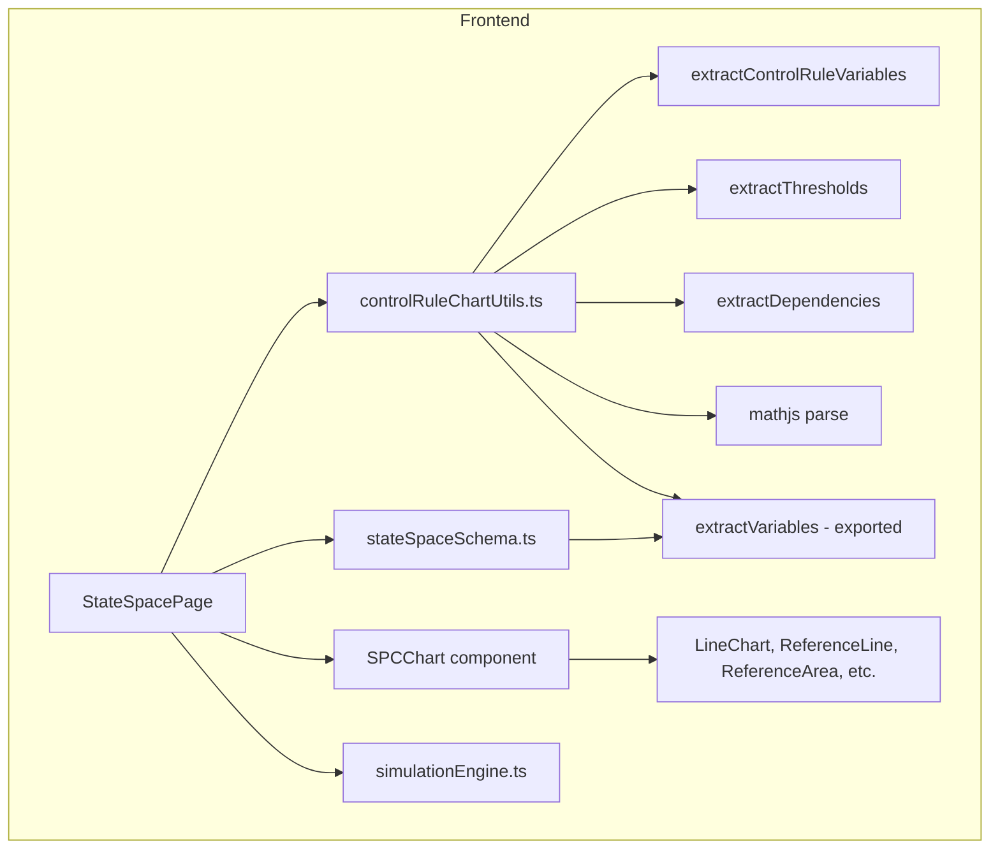
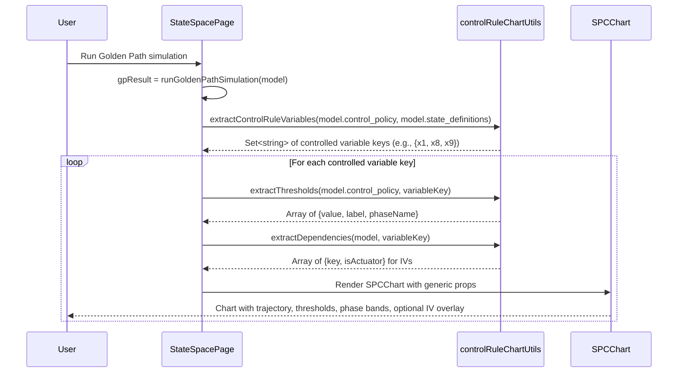

# Design Document: Control Rule Charts

## Overview

This feature adds per-variable SPC-style control charts to the StateSpacePage, driven by the control policy already defined in the NonlinearModel. When a golden path simulation completes, the system:

1. Parses all control policy phase rule conditions and exit thresholds to extract unique controlled state variable keys
2. Extracts numeric threshold values from comparison expressions
3. Parses state update equations to identify independent (driving) variables for each controlled variable
4. Renders one dedicated chart per controlled variable above the main state trajectories chart

Each chart shows the variable's trajectory with horizontal threshold reference lines, phase band shading, and an optional dual Y-axis overlay of independent variables (state variables and actuator traces). The chart component uses a generic props interface decoupled from state-space types for future reuse.

### Key Design Decisions

1. **New utility module `controlRuleChartUtils.ts`**: All extraction logic (variable extraction, threshold extraction, dependency extraction) lives in a pure utility module with no React or Recharts dependencies. This keeps the logic testable and reusable.

2. **Reuse of mathjs `parse` + AST traversal**: The existing `extractVariables` pattern in `stateSpaceSchema.ts` (traverse AST, collect SymbolNode names) is the proven approach. The new module uses the same technique but with additional AST node type handling for threshold extraction (OperatorNode with comparison operators, ConstantNode for numeric literals).

3. **Export `extractVariables` from stateSpaceSchema.ts**: The existing `extractVariables` function is currently private. Rather than duplicating it, we export it so the new utility module can import and reuse it for variable extraction from expressions.

4. **Generic `SPCChart` component**: A new `src/components/SPCChart.tsx` component accepts a props interface with no imports from state-space types. The StateSpacePage transforms `GoldenPathResult` + `NonlinearModel` data into the generic props format before passing it to SPCChart.

5. **Dual Y-axis with toggle**: The controlled variable uses the right Y-axis (linear scale). When the "Show Independent Variables" toggle is on, IV traces appear on the left Y-axis (log scale). IV lines use thinner stroke width and lower opacity to keep the controlled variable prominent.

6. **Threshold extraction via AST comparison node inspection**: For expressions like `x8 < 1.0`, we inspect the mathjs AST for `OperatorNode` with comparison operators (`<`, `>`, `<=`, `>=`, `==`). If one side is a `ConstantNode` (numeric literal), we extract it as a threshold. For compound LHS expressions like `x7 / (...) < 0.45`, we still extract `0.45` and associate it with the first state variable found on the LHS.

7. **No backend changes**: This is entirely browser-side. No Lambda, database, or API changes needed.

## Architecture



### Data Flow



## Components and Interfaces

### New Files

| File | Purpose |
|------|---------|
| `src/lib/controlRuleChartUtils.ts` | Pure utility functions for variable extraction, threshold extraction, and dependency extraction from control policy and state update equations |
| `src/components/SPCChart.tsx` | Generic SPC chart component using Recharts, decoupled from state-space types |

### Modified Files

| File | Change |
|------|--------|
| `src/lib/stateSpaceSchema.ts` | Export the existing `extractVariables` function (change from `function` to `export function`) |
| `src/pages/StateSpacePage.tsx` | Import and use `controlRuleChartUtils` + `SPCChart` to render per-variable charts above the main trajectories chart when golden path mode is active |

### Component Interfaces

#### controlRuleChartUtils.ts

```typescript
import { parse } from 'mathjs';
import { extractVariables } from './stateSpaceSchema';
import type { NonlinearModel } from './stateSpaceSchema';

/** A threshold extracted from a control policy expression */
export interface ExtractedThreshold {
  value: number;
  label: string;       // e.g., "phase_a: 1.0"
  phaseName: string;
}

/** A dependency (independent variable) for a controlled variable */
export interface ExtractedDependency {
  key: string;         // e.g., "u_fan", "x2"
  isActuator: boolean; // true if key is in u_actuators
}

/**
 * Parse all control policy expressions and return the unique set of
 * state variable keys referenced in rule conditions and exit thresholds.
 * Only returns keys that exist in state_definitions.
 */
export function extractControlRuleVariables(
  controlPolicy: NonlinearModel['control_policy'],
  stateDefinitions: NonlinearModel['state_definitions']
): Set<string>;

/**
 * Extract numeric threshold values from control policy expressions
 * for a specific variable key. Inspects comparison OperatorNodes
 * in the mathjs AST.
 */
export function extractThresholds(
  controlPolicy: NonlinearModel['control_policy'],
  variableKey: string
): ExtractedThreshold[];

/**
 * Parse the state update equation for a variable to find which
 * state variables and actuator keys it references (its IVs).
 * Excludes the variable itself and constants/transitions.
 */
export function extractDependencies(
  model: NonlinearModel,
  variableKey: string
): ExtractedDependency[];
```

#### SPCChart.tsx — Generic Props Interface

```typescript
/** A horizontal threshold reference line */
export interface SPCThreshold {
  value: number;
  label: string;
  color?: string;
}

/** A phase band for background shading */
export interface SPCPhaseBand {
  startTime: number;
  endTime: number;
  label: string;
  colorIndex: number;
}

/** An independent variable overlay trace */
export interface SPCIndependentVariable {
  key: string;
  label: string;
  values: number[];
  color?: string;
}

/** Props for the generic SPC chart component */
export interface SPCChartProps {
  label: string;                              // Chart title (e.g., "Max Temperature")
  unit: string;                               // Y-axis unit (e.g., "°C")
  timePoints: number[];                       // X-axis values (days)
  values: number[];                           // Controlled variable Y values
  thresholds: SPCThreshold[];                 // Horizontal reference lines
  phaseBands: SPCPhaseBand[];                 // Background shading regions
  independentVariables?: SPCIndependentVariable[]; // Optional IV overlay traces
}
```

The SPCChart component:
- Renders a `ResponsiveContainer` > `LineChart` with the controlled variable as a `Line` on the right `YAxis` (linear scale)
- Renders `ReferenceLine` (horizontal) for each threshold
- Renders `ReferenceArea` for each phase band
- Shows a "Show Independent Variables" toggle when `independentVariables` is provided and non-empty
- When toggle is on, renders IV lines on the left `YAxis` (log scale) with thinner stroke and lower opacity
- Shows a `Legend` for IV lines when toggle is on
- Uses the same `PHASE_BAND_COLORS` palette as the main chart

## Data Models

### Extraction Input: Control Policy Structure (existing)

The extraction functions operate on the existing `control_policy` structure already defined in `stateSpaceSchema.ts`:

```typescript
interface ControlPolicy {
  phases: Phase[];
  initial_phase: string;
}

interface Phase {
  name: string;
  entry_condition: string;   // mathjs expression
  rules: ActuatorRule[];
  exit_threshold: string | null;
}

interface ActuatorRule {
  condition: string;      // mathjs expression (e.g., "x8 < 1.0")
  actuator: string;
  value: number;
  duration_steps: number;
}
```

### Extraction Output: Per-Variable Chart Data

For each controlled variable, the StateSpacePage assembles this data before passing to SPCChart:

```typescript
// Example for x8 (Oxygen Mass):
{
  label: "Oxygen Mass",           // from state_definitions.x8.name
  unit: "kg",                     // from state_definitions.x8.unit
  timePoints: gpResult.timePoints,
  values: gpResult.stateHistory.x8,
  thresholds: [
    { value: 1.0, label: "phase_a: 1.0" },
    { value: 0.8, label: "phase_b: 0.8" },
    { value: 0.5, label: "phase_c: 0.5" },
  ],
  phaseBands: [
    { startTime: 0, endTime: 2.1, label: "phase_a_mesophilic_ignition", colorIndex: 0 },
    { startTime: 2.1, endTime: 5.3, label: "phase_b_thermophilic_handover", colorIndex: 1 },
    { startTime: 5.3, endTime: 14, label: "phase_c_lignin_breach", colorIndex: 2 },
  ],
  independentVariables: [
    { key: "u_fan", label: "u_fan (Fan duty cycle)", values: gpResult.actuatorTraces.u_fan },
    { key: "x2", label: "x2 (Mesophilic Mass)", values: gpResult.stateHistory.x2 },
    { key: "x3", label: "x3 (Thermophilic Mass)", values: gpResult.stateHistory.x3 },
    // ... other vars from x8_next equation
  ],
}
```

### mathjs AST Node Types Used for Extraction

The threshold extraction inspects these mathjs AST node types:

| Node Type | Usage |
|-----------|-------|
| `SymbolNode` | Variable references (e.g., `x8`, `u_fan`) — has `.name` property |
| `OperatorNode` | Comparison operators (`<`, `>`, `<=`, `>=`, `==`) — has `.op` and `.args` properties |
| `ConstantNode` | Numeric literals (e.g., `1.0`, `45`) — has `.value` property |

For `x8 < 1.0`, the AST is:
```
OperatorNode(<)
├── SymbolNode(x8)
└── ConstantNode(1.0)
```

For `x7 / (x2 + x3 + ...) < 0.45`, the AST is:
```
OperatorNode(<)
├── OperatorNode(/)
│   ├── SymbolNode(x7)
│   └── OperatorNode(+) ...
└── ConstantNode(0.45)
```

The extraction algorithm:
1. Parse the expression with `mathjs.parse()`
2. Find the top-level `OperatorNode` with a comparison operator
3. Identify which side has a `ConstantNode` — that's the threshold value
4. Identify which side has variable references — extract the first state variable key as the "primary" variable
5. If neither side is a simple `ConstantNode` (e.g., comparing two variables), skip threshold extraction for that expression

### Dependency Extraction from State Update Equations

For a controlled variable like `x8`, the dependency extractor:
1. Looks up the equation key `x8_next` in `state_update_equations`
2. Uses `extractVariables()` to get all referenced symbols
3. Filters to keep only keys that are in `state_definitions` (state variables) or `u_actuators` (actuator keys)
4. Excludes the variable itself (`x8`), constants, transition variables, and built-ins
5. Marks each dependency as `isActuator: true/false`

Example for `x8_next = "max(x8 + dt * (k_diff * u_fan * afp - q_resp * (mu_m * phi_lim * x2 + mu_t * phi_lim * x3)), 0)"`:
- All symbols: `x8`, `dt`, `k_diff`, `u_fan`, `afp`, `q_resp`, `mu_m`, `phi_lim`, `x2`, `mu_t`, `x3`
- After filtering (keep state vars + actuators, exclude self):
  - `u_fan` (actuator) → `{ key: "u_fan", isActuator: true }`
  - `x2` (state) → `{ key: "x2", isActuator: false }`
  - `x3` (state) → `{ key: "x3", isActuator: false }`


## Correctness Properties

*A property is a characteristic or behavior that should hold true across all valid executions of a system — essentially, a formal statement about what the system should do. Properties serve as the bridge between human-readable specifications and machine-verifiable correctness guarantees.*

### Property 1: Variable extraction returns exactly the state definition keys referenced in control policy expressions

*For any* control policy with phases containing rule conditions and exit thresholds, and any set of state definitions, `extractControlRuleVariables` should return a set where: (a) every key in the result exists in `state_definitions`, (b) every key in the result appears as a `SymbolNode` in at least one rule condition or non-null exit threshold expression, (c) the result contains no duplicates, and (d) no state variable key that appears in a rule condition or exit threshold is missing from the result.

**Validates: Requirements 1.1, 1.4, 1.7**

### Property 2: Threshold extraction returns correct numeric values with phase associations for all comparison expressions

*For any* control policy where rule conditions and exit thresholds contain comparison expressions with a numeric literal on one side, `extractThresholds(controlPolicy, variableKey)` should return a threshold entry for each such expression that references `variableKey`, where: (a) the `value` field equals the numeric literal from the expression, (b) the `phaseName` field matches the phase the expression belongs to, and (c) thresholds from all phases are collected (not just the first match).

**Validates: Requirements 2.1, 2.3, 2.4**

### Property 3: Dependency extraction returns state variables and actuator keys from the state update equation, excluding self and non-state symbols

*For any* NonlinearModel and any controlled variable key, `extractDependencies(model, variableKey)` should return a list where: (a) every returned key exists in either `state_definitions` or `u_actuators`, (b) the controlled variable key itself is not in the result, (c) constants, transition variable keys, shock keys, and built-ins (`dt`, `t`) are not in the result, (d) every state variable or actuator key that appears as a `SymbolNode` in the `{variableKey}_next` equation (and passes the filter) is present in the result, and (e) each dependency is correctly marked with `isActuator: true` if it's in `u_actuators`.

**Validates: Requirements 5.5, 5.6, 5.7**

## Error Handling

### Expression Parsing Errors in Extraction

The extraction functions operate on control policy expressions that have already been validated by `validateControlPolicy` during model loading. However, the extraction functions should still handle parse failures gracefully:

- **`extractControlRuleVariables`**: If `mathjs.parse()` throws on an expression, that expression is skipped (no variables extracted from it). No error is thrown — the function returns whatever variables it could extract from the remaining expressions.
- **`extractThresholds`**: If `mathjs.parse()` throws on an expression, that expression is skipped. If the AST doesn't contain a comparison operator or numeric literal, the expression is skipped without error.
- **`extractDependencies`**: If the equation key `{variableKey}_next` doesn't exist in `state_update_equations`, returns an empty array. If `mathjs.parse()` throws, returns an empty array.

### Missing Data Handling

- **No control policy**: If `model.control_policy` is undefined, no SPC charts are rendered. The extraction functions are not called.
- **No golden path result**: If `gpResult` is null (simulation hasn't run or failed), no SPC charts are rendered.
- **Empty phases array**: `extractControlRuleVariables` returns an empty set. No charts rendered.
- **Variable not in stateHistory**: If an extracted variable key doesn't have data in `gpResult.stateHistory`, that chart is skipped.
- **Actuator not in actuatorTraces**: If a dependency key marked as actuator doesn't exist in `gpResult.actuatorTraces`, it's excluded from the independent variables list.

### SPCChart Component Robustness

- Empty `thresholds` array: Renders trajectory only, no reference lines.
- Empty `phaseBands` array: Renders without background shading.
- Empty or missing `independentVariables`: No toggle button shown, no IV overlay.
- Mismatched array lengths (`timePoints.length !== values.length`): The component trusts the caller to provide consistent data (validated upstream).

## Testing Strategy

### Property-Based Testing

Use `fast-check` (v4.6.0, already installed) as the property-based testing library.

Each property test must:
- Run a minimum of 100 iterations
- Reference its design document property in a comment tag
- Use `fast-check` arbitraries to generate random valid control policies, state definitions, and state update equations

Tag format: **Feature: control-rule-charts, Property {number}: {property_text}**

Each correctness property MUST be implemented by a SINGLE property-based test.

Test file: `src/lib/controlRuleChartUtils.property.test.ts`

#### Custom Arbitraries Needed

These build on the existing arbitraries from `stateSpaceSchema.property.test.ts`:

```typescript
// Generate a simple comparison expression: "varKey op numericLiteral"
function arbSimpleComparison(
  varKey: string,
  numericRange?: [number, number]
): fc.Arbitrary<{ expr: string; threshold: number }>;

// Generate a compound comparison expression: "varKey / (v1 + v2 + ...) op numericLiteral"
function arbCompoundComparison(
  primaryVar: string,
  otherVars: string[],
  numericRange?: [number, number]
): fc.Arbitrary<{ expr: string; threshold: number }>;

// Generate a control policy with known variable references and thresholds
function arbControlPolicyWithKnownVars(
  stateKeys: string[],
  actuatorKeys: string[]
): fc.Arbitrary<{
  policy: ControlPolicy;
  expectedVars: Set<string>;
  expectedThresholds: Map<string, Array<{ value: number; phaseName: string }>>;
}>;

// Generate a state update equation with known dependencies
function arbEquationWithKnownDeps(
  selfKey: string,
  stateKeys: string[],
  actuatorKeys: string[],
  constantKeys: string[],
  transitionKeys: string[]
): fc.Arbitrary<{
  equation: string;
  expectedStateDeps: string[];
  expectedActuatorDeps: string[];
}>;
```

#### Property Tests to Implement

| Property | Strategy |
|----------|----------|
| P1: Variable extraction | Generate control policies with known state variable references across multiple phases and rules. Verify `extractControlRuleVariables` returns exactly the expected set — deduplicated, filtered to state_definitions only. |
| P2: Threshold extraction | Generate control policies with comparison expressions containing known numeric literals. Verify `extractThresholds` returns all thresholds with correct values and phase names. Include multi-phase scenarios. |
| P3: Dependency extraction | Generate models with state update equations containing known mixes of state vars, actuator keys, constants, and transitions. Verify `extractDependencies` returns only state vars and actuators (excluding self), with correct `isActuator` flags. |

### Unit Testing

Unit tests complement property tests for specific examples and edge cases.

Test file: `src/lib/controlRuleChartUtils.test.ts`

**Variable extraction unit tests:**
- Extract `{x1, x8, x9}` from the Sapi-an composting control policy
- Return empty set for control policy with empty phases array
- Return empty set for phases with no rules and null exit thresholds
- Filter out constants (`K_o`) and actuator keys (`u_fan`) from results
- Handle compound expressions like `x7 / (x2 + x3 + ...) < 0.45` — extract `x7` (and others that are state vars)

**Threshold extraction unit tests:**
- Extract `{1.0, 0.8, 0.5}` for `x8` from the Sapi-an policy (one per phase)
- Extract `{45, 55}` for `x1` from exit thresholds
- Return empty array for a variable with no thresholds
- Extract `0.45` from compound expression `x7 / (...) < 0.45`
- Skip expressions that compare two variables (e.g., `x1 > x2`) — no threshold extracted

**Dependency extraction unit tests:**
- For `x8` in the Sapi-an model, return `u_fan`, `x2`, `x3` (and any other state/actuator refs in `x8_next`)
- Return empty array when equation key doesn't exist
- Exclude the variable itself from dependencies
- Correctly mark actuator keys with `isActuator: true`

**SPCChart component tests** (in `src/components/__tests__/SPCChart.test.tsx`):
- Renders without crashing with minimal props (empty thresholds, empty phaseBands)
- Does not show toggle button when independentVariables is empty
- Shows toggle button when independentVariables is provided
- Does not import any state-space-specific types (static analysis / import check)

### Test Configuration

```typescript
// Property test configuration
import fc from 'fast-check';

// Feature: control-rule-charts, Property 1: Variable extraction returns exactly the state definition keys referenced in control policy expressions
fc.assert(
  fc.property(arbControlPolicyWithKnownVars(stateKeys, actuatorKeys), ({ policy, expectedVars, stateDefinitions }) => {
    const result = extractControlRuleVariables(policy, stateDefinitions);
    expect(result).toEqual(expectedVars);
  }),
  { numRuns: 100 }
);
```
