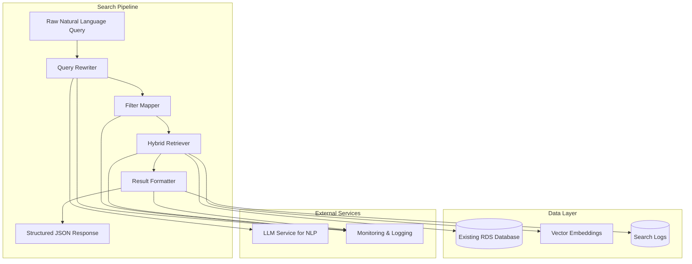
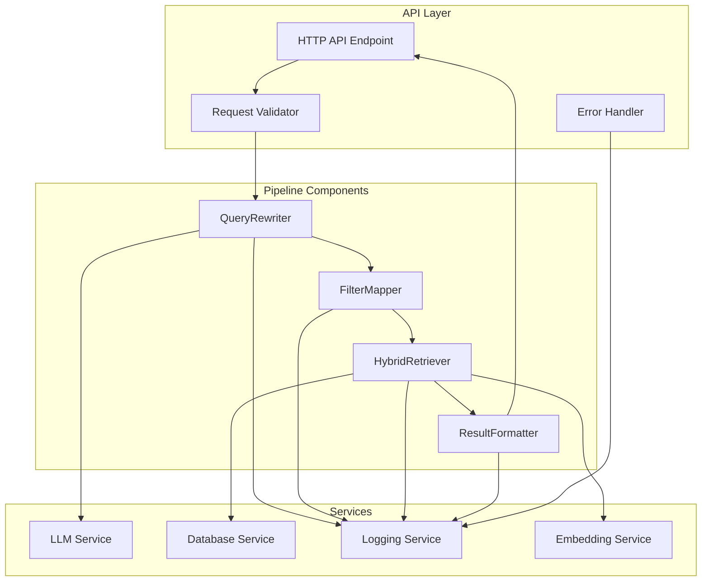

# Enhanced Search Pipeline Design Document

## Overview

The Enhanced Search Pipeline is a modular natural-language product search system that processes user queries through a structured 5-step pipeline. It supports price-based filtering, handles inventory with pre-order capabilities, and uses existing RDS database schema with vector embeddings for semantic similarity ranking.

The system is designed to integrate seamlessly with existing infrastructure while providing advanced search capabilities including natural language price constraints, semantic product matching, and comprehensive observability.

## Architecture

### High-Level Pipeline Architecture



### Component Architecture



## Components and Interfaces

### QueryRewriter Component

Transforms raw natural language queries into structured objects with semantic intent and price constraints.

**Key Responsibilities:**
- Extract semantic search terms from natural language
- Identify and parse price constraints (under, above, between patterns)
- Validate extracted constraints
- Provide fallback semantic queries

**Interface:**
```python
from dataclasses import dataclass
from typing import Optional

@dataclass
class QueryComponents:
    semantic_query: str               # e.g., "instant noodles"
    price_min: Optional[float] = None
    price_max: Optional[float] = None
    negated_terms: List[str] = None   # e.g., ["spicy", "dairy"]

class QueryRewriter:
    def __init__(self, llm_client):
        self.llm = llm_client
    
    def __call__(self, raw_query: str) -> QueryComponents:
        """
        Use an LLM to extract:
        - semantic_query
        - price_min / price_max (if any)
        Validate that the result matches the QueryComponents schema.
        """
        pass
```

**Price Pattern Recognition:**
- "under 20 pesos", "<= 20" → price_max = 20
- "above 50 pesos", "> 50" → price_min = 50  
- "between 20 and 50 pesos" → price_min = 20, price_max = 50
- No price mentioned → price_min = None, price_max = None

### FilterMapper Component

Maps QueryComponents into concrete filter parameters for SQL execution.

**Interface:**
```python
@dataclass
class SqlFilterParams:
    min_price: Optional[float]
    max_price: Optional[float]
    excluded_terms: List[str] = None  # Negated characteristics to exclude

class FilterMapper:
    def __call__(self, qc: QueryComponents) -> SqlFilterParams:
        """
        - Pass through qc.price_min → min_price
        - Pass through qc.price_max → max_price
        - No inventory filter here (inventory is handled in ranking/labeling)
        """
        return SqlFilterParams(
            min_price=qc.price_min,
            max_price=qc.price_max
        )
```

### HybridRetriever Component

Executes combined SQL and vector similarity searches with price filtering and product eligibility.

**Interface:**
```python
class HybridRetriever:
    def __init__(self, db_connection, embedding_model):
        self.db = db_connection
        self.embedding_model = embedding_model
    
    def search(self, semantic_query: str, filters: SqlFilterParams, limit: int = 20):
        query_embedding = self.embedding_model.embed(semantic_query)
        
        sql = """
        SELECT
          id,
          name,
          description,
          price,
          stock_level,
          is_active,
          1 - (embedding <=> :query_embedding) AS similarity_score
        FROM products
        WHERE is_active = TRUE
          AND (:min_price IS NULL OR price >= :min_price)
          AND (:max_price IS NULL OR price <= :max_price)
        ORDER BY
          (stock_level > 0) DESC,        -- in-stock first
          embedding <=> :query_embedding -- semantic similarity
        LIMIT :limit;
        """
        
        params = {
            "query_embedding": query_embedding,
            "min_price": filters.min_price,
            "max_price": filters.max_price,
            "limit": limit,
        }
        
        # Execute parameterized query via db driver
        rows = self.db.fetch_all(sql, params)
        return rows
```

**Key Features:**
- Mandatory `is_active = TRUE` filter for product eligibility
- Optional price range filtering with NULL-safe conditions
- Vector similarity ranking using pgvector `<=>` operator
- Stock level boosting (in-stock products ranked higher)
- Parameterized queries for SQL injection prevention

### ResultFormatter Component

Converts SQL rows into structured API response format with proper labeling and metadata.

**Interface:**
```python
def format_results(rows):
    results = []
    for r in rows:
        in_stock = r["stock_level"] > 0
        status_label = "In stock" if in_stock else "Out of stock – available for pre-order"
        
        results.append({
            "id": r["id"],
            "name": r["name"],
            "description": r.get("description"),
            "price": float(r["price"]),
            "stock_level": r["stock_level"],
            "in_stock": in_stock,
            "status_label": status_label,
            "similarity_score": float(r["similarity_score"]),
        })
    return results
```

## Data Models

### Core Data Structures

```python
# Input/Output Models
@dataclass
class SearchRequest:
    query: str
    store_id: Optional[str] = None

@dataclass
class SearchResponse:
    results: List[ProductResult]
    filters_applied: FiltersApplied
    debug: Optional[DebugInfo] = None

@dataclass
class ProductResult:
    id: str
    name: str
    description: Optional[str]
    price: float
    stock_level: int
    in_stock: bool
    status_label: str
    similarity_score: float

@dataclass
class FiltersApplied:
    price_min: Optional[float]
    price_max: Optional[float]

@dataclass
class DebugInfo:
    semantic_query: str
    raw_sql: str
    parsed_constraints: dict
```

### Database Schema (Existing)

The system uses existing RDS database schema without modifications:

```sql
-- Existing products table structure
CREATE TABLE products (
    id VARCHAR(255) PRIMARY KEY,
    name VARCHAR(255) NOT NULL,
    description TEXT,
    price DECIMAL(10,2) NOT NULL,
    stock_level INT NOT NULL DEFAULT 0,
    is_active BOOLEAN NOT NULL DEFAULT TRUE,
    embedding vector(1536)  -- Existing pgvector column
);

-- Required indexes for performance
CREATE INDEX products_embedding_idx ON products USING ivfflat (embedding vector_cosine_ops);
CREATE INDEX products_active_price_idx ON products (is_active, price);
CREATE INDEX products_stock_idx ON products (stock_level);
```

## Correctness Properties

*A property is a characteristic or behavior that should hold true across all valid executions of a system-essentially, a formal statement about what the system should do. Properties serve as the bridge between human-readable specifications and machine-verifiable correctness guarantees.*
Property 1: Pipeline input acceptance
*For any* natural language input string, the Search_Pipeline should process it without errors and produce a valid response structure
**Validates: Requirements 1.1**

Property 2: Query rewriting consistency
*For any* raw query input, the QueryRewriter should produce a valid QueryComponents object with a non-empty semantic_query string
**Validates: Requirements 1.2, 12.1, 12.2**

Property 3: Filter mapping reliability
*For any* QueryComponents object, the FilterMapper should produce valid SqlFilterParams with correct price constraint passthrough
**Validates: Requirements 1.3, 12.3**

Property 4: Hybrid query execution
*For any* SqlFilterParams, the HybridRetriever should generate and execute valid parameterized SQL queries without errors
**Validates: Requirements 1.4, 12.4**

Property 5: Complete pipeline response
*For any* natural language query, the complete pipeline should return a properly structured SearchResponse with all required fields
**Validates: Requirements 1.5, 7.1, 7.5**

Property 6: Price constraint extraction
*For any* natural language query containing price terms, the QueryRewriter should correctly extract price constraints into price_min and price_max fields
**Validates: Requirements 2.1**

Property 7: Price filtering accuracy
*For any* price filter applied, all returned products must have prices within the specified range (inclusive of boundaries)
**Validates: Requirements 3.5, 9.1**

Property 8: No price condition when none specified
*For any* query without price terms, the system should not apply price filtering to the SQL query
**Validates: Requirements 3.4**

Property 9: Zero stock inclusion
*For any* product search, products with stock_level = 0 should be included in results and labeled as "Out of stock – available for pre-order"
**Validates: Requirements 4.1, 4.4**

Property 10: Stock level ranking boost
*For any* search results with mixed stock levels, products with stock_level > 0 should be ranked higher than products with stock_level = 0 when similarity scores are equal
**Validates: Requirements 4.2, 4.5, 6.4**

Property 11: In-stock labeling accuracy
*For any* product with stock_level > 0, the system should label it as "In stock" and set in_stock = true
**Validates: Requirements 4.3**

Property 12: Active product filtering
*For any* product search, only products with is_active = TRUE should appear in results, and no products with is_active = FALSE should ever be returned
**Validates: Requirements 5.1, 5.2, 5.4, 9.2**

Property 13: SQL active filter inclusion
*For any* generated SQL query, the WHERE clause should always include "is_active = TRUE" condition
**Validates: Requirements 5.3**

Property 14: Embedding generation consistency
*For any* semantic query string, the system should generate a valid vector embedding for similarity calculation
**Validates: Requirements 6.1**

Property 15: Vector similarity ranking
*For any* search results, products should be ordered primarily by semantic similarity score (higher similarity first)
**Validates: Requirements 6.3**

Property 16: Similarity score transparency
*For any* product result, the response should include the calculated similarity_score for transparency
**Validates: Requirements 6.5, 7.2**

Property 17: Complete product information
*For any* product in search results, it should include all required fields: id, name, description, price, stock_level, in_stock, status_label, and similarity_score
**Validates: Requirements 7.2**

Property 18: Filter metadata inclusion
*For any* search response, the filters_applied object should accurately reflect the price_min and price_max values that were applied
**Validates: Requirements 7.3**

Property 19: Debug information completeness
*For any* search request with debug enabled, the response should include semantic_query, raw_sql, and parsed_constraints in the debug section
**Validates: Requirements 7.4**

Property 20: Performance logging
*For any* search request, the system should log execution time per pipeline step and overall request duration
**Validates: Requirements 8.4, 10.5**

Property 21: Error logging and safe responses
*For any* parsing or SQL error, the system should log the error details and return a safe error response without exposing internal details
**Validates: Requirements 9.3, 9.4**

Property 22: Validation error messages
*For any* validation failure, the system should provide meaningful error messages to help users correct their queries
**Validates: Requirements 9.5**

Property 23: Comprehensive query logging
*For any* processed query, the system should log the raw user query, parsed query object, filter parameters, and SQL query with parameters
**Validates: Requirements 10.1, 10.2, 10.3, 10.4**

Property 24: Database schema compatibility
*For any* database operation, the system should use only existing columns from the products table: id, name, description, price, stock_level, is_active, embedding
**Validates: Requirements 11.1, 11.2, 11.4**

Property 25: API endpoint compliance
*For any* POST request to /search with valid JSON payload, the system should accept the request and return appropriate responses
**Validates: Requirements 13.2, 13.3**

Property 26: HTTP error handling
*For any* malformed request or system error, the system should return appropriate HTTP status codes (400 for validation errors, 500 for system errors) with descriptive messages
**Validates: Requirements 13.4, 13.5**

Property 27: Negation detection and extraction
*For any* query containing negation phrases like "no", "not", "avoid", or "without", the QueryRewriter should correctly identify and extract the negated terms
**Validates: Requirements 14.1**

Property 28: Negation filtering accuracy
*For any* search with negation filters, the system should exclude products that semantically match the negated characteristics from results
**Validates: Requirements 14.2, 14.3, 14.4**

Property 29: Negation transparency
*For any* search where negation filtering is applied, the system should log the excluded characteristics and inform the customer what was filtered out
**Validates: Requirements 14.5**

## Error Handling

### Error Categories and Response Strategy

**Input Validation Errors (400 Bad Request):**
- Malformed JSON payloads
- Missing required query parameter
- Invalid parameter types or values
- Empty or excessively long queries

**Processing Errors (500 Internal Server Error):**
- LLM service failures during query rewriting
- Database connection or query execution failures
- Embedding generation failures
- Unexpected system exceptions

**Business Logic Errors (422 Unprocessable Entity):**
- Queries that cannot be parsed for semantic meaning
- Price constraints that are logically invalid (e.g., min > max)
- Queries that would return no results due to overly restrictive filters

### Error Response Format

```json
{
  "error": {
    "type": "validation_error",
    "message": "Query parameter is required and cannot be empty",
    "code": "MISSING_QUERY",
    "suggestions": [
      "Provide a search query in the 'query' field",
      "Example: {'query': 'noodles under 20 pesos'}"
    ]
  },
  "request_id": "req_123456789"
}
```

### Graceful Degradation Strategy

- **LLM Service Failure:** Fall back to simple keyword extraction and basic price pattern matching
- **Embedding Service Failure:** Fall back to text-based search using PostgreSQL full-text search
- **Database Performance Issues:** Implement query timeouts and return partial results with warnings
- **Vector Index Issues:** Fall back to sequential scan with performance warnings

## Testing Strategy

### Dual Testing Approach

The system employs both unit testing and property-based testing to ensure comprehensive coverage:

**Unit Tests:**
- Verify specific price extraction patterns ("under 20 pesos" → price_max = 20)
- Test concrete examples of query rewriting and filter mapping
- Validate API endpoint behavior with known inputs
- Test error handling scenarios with specific malformed inputs

**Property-Based Tests:**
- Verify universal properties across all possible inputs using **fast-check** library
- Test system behavior with generated query strings, price ranges, and product data
- Validate business rules under various conditions (price filtering, stock ranking, active product filtering)
- Ensure correctness properties hold across all scenarios

**Property-Based Testing Configuration:**
- Minimum 100 iterations per property test
- Custom generators for natural language queries, price patterns, and product data
- Shrinking enabled for minimal failing examples
- Seed-based reproducible test runs

**Test Data Generators:**
```javascript
// Example generators for property-based testing
const queryGenerator = fc.string().filter(s => s.length > 0 && s.length < 200);
const priceGenerator = fc.float({min: 0.01, max: 10000, noNaN: true});
const productGenerator = fc.record({
  id: fc.uuid(),
  name: fc.string({minLength: 1, maxLength: 100}),
  price: priceGenerator,
  stock_level: fc.integer({min: 0, max: 1000}),
  is_active: fc.boolean(),
  embedding: fc.array(fc.float({min: -1, max: 1}), {minLength: 1536, maxLength: 1536})
});
```

### Integration Testing Strategy

**End-to-End Pipeline Tests:**
- Test complete query processing pipeline with seed datasets
- Verify price filtering accuracy with known product catalogs
- Validate stock level handling and pre-order functionality
- Test semantic similarity ranking with controlled embeddings

**Database Integration Tests:**
- Test with existing RDS schema without modifications
- Verify pgvector operations and index usage
- Test connection pooling and error recovery
- Validate SQL injection prevention with parameterized queries

**Performance Testing:**
- Load testing to verify 100 queries/minute throughput
- Latency testing to ensure <2 second 95th percentile response times
- Resource usage monitoring to stay within infrastructure constraints
- Database query optimization and index effectiveness testing

## Deployment Architecture

### AWS Lambda Implementation

```python
# Lambda handler structure
import json
import logging
from typing import Dict, Any

from search_pipeline import SearchPipeline
from database import DatabaseService
from embedding import EmbeddingService

# Initialize services
db_service = DatabaseService()
embedding_service = EmbeddingService()
search_pipeline = SearchPipeline(db_service, embedding_service)

def lambda_handler(event: Dict[str, Any], context: Any) -> Dict[str, Any]:
    """
    AWS Lambda handler for search API endpoint
    """
    try:
        # Parse request
        body = json.loads(event.get('body', '{}'))
        query = body.get('query')
        store_id = body.get('store_id')
        
        # Validate input
        if not query or not isinstance(query, str):
            return {
                'statusCode': 400,
                'body': json.dumps({
                    'error': {
                        'type': 'validation_error',
                        'message': 'Query parameter is required and must be a string',
                        'code': 'INVALID_QUERY'
                    }
                })
            }
        
        # Process search
        result = search_pipeline.search(query, store_id)
        
        return {
            'statusCode': 200,
            'headers': {
                'Content-Type': 'application/json',
                'Access-Control-Allow-Origin': '*'
            },
            'body': json.dumps(result, default=str)
        }
        
    except Exception as e:
        logging.error(f"Search pipeline error: {str(e)}", exc_info=True)
        return {
            'statusCode': 500,
            'body': json.dumps({
                'error': {
                    'type': 'system_error',
                    'message': 'An internal error occurred while processing your search',
                    'code': 'INTERNAL_ERROR'
                }
            })
        }
```

### Database Connection Management

```python
import psycopg2
from psycopg2.pool import ThreadedConnectionPool
import os

class DatabaseService:
    def __init__(self):
        self.pool = ThreadedConnectionPool(
            minconn=1,
            maxconn=10,
            host=os.environ['DB_HOST'],
            database=os.environ['DB_NAME'],
            user=os.environ['DB_USER'],
            password=os.environ['DB_PASSWORD'],
            port=os.environ.get('DB_PORT', 5432)
        )
    
    def execute_query(self, sql: str, params: dict):
        conn = self.pool.getconn()
        try:
            with conn.cursor(cursor_factory=psycopg2.extras.RealDictCursor) as cursor:
                cursor.execute(sql, params)
                return cursor.fetchall()
        finally:
            self.pool.putconn(conn)
```

### Monitoring and Observability

**CloudWatch Metrics:**
- Request count and error rates
- Response latency percentiles (50th, 95th, 99th)
- Database connection pool utilization
- LLM service call success rates and latency

**Structured Logging:**
```python
import json
import time
from datetime import datetime

class SearchLogger:
    def log_search_request(self, request_id: str, query: str, filters: dict):
        log_entry = {
            'timestamp': datetime.utcnow().isoformat(),
            'request_id': request_id,
            'event_type': 'search_request',
            'query': query,
            'filters': filters
        }
        print(json.dumps(log_entry))
    
    def log_pipeline_step(self, request_id: str, step: str, duration_ms: float, metadata: dict):
        log_entry = {
            'timestamp': datetime.utcnow().isoformat(),
            'request_id': request_id,
            'event_type': 'pipeline_step',
            'step': step,
            'duration_ms': duration_ms,
            'metadata': metadata
        }
        print(json.dumps(log_entry))
```

**Cost Optimization:**
- Connection pooling to reduce RDS connection overhead
- Embedding caching to reduce LLM service calls
- Query result caching for popular searches
- Efficient vector similarity queries using proper indexes

This design provides a robust, scalable, and cost-effective solution for enhanced natural language product search while maintaining compatibility with existing infrastructure and ensuring comprehensive testing coverage.