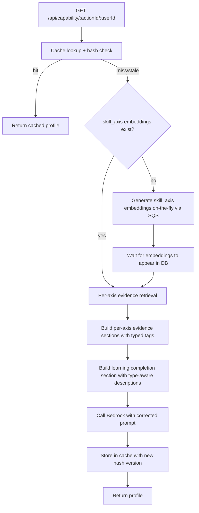

# Design Document: Evidence-Weighted Scoring

## Overview

The capability assessment system uses Bedrock Claude to score users on Bloom's taxonomy (0.0–5.0) per skill axis. The current prompts overstate what multiple-choice quiz completions prove — describing all quiz completions as "tests understanding (Bloom's level 2)" when recognition quizzes only prove the learner selected the right answer from a set.

This feature corrects the evidence hierarchy in all Bedrock prompts, removes the legacy whole-profile fallback code path, and bumps the cache version so stale scores are recomputed.

### Changes at a Glance

1. **Per-axis prompt** (`callBedrockForPerAxisCapability`): Update the EVIDENCE TYPE INTERPRETATION section and LEARNING COMPLETION section to distinguish recognition (guided selection, 0.3–0.7 range) from open-form (independent reasoning, score-indicated depth).
2. **Learning Lambda scorer** (`callBedrockForCapabilityLevels`): Add the same evidence hierarchy guidance.
3. **Learning completion section** (`fetchLearningCompletionData` consumer): Replace the blanket "tests understanding (Bloom's level 2)" description with type-aware descriptions. Include completion type and open-form scores.
4. **Whole-profile removal**: Delete `handleWholeProfileCapability`, `callBedrockForCapability`, and the `hasPerAxisEmbeddings` branching. Generate `skill_axis` embeddings on-the-fly when missing.
5. **Cache version bump**: Add a `PROMPT_VERSION` constant to `computeEvidenceHash` input so all cached profiles become stale after deployment.

## Architecture

The current flow has two code paths — per-axis (when `skill_axis` embeddings exist) and whole-profile fallback. After this change, there is one path:



### Prompt Change Strategy

The user's concern about prompt complexity is addressed by keeping changes minimal:

1. **Per-axis prompt**: The existing EVIDENCE TYPE INTERPRETATION section already lists each evidence type. We update the recognition entry to say "engaged exposure / guided participation" instead of "Demonstrates at minimum Bloom's level 1 (Remember)" and add the 0.3–0.7 scoring guidance. Other entries stay the same.

2. **Learning completion section**: Replace the single paragraph that says "tests understanding (Bloom's level 2)" with two lines — one for recognition completions, one for open-form completions. No structural change to the prompt.

3. **Learning Lambda scorer**: Add a brief evidence hierarchy note (3 lines) since this prompt currently has no evidence type guidance at all.

### On-the-Fly Embedding Generation

When `skill_axis` embeddings don't exist (profiles approved before the per-axis feature), the capability Lambda will:

1. Queue SQS messages for each axis using the same `composeAxisEmbeddingSource` / `composeAxisEntityId` functions from `lambda/skill-profile/axisUtils.js`.
2. Poll `unified_embeddings` with short waits (same retry pattern as the existing `handleWholeProfileCapability` embedding wait).
3. Proceed with the per-axis flow once embeddings appear.

This reuses the existing embedding pipeline — no new infrastructure.

## Components and Interfaces

### 1. Updated Prompt: `callBedrockForPerAxisCapability` (lambda/capability/index.js)

**Current EVIDENCE TYPE INTERPRETATION section:**
```
- "recognition" (quiz): Multiple-choice correct answer. Demonstrates at minimum Bloom's level 1 (Remember).
```

**New EVIDENCE TYPE INTERPRETATION section:**
```
- "recognition" (quiz): Multiple-choice correct answer. This is engaged exposure — the learner selected from options, not independent recall. Score recognition-only axes in the 0.3–0.7 range.
```

All other evidence type entries (bridging, self_explanation, application, analysis, synthesis, observation, pending) remain unchanged.

**Current LEARNING COMPLETION section:**
```
LEARNING COMPLETION (quiz-based training results):
The person completed adaptive quizzes that test understanding (Bloom's level 2 — "why" comprehension, not just recall). Each completed objective means the person answered correctly on the first attempt for a question testing that concept.
${learningLines}

Factor this learning data into your assessment. Quiz completion that tests "why" reasoning demonstrates at least Understand-level capability on the relevant axis. Combine this with observation evidence for the final score.
```

**New LEARNING COMPLETION section:**
```
LEARNING COMPLETION (training results):
${learningLines}

Recognition completions show the learner selected the correct answer from options — engaged exposure, not independent recall. Open-form completions show the learner produced their own reasoning at the depth indicated by the score.
Factor this data into your assessment alongside observation evidence.
```

**Updated `learningLines` format** (in the `learningSection` builder):
```
- Axis "Water Chemistry" (water_chemistry): 3 of 5 objectives completed (2 recognition, 1 open-form [self_explanation, score:2.4]).
  Completed objectives: Understand pH testing; Explain water hardness; ...
```

Currently `fetchLearningCompletionData` returns `{ axisKey, axisLabel, totalObjectives, completedObjectives, objectiveTexts }`. We need to extend it to also return `recognitionCount` and `openFormCompletions` (array of `{ questionType, score }`).

### 2. Updated Prompt: `callBedrockForCapabilityLevels` (lambda/learning/index.js)

This prompt currently has no evidence type guidance. Add a brief section after the SKILL LEVEL SCALE:

```
EVIDENCE WEIGHTING:
- Multiple-choice recognition = engaged exposure (0.3–0.7 range). Not proof of independent recall.
- Open-form responses = learner-produced reasoning. Score indicates demonstrated depth.
- Field observations = real-world demonstration. Bloom's level varies by content.
```

### 3. Updated Function: `fetchLearningCompletionData` (lambda/capability/index.js)

**Current return shape per axis:**
```javascript
{ axisKey, axisLabel, totalObjectives, completedObjectives, objectiveTexts }
```

**New return shape per axis:**
```javascript
{
  axisKey,
  axisLabel,
  totalObjectives,
  completedObjectives,
  objectiveTexts,
  recognitionCount,        // number of recognition completions
  openFormCompletions      // array of { questionType, score }
}
```

The function already queries knowledge states to determine completion. We extend it to also parse open-form state texts (using the existing `determineEvidenceTypeEnriched` or a simpler check) and count recognition vs. open-form completions.

### 4. Removed Functions (lambda/capability/index.js)

- `handleWholeProfileCapability()` — entire function deleted
- `callBedrockForCapability()` — entire function deleted (the whole-profile prompt)
- The `hasPerAxisEmbeddings` check and branching in `handleIndividualCapability` — replaced with on-the-fly generation

### 5. New Function: `ensurePerAxisEmbeddings` (lambda/capability/index.js)

```javascript
/**
 * Ensure skill_axis embeddings exist for an action. If missing, generate them
 * on-the-fly via SQS and wait for them to appear in unified_embeddings.
 *
 * Reuses composeAxisEmbeddingSource and composeAxisEntityId from skill-profile/axisUtils.js.
 *
 * @param {object} db - database client
 * @param {string} actionId
 * @param {string} organizationId
 * @param {object} skillProfile - the action's approved skill profile
 * @returns {Promise<void>}
 */
async function ensurePerAxisEmbeddings(db, actionId, organizationId, skillProfile)
```

### 6. Updated Function: `computeEvidenceHash` (lambda/capability/cacheUtils.js)

**Current hash input:**
```javascript
const input = sorted.join(',') + ':' + learningCompletionCount;
```

**New hash input:**
```javascript
const PROMPT_VERSION = 'v2';
const input = sorted.join(',') + ':' + learningCompletionCount + ':' + PROMPT_VERSION;
```

The `PROMPT_VERSION` constant is defined at the top of `cacheUtils.js`. Future prompt changes bump this value.

### 7. Updated Organization Capability Flow

`handleOrganizationCapability` currently calls `callBedrockForCapability` (the whole-profile prompt). After this change, it needs to use the per-axis flow instead. This means:

1. Check for `skill_axis` embeddings (same as individual flow).
2. If missing, call `ensurePerAxisEmbeddings`.
3. Run per-axis evidence retrieval (same as `handlePerAxisCapability` but without user scoping).
4. Call `callBedrockForPerAxisCapability` with the corrected prompt.

This is a larger refactor of `handleOrganizationCapability` to align it with the per-axis pattern.

## Data Models

### No Schema Changes

This feature modifies prompt text and code paths only. No database schema changes are needed.

### Modified Data Structures

**Learning completion data** (in-memory, returned by `fetchLearningCompletionData`):

| Field | Type | Description |
|-------|------|-------------|
| `axisKey` | string | Skill axis key |
| `axisLabel` | string | Human-readable axis label |
| `totalObjectives` | number | Total learning objectives for this axis |
| `completedObjectives` | number | Count of completed objectives (any type) |
| `objectiveTexts` | string[] | Text of completed objectives |
| `recognitionCount` | number | **New.** Count of recognition (multiple-choice) completions |
| `openFormCompletions` | array | **New.** Array of `{ questionType: string, score: number }` for open-form completions |

**Evidence hash input** (in `computeEvidenceHash`):

| Component | Current | After |
|-----------|---------|-------|
| State IDs | sorted, comma-joined | unchanged |
| Learning count | appended after `:` | unchanged |
| Prompt version | — | **New.** `':v2'` appended to hash input |


## Correctness Properties

*A property is a characteristic or behavior that should hold true across all valid executions of a system — essentially, a formal statement about what the system should do. Properties serve as the bridge between human-readable specifications and machine-verifiable correctness guarantees.*

### Property 1: Recognition evidence described as engaged exposure, not independent recall

*For any* valid skill profile and per-axis evidence set, the prompt string produced by the per-axis prompt builder SHALL contain the phrase "engaged exposure" in the recognition evidence description and SHALL NOT contain "Demonstrates at minimum Bloom's level 1 (Remember)" or "tests understanding (Bloom's level 2)" in reference to recognition evidence.

**Validates: Requirements 1.1**

### Property 2: Learning completion section distinguishes recognition from open-form

*For any* learning completion data containing at least one completion, the generated learning completion section SHALL NOT contain the phrases "tests understanding (Bloom's level 2)" or "demonstrates at least Understand-level capability" and SHALL contain distinct descriptions for recognition completions and open-form completions.

**Validates: Requirements 1.4**

### Property 3: Learning completion data classifies completions by type with scores

*For any* set of knowledge state texts for an axis's objectives, the learning completion data SHALL correctly count recognition completions (state text containing "which was the correct answer") separately from open-form completions, and for each open-form completion SHALL include the question type and continuous score parsed from the state text.

**Validates: Requirements 1.5**

### Property 4: Prompt version change invalidates all cached hashes

*For any* set of evidence state IDs and learning completion count, changing the prompt version constant SHALL produce a different evidence hash. Specifically, `computeEvidenceHash(ids, count)` with version `'v2'` SHALL NOT equal the hash produced by the old version-less computation for the same inputs.

**Validates: Requirements 3.1, 3.2**

### Property 5: Evidence tag format preserved for all evidence types

*For any* evidence object with a valid `question_type` (recognition, bridging, self_explanation, application, analysis, synthesis, or null) and optional `continuous_score`, the evidence tag builder SHALL produce a tag matching the existing format: `[quiz:recognition]`, `[quiz:<type>, score:<score>, <status>]`, `[quiz:<type>, pending]`, `[quiz:<type>]`, or `[observation]`.

**Validates: Requirements 4.2**

## Error Handling

### On-the-Fly Embedding Generation Failures

When `ensurePerAxisEmbeddings` fails to generate embeddings (SQS send failure or embeddings don't appear after retries):

- Log the error with action ID and axis details.
- Return a 500 error: "Skill axis embeddings could not be generated. Please try again."
- Do NOT fall back to the whole-profile flow (that code path is removed).

### Bedrock Prompt Failures

No change to existing error handling. The `callBedrockForPerAxisCapability` function already returns a fallback zero-score profile if the Bedrock response is malformed.

### Cache Hash Computation

No change. The `computeEvidenceHash` function is pure and cannot fail (it uses `crypto.createHash` on string input).

### Learning Completion Data Parsing

If an open-form state text doesn't match the expected pattern, it's silently skipped (counted as neither recognition nor open-form). This matches the existing `determineEvidenceTypeEnriched` behavior — unrecognized formats fall through to "observation."

## Testing Strategy

### Property-Based Tests (fast-check + Vitest)

The project already uses `fast-check` with `vitest` for property-based testing in `lambda/capability/capability.property.test.js` and `lambda/skill-profile/index.property.test.js`. New property tests follow the same pattern.

**Test file**: `lambda/capability/capabilityUtils.test.js` (new) and updates to `lambda/capability/cacheUtils.test.js` (existing).

Each property test runs a minimum of 100 iterations and is tagged with the design property it validates.

- **Property 1**: Generate random skill profiles and evidence maps. Build the prompt string. Assert it contains "engaged exposure" for recognition and does not contain the old Bloom's level 1/2 language for recognition.
- **Property 2**: Generate random learning completion data arrays. Build the learning section string. Assert absence of old language and presence of type-distinguishing descriptions.
- **Property 3**: Generate random knowledge state texts (mix of recognition patterns, open-form patterns, and other). Run the classification logic. Assert `recognitionCount` + `openFormCompletions.length` ≤ total completions, and that each open-form entry has `questionType` and `score`.
- **Property 4**: Generate random state ID arrays and completion counts. Compute hash with old logic and new logic. Assert they differ.
- **Property 5**: Generate random evidence objects with valid question types and scores. Build the tag string. Assert it matches one of the expected tag patterns via regex.

### Unit Tests (example-based)

- Verify the per-axis prompt contains correct descriptions for open-form and observation evidence (unchanged from current — regression check).
- Verify `handleWholeProfileCapability` and `callBedrockForCapability` are no longer exported.
- Verify `ensurePerAxisEmbeddings` sends correct SQS message format (entity_type, entity_id pattern).
- Verify the organization capability flow uses the per-axis prompt after refactoring.

### Integration Tests

- End-to-end test with mock Bedrock: submit a capability request for an action with no `skill_axis` embeddings, verify embeddings are generated and the per-axis flow completes.
- Verify that a cached profile with the old hash (no version) is treated as stale after the version bump.

### What Is NOT Tested via PBT

- Bedrock response quality (the AI's actual scoring behavior) — this is tested manually by reviewing scores before/after deployment.
- Database query correctness — tested via integration tests.
- SQS message delivery — tested via integration tests with mocks.
