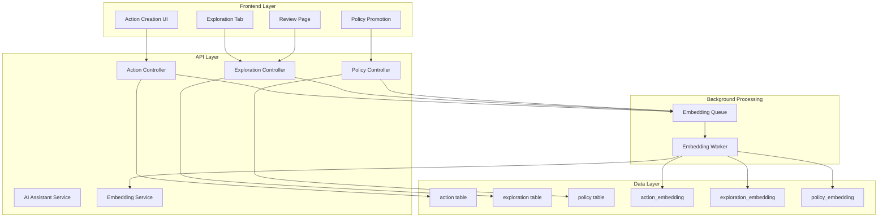

# Design Document: Exploration Data Collection Flow

## Overview

The Exploration Data Collection Flow extends the existing action system with structured exploration capabilities and policy management. The system enables agricultural operators to systematically capture, analyze, and promote farming practices through a lightweight exploration framework integrated with semantic search and AI-assisted content generation.

**Note on Field Mapping**: Logical field names (state_text, policy_text, summary_policy_text) map to existing columns in the action schema where appropriate and do not require renaming existing database fields.

The design follows a three-tier approach:

1. **Data Layer**: Extended RDS schema with separate embedding tables following AWS vector-store patterns
2. **Service Layer**: API endpoints for CRUD operations with asynchronous embedding generation
3. **UI Layer**: Minimal changes to existing action workflows with new exploration features

Key design principles:

- **Backward Compatibility**: Existing action creation flow remains unchanged
- **Asynchronous Processing**: Embedding generation happens in background, never blocks user saves
- **Field Mapping**: Logical field names map to existing action schema columns where possible
- **Separation of Concerns**: Vector embeddings stored in separate tables, not main domain tables

## Architecture



## Components and Interfaces

### Database Schema Design

The schema extends the existing action table and adds new tables for explorations, policies, and embeddings. All field names are logical names that should map to existing columns where appropriate.

#### Extended action table

```sql
-- Map logical fields to existing columns where possible
-- Only add new columns if not already present in schema

-- Existing columns (confirmed):
-- id (PK)
-- state_text (or equivalent existing field for context/problem description)
-- policy_text (or equivalent existing field for policy information)
-- user_id, location fields, crop, timestamps, attachments

-- New columns to add if not present:
ALTER TABLE action ADD COLUMN IF NOT EXISTS summary_policy_text TEXT; -- Add only if not already present
ALTER TABLE action ADD COLUMN IF NOT EXISTS policy_id INTEGER REFERENCES policy(id); -- Add only if not already present

-- Constraints
CREATE INDEX IF NOT EXISTS idx_action_policy_id ON action(policy_id);
```

#### New exploration table

```sql
CREATE TABLE exploration (
    id SERIAL PRIMARY KEY,
    action_id INTEGER UNIQUE NOT NULL REFERENCES action(id) ON DELETE CASCADE,
    exploration_code VARCHAR(20) NOT NULL UNIQUE,
    exploration_notes_text TEXT,
    metrics_text TEXT,
    public_flag BOOLEAN DEFAULT FALSE,
    created_at TIMESTAMP DEFAULT CURRENT_TIMESTAMP,
    updated_at TIMESTAMP DEFAULT CURRENT_TIMESTAMP
);

-- Constraints and indexes
CREATE UNIQUE INDEX idx_exploration_action_id ON exploration(action_id);
CREATE UNIQUE INDEX idx_exploration_code ON exploration(exploration_code);
CREATE INDEX idx_exploration_public_flag ON exploration(public_flag);
CREATE INDEX idx_exploration_created_at ON exploration(created_at);

-- Policy deletion behavior: Policies are rarely deleted
-- Application layer must validate policy_id references before allowing policy deletes
-- No CASCADE from policy to action to preserve historical data
```
```

#### New policy table

```sql
CREATE TABLE policy (
    id SERIAL PRIMARY KEY,
    title VARCHAR(255) NOT NULL,
    description_text TEXT NOT NULL,
    status VARCHAR(20) DEFAULT 'draft' CHECK (status IN ('draft', 'active', 'deprecated')),
    effective_from DATE,
    effective_to DATE,
    created_by_user_id INTEGER NOT NULL REFERENCES users(id),
    created_at TIMESTAMP DEFAULT CURRENT_TIMESTAMP,
    updated_at TIMESTAMP DEFAULT CURRENT_TIMESTAMP
);

-- Constraints and indexes
CREATE INDEX idx_policy_status ON policy(status);
CREATE INDEX idx_policy_created_by ON policy(created_by_user_id);
CREATE INDEX idx_policy_effective_dates ON policy(effective_from, effective_to);
```

#### Embedding tables

Vector embeddings are stored separately from main domain tables following AWS vector-store patterns.

```sql
CREATE TABLE action_embedding (
    id SERIAL PRIMARY KEY,
    action_id INTEGER NOT NULL REFERENCES action(id) ON DELETE CASCADE,
    embedding_type VARCHAR(50) NOT NULL,
    model VARCHAR(100) NOT NULL,
    embedding VECTOR(1536), -- Dimension to be adjusted to match the actual embedding model
    created_at TIMESTAMP DEFAULT CURRENT_TIMESTAMP
);

CREATE TABLE exploration_embedding (
    id SERIAL PRIMARY KEY,
    exploration_id INTEGER NOT NULL REFERENCES exploration(id) ON DELETE CASCADE,
    embedding_type VARCHAR(50) NOT NULL,
    model VARCHAR(100) NOT NULL,
    embedding VECTOR(1536), -- Dimension to be adjusted to match the actual embedding model
    created_at TIMESTAMP DEFAULT CURRENT_TIMESTAMP
);

CREATE TABLE policy_embedding (
    id SERIAL PRIMARY KEY,
    policy_id INTEGER NOT NULL REFERENCES policy(id) ON DELETE CASCADE,
    embedding_type VARCHAR(50) NOT NULL,
    model VARCHAR(100) NOT NULL,
    embedding VECTOR(1536), -- Dimension to be adjusted to match the actual embedding model
    created_at TIMESTAMP DEFAULT CURRENT_TIMESTAMP
);

-- Indexes for embedding tables
CREATE INDEX idx_action_embedding_action_id ON action_embedding(action_id);
CREATE INDEX idx_action_embedding_type ON action_embedding(embedding_type);
CREATE INDEX idx_exploration_embedding_exploration_id ON exploration_embedding(exploration_id);
CREATE INDEX idx_exploration_embedding_type ON exploration_embedding(embedding_type);
CREATE INDEX idx_policy_embedding_policy_id ON policy_embedding(policy_id);
CREATE INDEX idx_policy_embedding_type ON policy_embedding(embedding_type);
```

### API Interfaces

#### Action Service Extensions

```typescript
interface ActionService {
  createAction(data: CreateActionRequest): Promise<ActionResponse>
  updateAction(id: number, data: UpdateActionRequest): Promise<ActionResponse>
  generateSummaryPolicy(actionId: number): Promise<string>
}

interface CreateActionRequest {
  // Logical field names - map to existing schema columns
  state_text: string
  policy_text?: string
  summary_policy_text?: string
  is_exploration?: boolean
  exploration_code_override?: string // Allow manual override of auto-generated code
  // ... existing fields
}

interface ActionResponse {
  id: number
  state_text: string
  policy_text?: string
  summary_policy_text?: string
  policy_id?: number
  exploration?: ExplorationResponse
  // ... existing fields
}
```

#### Exploration Service

```typescript
interface ExplorationService {
  createExploration(actionId: number, data: CreateExplorationRequest): Promise<ExplorationResponse>
  updateExploration(id: number, data: UpdateExplorationRequest): Promise<ExplorationResponse>
  generateExplorationCode(date: Date, farmCode?: string): Promise<string>
  generateExplorationSuggestions(actionId: number): Promise<ExplorationSuggestions>
  listExplorations(filters: ExplorationFilters): Promise<ExplorationListResponse>
}

interface CreateExplorationRequest {
  exploration_code?: string // Allow override of auto-generated code
  exploration_notes_text?: string
  metrics_text?: string
  public_flag?: boolean
}

interface ExplorationFilters {
  date_range?: { start: Date, end: Date }
  location?: string
  explorer?: string // user_id
  public_flag?: boolean
}

interface ExplorationSuggestions {
  exploration_notes_text?: string
  metrics_text?: string
}
```

#### Policy Service

```typescript
interface PolicyService {
  createPolicy(data: CreatePolicyRequest): Promise<PolicyResponse>
  updatePolicy(id: number, data: UpdatePolicyRequest): Promise<PolicyResponse>
  linkActionToPolicy(actionId: number, policyId: number): Promise<void>
  generatePolicyFromExploration(explorationId: number): Promise<PolicyDraft>
  searchPolicies(query: string, filters?: PolicyFilters): Promise<PolicySearchResponse>
  listPolicies(filters?: PolicyFilters): Promise<PolicyListResponse>
}

interface CreatePolicyRequest {
  title: string
  description_text: string
  status: 'draft' | 'active' | 'deprecated'
  effective_from?: Date
  effective_to?: Date
  link_to_action_id?: number // Optional linking during creation
}

interface PolicyDraft {
  title: string
  description_text: string
}

interface PolicyFilters {
  status?: 'draft' | 'active' | 'deprecated'
  crop?: string
  created_by?: number
}
```

#### Embedding Service

```typescript
interface EmbeddingService {
  generateActionEmbeddings(actionId: number): Promise<void>
  generateExplorationEmbeddings(explorationId: number): Promise<void>
  generatePolicyEmbeddings(policyId: number): Promise<void>
  searchSimilar(query: string, types: EmbeddingType[], filters?: SearchFilters): Promise<SearchResult[]>
}

interface EmbeddingType {
  table: 'action' | 'exploration' | 'policy'
  embedding_type: string
}

interface SearchFilters {
  crop?: string
  date_range?: { start: Date, end: Date }
  status?: string
}
```

### UI Components

#### Action Creation Form Extensions

```typescript
interface ActionFormProps {
  initialData?: Partial<Action>
  onSave: (data: CreateActionRequest) => Promise<void>
}

// New fields added to existing form:
// - summary_policy_text textarea with AI assist button
// - is_exploration checkbox
// - exploration_code input (pre-filled with auto-generated code when is_exploration is checked, remains editable by user)
```

#### Exploration Tab Component

```typescript
interface ExplorationTabProps {
  actionId: number
  exploration?: Exploration
  onSave: (data: ExplorationData) => Promise<void>
}

interface ExplorationData {
  exploration_notes_text?: string
  metrics_text?: string
  public_flag: boolean
}

// Note: Editing exploration fields does not change whether an action is an exploration;
// that is controlled only by the existence of an exploration record.
```

#### Review Explorations Page

```typescript
interface ReviewExplorationsProps {
  filters: ExplorationFilters
  onFilterChange: (filters: ExplorationFilters) => void
  onCreatePolicy: (explorationId: number) => void
  onLinkPolicy: (actionId: number, policyId: number) => void
}

interface ExplorationListItem {
  exploration_code: string
  state_text: string
  summary_policy_text?: string
  exploration_notes_text?: string
  metrics_text?: string
  key_photos: string[] // URLs or identifiers
  action_id: number
  exploration_id: number
}
```

## Data Models

### Core Domain Models

```typescript
interface Action {
  id: number
  state_text: string // Maps to existing field
  policy_text?: string // Maps to existing field
  summary_policy_text?: string // New field
  policy_id?: number // New foreign key
  user_id: number
  crop?: string
  location?: string
  created_at: Date
  updated_at: Date
  // ... other existing fields
}

interface Exploration {
  id: number
  action_id: number
  exploration_code: string
  exploration_notes_text?: string
  metrics_text?: string
  public_flag: boolean
  created_at: Date
  updated_at: Date
}

interface Policy {
  id: number
  title: string
  description_text: string
  status: 'draft' | 'active' | 'deprecated'
  effective_from?: Date
  effective_to?: Date
  created_by_user_id: number
  created_at: Date
  updated_at: Date
}

interface ActionEmbedding {
  id: number
  action_id: number
  embedding_type: 'state' | 'policy_text' | 'summary_policy_text' | 'combined'
  model: string
  embedding: number[]
  created_at: Date
}

interface ExplorationEmbedding {
  id: number
  exploration_id: number
  embedding_type: 'exploration_notes' | 'metrics'
  model: string
  embedding: number[]
  created_at: Date
}

interface PolicyEmbedding {
  id: number
  policy_id: number
  embedding_type: 'description'
  model: string
  embedding: number[]
  created_at: Date
}
```

### Exploration Code Generation

```typescript
class ExplorationCodeGenerator {
  async generateCode(date: Date, farmCode: string = 'SF', userOverride?: string): Promise<string> {
    if (userOverride) {
      await this.validateCodeUniqueness(userOverride)
      return userOverride
    }
    
    const mmddyy = this.formatDate(date)
    const nextNumber = await this.getNextNumber(date, farmCode)
    return `${farmCode}${mmddyy}EX${nextNumber.toString().padStart(2, '0')}`
  }
  
  private formatDate(date: Date): string {
    const mm = (date.getMonth() + 1).toString().padStart(2, '0')
    const dd = date.getDate().toString().padStart(2, '0')
    const yy = date.getFullYear().toString().slice(-2)
    return `${mm}${dd}${yy}`
  }
  
  private async getNextNumber(date: Date, farmCode: string): Promise<number> {
    const dateStr = this.formatDate(date)
    const prefix = `${farmCode}${dateStr}EX`
    
    // Query for existing codes with this prefix
    const existingCodes = await this.getExistingCodes(prefix)
    const numbers = existingCodes
      .map(code => parseInt(code.substring(prefix.length)))
      .filter(num => !isNaN(num))
      .sort((a, b) => a - b)
    
    // Find next available number
    let nextNumber = 1
    for (const num of numbers) {
      if (num === nextNumber) {
        nextNumber++
      } else {
        break
      }
    }
    
    return nextNumber
  }
  
  private async validateCodeUniqueness(code: string): Promise<void> {
    const exists = await this.codeExists(code)
    if (exists) {
      throw new Error(`Exploration code ${code} already exists`)
    }
  }
}
```

### Asynchronous Embedding Processing

```typescript
interface EmbeddingQueue {
  enqueueActionEmbedding(actionId: number, fields: string[]): Promise<void>
  enqueueExplorationEmbedding(explorationId: number, fields: string[]): Promise<void>
  enqueuePolicyEmbedding(policyId: number, fields: string[]): Promise<void>
}

class EmbeddingWorker {
  async processActionEmbedding(actionId: number, fields: string[]): Promise<void> {
    const action = await this.getAction(actionId)
    
    for (const field of fields) {
      const text = action[field]
      if (text && text.trim()) {
        const embedding = await this.embeddingService.generateEmbedding(text)
        await this.saveActionEmbedding({
          action_id: actionId,
          embedding_type: field,
          model: 'titan-text-embeddings-v1',
          embedding: embedding
        })
      }
    }
  }
  
  // Similar methods for exploration and policy embeddings
}

// Critical: Jobs MUST be enqueued after the corresponding DB transaction commits 
// to avoid orphaned embedding jobs for rolled-back actions/policies.
```

### Search Implementation

For now: Implement dense vector search with optional structured filters (crop, date, status); keyword/hybrid search is a later enhancement. Search SHOULD be able to limit by entity type (actions vs explorations vs policies) even if the UI shows a unified result list.
```

## Error Handling

### Database Constraints

- **Unique Constraints**: exploration_code must be unique system-wide
- **Foreign Key Constraints**: All foreign keys have CASCADE DELETE where appropriate
- **Check Constraints**: policy.status must be one of 'draft', 'active', 'deprecated'
- **One-to-One Constraint**: action_id in exploration table must be unique

### API Error Responses

```typescript
interface ApiError {
  code: string
  message: string
  details?: any
}

// Error codes:
enum ErrorCode {
  EXPLORATION_CODE_EXISTS = 'EXPLORATION_CODE_EXISTS',
  INVALID_POLICY_STATUS = 'INVALID_POLICY_STATUS',
  EMBEDDING_GENERATION_FAILED = 'EMBEDDING_GENERATION_FAILED',
  INVALID_DATE_RANGE = 'INVALID_DATE_RANGE',
  ACTION_NOT_FOUND = 'ACTION_NOT_FOUND',
  POLICY_NOT_FOUND = 'POLICY_NOT_FOUND',
  EXPLORATION_ALREADY_EXISTS = 'EXPLORATION_ALREADY_EXISTS'
}
```

### UI Error Handling

- **Form Validation**: Real-time validation with clear error messages
- **Graceful Degradation**: AI features remain optional when services are unavailable
- **Retry Mechanisms**: Background embedding generation includes retry logic
- **User Feedback**: Clear indication when background processes are running or failed

## Testing Strategy

### Unit Testing

- Database model validation and constraints
- Exploration code generation and uniqueness logic
- Policy status transitions and date validation
- API endpoint request/response handling
- UI component rendering and user interactions
- Asynchronous embedding processing

### Property-Based Testing

Property-based testing will validate universal properties across the system using generated test data with minimum 100 iterations per test.

*A property is a characteristic or behavior that should hold true across all valid executions of a system-essentially, a formal statement about what the system should do. Properties serve as the bridge between human-readable specifications and machine-verifiable correctness guarantees.*

### Correctness Properties

Based on the prework analysis, the following properties will be validated through property-based testing:

**Property 1: Action Data Persistence**
*For any* action with policy-related text fields (state_text, policy_text, summary_policy_text), saving the action should result in all non-null text fields being stored in the action table
**Validates: Requirements 1.4**

**Property 2: Policy Linking Integrity**
*For any* action with a policy_id set, the policy_id should reference a valid, existing policy record in the policy table
**Validates: Requirements 1.5**

**Property 3: Exploration Code Generation**
*For any* date and farm code, generating an exploration code should produce a string in the format SF<mmddyy>EX<number> where the number is unique for that date
**Validates: Requirements 2.2, 2.3**

**Property 4: Exploration-Action Relationship**
*For any* action marked as an exploration, there should be exactly one corresponding exploration record, and conversely, every exploration record should reference exactly one action
**Validates: Requirements 2.4**

**Property 5: Conditional UI Display**
*For any* action that has an associated exploration record, the UI should display an exploration tab, and for any action without an exploration record, no exploration tab should be displayed
**Validates: Requirements 2.5, 6.3**

**Property 6: Policy Draft Generation**
*For any* exploration with sufficient context data (state_text, exploration_notes_text), the system should be able to generate a policy draft with both title and description fields populated
**Validates: Requirements 3.2**

**Property 7: Policy Status Validation**
*For any* policy creation or update request, the status field should only accept values from the set {'draft', 'active', 'deprecated'}
**Validates: Requirements 3.3**

**Property 8: Policy Linking Operation**
*For any* valid action ID and policy ID, performing a link operation should set the action's policy_id field to the specified policy ID
**Validates: Requirements 3.5**

**Property 9: Metadata Population**
*For any* newly created policy, the created_by_user_id and created_at fields should be automatically populated with the current user and timestamp
**Validates: Requirements 3.6**

**Property 10: Embedding Generation**
*For any* saved record with text content (action, exploration, or policy), embeddings should be generated and stored in the appropriate embedding table with correct foreign key references
**Validates: Requirements 4.1, 4.2, 4.3, 4.4**

**Property 11: Embedding Type Support**
*For any* embedding generation request, the system should support multiple embedding types (state, policy_text, summary_policy_text, exploration_notes, metrics, description) and multiple models
**Validates: Requirements 4.5**

**Property 12: Semantic Search Coverage**
*For any* search query, the system should be able to search across all embedding types (action_embedding, exploration_embedding, policy_embedding) and return relevant results
**Validates: Requirements 4.6, 5.6**

**Property 13: Exploration Filtering**
*For any* combination of filters (date range, location, explorer, public_flag), the exploration list should return only explorations that match all specified filter criteria
**Validates: Requirements 5.2**

**Property 14: Exploration Display Data**
*For any* exploration in the list view, the displayed data should include exploration_code, state_text, summary_policy_text, and associated photos
**Validates: Requirements 5.3**

**Property 15: Analytics Query Support**
*For any* date range, the system should be able to calculate the percentage of actions that were explorations and support pattern analysis queries
**Validates: Requirements 5.5**

**Property 16: Backward Compatibility**
*For any* existing action creation workflow, adding exploration features should not break or modify the existing functionality
**Validates: Requirements 6.1**

**Property 17: Data Mutability**
*For any* exploration record, users should be able to update the exploration_notes_text, metrics_text, and public_flag fields after initial creation
**Validates: Requirements 6.6**

**Property 18: Exploration Code Uniqueness**
*For any* two exploration records in the system, their exploration_code values should be unique
**Validates: Requirements 7.2**

**Property 19: Referential Integrity**
*For any* action with a non-null policy_id, the referenced policy should exist, and policies should be validated at application layer before deletion to prevent orphaned references
**Validates: Requirements 7.3**

**Property 20: Embedding Table Structure**
*For any* embedding record, it should be stored in the appropriate embedding table (action_embedding, exploration_embedding, or policy_embedding) with proper foreign key relationships to the parent record
**Validates: Requirements 7.4**

**Property 21: Policy Lifecycle Management**
*For any* policy, status transitions should follow valid business rules (draft→active, active→deprecated; deprecated→active is forbidden) and effective date ranges should be logically consistent (effective_from <= effective_to when both are set)
**Validates: Requirements 7.5**

**Property 22: AI Content Generation**
*For any* action with state_text and policy_text, the AI service should be able to generate relevant summary policy suggestions
**Validates: Requirements 8.1**
*Note: Tests for 'relevant suggestions' will check for non-empty, context-sensitive output rather than exact content, since AI outputs are non-deterministic.*

**Property 23: AI Exploration Suggestions**
*For any* action context, the AI service should be able to generate relevant suggestions for exploration_notes_text and metrics_text
**Validates: Requirements 8.2**
*Note: Tests for 'relevant suggestions' will check for non-empty, context-sensitive output rather than exact content, since AI outputs are non-deterministic.*

**Property 24: AI Policy Promotion**
*For any* exploration record, the AI service should be able to analyze the exploration data and generate a policy draft with relevant title and description
**Validates: Requirements 8.3**
*Note: Tests for 'relevant suggestions' will check for non-empty, context-sensitive output rather than exact content, since AI outputs are non-deterministic.*

**Property 25: AI Context Utilization**
*For any* AI content generation request, the suggestions should be relevant to and derived from the available action metadata and context
**Validates: Requirements 8.5**
*Note: Tests for 'relevant suggestions' will check for non-empty, context-sensitive output rather than exact content, since AI outputs are non-deterministic.*

**Property 26: AI Feature Optionality**
*For any* core system functionality, it should work correctly even when AI services are unavailable or disabled
**Validates: Requirements 8.6**

### Integration Testing Strategy

**Dual Testing Approach:**
- **Unit tests**: Verify specific examples, edge cases, and error conditions for individual components
- **Property tests**: Verify universal properties across all inputs using property-based testing frameworks

**Property-Based Testing Configuration:**
- Use fast-check (JavaScript/TypeScript) for property-based testing
- Configure each test to run minimum 100 iterations
- Tag each test with format: **Feature: exploration-data-collection-flow, Property {number}: {property_text}**
- Each correctness property will be implemented by a single property-based test

**Testing Focus Areas:**
- Database constraint validation and referential integrity
- API endpoint request/response handling with various input combinations
- UI component behavior across different data states
- Embedding generation and search functionality
- AI service integration with fallback scenarios
- Policy lifecycle and status transition logic

**Integration Points:**
- Action creation flow with exploration features
- Embedding generation pipeline with vector search
- AI service integration with content generation
- Policy promotion workflow from explorations
- Review interface with filtering and search capabilities