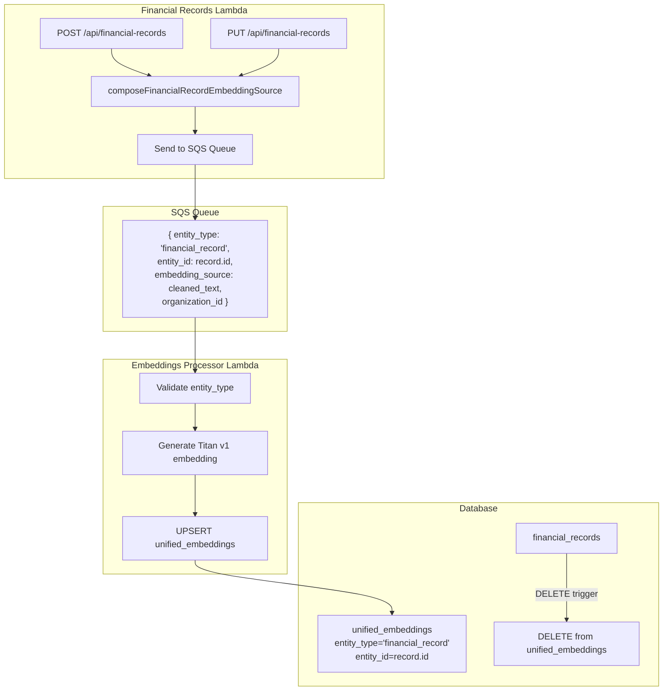
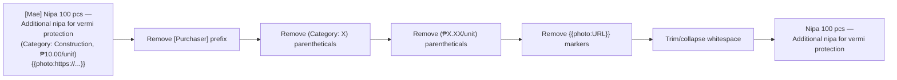

# Design Document: Financial Record Embeddings

## Overview

This feature adds `financial_record` as a first-class entity type in the unified embeddings system. Currently, the financial records Lambda queues embeddings as `entity_type: 'state'` using the linked state's ID, which means financial records are not directly searchable as their own entity type. This change makes them searchable via `entity_type: 'financial_record'` using the financial record's own ID.

The core challenge is that financial record descriptions live in linked `states.state_text` (via `state_links`), and that text contains structured metadata (`[Purchaser]` prefix, `(Category: X)`, `(₱X.XX/unit)`, `{{photo:URL}}`) that was baked in during the CSV seed. This metadata is either SQL-filterable or being deprecated, so it should be stripped from the embedding source to produce clean semantic text.

### Key Design Decisions

1. **Entity type `financial_record`, not `state`**: Embeddings use the financial record's ID as `entity_id`, not the linked state's ID. This follows the pattern where each domain entity gets its own entity_type (part, tool, action, etc.) and enables filtering search results to financial records specifically.

2. **Stripping structured metadata**: The `[Purchaser]` prefix, `(Category: X)` parentheticals, `(₱X.XX/unit)` per-unit price, and `{{photo:URL}}` markers are removed from `state_text` before embedding. These are either queryable via SQL columns (purchaser → `created_by`, category → future tagging system) or deprecated artifacts from the CSV seed.

3. **Rewrite `composeFinancialRecordEmbeddingSource`**: The existing function references dropped columns (`description`, `category_tag`, `external_source_note`). It gets rewritten to accept `{ state_text, photo_descriptions }` and apply the stripping logic. This function is the single source of truth used by both Lambda handlers and the backfill script.

4. **Database trigger for cascade delete**: A trigger on `financial_records` (matching the existing pattern for parts, tools, actions, issues, policies) ensures embeddings are cleaned up when records are deleted. This replaces the manual `DELETE FROM unified_embeddings` in the current `deleteRecord` handler.

5. **Backfill via SQS queue**: The backfill script queries all financial records with their linked state_text and photo descriptions, composes the embedding source using the shared function, and sends messages to the existing SQS queue. This reuses the existing pipeline rather than writing directly to the database.

## Architecture

### Embedding Generation Flow



### Stripping Logic Flow



## Components and Interfaces

### 1. Rewritten `composeFinancialRecordEmbeddingSource` (`lambda/shared/embedding-composition.js`)

The existing function references dropped columns. It gets rewritten with the new signature:

```javascript
/**
 * Compose embedding source for a financial record.
 *
 * Strips structured metadata from state_text and appends photo descriptions.
 *
 * @param {Object} record
 * @param {string} [record.state_text] - Raw state_text from linked state
 * @param {string[]} [record.photo_descriptions] - Photo descriptions from state_photos
 * @returns {string} Cleaned embedding source text
 */
function composeFinancialRecordEmbeddingSource(record) {
  let text = record.state_text || '';

  // Strip [Purchaser] prefix (e.g., "[Mae] " at start of string)
  text = text.replace(/^\[.*?\]\s*/, '');

  // Strip (Category: X) parentheticals — may appear with comma-joined content like (Category: Construction, ₱10.00/unit)
  // Handle combined parenthetical: (Category: X, ₱Y/unit)
  // Also handle standalone: (Category: X) or (₱Y/unit)
  text = text.replace(/\(Category:\s*[^)]*\)/g, '');
  text = text.replace(/\(₱[\d,.]+\/unit\)/g, '');

  // Strip {{photo:URL}} markers
  text = text.replace(/\{\{photo:.*?\}\}/g, '');

  // Collapse multiple spaces and trim
  text = text.replace(/\s+/g, ' ').trim();

  // Append photo descriptions
  const descriptions = (record.photo_descriptions || []).filter(d => d && d.trim());
  const parts = [text, ...descriptions].filter(Boolean);

  return parts.join('. ');
}
```

The function is exported from the same module and used by:
- `lambda/financial-records/index.js` (createRecord, updateRecord)
- `scripts/backfill-financial-record-embeddings.js` (backfill script)
- `lambda/embeddings-processor/index.js` (via `getEmbeddingSource` switch case, when `fields` are passed)

### 2. Financial Records Lambda Changes (`lambda/financial-records/index.js`)

**createRecord**: Change the SQS message from `entity_type: 'state'` / `entity_id: stateId` to `entity_type: 'financial_record'` / `entity_id: createdRecord.id`. Compose the embedding source using the rewritten function.

```javascript
// Current (WRONG):
// entity_type: 'state', entity_id: createdState.id, embedding_source: description

// New (CORRECT):
const { composeFinancialRecordEmbeddingSource } = require('/opt/nodejs/embedding-composition');

const embeddingSource = composeFinancialRecordEmbeddingSource({
  state_text: description,
  photo_descriptions: (photos || []).map(p => p.photo_description).filter(Boolean)
});

if (embeddingSource.trim()) {
  sqs.send(new SendMessageCommand({
    QueueUrl: EMBEDDINGS_QUEUE_URL,
    MessageBody: JSON.stringify({
      entity_type: 'financial_record',
      entity_id: createdRecord.id,
      embedding_source: embeddingSource,
      organization_id: organizationId
    })
  }))
  .then(() => console.log('Queued embedding for financial_record', createdRecord.id))
  .catch(err => console.error('Failed to queue embedding:', err));
}
```

**updateRecord**: When description or photos change, recompose and queue with `entity_type: 'financial_record'`.

```javascript
if ((hasDescriptionChange || hasPhotosChange) && stateId) {
  // Fetch updated photo descriptions
  const updatedPhotos = await client.query(
    'SELECT photo_description FROM state_photos WHERE state_id = $1 ORDER BY photo_order',
    [stateId]
  );
  const photoDescs = updatedPhotos.rows.map(r => r.photo_description).filter(Boolean);

  const embeddingSource = composeFinancialRecordEmbeddingSource({
    state_text: hasDescriptionChange ? body.description : /* fetch current state_text */,
    photo_descriptions: photoDescs
  });

  if (embeddingSource.trim()) {
    sqs.send(new SendMessageCommand({
      QueueUrl: EMBEDDINGS_QUEUE_URL,
      MessageBody: JSON.stringify({
        entity_type: 'financial_record',
        entity_id: id,
        embedding_source: embeddingSource,
        organization_id: organizationId
      })
    }))
    .then(() => console.log('Queued embedding for financial_record', id))
    .catch(err => console.error('Failed to queue embedding:', err));
  }
}
```

**deleteRecord**: Remove the manual `DELETE FROM unified_embeddings` calls. The database trigger handles cleanup. Also remove the state-based embedding deletion since financial records now use their own entity_type.

### 3. Cascade Delete Trigger (SQL Migration)

Following the existing pattern from the unified embeddings system:

```sql
CREATE TRIGGER financial_records_delete_embedding
    AFTER DELETE ON financial_records
    FOR EACH ROW
    EXECUTE FUNCTION delete_unified_embedding('financial_record');
```

This uses the same `delete_unified_embedding()` function already deployed for parts, tools, actions, issues, and policies.

### 4. Coverage Endpoint Update (`lambda/embeddings-coverage/index.js`)

Add a `UNION ALL` clause to the totals query:

```sql
UNION ALL
SELECT 'financial_record', COUNT(*) FROM financial_records WHERE organization_id = '${escapedOrgId}'
```

No other changes needed — the counts query already dynamically groups by `entity_type`, so `financial_record` rows in `unified_embeddings` will automatically appear.

### 5. Unified Search — No Changes Needed

The unified search Lambda (`lambda/unified-search/index.js`) already accepts any `entity_types` array and builds a dynamic `IN (...)` filter. Financial record embeddings will be included in unfiltered searches automatically, and `'financial_record'` can be passed in the `entity_types` filter. No code changes required.

### 6. Embeddings Processor — No Changes Needed

The embeddings processor (`lambda/embeddings-processor/index.js`) already has `'financial_record'` in its `validTypes` array and has a `case 'financial_record'` in the `getEmbeddingSource` switch. The rewritten `composeFinancialRecordEmbeddingSource` function will be picked up via the shared layer. No code changes required to the processor itself.

### 7. Backfill Script (`scripts/backfill-financial-record-embeddings.js`)

A Node.js script that:

1. Queries all financial records with their linked state_text and photo descriptions:
```sql
SELECT fr.id, fr.organization_id, s.state_text,
       ARRAY_AGG(sp.photo_description ORDER BY sp.photo_order) FILTER (WHERE sp.photo_description IS NOT NULL) AS photo_descriptions
FROM financial_records fr
JOIN state_links sl ON sl.entity_id = fr.id AND sl.entity_type = 'financial_record'
JOIN states s ON s.id = sl.state_id
LEFT JOIN state_photos sp ON sp.state_id = s.id
GROUP BY fr.id, fr.organization_id, s.state_text
```

2. For each record, composes the embedding source using `composeFinancialRecordEmbeddingSource`
3. Sends an SQS message to `cwf-embeddings-queue` with `entity_type: 'financial_record'`
4. Reports totals: processed, queued, skipped (empty state_text)

The script uses the same SQS queue and embeddings processor pipeline as all other entity types. It does not write directly to the database.

## Data Models

### SQS Message Format (Financial Record)

```typescript
interface FinancialRecordEmbeddingMessage {
  entity_type: 'financial_record';
  entity_id: string;        // financial_records.id (UUID)
  embedding_source: string;  // Cleaned text from composeFinancialRecordEmbeddingSource
  organization_id: string;   // financial_records.organization_id (UUID)
}
```

### unified_embeddings Row (Financial Record)

| Column | Value |
|--------|-------|
| entity_type | `'financial_record'` |
| entity_id | `financial_records.id` (UUID) |
| embedding_source | Cleaned state_text + photo descriptions |
| model_version | `'titan-v1'` |
| embedding | 1536-dimension vector |
| organization_id | `financial_records.organization_id` |

### composeFinancialRecordEmbeddingSource Input

```typescript
interface FinancialRecordEmbeddingInput {
  state_text: string;              // Raw state_text from linked state
  photo_descriptions?: string[];   // Photo descriptions from state_photos
}
```

### Stripping Rules Reference

| Pattern | Regex | Example Input | Stripped |
|---------|-------|---------------|----------|
| Purchaser prefix | `/^\[.*?\]\s*/` | `[Mae] Nipa 100 pcs` | `Nipa 100 pcs` |
| Category parenthetical | `/\(Category:\s*[^)]*\)/g` | `text (Category: Construction)` | `text` |
| Per-unit price | `/\(₱[\d,.]+\/unit\)/g` | `text (₱10.00/unit)` | `text` |
| Photo marker | `/\{\{photo:.*?\}\}/g` | `text {{photo:https://...}}` | `text` |

Note: The combined parenthetical `(Category: Construction, ₱10.00/unit)` is handled by the category regex since it matches `(Category:` followed by anything up to `)`.


## Correctness Properties

*A property is a characteristic or behavior that should hold true across all valid executions of a system — essentially, a formal statement about what the system should do. Properties serve as the bridge between human-readable specifications and machine-verifiable correctness guarantees.*

### Property 1: Metadata stripping completeness

*For any* `state_text` containing any combination of `[Purchaser]` prefix, `(Category: X)` parentheticals, `(₱X.XX/unit)` per-unit price, and `{{photo:URL}}` markers, the output of `composeFinancialRecordEmbeddingSource` shall not contain any of those patterns, and shall have no leading/trailing whitespace or consecutive spaces.

**Validates: Requirements 1.2, 1.3, 1.4, 1.5, 6.2, 6.3**

### Property 2: Photo description appending

*For any* non-empty `state_text` and any array of non-empty `photo_descriptions`, the output of `composeFinancialRecordEmbeddingSource` shall contain the cleaned state_text followed by each photo description, with all parts joined by `. `.

**Validates: Requirements 1.7, 6.4**

### Property 3: Composition idempotence

*For any* valid `{ state_text, photo_descriptions }` input, calling `composeFinancialRecordEmbeddingSource` once and then calling it again with `{ state_text: result, photo_descriptions: [] }` shall produce the same result as the first call (the output contains no strippable metadata).

**Validates: Requirements 1.10**

### Property 4: Embedding queue message correctness

*For any* financial record creation or update that changes description or photos, the SQS message sent to the embeddings queue shall have `entity_type = 'financial_record'`, `entity_id` equal to the financial record's ID (not the linked state's ID), a non-empty `embedding_source`, and the correct `organization_id`.

**Validates: Requirements 2.1, 2.2, 3.1, 3.2, 3.3**

### Property 5: Cascade delete integrity

*For any* financial record that has an associated embedding in `unified_embeddings`, deleting the financial record shall also delete the embedding row where `entity_type = 'financial_record'` and `entity_id` matches the deleted record's ID.

**Validates: Requirements 4.1**

## Error Handling

### Embedding Composition Errors

1. **Empty state_text and no photo descriptions**: `composeFinancialRecordEmbeddingSource` returns an empty string. The Lambda handler checks for empty embedding source and skips SQS queueing.
2. **Null/undefined inputs**: The function treats null/undefined `state_text` as empty string and null/undefined `photo_descriptions` as empty array. No errors thrown.
3. **Malformed metadata patterns**: If the state_text contains partial patterns (e.g., `[` without `]`), the regex won't match and the text passes through unchanged. This is correct behavior — only well-formed patterns are stripped.

### SQS Queue Errors

1. **Queue send failure**: The Lambda handler uses fire-and-forget (`.then()/.catch()`) for SQS sends. Failures are logged but do not affect the API response. The embedding will be missing until the next update or a manual backfill.
2. **Invalid message format**: The embeddings processor validates `entity_type` against its allowed list. `'financial_record'` is already in the list. Messages with empty `embedding_source` are skipped with a log warning.

### Backfill Script Errors

1. **No linked state**: Records without a linked state (missing `state_links` row) are skipped with a warning log. The script continues processing remaining records.
2. **Empty state_text**: Records with empty or null `state_text` and no photo descriptions produce an empty embedding source. These are skipped (not queued).
3. **SQS throttling**: The script should include a small delay between batches to avoid SQS throttling. If a send fails, the script logs the error and continues.

### Cascade Delete Edge Cases

1. **Record deleted before embedding generated**: If a financial record is deleted while its embedding is still in the SQS queue, the embeddings processor will attempt to write the embedding. The UPSERT will succeed, but the trigger won't fire (record already deleted). A subsequent cleanup or the next backfill coverage check will identify orphaned embeddings. This is an acceptable edge case given the async nature of the pipeline.
2. **Trigger function missing**: If `delete_unified_embedding()` function doesn't exist, the trigger creation will fail. The migration should be run after the unified embeddings system migration that creates this function.

## Testing Strategy

### Unit Tests

Unit tests verify specific examples, edge cases, and error conditions for the compose function:

1. **Specific stripping examples**:
   - `[Mae] Nipa 100 pcs — Additional nipa (Category: Construction, ₱10.00/unit) {{photo:https://...}}` → `Nipa 100 pcs — Additional nipa`
   - `[Stefan] GCash reload` → `GCash reload`
   - `Chicken feed 50kg (Category: Food)` → `Chicken feed 50kg` (no purchaser)
   - `Transaction` → `Transaction` (no metadata to strip)

2. **Edge cases**:
   - Empty string input → empty string output
   - Null state_text with photo descriptions → photo descriptions only
   - State_text with no metadata → unchanged text
   - Multiple `{{photo:URL}}` markers → all removed
   - Combined parenthetical `(Category: Construction, ₱10.00/unit)` → fully removed

3. **Photo description integration**:
   - State_text + one photo description → joined with `. `
   - State_text + multiple photo descriptions → all joined with `. `
   - Empty photo descriptions filtered out

4. **Lambda handler integration** (mocked SQS):
   - createRecord sends SQS message with `entity_type: 'financial_record'`
   - updateRecord with description change sends SQS message
   - updateRecord with photo change sends SQS message
   - SQS failure does not affect API response

### Property-Based Tests

Property tests verify universal properties across all inputs using randomization. Use `fast-check` as the property-based testing library. Each test runs minimum 100 iterations.

1. **Property 1: Metadata stripping completeness**
   - Generate random state_text with randomly injected `[Name]` prefix, `(Category: X)` parentheticals, `(₱X.XX/unit)` prices, and `{{photo:URL}}` markers
   - Call `composeFinancialRecordEmbeddingSource` with the generated input
   - Assert the output contains none of the metadata patterns
   - Assert no leading/trailing whitespace, no consecutive spaces
   - Tag: **Feature: financial-record-embeddings, Property 1: Metadata stripping completeness**

2. **Property 2: Photo description appending**
   - Generate random cleaned state_text (no metadata) and random array of non-empty photo descriptions
   - Call `composeFinancialRecordEmbeddingSource`
   - Assert the output starts with the state_text
   - Assert each photo description appears in the output
   - Assert parts are joined with `. `
   - Tag: **Feature: financial-record-embeddings, Property 2: Photo description appending**

3. **Property 3: Composition idempotence**
   - Generate random state_text with random metadata markers and random photo descriptions
   - Call `composeFinancialRecordEmbeddingSource` to get result1
   - Call `composeFinancialRecordEmbeddingSource({ state_text: result1, photo_descriptions: [] })` to get result2
   - Assert result1 === result2
   - Tag: **Feature: financial-record-embeddings, Property 3: Composition idempotence**

4. **Property 4: Embedding queue message correctness**
   - Generate random financial record creation inputs (description, photos, organization_id)
   - Mock SQS and call createRecord handler
   - Assert the SQS message has `entity_type: 'financial_record'`, `entity_id` matching the created record's ID, non-empty `embedding_source`, and correct `organization_id`
   - Tag: **Feature: financial-record-embeddings, Property 4: Embedding queue message correctness**

5. **Property 5: Cascade delete integrity**
   - Create a financial record with an embedding in unified_embeddings
   - Delete the financial record
   - Assert no rows exist in unified_embeddings with `entity_type = 'financial_record'` and `entity_id` matching the deleted record
   - Tag: **Feature: financial-record-embeddings, Property 5: Cascade delete integrity**

### Test Configuration

- **Property Test Library**: fast-check (JavaScript)
- **Minimum Iterations**: 100 per property test
- **Test Runner**: Vitest (`npm run test:run`)
- **Mocking**: SQS client mocked for Lambda handler tests; database mocked for unit tests, real database for integration tests (Properties 4, 5)
