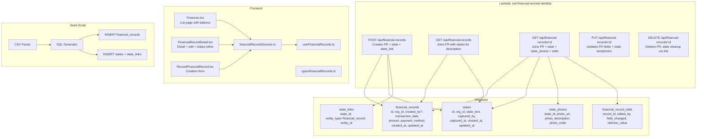

# Design Document: Financial Records Schema Refactor & CSV Seed

## Overview

This feature refactors the `financial_records` table from a wide table (with description, photos, category_tag, per_unit_price, funding_source, external_source_note) into a lean transaction table with only core financial fields. Descriptions and photos move to the existing `states`/`state_photos`/`state_links` system (entity_type = `'financial_record'`), reusing the observation infrastructure already used by actions, parts, tools, and issues.

The seed script is rewritten to parse ~3,275 CSV rows and generate SQL that inserts both `financial_records` rows and linked `states` + `state_links` rows. The Lambda and frontend are updated to work with the new schema.

### Key Design Decisions

1. **`payment_method` replaces `funding_source` + `external_source_note`**: A single VARCHAR(20) column with values `Cash`, `SCash`, `GCash`, `Wise`. Simpler, more accurate to the CSV data.
2. **`created_by` becomes nullable**: Seeded records from unknown purchasers (Jun Jun, Mark, etc.) get `NULL`. The Lambda POST still requires auth context for new records.
3. **States for descriptions**: Each financial record gets one linked state via `state_links`. The state's `state_text` holds the composed description. This enables the embedding pipeline and photo viewer to work identically to observations.
4. **`states.captured_by` handling for seeds**: ALTER `states.captured_by` to be nullable (consistent with `financial_records.created_by`). For seeded records from unknown purchasers, both `created_by` and `captured_by` are NULL.
5. **Balance computation**: `running_balance = -SUM(amount) WHERE payment_method = 'Cash'` — only Cash transactions affect petty cash balance. Computed server-side, never stored.

## Architecture



## Components and Interfaces

### 1. Migration SQL (`migrations/alter-financial-records-schema.sql`)

Single migration file that transforms the table:

```sql
BEGIN;

-- 0. Make states.captured_by nullable (for seeded records from unknown purchasers)
ALTER TABLE states ALTER COLUMN captured_by DROP NOT NULL;

-- 1. Make created_by nullable
ALTER TABLE financial_records ALTER COLUMN created_by DROP NOT NULL;

-- 2. Add payment_method column
ALTER TABLE financial_records ADD COLUMN payment_method VARCHAR(20);

-- 3. Migrate existing data: map funding_source to payment_method
UPDATE financial_records SET payment_method = 
  CASE 
    WHEN funding_source = 'petty_cash' THEN 'Cash'
    WHEN external_source_note ILIKE '%wise%' THEN 'Wise'
    WHEN external_source_note ILIKE '%gcash%' THEN 'GCash'
    ELSE 'Cash'
  END;

-- 4. Make payment_method NOT NULL after backfill
ALTER TABLE financial_records ALTER COLUMN payment_method SET NOT NULL;

-- 5. Drop old columns
ALTER TABLE financial_records DROP COLUMN description;
ALTER TABLE financial_records DROP COLUMN photos;
ALTER TABLE financial_records DROP COLUMN funding_source;
ALTER TABLE financial_records DROP COLUMN external_source_note;
ALTER TABLE financial_records DROP COLUMN category_tag;
ALTER TABLE financial_records DROP COLUMN per_unit_price;

-- 6. Add index for balance computation
CREATE INDEX idx_financial_records_payment_method 
  ON financial_records(organization_id, payment_method);

COMMIT;
```

**Important**: This migration must run AFTER the existing seed data is cleared or AFTER the new seed is applied. The order is: (1) run migration, (2) delete old seed data, (3) run new seed script.

### 2. Lambda Handler Updates (`lambda/financial-records/index.js`)

All 5 endpoints updated:

**POST /api/financial-records** (createRecord):
- Accepts: `{ transaction_date, description, amount, payment_method, photos[] }`
- Validates `payment_method` ∈ `['Cash', 'SCash', 'GCash', 'Wise']`
- In a transaction:
  1. INSERT into `financial_records` (no description/photos columns)
  2. INSERT into `states` with `state_text = description`, `captured_by = cognitoUserId`
  3. INSERT into `state_links` with `entity_type = 'financial_record'`, `entity_id = new_record.id`
  4. INSERT into `state_photos` for each photo
- Queue embedding generation for the state (not the financial_record directly)

**GET /api/financial-records** (listRecords):
- JOIN `financial_records` with `state_links` + `states` to get `state_text` as description
- Replace `funding_source` filter with `payment_method` filter
- Balance query: `WHERE payment_method = 'Cash'` instead of `funding_source = 'petty_cash'`
- Handle NULL `created_by`: `COALESCE(om.full_name, 'Unknown')` instead of casting UUID

**GET /api/financial-records/:id** (getRecord):
- JOIN with `states` via `state_links` to get description
- JOIN with `state_photos` via the state to get photos
- Handle NULL `created_by` for permission check (null created_by → only `data:read:all` can view)

**PUT /api/financial-records/:id** (updateRecord):
- Editable fields on `financial_records`: `transaction_date`, `amount`, `payment_method`
- Description/photo changes go to the linked state via `states` Lambda or direct SQL
- Audit trail in `financial_record_edits` for `amount`, `payment_method`, `transaction_date`

**DELETE /api/financial-records/:id** (deleteRecord):
- Delete the financial_record (CASCADE handles `financial_record_edits`)
- Also delete the linked state via `state_links` lookup → delete state (CASCADE handles `state_photos`, `state_links`)
- Delete associated `unified_embeddings` for both `financial_record` and `state` entity types

### 3. Frontend Types (`src/types/financialRecords.ts`)

```typescript
export interface FinancialRecord {
  id: string;
  organization_id: string;
  created_by: string | null;        // nullable for seeded records
  created_by_name?: string;
  transaction_date: string;
  amount: number;
  payment_method: 'Cash' | 'SCash' | 'GCash' | 'Wise';
  // Description and photos come from linked state
  description?: string;             // populated from states.state_text via JOIN
  photos?: ObservationPhoto[];      // populated from state_photos via JOIN
  state_id?: string;                // the linked state's ID for editing
  created_at: string;
  updated_at: string;
}

export interface FinancialRecordFilters {
  payment_method?: 'Cash' | 'SCash' | 'GCash' | 'Wise';
  start_date?: string;
  end_date?: string;
  created_by?: string;
  limit?: number;
  offset?: number;
}
```

### 4. Frontend Service (`src/services/financialRecordsService.ts`)

- `CreateFinancialRecordRequest`: `{ transaction_date, description, amount, payment_method, photos[] }`
- `UpdateFinancialRecordRequest`: `{ transaction_date?, amount?, payment_method?, description?, photos?[] }`
- Replace `funding_source` filter param with `payment_method`

### 5. Frontend Pages

**Finances.tsx** (list page):
- Replace "Source" column with "Method" column showing payment_method
- Handle null `created_by` — show "Unknown" or "—"
- Balance label stays "Petty Cash Balance"

**RecordFinancialRecord.tsx** (creation page):
- Replace funding_source Select with payment_method Select (Cash, SCash, GCash, Wise)
- Remove external_source_note field
- Description and photos still collected in the form, sent to Lambda which creates the state
- Remove receipt photo requirement (photos are optional in the new schema)

**FinancialRecordDetail.tsx** (detail page):
- Read description from `record.description` (populated by Lambda JOIN)
- Read photos from `record.photos` (populated by Lambda JOIN with state_photos)
- Remove funding_source/external_source_note display, show payment_method instead
- Remove category_tag and per_unit_price display
- Edit mode: update description/photos via the linked state
- Permission: null `created_by` records → only `data:write:all` users can edit/delete

### 6. Seed Script (`migrations/seed-financial-records.js`)

Rewritten to output SQL for both `financial_records` and `states` + `state_links`:

**Purchaser mapping**:
```javascript
const PURCHASER_MAP = {
  'Mae':      '1891f310-c071-705a-2c72-0d0a33c92bf0',
  'Lester':   '68d173b0-60f1-70ea-6084-338e74051fcc',
  'Stefan':   '08617390-b001-708d-f61e-07a1698282ec',
  'Malone':   '989163e0-7011-70ee-6d93-853674acd43c',
};
// Jun Jun, Mark, Kuya Juan, Janeth, Dhodie, empty → null created_by
```

**Description composition** (→ `states.state_text`):
- Format: `[Purchaser] Transaction — Comment (Category: X, ₱Y/unit) {{photo:URL}}`
- Omit brackets if no purchaser, omit comment if same as transaction, omit category/price if empty

**For each CSV row, generate**:
1. `INSERT INTO financial_records (id, organization_id, created_by, transaction_date, amount, payment_method, created_at, updated_at)`
2. `INSERT INTO states (id, organization_id, state_text, captured_by, captured_at, created_at, updated_at)`
3. `INSERT INTO state_links (state_id, entity_type, entity_id)`

**`states.captured_by` for seeds**: Use the mapped cognito_user_id when available. For unknown purchasers, `captured_by` is NULL (consistent with `financial_records.created_by`).

**Organization ID**: `00000000-0000-0000-0000-000000000001` (Stargazer Farm)

**Error handling**: Script halts (throws) on any unparseable date or non-numeric amount. No silent skipping.

## Data Models

### financial_records (after migration)

| Column | Type | Nullable | Notes |
|--------|------|----------|-------|
| id | UUID PK | NO | `gen_random_uuid()` |
| organization_id | UUID FK | NO | References `organizations(id)` |
| created_by | UUID | YES | NULL for unknown purchasers |
| transaction_date | DATE | NO | |
| amount | NUMERIC(12,2) | NO | Positive = expense, negative = income/reload |
| payment_method | VARCHAR(20) | NO | Cash, SCash, GCash, Wise |
| created_at | TIMESTAMPTZ | NO | |
| updated_at | TIMESTAMPTZ | NO | |

### states (existing, captured_by made nullable)

| Column | Type | Nullable | Notes |
|--------|------|----------|-------|
| id | UUID PK | NO | |
| organization_id | UUID FK | NO | |
| state_text | TEXT | YES | Composed description for financial records |
| captured_by | UUID | YES | Mapped user or NULL for unknown purchasers |
| captured_at | TIMESTAMPTZ | NO | Set to transaction_date 08:00 UTC for seeds |
| created_at | TIMESTAMPTZ | NO | |
| updated_at | TIMESTAMPTZ | NO | |

### state_links (existing, no schema changes)

| Column | Type | Notes |
|--------|------|-------|
| id | UUID PK | |
| state_id | UUID FK | References `states(id)` |
| entity_type | VARCHAR | `'financial_record'` for this feature |
| entity_id | UUID | References `financial_records(id)` |

### state_photos (existing, no schema changes)

| Column | Type | Notes |
|--------|------|-------|
| id | UUID PK | |
| state_id | UUID FK | References `states(id)` |
| photo_url | TEXT | S3 URL |
| photo_description | TEXT | Optional |
| photo_order | INTEGER | Display order |

### financial_record_edits (existing, no schema changes)

Tracks changes to `amount`, `payment_method`, `transaction_date` only (description/photo changes are tracked by the states system).

