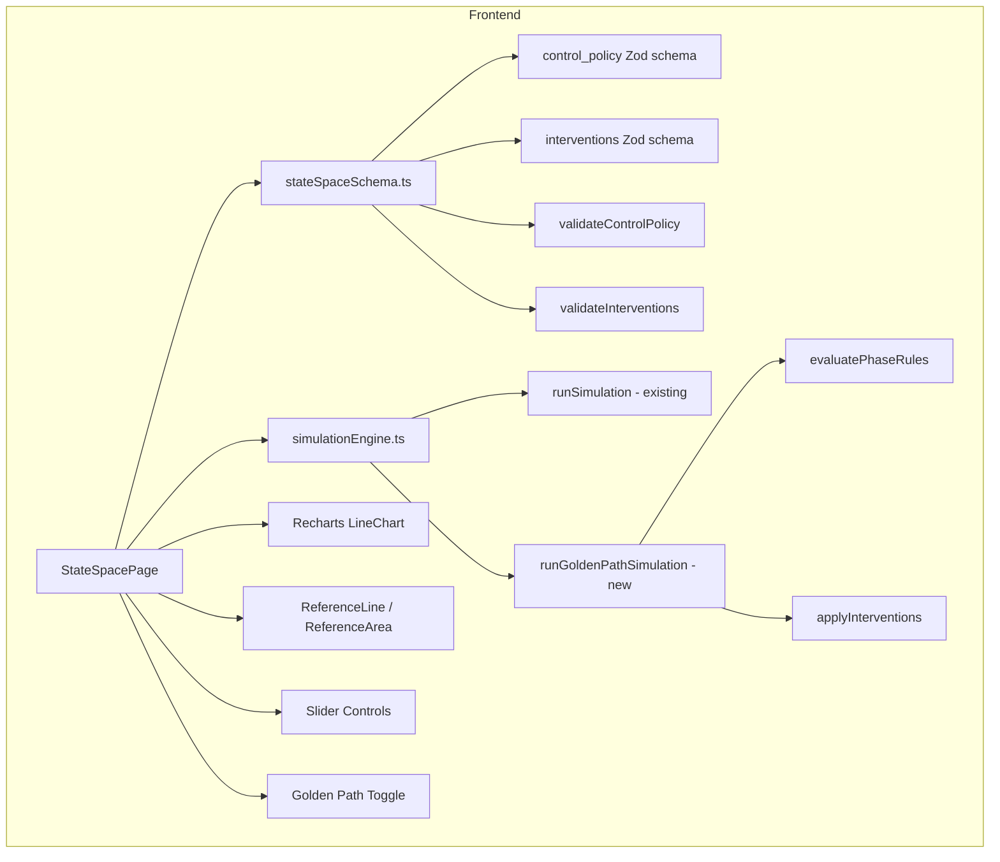
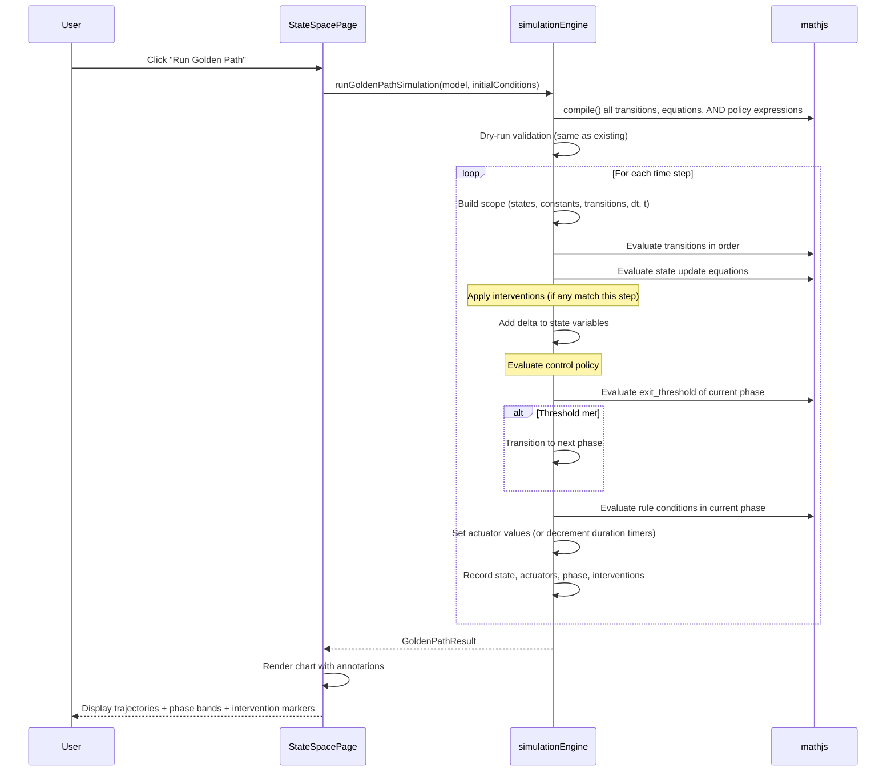

# Design Document: Golden Path Simulator

## Overview

This feature extends the existing nonlinear state-space simulator with closed-loop control policy execution and scheduled interventions. Two new optional JSON sections — `control_policy` and `interventions` — are added to the `NonlinearModel` type. When "golden path" mode is active, the simulation engine evaluates phase-based actuator rules at each time step instead of using static slider values, and applies scheduled state injections at specified times.

The design is browser-side only. No Lambda, database, or API changes are needed — the existing JSONB persistence stores the new optional sections transparently.

### Key Design Decisions

1. **Optional Zod schemas with `.optional()`**: The `control_policy` and `interventions` sections are added to `nonlinearModelSchema` using `.extend()` with `.optional()`. Existing models without these sections continue to validate. The `NonlinearModel` type gains two optional fields.

2. **Separate `runGoldenPathSimulation` function**: Rather than modifying the existing `runSimulation`, a new function `runGoldenPathSimulation` wraps the Forward Euler loop with control policy evaluation and intervention application. This keeps the existing simulation path untouched and avoids regression risk.

3. **Boolean expressions via mathjs**: Control policy conditions (`entry_condition`, `exit_threshold`, rule `condition`) are mathjs expressions that return 0 or 1. mathjs comparison operators (`>`, `<`, `>=`, `<=`, `==`) return 0 or 1 natively, so no special boolean handling is needed. A non-zero result is truthy.

4. **Duration timers as per-actuator counters**: Each actuator has a `remainingSteps` counter. When a rule fires, the counter is set to `duration_steps`. Each time step decrements active counters. While a counter is positive, the actuator holds its value and new rule evaluations for that actuator are skipped.

5. **Interventions as sorted pre-processing**: Before the simulation loop, interventions are sorted by `time_hours` and converted to time-step indices. During the loop, a pointer advances through the sorted list, applying interventions whose step index matches the current step.

6. **Extended result type**: `GoldenPathResult` extends `SimulationResult` with `actuatorTraces`, `phaseHistory`, and `interventionLog`. The existing chart code works with the base `SimulationResult` fields; new visualization components consume the extended fields.

7. **Recharts annotations for phases and interventions**: Phase transitions use `ReferenceLine` (vertical dashed lines). Intervention events use `ReferenceLine` with a different style (solid, colored). Phase bands can use `ReferenceArea` for background shading. All are available in Recharts v3.6.0.

8. **Validation reuse**: Control policy expression validation reuses the existing `extractVariables` helper and scope-building logic from `validateExpressions`. A new `validateControlPolicy` function handles the control-policy-specific cross-references (actuator key existence, phase name matching, expression variable resolution).

## Architecture



### Golden Path Simulation Flow



## Components and Interfaces

### Modified Files

| File | Change |
|------|--------|
| `src/lib/stateSpaceSchema.ts` | Add Zod schemas for `control_policy` and `interventions`. Add `validateControlPolicy` and `validateInterventions` functions. Extend `nonlinearModelSchema`. |
| `src/lib/simulationEngine.ts` | Add `runGoldenPathSimulation` function, `GoldenPathResult` type, and helper functions for policy evaluation and intervention application. |
| `src/pages/StateSpacePage.tsx` | Add golden path toggle, disable actuator sliders in GP mode, render phase bands/intervention markers on chart, display actuator traces. |

### New Files

None. All changes extend existing files.

### Component Interfaces

#### Extended Schema (`src/lib/stateSpaceSchema.ts`)

```typescript
// New Zod schemas
export const actuatorRuleSchema: z.ZodObject<...>;
export const phaseSchema: z.ZodObject<...>;
export const controlPolicySchema: z.ZodObject<...>;
export const interventionEventSchema: z.ZodObject<...>;

// Extended model schema (adds optional fields)
export const nonlinearModelSchema: z.ZodObject<...>; // now includes control_policy?, interventions?

// New validation functions
export function validateControlPolicy(model: NonlinearModel): string[];
export function validateInterventions(model: NonlinearModel): string[];
```

#### Golden Path Engine (`src/lib/simulationEngine.ts`)

```typescript
// New types
export interface ActuatorTrace {
  [actuatorKey: string]: number[];  // value (0 or 1) at each time step
}

export interface InterventionLogEntry {
  timeStep: number;
  timeHours: number;
  stateKey: string;
  delta: number;
  label: string;
}

export interface GoldenPathResult extends SimulationResult {
  actuatorTraces: ActuatorTrace;
  phaseHistory: string[];           // phase name at each time step
  interventionLog: InterventionLogEntry[];
}

export type GoldenPathOutcome =
  | { success: true; result: GoldenPathResult }
  | { success: false; error: SimulationError };

export function runGoldenPathSimulation(
  model: NonlinearModel,
  initialConditionOverrides?: Record<string, number>
): GoldenPathOutcome;
```

#### StateSpacePage Changes

- New state: `goldenPathMode: boolean`, `gpResult: GoldenPathResult | null`
- Conditional rendering: "Run Golden Path" button visible only when `model.control_policy` exists
- Actuator sliders disabled when `goldenPathMode` is true
- Chart annotations: `ReferenceLine` for phase transitions and interventions, `ReferenceArea` for phase bands
- Tooltip extension: shows active phase, actuator states, and triggering rule

## Data Models

### Control Policy JSON Structure

```typescript
interface ControlPolicy {
  phases: Phase[];
  initial_phase: string;  // must match a phase name
}

interface Phase {
  name: string;
  entry_condition: string;   // mathjs boolean expression (e.g., "x1 < 45")
  rules: ActuatorRule[];
  exit_threshold: string | null;  // null for final phase (no exit)
}

interface ActuatorRule {
  condition: string;      // mathjs boolean expression
  actuator: string;       // key in input_vectors.u_actuators
  value: number;          // 0 or 1
  duration_steps: number; // positive integer, consecutive steps to hold
}
```

### Interventions JSON Structure

```typescript
interface InterventionEvent {
  time_hours: number;   // non-negative, when to apply
  state_key: string;    // must exist in state_definitions
  delta: number;        // additive change (can be negative)
  label: string;        // human-readable description
}
```

### Sapi-an Composting Example with Control Policy

This encodes the three-phase composting protocol: Phase A (mesophilic ignition, T < 45°C), Phase B (thermophilic handover, 45°C ≤ T < 55°C), Phase C (lignin breach, T ≥ 55°C).

```json
{
  "control_policy": {
    "initial_phase": "phase_a_mesophilic_ignition",
    "phases": [
      {
        "name": "phase_a_mesophilic_ignition",
        "entry_condition": "x1 < 45",
        "rules": [
          {
            "condition": "x8 < 1.0",
            "actuator": "u_fan",
            "value": 1,
            "duration_steps": 2
          },
          {
            "condition": "x9 < 0.3",
            "actuator": "u_motor",
            "value": 1,
            "duration_steps": 4
          }
        ],
        "exit_threshold": "x1 >= 45"
      },
      {
        "name": "phase_b_thermophilic_handover",
        "entry_condition": "x1 >= 45",
        "rules": [
          {
            "condition": "x8 < 0.8",
            "actuator": "u_fan",
            "value": 1,
            "duration_steps": 2
          },
          {
            "condition": "x9 < 0.5",
            "actuator": "u_motor",
            "value": 1,
            "duration_steps": 3
          }
        ],
        "exit_threshold": "x1 >= 55"
      },
      {
        "name": "phase_c_lignin_breach",
        "entry_condition": "x1 >= 55",
        "rules": [
          {
            "condition": "x8 < 0.5",
            "actuator": "u_fan",
            "value": 1,
            "duration_steps": 2
          },
          {
            "condition": "x7 / (x2 + x3 + x4 + x5 + x6 + x7 + x10) < 0.45",
            "actuator": "u_fan",
            "value": 1,
            "duration_steps": 3
          },
          {
            "condition": "x9 < 0.7",
            "actuator": "u_motor",
            "value": 1,
            "duration_steps": 4
          }
        ],
        "exit_threshold": null
      }
    ]
  },
  "interventions": [
    {
      "time_hours": 48,
      "state_key": "x4",
      "delta": 20.0,
      "label": "Day 2: Add 20kg greens (sugar substrate)"
    },
    {
      "time_hours": 48,
      "state_key": "x7",
      "delta": 15.0,
      "label": "Day 2: Add 15kg moisture with greens"
    },
    {
      "time_hours": 120,
      "state_key": "x7",
      "delta": 25.0,
      "label": "Day 5: Moisture top-up (25kg water)"
    },
    {
      "time_hours": 240,
      "state_key": "x4",
      "delta": 10.0,
      "label": "Day 10: Add 10kg greens (late sugar boost)"
    }
  ]
}
```

### Phase A — Mesophilic Ignition (T < 45°C)
- Fan runs 2 steps (~6 min) when oxygen drops below 1.0 kg — gentle aeration to support mesophilic growth without cooling
- Motor runs 4 steps (~12 min) when bio-availability is below 0.3 — tumbling to expose fresh substrate
- Exits when core temperature reaches 45°C

### Phase B — Thermophilic Handover (45°C ≤ T < 55°C)
- Fan runs 2 steps when oxygen drops below 0.8 kg — slightly more aggressive aeration threshold
- Motor runs 3 steps when bio-availability is below 0.5 — moderate tumbling
- Exits when core temperature reaches 55°C

### Phase C — Lignin Breach (T ≥ 55°C)
- Fan runs 2 steps when oxygen drops below 0.5 kg — minimal aeration to maintain high temperature
- Fan also runs 3 steps when moisture fraction drops below 0.45 — moisture preservation via aeration control
- Motor runs 4 steps when bio-availability is below 0.7 — aggressive tumbling for lignin exposure
- No exit threshold (final phase, runs until simulation ends)

### Expression Scope for Control Policy

Control policy expressions have access to the same scope as state update equations:

| Source | Keys |
|--------|------|
| `state_definitions` | `x1`, `x2`, ..., `x12` |
| `constants` | `h_m`, `K_o`, `k_soft`, etc. |
| `input_vectors.u_actuators` | `u_fan`, `u_motor` |
| `input_vectors.v_shocks` | `delta_x` |
| `non_linear_transitions` | `total_mass_M`, `rho_bulk`, `phi_lim`, etc. |
| Built-in | `dt`, `t` |
| mathjs built-ins | `exp`, `max`, `min`, `abs`, etc. |

### Duration Timer Mechanics

At dt=0.05 hours (3 minutes per step):
- `duration_steps: 2` = ~6 minutes of actuator on-time
- `duration_steps: 3` = ~9 minutes
- `duration_steps: 4` = ~12 minutes

Timer behavior per actuator per step:
1. If `remainingSteps[actuator] > 0`: decrement counter, keep current value, skip rule evaluation
2. If `remainingSteps[actuator] == 0`: evaluate rules in order, first matching rule sets value and starts timer
3. If no rule matches and no timer active: set actuator to 0

### Intervention Application Timing

Interventions are applied after state update equations but before the next step's scope build:
1. Convert `time_hours` to step index: `step = Math.round(time_hours / dt)`
2. After computing `nextState` from equations, add `delta` to `nextState[state_key]`
3. This means the intervention takes effect in the next step's transition/equation evaluation

### Golden Path Result Structure

```typescript
interface GoldenPathResult extends SimulationResult {
  // Inherited: timePoints, stateHistory
  actuatorTraces: {
    [actuatorKey: string]: number[];  // length = timePoints.length
  };
  phaseHistory: string[];             // length = timePoints.length
  interventionLog: {
    timeStep: number;
    timeHours: number;
    stateKey: string;
    delta: number;
    label: string;
  }[];
}
```


## Correctness Properties

*A property is a characteristic or behavior that should hold true across all valid executions of a system — essentially, a formal statement about what the system should do. Properties serve as the bridge between human-readable specifications and machine-verifiable correctness guarantees.*

### Property 1: Schema validates extended models with optional sections

*For any* valid `NonlinearModel` object (with all 8 required sections), the schema validator should accept it regardless of whether `control_policy` and/or `interventions` are present, absent, or both present. *For any* model with a well-formed `control_policy` (valid phases array, valid initial_phase, valid rule objects) and well-formed `interventions` (valid event objects), validation should pass. *For any* model with malformed optional sections (missing required fields, wrong types), validation should fail with descriptive errors.

**Validates: Requirements 1.1, 1.2, 1.3, 1.4, 1.5, 2.1, 2.2, 2.3, 2.5, 9.1**

### Property 2: Cross-reference validation for control policy and interventions

*For any* `NonlinearModel` with a `control_policy`, every `actuator` key in every `ActuatorRule` must exist in `input_vectors.u_actuators`, and `initial_phase` must match a phase `name`. *For any* model with `interventions`, every `state_key` must exist in `state_definitions`. Models with valid cross-references should pass; models with invalid references should fail with errors identifying the invalid key.

**Validates: Requirements 1.6, 1.7, 2.4**

### Property 3: Control policy expression parseability and variable resolution

*For any* `NonlinearModel` with a `control_policy` where all expression strings (`entry_condition`, `exit_threshold`, rule `condition`) are valid mathjs syntax and reference only variables in the valid scope (constants, state_definitions, u_actuators, v_shocks, non_linear_transitions, `dt`, `t`, and mathjs built-ins), validation should pass. *For any* model where a control policy expression references an undefined variable, validation should fail with an error identifying the phase name, the field, and the undefined variable.

**Validates: Requirements 1.8, 3.2, 3.3, 3.4**

### Property 4: JSON round-trip for extended models

*For any* valid `NonlinearModel` with `control_policy` and `interventions`, `JSON.parse(JSON.stringify(model))` should produce a deep-equal object, and re-validating the round-tripped model should produce the same validation result as the original.

**Validates: Requirements 10.1, 10.2, 10.3, 9.5**

### Property 5: Golden path result structure completeness

*For any* valid `NonlinearModel` with a `control_policy`, running `runGoldenPathSimulation` should produce a result where: `timePoints`, `stateHistory`, `actuatorTraces`, and `phaseHistory` all have the same length (equal to `Math.floor((total_days * 24) / dt) + 1`), `phaseHistory[0]` equals `initial_phase`, and every actuator key from `u_actuators` appears in `actuatorTraces`.

**Validates: Requirements 4.1, 4.8, 11.1, 11.2**

### Property 6: Phase transition on exit threshold

*For any* `NonlinearModel` with a two-phase control policy where the first phase's `exit_threshold` is satisfied by the initial state conditions, the `phaseHistory` should show the second phase's name from the first or second time step onward (depending on evaluation order).

**Validates: Requirements 4.3**

### Property 7: Actuator duration timer holds for exactly duration_steps

*For any* `NonlinearModel` with a control policy containing a rule with `duration_steps = N` whose condition is always true, once the actuator is set to the rule's value, the actuator trace should show that value for exactly `N` consecutive time steps before the actuator can be re-evaluated.

**Validates: Requirements 4.5, 4.6**

### Property 8: Default actuator value is zero when no rule matches

*For any* `NonlinearModel` with a control policy where all rule conditions evaluate to false (e.g., conditions like `"0 > 1"`), and no duration timers are active, all actuator values in the trace should be 0 at every time step.

**Validates: Requirements 4.7**

### Property 9: Intervention application at correct time step with correct delta

*For any* `NonlinearModel` with `interventions`, each intervention should appear in the `interventionLog` at the time step closest to `time_hours / dt`, and the state value at the step after the intervention should reflect the `delta` addition (compared to what the state update equations alone would have produced).

**Validates: Requirements 5.1, 5.2, 5.4**

### Property 10: Control policy expression NaN/Infinity halts simulation

*For any* `NonlinearModel` with a control policy containing an expression that evaluates to NaN or Infinity at some time step (e.g., a condition like `"1 / (x1 - x1)"` which divides by zero), the simulation should stop and return an error identifying the failing expression, the phase name, and the time step.

**Validates: Requirements 11.3**

### Property 11: Backward compatibility — existing simulation unchanged

*For any* valid `NonlinearModel` without `control_policy` or `interventions`, `runSimulation` should produce the same result as before (unchanged behavior). The existing function signature and return type are not modified.

**Validates: Requirements 9.2**

## Error Handling

### Schema Validation Errors (Extended)

The existing `validateStateSpaceJson` pipeline gains two new validation phases after the existing Phase 5 (expression validation):

- **Phase 6 — Control Policy Validation** (`validateControlPolicy`):
  - If `control_policy` is present:
    - Verify `initial_phase` matches a phase `name` → error: `"control_policy.initial_phase '${name}' does not match any phase name"`
    - For each rule, verify `actuator` exists in `u_actuators` → error: `"Phase '${phaseName}', rule ${i}: actuator '${key}' not found in u_actuators"`
    - For each expression field, parse with mathjs → error: `"Phase '${phaseName}', ${field}: parse error: ${message}"`
    - For each expression field, extract variables and check scope → error: `"Phase '${phaseName}', ${field}: undefined variable '${varName}'"`

- **Phase 7 — Interventions Validation** (`validateInterventions`):
  - If `interventions` is present:
    - For each event, verify `state_key` exists in `state_definitions` → error: `"Intervention '${label}': state_key '${key}' not found in state_definitions"`

Each phase short-circuits: if Phase 6 fails, Phase 7 is still run (they're independent). All errors within a phase are collected.

### Golden Path Simulation Errors

The `runGoldenPathSimulation` function returns the same discriminated union pattern as `runSimulation`:

- **Compilation failure**: If a control policy expression fails to compile → `{ success: false, error: { expressionKey: "phase:${phaseName}:${field}", timeStep: 0, message } }`
- **Dry-run failure**: Same as existing — catches NaN/Infinity in transitions and equations at t=0
- **Mid-simulation NaN/Infinity in state equations**: Same as existing — stops and reports expression key and time step
- **Mid-simulation NaN/Infinity in control policy expression**: Stops and reports → `{ success: false, error: { expressionKey: "phase:${phaseName}:${field}", timeStep: N, message: "Control policy expression produced ${val}" } }`
- **Phase transition beyond array bounds**: If the last phase's `exit_threshold` fires but there's no next phase, the simulation stays in the current phase (the final phase should have `exit_threshold: null`, but if it doesn't, this is a graceful no-op)

### Existing Error Handling (Unchanged)

All existing error handling in `runSimulation`, `validateStateSpaceJson`, and the page's error display remains unchanged. The golden path errors use the same `SimulationError` type and display in the same destructive Card.

## Testing Strategy

### Property-Based Testing

Use `fast-check` (already installed) as the property-based testing library.

Each property test must:
- Run a minimum of 100 iterations
- Reference its design document property in a comment tag
- Use `fast-check` arbitraries to generate random valid and invalid models

Tag format: **Feature: golden-path-simulator, Property {number}: {property_text}**

Each correctness property MUST be implemented by a SINGLE property-based test.

#### New Custom Arbitraries Needed

These extend the existing arbitraries from `stateSpaceSchema.property.test.ts`:

```typescript
// Generate a valid ActuatorRule referencing a known actuator key
function arbActuatorRule(actuatorKeys: string[], scopeVars: string[]): fc.Arbitrary<ActuatorRule>;

// Generate a valid Phase with rules referencing known actuators and scope
function arbPhase(name: string, actuatorKeys: string[], scopeVars: string[], isFinal: boolean): fc.Arbitrary<Phase>;

// Generate a valid ControlPolicy with 1-3 phases
function arbControlPolicy(actuatorKeys: string[], scopeVars: string[]): fc.Arbitrary<ControlPolicy>;

// Generate a valid InterventionEvent referencing a known state key
function arbInterventionEvent(stateKeys: string[]): fc.Arbitrary<InterventionEvent>;

// Generate a valid NonlinearModel with control_policy and interventions
function arbValidExtendedModel(): fc.Arbitrary<NonlinearModel>;

// Generate models with invalid control_policy cross-references
function arbInvalidControlPolicyCrossRef(): fc.Arbitrary<NonlinearModel>;

// Generate models with invalid control_policy expressions
function arbInvalidControlPolicyExpressions(): fc.Arbitrary<NonlinearModel>;
```

#### Expression Generation for Control Policy

Control policy conditions are boolean expressions (comparisons). Templates:

```typescript
const BOOLEAN_EXPRESSION_TEMPLATES = [
  { template: 'V1 < K1', vars: ['V1'], consts: ['K1'] },
  { template: 'V1 >= K1', vars: ['V1'], consts: ['K1'] },
  { template: 'V1 > K1', vars: ['V1'], consts: ['K1'] },
  { template: 'V1 <= K1', vars: ['V1'], consts: ['K1'] },
  { template: 'V1 / V2 < K1', vars: ['V1', 'V2'], consts: ['K1'] },
];
```

#### Property Tests to Implement

| Property | Test File | Strategy |
|----------|-----------|----------|
| P1: Schema validates extended models | `stateSpaceSchema.property.test.ts` | Generate valid models with/without optional sections → pass. Generate malformed optional sections → fail. |
| P2: Cross-reference validation | `stateSpaceSchema.property.test.ts` | Generate models with valid cross-refs → pass. Generate models with invalid actuator/phase/state refs → fail. |
| P3: Expression validation | `stateSpaceSchema.property.test.ts` | Generate models with valid boolean expressions → pass. Generate models with undefined variables → fail with phase/field/variable in error. |
| P4: JSON round-trip | `stateSpaceSchema.property.test.ts` | Generate valid extended models → stringify → parse → deep equal. |
| P5: Result structure | `simulationEngine.property.test.ts` | Generate valid models with control_policy → run GP simulation → verify all arrays same length, phaseHistory[0] = initial_phase, all actuator keys present. |
| P6: Phase transition | `simulationEngine.property.test.ts` | Generate 2-phase models where exit_threshold is immediately true → verify phase transition in phaseHistory. |
| P7: Duration timer | `simulationEngine.property.test.ts` | Generate models with always-true rule conditions and known duration_steps → verify actuator holds for exactly N steps. |
| P8: Default actuator zero | `simulationEngine.property.test.ts` | Generate models with always-false rule conditions → verify all actuator traces are 0. |
| P9: Intervention application | `simulationEngine.property.test.ts` | Generate models with interventions → verify interventionLog entries at correct steps with correct deltas. |
| P10: NaN/Infinity halt | `simulationEngine.property.test.ts` | Generate models with division-by-zero control policy expressions → verify simulation stops with error. |
| P11: Backward compatibility | `simulationEngine.property.test.ts` | Generate models without control_policy → run existing runSimulation → verify success. |

### Unit Testing

Unit tests complement property tests for specific examples and edge cases:

**Schema tests (`stateSpaceSchema.test.ts`)**:
- Validate the full Sapi-an composting model with control_policy and interventions
- Reject control_policy with `initial_phase` not matching any phase name
- Reject actuator rule referencing non-existent actuator key
- Reject intervention with `state_key` not in state_definitions
- Accept model with empty `interventions` array
- Accept model with `control_policy` but no `interventions`
- Reject control_policy expression with undefined variable (verify error message includes phase name)

**Simulation tests (`simulationEngine.test.ts`)**:
- Run the Sapi-an composting model with golden path and verify phase transitions occur (temperature rises through 45°C and 55°C thresholds)
- Verify intervention at t=48h adds delta to the correct state variable
- Verify actuator trace shows fan on/off pattern matching oxygen-based rules
- Verify simulation stops when a control policy expression produces NaN
- Verify `runSimulation` (not golden path) still works for models with control_policy present (it ignores the section)

### Test Configuration

```typescript
// Property test configuration
import fc from 'fast-check';

// Feature: golden-path-simulator, Property 1: Schema validates extended models
fc.assert(
  fc.property(arbValidExtendedModel(), (model) => {
    const result = validateStateSpaceJson(JSON.stringify(model));
    expect(result.success).toBe(true);
  }),
  { numRuns: 100 }
);
```
