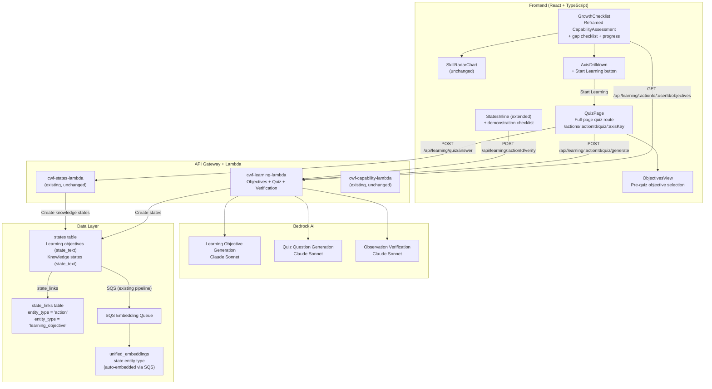
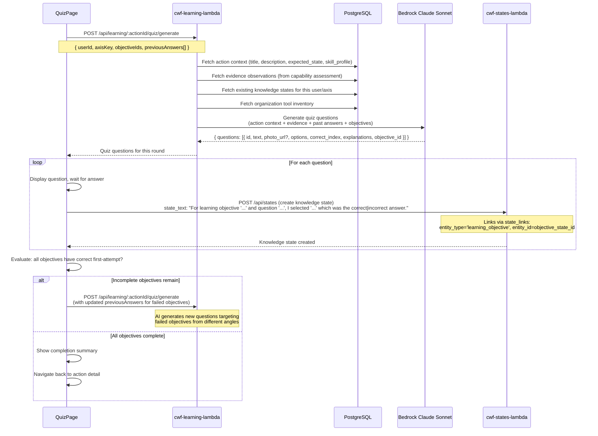
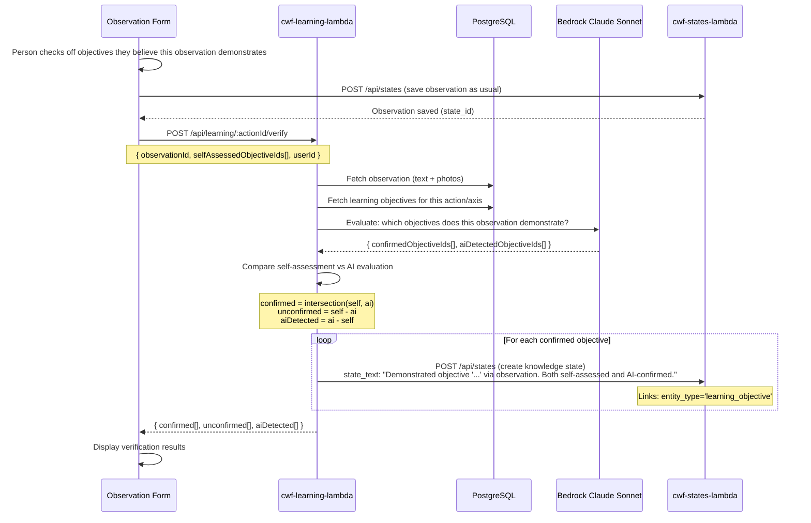
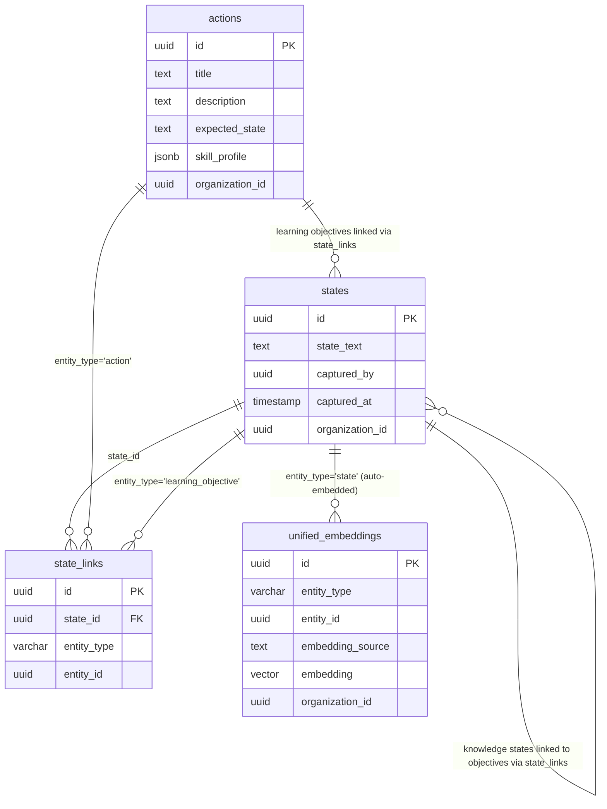

# Design Document: Growth Learning Module

## Overview

The Growth Learning Module extends the deployed observation-based training system by reframing the existing radar chart as a "Growth Checklist" and adding an adaptive quiz-based learning flow for skill gaps. When the chart surfaces a gap between a person's demonstrated capability and the action's required level, the system offers a "Start Learning" flow that generates AI-powered learning objectives and an adaptive quiz tailored to each specific gap.

Key design decisions:

- **No new tables** — Learning objectives and quiz responses (knowledge states) are stored as states in the existing `states` table, linked via `state_links` with new entity types (`learning_objective` for quiz-to-objective links)
- **Stateless quiz sessions** — Questions are regenerated fresh each time using stored knowledge states as context. No cached quiz state or JSON blobs.
- **Adaptive loop** — The quiz keeps generating rounds until all selected learning objectives have at least one correct first-attempt answer
- **Claude Sonnet** for quiz generation — Higher quality needed for photo-based questions and adaptive pedagogical reasoning about misconceptions
- **Hybrid skill verification** — Person self-assesses which objectives an observation demonstrates, AI confirms via analysis
- **Bloom's 0-5 integer scale** — Consistent with the deployed observation-based training system
- **Full-page quiz route** — Dedicated `/actions/:actionId/quiz/:axisKey` route, not a dialog or sheet

The existing radar chart rendering logic, capability assessment computation, and axis drilldown remain unchanged. The module adds UI chrome around them (labels, gap checklist, learning buttons) and new backend endpoints for learning objective generation, quiz generation, and observation-based skill verification.

## Architecture



### Request Flow: Adaptive Quiz Loop



### Request Flow: Observation-Based Skill Verification



## Components and Interfaces

### 1. New Lambda Function: `cwf-learning-lambda`

Handles learning objective generation, quiz question generation, and observation-based skill verification. Uses the existing Lambda layer pattern (`cwf-common-nodejs` layer v13).

**Model:** `anthropic.claude-sonnet-4-20250514-v1:0` (Claude Sonnet for quality on photo-based and adaptive questions)

**Endpoints:**

| Method | Path | Description |
|--------|------|-------------|
| GET | `/api/learning/:actionId/:userId/objectives` | Get or generate learning objectives for a user's gap axes |
| POST | `/api/learning/:actionId/quiz/generate` | Generate a round of quiz questions |
| POST | `/api/learning/:actionId/verify` | Verify observation against learning objectives |

#### GET `/api/learning/:actionId/:userId/objectives`

Returns existing learning objectives for the user on this action, grouped by axis. If no objectives exist for a gap axis, generates them on first request.

**Response:**
```json
{
  "data": {
    "axes": [
      {
        "axisKey": "chemistry_understanding",
        "axisLabel": "Chemistry Understanding",
        "requiredLevel": 3,
        "currentLevel": 1,
        "objectives": [
          {
            "id": "state-uuid-1",
            "text": "Understand why the water-to-cement ratio affects concrete strength",
            "evidenceTag": "no_evidence",
            "status": "not_started",
            "completionType": null
          },
          {
            "id": "state-uuid-2",
            "text": "Understand why curing time matters for structural integrity",
            "evidenceTag": "some_evidence",
            "status": "completed",
            "completionType": "quiz"
          }
        ]
      }
    ]
  }
}
```

**Objective generation flow:**
1. Fetch action context (title, description, expected_state, skill_profile)
2. Fetch the user's capability profile evidence for this axis
3. Fetch existing knowledge states (past quiz answers) for this user on this action
4. Call Bedrock Sonnet with a structured prompt to generate 3-6 objectives per gap axis
5. Tag each objective with evidence level: `no_evidence`, `some_evidence`, or `previously_correct`
6. Store each objective as a state in the `states` table, linked to the action via `state_links` with `entity_type = 'action'`
7. Return the objectives grouped by axis

**Objective state_text format:**
```
[learning_objective] axis=chemistry_understanding action=<action_id> user=<user_id> | Understand why the water-to-cement ratio affects concrete strength
```

The `[learning_objective]` prefix and metadata allow querying objectives by type. The human-readable text after the `|` is the actual objective.

#### POST `/api/learning/:actionId/quiz/generate`

Generates a round of multiple-choice questions for selected learning objectives.

**Request:**
```json
{
  "userId": "user-uuid",
  "axisKey": "chemistry_understanding",
  "objectiveIds": ["state-uuid-1", "state-uuid-3"],
  "previousAnswers": [
    {
      "objectiveId": "state-uuid-1",
      "questionText": "Why does adding too much water weaken concrete?",
      "selectedAnswer": "It makes the concrete dry faster",
      "correctAnswer": "Excess water creates voids when it evaporates during curing",
      "wasCorrect": false
    }
  ]
}
```

**Response:**
```json
{
  "data": {
    "questions": [
      {
        "id": "q-uuid-1",
        "objectiveId": "state-uuid-1",
        "type": "concept",
        "text": "A worker mixed concrete with a higher water ratio than specified. What is the most likely consequence for the foundation's long-term durability?",
        "photoUrl": null,
        "options": [
          { "index": 0, "text": "The concrete will be stronger because it's more fluid", "explanation": "More water actually weakens concrete..." },
          { "index": 1, "text": "The concrete will have reduced compressive strength due to increased porosity", "explanation": "Correct. Excess water creates voids..." },
          { "index": 2, "text": "The concrete will cure faster", "explanation": "Higher water content actually slows curing..." },
          { "index": 3, "text": "There will be no significant effect", "explanation": "Water-cement ratio is one of the most critical factors..." }
        ],
        "correctIndex": 1
      },
      {
        "id": "q-uuid-2",
        "objectiveId": "state-uuid-1",
        "type": "photo",
        "text": "Look at this concrete surface. What does the visible cracking pattern suggest about the mixing process?",
        "photoUrl": "https://cwf-dev-assets.s3.us-west-2.amazonaws.com/...",
        "options": [
          { "index": 0, "text": "The aggregate was too large", "explanation": "..." },
          { "index": 1, "text": "Excess water in the mix caused shrinkage cracking during curing", "explanation": "Correct. This pattern is characteristic of..." },
          { "index": 2, "text": "The concrete was poured in cold weather", "explanation": "..." },
          { "index": 3, "text": "Normal settling cracks", "explanation": "..." }
        ],
        "correctIndex": 1
      }
    ]
  }
}
```

**Generation flow:**
1. Fetch action context (title, description, expected_state, skill_profile)
2. Fetch evidence observations (photos + text) from the capability assessment for this axis
3. Fetch the organization's tool inventory
4. Build a structured prompt including:
   - Action context with expected_state as primary driver
   - Evidence observation photos and text
   - Required tools and available tools
   - Previous wrong answers with the specific misconceptions to address
   - The learning objectives to cover
5. Call Bedrock Sonnet to generate at least one question per objective
6. Return the questions (not stored — questions are ephemeral)

#### POST `/api/learning/:actionId/verify`

Evaluates which learning objectives an observation demonstrates.

**Request:**
```json
{
  "observationId": "state-uuid",
  "selfAssessedObjectiveIds": ["obj-uuid-1", "obj-uuid-3"],
  "userId": "user-uuid"
}
```

**Response:**
```json
{
  "data": {
    "confirmed": ["obj-uuid-1"],
    "unconfirmed": ["obj-uuid-3"],
    "aiDetected": ["obj-uuid-2"]
  }
}
```

### 2. Storage Model

All learning data uses the existing `states` and `state_links` tables. No new tables.

#### Learning Objectives (stored as states)

| Field | Value |
|-------|-------|
| `state_text` | `[learning_objective] axis=<key> action=<id> user=<id> \| <objective text>` |
| `captured_by` | The user who initiated the learning flow |
| `organization_id` | From auth context |

**state_links for learning objectives:**

| `entity_type` | `entity_id` | Purpose |
|---------------|-------------|---------|
| `action` | action UUID | Links objective to the action |

#### Knowledge States (quiz responses, stored as states)

| Field | Value |
|-------|-------|
| `state_text` | `For learning objective '{objective}' and question '{question}', I selected '{answer}' which was the {correct\|incorrect} answer.` |
| `captured_by` | The user who answered |
| `organization_id` | From auth context |

**state_links for knowledge states:**

| `entity_type` | `entity_id` | Purpose |
|---------------|-------------|---------|
| `learning_objective` | objective state UUID | Links answer to its objective |

#### Demonstration Knowledge States (from observation verification)

| Field | Value |
|-------|-------|
| `state_text` | `Demonstrated learning objective '{objective}' via observation. Both self-assessed and AI-confirmed.` |
| `captured_by` | The user who captured the observation |
| `organization_id` | From auth context |

**state_links for demonstration states:**

| `entity_type` | `entity_id` | Purpose |
|---------------|-------------|---------|
| `learning_objective` | objective state UUID | Links demonstration to its objective |

Both learning objectives and knowledge states are embedded automatically via the existing SQS pipeline as `state` entity types. The `resolveAndQueueEmbedding` function in the states Lambda already handles this — no changes needed to the embedding pipeline.

### 3. Frontend Components

#### `GrowthChecklist` (refactored from `CapabilityAssessment`)

The existing `CapabilityAssessment` component is extended (not replaced) with:
- Heading changed from "Capability Assessment" to "Growth Checklist"
- Gap checklist below the radar chart showing each gap axis as a checklist item
- Per-person gap summary count ("3 of 5 skills need attention")
- "All requirements met" confirmation when no gaps exist
- Learning objectives grouped by axis with progress indicators
- "Start Learning" / "Review Learning" buttons per gap axis

The radar chart rendering (`SkillRadarChart`) and axis drilldown (`AxisDrilldown`) remain unchanged internally. The `AxisDrilldown` sheet gets a "Start Learning" button added to its content.

**New hooks:**

- `useLearningObjectives(actionId, userId)` — TanStack Query hook for `GET /api/learning/:actionId/:userId/objectives`
- `useQuizGeneration()` — TanStack mutation hook for `POST /api/learning/:actionId/quiz/generate`
- `useObservationVerification()` — TanStack mutation hook for `POST /api/learning/:actionId/verify`

**Query keys (added to `queryKeys.ts`):**

```typescript
export const learningObjectivesQueryKey = (actionId: string, userId: string) =>
  ['learning_objectives', actionId, userId];
```

#### `QuizPage` (new page component)

Full-page quiz experience at route `/actions/:actionId/quiz/:axisKey`.

**States:**
1. **Objectives selection** — Shows learning objectives with required/optional tags. User selects which to include.
2. **Quiz in progress** — One question at a time. Shows action title + axis as context header. Photo displayed large above question text when present.
3. **Answer feedback** — Immediate feedback on selection. Wrong answer shows explanation + allows retry. Correct answer shows explanation + "Next" button.
4. **Round complete** — Evaluates which objectives still need work. If incomplete, generates next round.
5. **Quiz complete** — Summary of correct-on-first-attempt count. Link back to action detail.

**Answer recording flow:**
1. User selects an answer → record as first selection (scored)
2. If wrong, show explanation, allow exploring other options (not scored)
3. If correct, show explanation, enable "Next"
4. On "Next", create a knowledge state via the existing states API (`POST /api/states`) with:
   - `state_text`: Natural language record of the answer
   - `links`: `[{ entity_type: 'learning_objective', entity_id: objectiveStateId }]`
5. Optimistically update the learning objectives cache

#### `ObjectivesView` (sub-component of QuizPage)

Displays learning objectives before quiz starts:
- Required objectives (no evidence / some evidence) shown prominently
- Optional review objectives (previously answered correctly) shown as toggleable
- "Start Quiz" button enabled when at least one objective is selected

#### Extended `StatesInline` / Observation Form

When an action has incomplete learning objectives:
- Display a "Demonstrate Skills" checklist alongside the observation form
- Person checks off objectives they believe this observation demonstrates
- After save, trigger verification via `POST /api/learning/:actionId/verify`
- Display results: confirmed ✓, unconfirmed ✗, AI-detected 🔍

### 4. Gap Computation Functions

These pure functions power the gap checklist and are the primary targets for property-based testing.

```typescript
interface GapItem {
  axisKey: string;
  axisLabel: string;
  requiredLevel: number;
  currentLevel: number;
  severity: 'needs_learning' | 'partial_readiness' | 'met';
  distanceBelowUnderstand: number; // max(0, 2 - currentLevel)
}

/** Compute gap items from skill profile and capability profile */
function computeGapItems(
  skillProfile: SkillProfile,
  capabilityProfile: CapabilityProfile
): GapItem[]

/** Classify gap severity for a single axis */
function classifyGapSeverity(
  requiredLevel: number,
  currentLevel: number
): 'needs_learning' | 'partial_readiness' | 'met'

/** Sort gap items by severity (furthest below Bloom's 2 first) */
function sortGapsBySeverity(gaps: GapItem[]): GapItem[]

/** Compute gap summary count */
function computeGapSummary(
  skillProfile: SkillProfile,
  capabilityProfile: CapabilityProfile
): { total: number; gaps: number }
```

### 5. Learning Progress Functions

Pure functions for deriving learning progress from stored data.

```typescript
type ObjectiveStatus = 'not_started' | 'in_progress' | 'completed';
type CompletionType = 'quiz' | 'demonstrated' | null;

interface ObjectiveProgress {
  objectiveId: string;
  status: ObjectiveStatus;
  completionType: CompletionType;
}

/** Derive objective status from knowledge states */
function deriveObjectiveStatus(
  objectiveId: string,
  knowledgeStates: KnowledgeState[]
): { status: ObjectiveStatus; completionType: CompletionType }

/** Check if all objectives for an axis are completed */
function isAxisComplete(objectives: ObjectiveProgress[]): boolean

/** Check if all objectives across all axes are completed */
function isAllLearningComplete(
  axisObjectives: Map<string, ObjectiveProgress[]>
): boolean

/** Compute progress summary for an axis */
function computeAxisProgress(
  objectives: ObjectiveProgress[]
): { completed: number; total: number }
```

### 6. Quiz Evaluation Functions

Pure functions for the adaptive quiz loop logic.

```typescript
interface QuizAnswer {
  questionId: string;
  objectiveId: string;
  selectedAnswer: string;
  correctAnswer: string;
  wasFirstAttempt: boolean;
  wasCorrect: boolean;
  timestamp: string;
}

/** Determine which objectives still need correct first-attempt answers */
function getIncompleteObjectives(
  objectiveIds: string[],
  answers: QuizAnswer[]
): string[]

/** Check if quiz is complete (all objectives have correct first-attempt) */
function isQuizComplete(
  objectiveIds: string[],
  answers: QuizAnswer[]
): boolean

/** Compute quiz summary statistics */
function computeQuizSummary(
  answers: QuizAnswer[]
): { totalQuestions: number; correctFirstAttempt: number }
```

### 7. Self-Assessment Comparison Function

```typescript
interface VerificationResult {
  confirmed: string[];   // Both person and AI agree
  unconfirmed: string[]; // Person claimed, AI didn't see evidence
  aiDetected: string[];  // AI found evidence person didn't claim
}

/** Compare self-assessment against AI evaluation */
function compareAssessments(
  selfAssessedIds: string[],
  aiEvaluatedIds: string[]
): VerificationResult
```

### 8. Route Configuration

New route added to `App.tsx`:

```tsx
<Route
  path="/actions/:actionId/quiz/:axisKey"
  element={
    <ProtectedRoute>
      <QuizPage />
    </ProtectedRoute>
  }
/>
```

### 9. API Gateway Configuration

New endpoint for the learning Lambda:

```bash
./scripts/add-api-endpoint.sh /api/learning GET cwf-learning-lambda
./scripts/add-api-endpoint.sh /api/learning POST cwf-learning-lambda
```

The Lambda handles routing internally based on path segments, following the same pattern as `cwf-capability-lambda`.

## Data Models

### Entity Relationship (New Elements)



### Data Flow: Learning Objective Creation

1. User clicks "Start Learning" on a gap axis
2. Frontend calls `GET /api/learning/:actionId/:userId/objectives`
3. Lambda checks for existing objectives (states with `[learning_objective]` prefix linked to this action for this user)
4. If none exist for this axis, Lambda generates objectives via Bedrock Sonnet
5. Lambda creates each objective as a state via direct DB insert, with `state_links` to the action
6. Existing SQS pipeline auto-embeds each objective state
7. Lambda returns objectives grouped by axis

### Data Flow: Quiz Answer Recording

1. User selects an answer on the quiz page
2. Frontend creates a knowledge state via `POST /api/states`:
   - `state_text`: Natural language record
   - `links`: `[{ entity_type: 'learning_objective', entity_id: objectiveStateId }]`
3. States Lambda stores the state and state_link
4. Existing SQS pipeline auto-embeds the knowledge state
5. Frontend optimistically updates the learning objectives cache
6. After all questions in a round, frontend evaluates completion

### Data Flow: Observation Verification

1. Person captures observation with self-assessed objectives checked
2. Observation saved via existing states flow
3. Frontend calls `POST /api/learning/:actionId/verify` with observation ID and self-assessed objective IDs
4. Lambda fetches observation text + photos + objectives
5. Lambda calls Bedrock Sonnet to evaluate which objectives the observation demonstrates
6. Lambda compares self-assessment vs AI evaluation
7. For confirmed objectives, Lambda creates demonstration knowledge states
8. Lambda returns comparison results
9. Frontend displays confirmed/unconfirmed/AI-detected results


## Correctness Properties

*A property is a characteristic or behavior that should hold true across all valid executions of a system — essentially, a formal statement about what the system should do. Properties serve as the bridge between human-readable specifications and machine-verifiable correctness guarantees.*

### Property 1: Gap computation produces correct checklist items

*For any* skill profile with N axes and any capability profile on the same axes, the `computeGapItems` function should return a gap item for every axis where `currentLevel < requiredLevel`, each containing the correct axis label, current level, and required level. When no axes have gaps (all `currentLevel >= requiredLevel`), the result should be an empty array.

**Validates: Requirements 1.2, 1.4, 1.5, 2.1**

### Property 2: Gap severity classification

*For any* pair of (requiredLevel, currentLevel) where both are integers in [0, 5], the `classifyGapSeverity` function should return:
- `'needs_learning'` when `currentLevel < 2` and `currentLevel < requiredLevel`
- `'partial_readiness'` when `currentLevel >= 2` and `currentLevel < requiredLevel`
- `'met'` when `currentLevel >= requiredLevel`

**Validates: Requirements 2.3, 2.4**

### Property 3: Gap ordering by severity

*For any* list of gap items, the `sortGapsBySeverity` function should return the items ordered such that for any two adjacent items, the first item's `distanceBelowUnderstand` (i.e., `max(0, 2 - currentLevel)`) is greater than or equal to the second item's. Items with the same distance should maintain stable relative order.

**Validates: Requirements 2.5**

### Property 4: Objective evidence tagging

*For any* learning objective and set of knowledge states (past quiz answers) and capability evidence, the evidence tagging function should classify the objective as:
- `'previously_correct'` if there exists a knowledge state for this objective with a correct first-attempt answer
- `'some_evidence'` if the capability assessment evidence contains semantically relevant observations but no correct quiz answer exists
- `'no_evidence'` otherwise

These three categories are mutually exclusive and exhaustive for any objective.

**Validates: Requirements 3.5.4**

### Property 5: Every quiz question maps to a learning objective

*For any* generated quiz round, every question in the response should have a non-null `objectiveId` that matches one of the requested `objectiveIds`. No question should reference an objective that was not in the request.

**Validates: Requirements 3.5.7**

### Property 6: Learning objectives grouped by axis

*For any* set of learning objectives with axis associations, the grouping function should produce groups where every objective in a group shares the same `axisKey`, and every objective appears in exactly one group. The union of all groups should equal the input set.

**Validates: Requirements 3.5.9**

### Property 7: First answer is the scored response

*For any* sequence of answer selections on a single question, only the first selection should be recorded as the scored response (`wasFirstAttempt = true`). All subsequent selections on the same question should have `wasFirstAttempt = false`. The knowledge state's `state_text` should contain the first selected answer, not any subsequent exploratory selections.

**Validates: Requirements 4.5, 6.6**

### Property 8: Quiz completion evaluation

*For any* set of selected objective IDs and any sequence of quiz answers, the `isQuizComplete` function should return `true` if and only if for every objective ID in the set, there exists at least one answer where `objectiveId` matches, `wasFirstAttempt` is true, and `wasCorrect` is true. The `getIncompleteObjectives` function should return exactly the objective IDs that lack such an answer.

**Validates: Requirements 4.6, 4.8**

### Property 9: Objective status transitions on correct answer

*For any* learning objective, when a knowledge state is created with a correct first-attempt answer linked to that objective, the derived status should transition to `'completed'` with `completionType = 'quiz'`. When a demonstration knowledge state is created, the status should be `'completed'` with `completionType = 'demonstrated'`. An objective with any knowledge states but no correct first-attempt answer should have status `'in_progress'`.

**Validates: Requirements 4.9**

### Property 10: Learning data round-trip storage

*For any* valid learning objective text and axis key, storing it as a state with the `[learning_objective]` prefix format and retrieving it should preserve the original objective text and axis key. *For any* valid quiz answer, storing it as a knowledge state with the natural language format and retrieving it should preserve the question text, selected answer, correct answer, and correctness flag.

**Validates: Requirements 5.1, 5.2**

### Property 11: Multi-tenant isolation for learning data

*For any* learning data query (objectives or knowledge states), the results should only contain states where `organization_id` matches the querying user's organization. No learning data from other organizations should ever appear in the results.

**Validates: Requirements 5.5**

### Property 12: Learning progress derivation

*For any* set of learning objectives across multiple axes and any set of knowledge states, the progress derivation functions should satisfy:
- `computeAxisProgress` returns a completed count equal to the number of objectives with `'completed'` status
- `isAxisComplete` returns true if and only if all objectives for that axis have `'completed'` status
- `isAllLearningComplete` returns true if and only if `isAxisComplete` is true for every axis
- Each objective's status correctly distinguishes `'quiz'` completion (from correct quiz answers) from `'demonstrated'` completion (from observation verification)

**Validates: Requirements 7.1, 7.2, 7.3, 7.4, 9.6**

### Property 13: Self-assessment vs AI comparison

*For any* two sets of objective IDs (self-assessed and AI-evaluated), the `compareAssessments` function should produce:
- `confirmed` = the intersection of self-assessed and AI-evaluated
- `unconfirmed` = self-assessed minus AI-evaluated
- `aiDetected` = AI-evaluated minus self-assessed

These three sets should be mutually disjoint, and their union should equal the union of the two input sets.

**Validates: Requirements 9.4**

## Error Handling

### Learning Objective Generation Errors

| Scenario | Handling |
|----------|----------|
| Action has no approved skill profile | Return 404: "No skill profile found. Generate and approve one first." |
| Action has no expected_state | Generate objectives from title + description + skill axis context. Log warning that S' is missing. |
| Bedrock Sonnet call fails or times out | Return 503: "AI service temporarily unavailable. Please try again." Frontend shows toast with retry. |
| AI returns malformed objectives (missing text, wrong count) | Retry once with stricter prompt. If still invalid, return 500: "Failed to generate learning objectives." |
| User has no capability profile computed | Return 400: "Capability profile not yet computed. View the Growth Checklist first." |

### Quiz Generation Errors

| Scenario | Handling |
|----------|----------|
| No objectives selected | Return 400: "At least one learning objective must be selected." |
| Objective IDs don't exist or belong to different action | Return 404: "Learning objectives not found for this action." |
| No evidence observations available for photo questions | Generate concept-based and tool-based questions only. Log that no photos were available. |
| Bedrock Sonnet call fails | Return 503: "AI service temporarily unavailable." Frontend shows retry option on quiz page. |
| AI returns fewer questions than objectives | Accept partial response — some objectives may share questions. Log warning. |

### Quiz Answer Recording Errors

| Scenario | Handling |
|----------|----------|
| Knowledge state creation fails | Frontend shows error toast. Answer is not recorded. User can retry. |
| State_link creation fails (invalid objective ID) | Return 400: "Learning objective not found." |
| Duplicate answer for same question (race condition) | Idempotent — first answer is already scored, subsequent are exploratory. |

### Observation Verification Errors

| Scenario | Handling |
|----------|----------|
| Observation not found | Return 404: "Observation not found." |
| No learning objectives exist for this action | Return 400: "No learning objectives to verify against." |
| Bedrock Sonnet call fails during verification | Return 503. Frontend shows "Verification unavailable" with option to skip. Self-assessment is not recorded. |
| AI returns objective IDs not in the request | Filter to only valid objective IDs. Log warning about unexpected AI output. |

### Frontend Error Handling

- Quiz page shows loading skeleton while questions generate (can take 5-10 seconds for Sonnet)
- 30-second timeout on quiz generation with "Taking longer than expected" message and retry button
- Failed answer recording shows inline error with retry — does not block quiz progression
- Network errors during quiz show "You're offline" banner — answers are queued for retry when connection returns (leveraging existing offline-first architecture)
- Navigation away from quiz shows confirmation dialog if answers are unsaved

## Testing Strategy

### Property-Based Tests (Vitest + fast-check)

Property-based tests use [fast-check](https://github.com/dubzzz/fast-check) with Vitest. Each property test runs a minimum of 100 iterations and is tagged with its design property reference.

| Property | Target Function | Tag |
|----------|----------------|-----|
| Property 1 | `computeGapItems` | Feature: growth-learning-module, Property 1: Gap computation produces correct checklist items |
| Property 2 | `classifyGapSeverity` | Feature: growth-learning-module, Property 2: Gap severity classification |
| Property 3 | `sortGapsBySeverity` | Feature: growth-learning-module, Property 3: Gap ordering by severity |
| Property 4 | `tagObjectiveEvidence` | Feature: growth-learning-module, Property 4: Objective evidence tagging |
| Property 5 | Quiz generation response validation | Feature: growth-learning-module, Property 5: Every quiz question maps to a learning objective |
| Property 6 | `groupObjectivesByAxis` | Feature: growth-learning-module, Property 6: Learning objectives grouped by axis |
| Property 7 | Answer recording logic | Feature: growth-learning-module, Property 7: First answer is the scored response |
| Property 8 | `isQuizComplete`, `getIncompleteObjectives` | Feature: growth-learning-module, Property 8: Quiz completion evaluation |
| Property 9 | `deriveObjectiveStatus` | Feature: growth-learning-module, Property 9: Objective status transitions on correct answer |
| Property 10 | State text parsing/formatting | Feature: growth-learning-module, Property 10: Learning data round-trip storage |
| Property 11 | Query scoping validation | Feature: growth-learning-module, Property 11: Multi-tenant isolation |
| Property 12 | `computeAxisProgress`, `isAxisComplete`, `isAllLearningComplete` | Feature: growth-learning-module, Property 12: Learning progress derivation |
| Property 13 | `compareAssessments` | Feature: growth-learning-module, Property 13: Self-assessment vs AI comparison |

### Unit Tests (Vitest)

- `classifyGapSeverity` with specific Bloom's level boundary cases (0, 1, 2, 3, 4, 5)
- `computeGapItems` with empty skill profile, all-met profile, all-gap profile
- `sortGapsBySeverity` with ties at same severity level
- Learning objective `state_text` format parsing and composition
- Knowledge state `state_text` format parsing and composition
- `compareAssessments` with empty sets, full overlap, no overlap
- `isQuizComplete` with no answers, partial answers, all correct
- `deriveObjectiveStatus` with no states, wrong answers only, correct answer, demonstration
- Quiz question validation (correct structure, valid option indices)
- Error response formatting for all Lambda endpoints

### Integration Tests

- Learning objective generation → storage as states → retrieval via objectives endpoint
- Quiz generation with real action context and evidence observations
- Knowledge state creation via states API with `learning_objective` state_links
- Observation verification flow: save observation → verify → create demonstration states
- Multi-tenant isolation: objectives from org A not visible to org B
- Embedding pipeline: learning objectives and knowledge states auto-embedded as `state` entity types

### Frontend Component Tests (Vitest + React Testing Library)

- `GrowthChecklist` renders "Growth Checklist" heading (not "Capability Assessment")
- `GrowthChecklist` renders gap checklist items when gaps exist
- `GrowthChecklist` renders "All requirements met" when no gaps
- `GrowthChecklist` renders gap summary count
- `GrowthChecklist` renders learning objectives grouped by axis with progress
- `AxisDrilldown` renders "Start Learning" button for gap axes
- `AxisDrilldown` renders "Review Learning" when objectives exist
- `QuizPage` renders one question at a time
- `QuizPage` shows "Next" only after correct answer
- `QuizPage` shows immediate feedback on wrong answer
- `QuizPage` shows completion summary when all objectives met
- `ObjectivesView` renders required vs optional objectives
- `ObjectivesView` allows toggling optional objectives
- Quiz route is navigable via direct URL
- Observation form shows demonstration checklist when objectives exist
