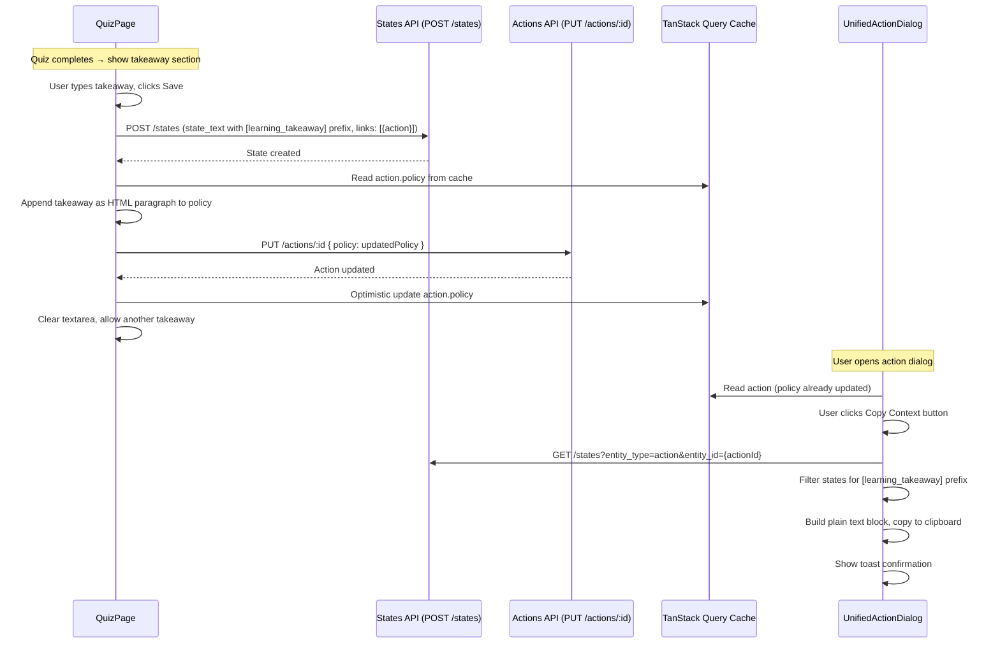

# Design Document: Learning-to-Policy Pipeline

## Overview

The Learning-to-Policy Pipeline connects the quiz learning flow to the action planning flow. When a learner finishes a quiz, they can capture takeaways — ideas sparked by learning — and have them automatically appended to the action's policy field. A Copy Context button on the Action Policy section header lets learners copy their action context and takeaways to the clipboard for use with external AI tools.

The design reuses existing infrastructure exclusively: the states API for takeaway persistence, the action update API for policy appending, and the existing TanStack Query cache patterns for data flow. No new database tables, Lambda endpoints, or API Gateway routes are needed.

### Key Design Decisions

1. **Takeaway state_text format**: `[learning_takeaway] axis={axisKey} action={actionId} user={userId} | {takeaway text}` — follows the existing `[learning_objective]` convention in `learningUtils.ts`.
2. **Policy append format**: Takeaways are appended as HTML `<p>` tags (TipTap's native format) with a `📝 ` prefix to visually distinguish them from manually written policy content.
3. **Copy Context strips HTML**: The clipboard text is plain text with labeled sections. HTML is stripped from the policy field using a DOM-based approach (`DOMParser`).
4. **QuizPage already has actionId**: The `actionId` param is available from the URL. The action's current policy is read from the TanStack Query cache (same pattern used for `action.title` in the header).

## Architecture

The feature adds three capabilities to two existing components:



### Data Flow

- **Takeaway creation**: QuizPage → `POST /states` (creates state with `[learning_takeaway]` prefix and action link) → `PUT /actions/:id` (appends to policy field) → optimistic cache update.
- **Copy Context**: UnifiedActionDialog reads action from cache + fetches states for the action → filters for `[learning_takeaway]` prefix → builds plain text → clipboard.

## Components and Interfaces

### 1. TakeawayCapture (inline in QuizPage)

Rendered inline within the `quiz_complete` block of `QuizPage.tsx`, between the score summary and the "Back to action" button.

```typescript
// Inline within QuizPage's quiz_complete state
// No separate component file needed — it's ~40 lines of JSX

// State:
const [takeawayText, setTakeawayText] = useState('');
const [isSavingTakeaway, setIsSavingTakeaway] = useState(false);
const [takeawaySaved, setTakeawaySaved] = useState(false);

// Handler:
async function handleSaveTakeaway() {
  // 1. Create state via POST /states
  // 2. Read current policy from cache
  // 3. Append takeaway as HTML paragraph
  // 4. PUT /actions/:id with updated policy
  // 5. Optimistic cache update
  // 6. Clear textarea, show success feedback
}
```

**Props/dependencies** (all already available in QuizPage scope):
- `actionId` — from `useParams`
- `axisKey` — from `useParams`
- `userId` — from `useAuth`
- `queryClient` — from `useQueryClient`
- `apiService` — existing import

### 2. composeLearningTakeawayStateText (new function in learningUtils.ts)

```typescript
/**
 * Compose a learning takeaway state_text in the canonical format:
 *   [learning_takeaway] axis=<key> action=<id> user=<id> | <text>
 */
export function composeLearningTakeawayStateText(
  axisKey: string,
  actionId: string,
  userId: string,
  takeawayText: string
): string {
  return `[learning_takeaway] axis=${axisKey} action=${actionId} user=${userId} | ${takeawayText}`;
}
```

### 3. parseLearningTakeawayStateText (new function in learningUtils.ts)

```typescript
export interface ParsedLearningTakeaway {
  axisKey: string;
  actionId: string;
  userId: string;
  takeawayText: string;
}

/**
 * Parse a learning takeaway state_text back to its component fields.
 * Returns null if the format doesn't match.
 */
export function parseLearningTakeawayStateText(
  stateText: string
): ParsedLearningTakeaway | null {
  const match = stateText.match(
    /^\[learning_takeaway\] axis=(\S+) action=(\S+) user=(\S+) \| (.+)$/
  );
  if (!match) return null;
  return {
    axisKey: match[1],
    actionId: match[2],
    userId: match[3],
    takeawayText: match[4],
  };
}
```

### 4. appendTakeawayToPolicy (new function in learningUtils.ts)

```typescript
/**
 * Append a takeaway to an action's policy HTML.
 * If the policy is empty/blank, sets the takeaway as the initial content.
 * Adds a 📝 prefix to visually distinguish appended takeaways.
 */
export function appendTakeawayToPolicy(
  currentPolicy: string | null | undefined,
  takeawayText: string
): string {
  const takeawayHtml = `<p>📝 ${escapeHtml(takeawayText)}</p>`;
  const trimmed = (currentPolicy || '').trim();
  const isEmpty = !trimmed
    || trimmed === '<p></p>'
    || trimmed === '<p><br></p>'
    || trimmed === '<p>&nbsp;</p>';

  if (isEmpty) {
    return takeawayHtml;
  }
  return `${trimmed}${takeawayHtml}`;
}
```

### 5. stripHtmlToPlainText (new utility in learningUtils.ts)

```typescript
/**
 * Strip HTML tags from a string, returning plain text.
 * Uses DOMParser for safe, accurate HTML-to-text conversion.
 */
export function stripHtmlToPlainText(html: string): string {
  if (!html) return '';
  const doc = new DOMParser().parseFromString(html, 'text/html');
  return doc.body.textContent || '';
}
```

### 6. buildCopyContextText (new function in learningUtils.ts)

```typescript
/**
 * Build a formatted plain text block for clipboard copy.
 * Includes action context fields and learning takeaways.
 * Only includes sections for non-empty fields.
 * Omits "Takeaways:" section entirely when takeaways array is empty.
 */
export function buildCopyContextText(
  action: {
    title?: string;
    description?: string;
    expected_state?: string;
    policy?: string;
  },
  takeaways: string[]
): string {
  const sections: string[] = [];

  if (action.title) sections.push(`Title: ${action.title}`);
  if (action.description) sections.push(`Description: ${action.description}`);
  if (action.expected_state) sections.push(`Expected State: ${action.expected_state}`);

  const policyText = stripHtmlToPlainText(action.policy || '');
  if (policyText.trim()) sections.push(`Current Policy:\n${policyText}`);

  if (takeaways.length > 0) {
    sections.push(`Takeaways:\n${takeaways.map(t => `- ${t}`).join('\n')}`);
  }

  return sections.join('\n\n');
}
```

### 7. Copy Context Button (modification to UnifiedActionDialog.tsx)

Added to the left of the existing "AI Assist" button in the Action Policy section header. Uses the same button styling (`h-7 px-2 text-xs`, outline variant).

```typescript
// In the Action Policy header div:
<div className="flex items-center justify-between">
  <Label className="text-foreground">Action Policy</Label>
  <div className="flex items-center gap-1">
    <Button
      type="button"
      variant="outline"
      size="sm"
      onClick={handleCopyContext}
      className="h-7 px-2 text-xs"
    >
      <Copy className="h-3 w-3 mr-1" />
      Copy Context
    </Button>
    <Button /* existing AI Assist button */ />
  </div>
</div>
```

The `handleCopyContext` handler:
1. Reads the action from form data (title, description, expected_state, policy).
2. Fetches states for the action via `useStates({ entity_type: 'action', entity_id: actionId })` (already available or easily added).
3. Filters states for `[learning_takeaway]` prefix using `parseLearningTakeawayStateText`.
4. Calls `buildCopyContextText` to build the plain text block.
5. Calls `copyToClipboard` (existing utility) and shows a toast.

## Data Models

### State (existing — no changes)

The takeaway is stored as a standard state record:

| Field | Value |
|-------|-------|
| `state_text` | `[learning_takeaway] axis={axisKey} action={actionId} user={userId} \| {takeaway text}` |
| `captured_by` | Set by backend from auth context |
| `links` | `[{ entity_type: 'action', entity_id: actionId }]` |

### Action (existing — no schema changes)

The `policy` field (text/HTML) is updated via `PUT /actions/:id` with the appended takeaway paragraph. No new columns.

### Takeaway State Text Format

```
[learning_takeaway] axis=food_safety action=abc-123 user=user-456 | Always check temperature before serving
```

Follows the same convention as `[learning_objective]`:
- Prefix: `[learning_takeaway]`
- Metadata: `axis=`, `action=`, `user=`
- Separator: ` | `
- Payload: free-text takeaway

### Policy Append Format

Before:
```html
<p>Check temperature logs daily.</p>
```

After appending takeaway "Always verify thermometer calibration":
```html
<p>Check temperature logs daily.</p><p>📝 Always verify thermometer calibration</p>
```

## Correctness Properties

*A property is a characteristic or behavior that should hold true across all valid executions of a system — essentially, a formal statement about what the system should do. Properties serve as the bridge between human-readable specifications and machine-verifiable correctness guarantees.*

### Property 1: Takeaway state_text round trip

*For any* valid axisKey, actionId, userId, and non-empty takeawayText (none containing whitespace-only strings or the `|` separator in metadata fields), composing a takeaway state_text with `composeLearningTakeawayStateText` and then parsing it with `parseLearningTakeawayStateText` SHALL return an object with the original axisKey, actionId, userId, and takeawayText.

**Validates: Requirements 1.4, 1.5**

### Property 2: Policy append preserves existing content and adds takeaway

*For any* non-empty existing policy HTML string and *any* non-empty takeaway text, calling `appendTakeawayToPolicy(existingPolicy, takeawayText)` SHALL produce a result that (a) starts with the original policy content and (b) contains a `<p>` element including the takeaway text with the 📝 prefix.

**Validates: Requirements 2.1, 2.2**

### Property 3: Copy context text includes all provided fields with correct labels

*For any* action object with at least one non-empty field (title, description, expected_state, or policy) and *any* list of takeaway strings, calling `buildCopyContextText(action, takeaways)` SHALL produce a string where: (a) every non-empty action field appears with its corresponding label ("Title:", "Description:", "Expected State:", "Current Policy:"), (b) if takeaways is non-empty, a "Takeaways:" section appears containing each takeaway, and (c) if takeaways is empty, no "Takeaways:" label appears in the output.

**Validates: Requirements 3.2, 3.3, 3.5**

## Error Handling

### Takeaway Save Failures

| Scenario | Handling |
|----------|----------|
| `POST /states` fails (network error, 500) | Show toast with error message. Do not clear textarea — user can retry. Do not attempt policy append. |
| `PUT /actions/:id` fails after state creation | Show toast with error message. The takeaway state is already saved (durable). The policy append can be retried by saving another takeaway or using AI Assist. Log the error. |
| Action not found in cache when reading policy | Fall back to empty string for current policy — the append function handles empty policy as initial content. |

### Copy Context Failures

| Scenario | Handling |
|----------|----------|
| Clipboard API fails | Use the existing `copyToClipboard` fallback (textarea + execCommand). If both fail, show toast with the text content so user can manually copy (same pattern as `handleCopyLink`). |
| States fetch fails or returns empty | Build context text without takeaways section. The button works regardless of takeaway availability (Req 3.5). |
| Action has no title/description/policy | Build context text with only the fields that have values. If all fields are empty, copy an empty string and show toast. |

### Input Validation

| Scenario | Handling |
|----------|----------|
| Empty or whitespace-only takeaway text | Disable the Save button. Do not allow saving empty takeaways. |
| Very long takeaway text | No client-side limit — the states table `state_text` is TEXT type (unlimited). The textarea will naturally scroll. |

## Testing Strategy

### Property-Based Tests (Vitest + fast-check)

Property-based testing is appropriate for this feature because the core logic consists of pure functions with clear input/output behavior: composing/parsing state text, appending HTML, and building clipboard text. These functions have large input spaces (arbitrary strings) where edge cases matter.

Each property test runs a minimum of 100 iterations. Tests are tagged with the design property they validate.

**Library**: `fast-check` (already available in the Node.js ecosystem, pairs with Vitest)

| Test | Property | Tag |
|------|----------|-----|
| Compose then parse takeaway state_text returns original values | Property 1 | `Feature: learning-to-policy-pipeline, Property 1: Takeaway state_text round trip` |
| Append preserves existing policy and adds takeaway paragraph | Property 2 | `Feature: learning-to-policy-pipeline, Property 2: Policy append preserves existing content and adds takeaway` |
| Build copy context includes all non-empty fields with labels | Property 3 | `Feature: learning-to-policy-pipeline, Property 3: Copy context text includes all provided fields with correct labels` |

### Unit Tests (Vitest)

| Test | Validates |
|------|-----------|
| `appendTakeawayToPolicy` with null, empty string, `<p></p>`, `<p><br></p>`, `<p>&nbsp;</p>` returns just the takeaway paragraph | Req 2.4 (edge cases) |
| `parseLearningTakeawayStateText` returns null for non-matching strings | Req 1.4 (negative case) |
| `buildCopyContextText` with all-empty action fields returns empty string | Req 3.5 (edge case) |
| `stripHtmlToPlainText` correctly strips tags from TipTap HTML | Req 3.2 (helper) |

### Integration / Component Tests (Vitest + React Testing Library)

| Test | Validates |
|------|-----------|
| QuizPage renders takeaway section in quiz_complete state | Req 1.1, 1.2 |
| Clicking "Back to action" without entering text navigates without API calls | Req 1.3 |
| Saving a takeaway calls POST /states with correct payload and PUT /actions/:id | Req 1.4, 1.6, 2.1, 2.5 |
| After save, textarea is cleared and another takeaway can be entered | Req 1.7 |
| Copy Context button appears to the left of AI Assist with matching style | Req 3.1, 3.6 |
| Clicking Copy Context copies formatted text and shows toast | Req 3.2, 3.4 |
