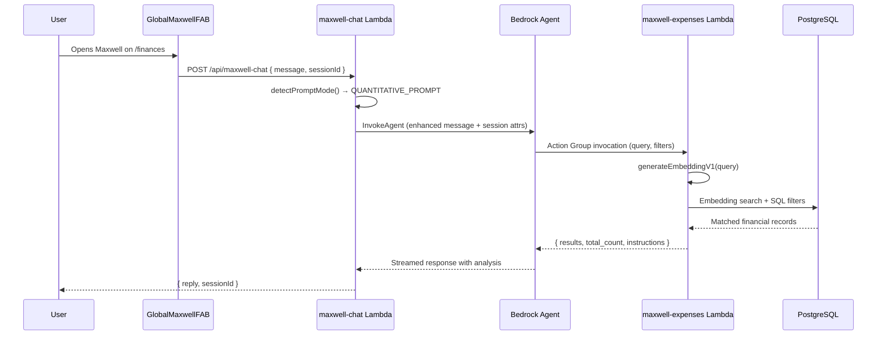
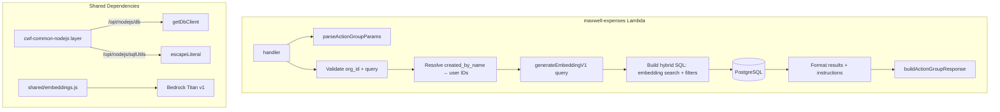

# Design Document: Maxwell Expenses Assistant

## Overview

This feature adds expense-querying capabilities to Maxwell by introducing a new `maxwell-expenses` action group Lambda, expanding the GlobalMaxwellFAB visibility to the Finances page, and adding expense-related keywords to the quantitative prompt routing in `maxwell-chat`.

The `maxwell-expenses` Lambda follows the exact same pattern as `maxwell-observations` and `maxwell-storage-advisor`: it receives a Bedrock Action Group event, extracts parameters via `parseActionGroupParams`, queries the database, and returns results wrapped in `buildActionGroupResponse` with self-contained `instructions`. The key difference is that this Lambda combines semantic embedding search (against `unified_embeddings` where `entity_type = 'financial_record'`) with SQL filters on the joined `financial_records` table.

### Key Design Decisions

1. **Reuse existing action group patterns exactly**: The Lambda uses the same `parseActionGroupParams` / `buildActionGroupResponse` helpers, the same `sessionAttributes` org extraction, and the same `shared/embeddings.js` module (copied from `maxwell-storage-advisor`) for embedding generation.

2. **Embedding search + SQL filter hybrid**: The query first finds semantically similar financial record embeddings, then joins to `financial_records` and `states` (via `state_links`) to apply structured filters (date range, payment method, created_by). This gives Maxwell both semantic relevance and precise filtering.

3. **Name resolution via `organization_members`**: The `created_by_name` parameter is resolved to `cognito_user_id`(s) using a case-insensitive `ILIKE` partial match on `full_name`, scoped to the organization. This lets users say "what did Mae buy?" without knowing user IDs.

4. **Default 6-month date window**: When no date range is provided, the Lambda defaults to the last 6 months. This prevents unbounded queries while covering a useful default range.

5. **FAB visibility via pathname check**: The GlobalMaxwellFAB already checks `isDashboard` as a special case. We add an `isFinances` check for `/finances` the same way. No entity context is needed — the FAB opens in general mode.

6. **Keyword expansion in existing regex**: The `QUANTITATIVE_KEYWORDS` regex in `maxwell-chat/index.js` gets additional terms (`spend|spent|purchase|purchased|bought|transaction|payment|balance`) appended to the existing alternation.

## Architecture

### Request Flow



### Lambda Architecture



## Components and Interfaces

### 1. GlobalMaxwellFAB Change (`src/components/GlobalMaxwellFAB.tsx`)

Add `/finances` to the visibility check, following the same pattern as `isDashboard`:

```typescript
const isFinances = location.pathname === '/finances';

// Show FAB on entity detail pages, dashboard, and finances
if (!entityContext && !isDashboard && !isFinances && !isPanelOpen) {
  return null;
}
```

And update the render condition:

```typescript
{!isPanelOpen && (entityContext || isDashboard || isFinances) && (
```

No entity context is passed — the FAB opens in general mode, same as on the dashboard.

### 2. Maxwell Chat Keyword Expansion (`lambda/maxwell-chat/index.js`)

Expand the `QUANTITATIVE_KEYWORDS` regex to include expense-related terms:

```javascript
// Before:
const QUANTITATIVE_KEYWORDS = /\b(roi|cost|revenue|profit|price|expense|budget|investment|how much|per month|per day|per week|earnings|income|margin|break.?even)\b/i;

// After:
const QUANTITATIVE_KEYWORDS = /\b(roi|cost|revenue|profit|price|expense|budget|investment|how much|per month|per day|per week|earnings|income|margin|break.?even|spend|spent|purchase|purchased|bought|transaction|payment|balance)\b/i;
```

All previously supported keywords remain unchanged. The new keywords are appended to the alternation.

### 3. Maxwell Expenses Lambda (`lambda/maxwell-expenses/index.js`)

New Lambda following the exact pattern of `maxwell-storage-advisor` and `maxwell-observations`:

**Dependencies:**
- `/opt/nodejs/db` → `getDbClient` (from cwf-common-nodejs layer)
- `/opt/nodejs/sqlUtils` → `escapeLiteral` (from cwf-common-nodejs layer)
- `./shared/embeddings.js` → `generateEmbeddingV1` (local copy, same as maxwell-storage-advisor)

**Shared helpers** (identical to existing action group Lambdas):
- `parseActionGroupParams(event)` — extracts `{ name, value }` array into object
- `buildActionGroupResponse(actionGroup, apiPath, httpMethod, statusCode, body)` — wraps response in Bedrock Action Group envelope
- `queryJSON(sql)` — executes SQL and returns `result.rows`

**Handler flow:**

1. Extract `actionGroup`, `apiPath`, `httpMethod` from event (defaults: `SearchFinancialRecords`, `/searchFinancialRecords`, `POST`)
2. Extract `organization_id` from `event.sessionAttributes`
3. Parse parameters: `query` (required), `created_by_name`, `payment_method`, `start_date`, `end_date`, `sort_by`, `limit`
4. Validate: return 400 if `query` missing/empty or `organization_id` missing
5. If `created_by_name` provided, resolve to `cognito_user_id`(s) via `organization_members` ILIKE lookup
6. Generate embedding for `query` via `generateEmbeddingV1`
7. Build SQL: embedding similarity search on `unified_embeddings` joined to `financial_records` + `state_links` + `states` + `organization_members`, with WHERE clauses for date range, payment method, and resolved user IDs
8. Execute query, format results
9. Return `{ results, total_count, message, instructions }` via `buildActionGroupResponse`

**SQL Query Structure:**

```sql
SELECT
  ue.entity_id,
  ue.embedding_source,
  1 - (ue.embedding <=> $embedding::vector) AS similarity,
  fr.amount,
  fr.transaction_date,
  fr.payment_method,
  s.state_text AS description,
  COALESCE(om.full_name, 'Unknown') AS created_by_name
FROM unified_embeddings ue
JOIN financial_records fr ON ue.entity_id = fr.id
  AND fr.organization_id = $org_id
JOIN state_links sl ON sl.entity_id = fr.id AND sl.entity_type = 'financial_record'
JOIN states s ON s.id = sl.state_id
LEFT JOIN organization_members om
  ON fr.created_by::text = om.cognito_user_id::text
  AND om.organization_id = fr.organization_id
WHERE ue.entity_type = 'financial_record'
  AND ue.organization_id = $org_id
  AND fr.transaction_date >= $start_date
  AND fr.transaction_date <= $end_date
  -- Optional: AND fr.payment_method = $payment_method
  -- Optional: AND fr.created_by IN ($resolved_user_ids)
ORDER BY $sort_clause
LIMIT $limit
```

The `total_count` is obtained via a parallel `COUNT(*)` query with the same WHERE clauses (excluding LIMIT).

**Instructions template:**

```javascript
const instructions = results.length > 0
  ? 'You are answering a question about financial records/expenses. Use ONLY the data provided. Show amounts in ₱ (Philippine Peso). When multiple records are returned, calculate totals, averages, or breakdowns as appropriate to answer the question. Group by created_by_name or payment_method when relevant. Always mention the date range covered. If total_count exceeds the number of results shown, mention that more records exist.'
  : 'No matching financial records were found for this query. Inform the user and suggest they try different search terms or a wider date range.';
```

### 4. OpenAPI Schema (`lambda/maxwell-expenses/openapi.json`)

Defines the `/searchFinancialRecords` endpoint for Bedrock Agent registration:

```json
{
  "openapi": "3.0.0",
  "info": {
    "title": "Maxwell Expenses API",
    "version": "1.0.0",
    "description": "Search and filter financial records for expense analysis"
  },
  "paths": {
    "/searchFinancialRecords": {
      "post": {
        "operationId": "searchFinancialRecords",
        "description": "Search financial records using semantic search combined with optional filters. Use this when users ask about expenses, purchases, transactions, spending, or financial records.",
        "parameters": [
          {
            "name": "query",
            "in": "query",
            "required": true,
            "schema": { "type": "string" },
            "description": "Search text for semantic matching against financial record descriptions"
          },
          {
            "name": "created_by_name",
            "in": "query",
            "required": false,
            "schema": { "type": "string" },
            "description": "Filter by person name (partial match). Example: 'Mae' or 'Stefan'"
          },
          {
            "name": "payment_method",
            "in": "query",
            "required": false,
            "schema": { "type": "string", "enum": ["Cash", "SCash", "GCash", "Wise"] },
            "description": "Filter by payment method"
          },
          {
            "name": "start_date",
            "in": "query",
            "required": false,
            "schema": { "type": "string", "format": "date" },
            "description": "Start of date range (ISO date). Defaults to 6 months ago"
          },
          {
            "name": "end_date",
            "in": "query",
            "required": false,
            "schema": { "type": "string", "format": "date" },
            "description": "End of date range (ISO date). Defaults to today"
          },
          {
            "name": "sort_by",
            "in": "query",
            "required": false,
            "schema": { "type": "string", "enum": ["amount_desc", "amount_asc", "date_desc", "date_asc"] },
            "description": "Sort order for results. Defaults to similarity ranking"
          },
          {
            "name": "limit",
            "in": "query",
            "required": false,
            "schema": { "type": "integer", "default": 20 },
            "description": "Maximum number of results to return (default 20)"
          }
        ],
        "responses": {
          "200": {
            "description": "Search results with matched financial records",
            "content": {
              "application/json": {
                "schema": {
                  "type": "object",
                  "properties": {
                    "results": {
                      "type": "array",
                      "items": {
                        "type": "object",
                        "properties": {
                          "description": { "type": "string" },
                          "amount": { "type": "number" },
                          "transaction_date": { "type": "string" },
                          "payment_method": { "type": "string" },
                          "created_by_name": { "type": "string" },
                          "similarity": { "type": "number" }
                        }
                      }
                    },
                    "total_count": { "type": "integer" },
                    "message": { "type": "string" },
                    "instructions": { "type": "string" }
                  }
                }
              }
            }
          }
        }
      }
    }
  }
}
```

### 5. Name Resolution Logic

```javascript
async function resolveCreatedByName(client, organizationId, createdByName) {
  const safeName = escapeLiteral(createdByName);
  const safeOrgId = escapeLiteral(organizationId);
  
  const sql = `
    SELECT cognito_user_id, full_name
    FROM organization_members
    WHERE organization_id = '${safeOrgId}'
      AND full_name ILIKE '%${safeName}%'
  `;
  
  const result = await client.query(sql);
  return result.rows; // Array of { cognito_user_id, full_name }
}
```

Returns:
- 0 matches → empty result set with message
- 1 match → filter by that user's `cognito_user_id`
- N matches → filter by all matched `cognito_user_id`s, include matched names in response

## Data Models

### Bedrock Action Group Event (Input)

```typescript
interface ActionGroupEvent {
  actionGroup: string;           // "SearchFinancialRecords"
  apiPath: string;               // "/searchFinancialRecords"
  httpMethod: string;            // "POST"
  parameters: Array<{            // Bedrock parameter format
    name: string;
    type: string;
    value: string;
  }>;
  sessionAttributes: {
    organization_id: string;     // Forwarded by maxwell-chat
    [key: string]: string;
  };
}
```

### Parsed Parameters

```typescript
interface ExpenseSearchParams {
  query: string;                 // Required: semantic search text
  created_by_name?: string;      // Optional: person name for ILIKE lookup
  payment_method?: string;       // Optional: Cash | SCash | GCash | Wise
  start_date?: string;           // Optional: ISO date, defaults to 6 months ago
  end_date?: string;             // Optional: ISO date, defaults to today
  sort_by?: string;              // Optional: amount_desc | amount_asc | date_desc | date_asc
  limit?: number;                // Optional: default 20
}
```

### Response Body

```typescript
interface ExpenseSearchResponse {
  results: Array<{
    description: string;         // state_text from linked state
    amount: number;              // financial_records.amount
    transaction_date: string;    // financial_records.transaction_date
    payment_method: string;      // financial_records.payment_method
    created_by_name: string;     // Resolved from organization_members
    similarity: number;          // Cosine similarity score
  }>;
  total_count: number;           // Total matches before limit
  message: string;               // Human-readable summary
  instructions: string;          // Self-contained agent instructions
  matched_users?: string[];      // Included when multiple users match created_by_name
}
```

### Name Resolution Result

```typescript
interface ResolvedUser {
  cognito_user_id: string;
  full_name: string;
}
```


## Correctness Properties

*A property is a characteristic or behavior that should hold true across all valid executions of a system — essentially, a formal statement about what the system should do. Properties serve as the bridge between human-readable specifications and machine-verifiable correctness guarantees.*

### Property 1: Response completeness

*For any* valid expense search query and organization, each result object in the response shall contain all required fields (`description`, `amount`, `transaction_date`, `payment_method`, `created_by_name`, `similarity`), and the response shall include a non-empty `instructions` string and a `message` string.

**Validates: Requirements 2.7, 2.9, 2.11**

### Property 2: Filter correctness

*For any* combination of optional filters (`payment_method`, `start_date`, `end_date`, resolved `created_by` user IDs), all returned results shall satisfy every provided filter. Additionally, every query shall be scoped to `entity_type = 'financial_record'` and the requesting user's `organization_id`.

**Validates: Requirements 2.6, 2.8**

### Property 3: Total count invariant

*For any* expense search query, the `total_count` in the response shall be greater than or equal to the number of results returned (i.e., `total_count >= results.length`).

**Validates: Requirements 2.10**

### Property 4: Name resolution correctness

*For any* name string and set of organization members, the resolved user IDs shall be exactly those members whose `full_name` contains the name string as a case-insensitive substring. When zero members match, the result set shall be empty.

**Validates: Requirements 3.1, 3.2, 3.3**

### Property 5: Quantitative keyword detection

*For any* message string containing at least one quantitative keyword (both existing: `roi`, `cost`, `revenue`, `profit`, `price`, `expense`, `budget`, `investment`, `how much`, `per month`, `per day`, `per week`, `earnings`, `income`, `margin`, `break-even`; and new: `spend`, `spent`, `purchase`, `purchased`, `bought`, `transaction`, `payment`, `balance`), `detectPromptMode` shall return the `QUANTITATIVE_PROMPT` fragment.

**Validates: Requirements 4.1, 4.2, 4.3**

## Error Handling

### Validation Errors (400)

1. **Missing query parameter**: If `query` is missing or empty string, return 400 with `{ error: 'Missing required parameter: query' }`. Follows the exact pattern from `maxwell-storage-advisor`.

2. **Missing organization context**: If `organization_id` is not in `sessionAttributes`, return 400 with `{ error: 'Missing organization context in session attributes' }`. Same pattern as both existing action group Lambdas.

### Name Resolution Edge Cases

1. **No matching users**: Return 200 with empty `results` array, `total_count: 0`, and a message like `"No user matching 'XYZ' found in your organization"`. The `instructions` field tells the agent to inform the user.

2. **Multiple matching users**: All matched user IDs are included in the filter. The `matched_users` array in the response lists the resolved names so the agent can clarify which users were included.

3. **SQL injection in name**: The `escapeLiteral` utility from the shared layer sanitizes the name before use in the ILIKE clause.

### Server Errors (500)

1. **Embedding generation failure**: If `generateEmbeddingV1` throws, catch the error and return 500 with `{ error: 'Failed to generate embedding for the provided query' }`. Follows the `maxwell-storage-advisor` pattern that checks for `'Embedding generation failed'` in the error message.

2. **Database query failure**: Any other error returns 500 with `{ error: 'Internal error searching financial records' }`. The detailed error is logged via `console.error` but not exposed to the client.

### Default Date Range

When `start_date` is omitted, the Lambda computes 6 months ago from the current date:

```javascript
const now = new Date();
const defaultStart = new Date(now);
defaultStart.setMonth(defaultStart.getMonth() - 6);
const startDate = params.start_date || defaultStart.toISOString().split('T')[0];
const endDate = params.end_date || now.toISOString().split('T')[0];
```

## Testing Strategy

### Unit Tests

Unit tests verify specific examples, edge cases, and error conditions:

1. **Parameter parsing**: Verify `parseActionGroupParams` extracts parameters correctly from Bedrock event format.

2. **Default date range**: Verify that when `start_date` is omitted, the default is 6 months ago; when `end_date` is omitted, the default is today.

3. **Name resolution examples**:
   - `"Mae"` matches `"Mae Santos"` → single user ID returned
   - `"a"` matches `"Mae Santos"` and `"Ana Cruz"` → both user IDs returned
   - `"XYZ"` matches nothing → empty array returned
   - Case insensitivity: `"mae"` matches `"Mae Santos"`

4. **Error handling**:
   - Missing `query` → 400 response
   - Missing `organization_id` → 400 response
   - Embedding generation failure → 500 response
   - Database query failure → 500 response

5. **Response format**: Verify the `buildActionGroupResponse` envelope matches the Bedrock Action Group expected format.

6. **FAB visibility**: Verify GlobalMaxwellFAB renders on `/finances`, `/dashboard`, and entity detail pages; does not render on other pages like `/settings`.

7. **Keyword detection**: Verify specific new keywords (`spent`, `bought`, `balance`) trigger quantitative mode; verify existing keywords (`roi`, `cost`) still work; verify non-matching words (`hello`, `weather`) don't trigger it.

### Property-Based Tests

Property tests verify universal properties across all inputs using randomization. Use `fast-check` as the property-based testing library. Each test runs minimum 100 iterations.

1. **Property 1: Response completeness**
   - Generate random valid query strings and mock database results with random financial record data
   - Call the handler with the generated query
   - Assert every result object has all required fields: `description`, `amount`, `transaction_date`, `payment_method`, `created_by_name`, `similarity`
   - Assert the response includes non-empty `instructions` and `message` strings
   - Tag: **Feature: maxwell-expenses-assistant, Property 1: Response completeness**

2. **Property 2: Filter correctness**
   - Generate random filter combinations (payment_method from valid enum, random date ranges, random user IDs)
   - Generate mock database rows, some matching filters and some not
   - Call the filter-building logic with the generated filters
   - Assert all returned results satisfy every provided filter
   - Assert the query always includes `entity_type = 'financial_record'` and the correct `organization_id`
   - Tag: **Feature: maxwell-expenses-assistant, Property 2: Filter correctness**

3. **Property 3: Total count invariant**
   - Generate random query results with varying total counts and limits
   - Assert `total_count >= results.length` for every response
   - Tag: **Feature: maxwell-expenses-assistant, Property 3: Total count invariant**

4. **Property 4: Name resolution correctness**
   - Generate random arrays of organization members with random `full_name` values
   - Generate random search name strings
   - Call `resolveCreatedByName` with the generated inputs
   - Assert the returned user IDs are exactly those whose `full_name` contains the search string (case-insensitive)
   - Tag: **Feature: maxwell-expenses-assistant, Property 4: Name resolution correctness**

5. **Property 5: Quantitative keyword detection**
   - Generate random message strings with at least one quantitative keyword (randomly chosen from the full set of old + new keywords) injected at a random position
   - Call `detectPromptMode` with the generated message
   - Assert the result equals `QUANTITATIVE_PROMPT`
   - Tag: **Feature: maxwell-expenses-assistant, Property 5: Quantitative keyword detection**

### Test Configuration

- **Property Test Library**: fast-check (JavaScript)
- **Minimum Iterations**: 100 per property test
- **Test Runner**: Vitest (`npm run test:run`)
- **Mocking**: `generateEmbeddingV1` mocked to return a fixed 1536-dimension vector; database client mocked for unit tests; Bedrock Agent not invoked in tests
- **Each correctness property is implemented by a single property-based test**
- **Each property test is tagged with**: Feature: maxwell-expenses-assistant, Property {number}: {title}
