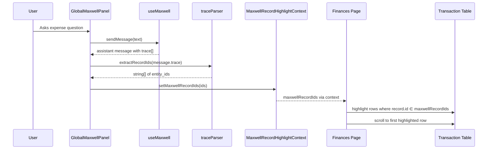
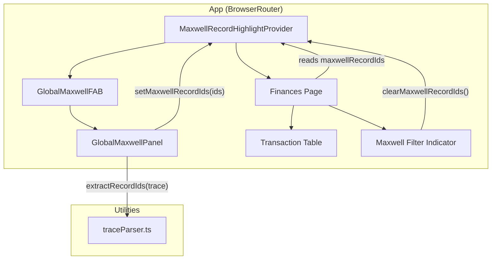

# Design Document: Maxwell Trace to List

## Overview

This feature connects Maxwell's expense analysis responses to the Finances page transaction list. When Maxwell answers an expense question, the trace events from the Bedrock Agent contain the raw action group response from `maxwell-expenses`, which includes `entity_id` for each matched financial record. By parsing these trace events, extracting the entity IDs, and sharing them with the Finances page via React context, we can highlight, filter, and auto-scroll to the exact records Maxwell referenced.

### Key Design Decisions

1. **React Context for shared state**: The codebase already uses React Context extensively (`AuthContext`, `OrganizationContext`, `UploadQueueContext`, `AppSettingsContext`). A new `MaxwellRecordHighlightContext` follows this established pattern. No new dependencies (zustand, jotai) are needed.

2. **Lambda must include `entity_id` in results**: Currently, `maxwell-expenses/index.js` selects `ue.entity_id` in SQL but drops it in the results mapper. The Lambda must be updated to include `entity_id` in each result object. This is the most reliable source — the action group response body is structured JSON, not LLM-generated text.

3. **Trace parsing is frontend-only**: The trace events are already captured on `message.trace` in `useMaxwell`. A pure utility function parses the Bedrock trace structure to find `actionGroupInvocationOutput` events where `apiPath` matches `/searchFinancialRecords`, then extracts `entity_id` from the parsed response body.

4. **Provider placement at App level**: The `MaxwellRecordHighlightProvider` wraps `AppContent` inside `BrowserRouter` (same level as `GlobalMaxwellFAB`), so both the Maxwell panel and the Finances page can access the shared state.

5. **Filter toggle is additive to existing filters**: The Maxwell filter indicator and toggle work alongside the existing description search, payment method, and creator filters on the Finances page. The Maxwell filter is applied as an additional constraint when the toggle is active.

## Architecture

### Data Flow



### Component Architecture



## Components and Interfaces

### 1. Lambda Change: Include `entity_id` in Results (`lambda/maxwell-expenses/index.js`)

The results mapper currently omits `entity_id`. Add it:

```javascript
// Before:
const results = rows.map((row) => ({
  description: row.description,
  amount: parseFloat(row.amount),
  // ...
}));

// After:
const results = rows.map((row) => ({
  entity_id: row.entity_id,  // <-- ADD THIS
  description: row.description,
  amount: parseFloat(row.amount),
  // ...
}));
```

This is a backward-compatible addition — the LLM instructions don't reference `entity_id`, so the agent's text response is unaffected.

### 2. Trace Parser Utility (`src/lib/traceParser.ts`)

A pure function that extracts entity IDs from Bedrock Agent trace events. The Bedrock trace structure nests action group responses inside `trace.orchestrationTrace.observation.actionGroupInvocationOutput`:

```typescript
export function extractRecordIdsFromTrace(traceEvents: any[]): string[] {
  const ids = new Set<string>();

  for (const event of traceEvents) {
    // Navigate Bedrock trace structure
    const output = event?.trace?.orchestrationTrace?.observation?.actionGroupInvocationOutput;
    if (!output) continue;

    // Check if this is a SearchFinancialRecords response
    if (output.actionGroupName !== 'SearchFinancialRecords') continue;

    // Parse the response body
    try {
      const responseBody = JSON.parse(output.actionGroupOutputString || '{}');
      const results = responseBody.results;
      if (Array.isArray(results)) {
        for (const result of results) {
          if (result.entity_id && typeof result.entity_id === 'string') {
            ids.add(result.entity_id);
          }
        }
      }
    } catch {
      // Skip unparseable responses
      continue;
    }
  }

  return Array.from(ids);
}
```

This function is pure (no side effects, no dependencies) and easily unit-testable.

### 3. Maxwell Record Highlight Context (`src/contexts/MaxwellRecordHighlightContext.tsx`)

Follows the same pattern as `UploadQueueContext`:

```typescript
interface MaxwellRecordHighlightContextType {
  maxwellRecordIds: string[];
  setMaxwellRecordIds: (ids: string[]) => void;
  clearMaxwellRecordIds: () => void;
  isFilterActive: boolean;
  setIsFilterActive: (active: boolean) => void;
}
```

- `maxwellRecordIds`: The current set of entity IDs from Maxwell's trace
- `setMaxwellRecordIds`: Replaces the current IDs (called by GlobalMaxwellPanel after parsing trace)
- `clearMaxwellRecordIds`: Clears IDs and resets filter toggle (called on dismiss, navigation away)
- `isFilterActive`: Whether the "Filter" toggle in the indicator is on
- `setIsFilterActive`: Toggles the filter mode

The provider is placed inside `AppContent` wrapping the `Routes` and `GlobalMaxwellFAB`, so both the panel and the Finances page share the same context instance.

### 4. GlobalMaxwellPanel Integration (`src/components/GlobalMaxwellPanel.tsx`)

After receiving an assistant message with trace events, the panel calls the trace parser and updates the context:

```typescript
// Inside GlobalMaxwellPanel, after assistant message is added:
const { setMaxwellRecordIds } = useMaxwellRecordHighlight();

// In useEffect watching messages:
useEffect(() => {
  const lastMessage = messages[messages.length - 1];
  if (lastMessage?.role === 'assistant' && lastMessage.trace?.length) {
    const ids = extractRecordIdsFromTrace(lastMessage.trace);
    if (ids.length > 0) {
      setMaxwellRecordIds(ids);
    }
  }
}, [messages]);
```

### 5. Finances Page Changes (`src/pages/Finances.tsx`)

#### 5a. Maxwell Filter Indicator

A banner displayed above the transaction table when `maxwellRecordIds` is non-empty:

```tsx
{maxwellRecordIds.length > 0 && matchCount > 0 && (
  <div className="flex items-center justify-between px-4 py-2 mb-2 rounded-lg bg-primary/10 border border-primary/20">
    <span className="text-sm text-primary">
      Showing {matchCount} records from Maxwell
    </span>
    <div className="flex items-center gap-2">
      <Button
        variant={isFilterActive ? "default" : "outline"}
        size="sm"
        onClick={() => setIsFilterActive(!isFilterActive)}
      >
        Filter
      </Button>
      <Button variant="ghost" size="icon" onClick={clearMaxwellRecordIds}>
        <X className="h-4 w-4" />
      </Button>
    </div>
  </div>
)}
```

Where `matchCount` is derived from the intersection of `maxwellRecordIds` and the currently loaded records.

#### 5b. Row Highlighting

In the `<TableRow>` for each record, add a conditional background class:

```tsx
const isHighlighted = maxwellRecordIdSet.has(record.id);

<TableRow
  key={record.id}
  className={cn(
    "cursor-pointer",
    isHighlighted && "bg-primary/5 hover:bg-primary/10"
  )}
  // ...
>
```

Using a `Set` for O(1) lookup.

#### 5c. Filter Toggle

When `isFilterActive` is true, add an additional filter step in the `filteredAndSorted` memo:

```typescript
// After existing filters, before sort:
if (isFilterActive && maxwellRecordIds.length > 0) {
  records = records.filter(r => maxwellRecordIdSet.has(r.id));
}
```

#### 5d. Auto-Scroll to First Match

Use a ref on the first highlighted row and scroll into view when IDs are first set:

```typescript
const firstHighlightRef = useRef<HTMLTableRowElement>(null);
const prevRecordIdsRef = useRef<string[]>([]);

useEffect(() => {
  if (
    maxwellRecordIds.length > 0 &&
    prevRecordIdsRef.current.length === 0 &&
    firstHighlightRef.current
  ) {
    firstHighlightRef.current.scrollIntoView({ behavior: 'smooth', block: 'center' });
  }
  prevRecordIdsRef.current = maxwellRecordIds;
}, [maxwellRecordIds]);
```

#### 5e. Clear on Navigation Away

Use a `useEffect` cleanup or route change detection to clear the IDs:

```typescript
const location = useLocation();

useEffect(() => {
  // Clear when navigating away from /finances
  return () => {
    clearMaxwellRecordIds();
  };
}, []);
```

### 6. Persistence Across Panel Toggle

The context state lives in `MaxwellRecordHighlightProvider` at the App level, not inside the Maxwell panel. Closing/reopening the panel does not affect the context state. The IDs persist until:
- The user dismisses the indicator (clicks X)
- The user navigates away from `/finances`
- A new Maxwell response replaces the IDs

## Data Models

### Bedrock Trace Event Structure (relevant subset)

```typescript
interface BedrockTraceEvent {
  trace?: {
    orchestrationTrace?: {
      observation?: {
        actionGroupInvocationOutput?: {
          actionGroupName: string;        // e.g., "SearchFinancialRecords"
          actionGroupOutputString: string; // JSON string of the Lambda response body
        };
      };
    };
  };
}
```

### Action Group Response Body (parsed from `actionGroupOutputString`)

```typescript
interface SearchFinancialRecordsResponse {
  results: Array<{
    entity_id: string;           // UUID — the financial record ID (NEW)
    description: string;
    amount: number;
    transaction_date: string;
    payment_method: string;
    created_by_name: string;
    similarity: number;
  }>;
  total_count: number;
  message: string;
  instructions: string;
}
```

### Maxwell Record Highlight Context State

```typescript
interface MaxwellRecordHighlightState {
  maxwellRecordIds: string[];    // Deduplicated entity_id UUIDs
  isFilterActive: boolean;       // Whether "Filter" toggle is on
}
```

### Financial Record (existing, unchanged)

```typescript
interface FinancialRecord {
  id: string;                    // UUID — matches entity_id from Maxwell
  organization_id: string;
  transaction_date: string;
  amount: number;
  payment_method: 'Cash' | 'SCash' | 'GCash' | 'Wise';
  description?: string;
  created_by_name?: string;
  balance_after?: number | null;
  // ... other fields
}
```


## Correctness Properties

*A property is a characteristic or behavior that should hold true across all valid executions of a system — essentially, a formal statement about what the system should do. Properties serve as the bridge between human-readable specifications and machine-verifiable correctness guarantees.*

### Property 1: Trace parser extraction correctness

*For any* array of Bedrock trace events containing zero or more SearchFinancialRecords action group responses (each with a `results` array of objects containing `entity_id` fields), mixed with non-matching trace events, malformed JSON, or other action groups, `extractRecordIdsFromTrace` shall return exactly the deduplicated set of `entity_id` strings found in all valid SearchFinancialRecords responses, and no others.

**Validates: Requirements 1.1, 1.2, 1.3, 1.4, 1.5**

### Property 2: Trace parser round-trip

*For any* set of unique UUID strings, constructing trace events that embed those UUIDs as `entity_id` fields in SearchFinancialRecords action group responses and passing them to `extractRecordIdsFromTrace` shall return a set equal to the original input set.

**Validates: Requirements 1.2, 1.3**

### Property 3: State replacement semantics

*For any* two arrays of entity ID strings A and B, calling `setMaxwellRecordIds(A)` followed by `setMaxwellRecordIds(B)` shall result in the context state containing exactly B, with no elements from A retained unless they also appear in B.

**Validates: Requirements 2.3, 6.3**

### Property 4: Highlight correctness (set membership)

*For any* financial record and any set of Maxwell record IDs, the record is highlighted if and only if `record.id` is a member of the Maxwell record IDs set.

**Validates: Requirements 3.1, 3.4**

### Property 5: Default non-filtering behavior

*For any* list of financial records and any non-empty set of Maxwell record IDs, when the filter toggle is inactive, the displayed record count shall equal the total record count (all records remain visible).

**Validates: Requirements 3.2, 4.5**

### Property 6: Match count equals intersection size

*For any* set of Maxwell record IDs and any list of loaded financial records, the displayed match count X in the filter indicator shall equal the size of the intersection of the Maxwell record IDs set and the set of loaded record IDs.

**Validates: Requirements 4.1**

### Property 7: Filter correctness

*For any* list of financial records and any non-empty set of Maxwell record IDs, when the filter toggle is active, the displayed records shall be exactly those records whose `id` is a member of the Maxwell record IDs set, preserving the existing sort order.

**Validates: Requirements 4.3, 4.4**

## Error Handling

### Trace Parsing Errors

1. **Malformed trace events**: If a trace event has unexpected structure (missing `trace`, `orchestrationTrace`, `observation`, or `actionGroupInvocationOutput` fields), the parser skips it via optional chaining. No error is thrown.

2. **Unparseable response body**: If `actionGroupOutputString` contains invalid JSON, the `JSON.parse` call is wrapped in a try/catch. The parser logs nothing (pure function) and continues to the next event.

3. **Missing `entity_id` fields**: If a result object in the parsed response lacks `entity_id` or it's not a string, the parser skips that result. Only valid string entity_ids are collected.

4. **Empty trace array**: If `message.trace` is an empty array or undefined, `extractRecordIdsFromTrace` returns an empty array. The panel does not call `setMaxwellRecordIds` with an empty array (no-op).

### Context State Errors

1. **Context used outside provider**: The `useMaxwellRecordHighlight` hook throws a descriptive error if used outside `MaxwellRecordHighlightProvider`, following the same pattern as `useUploadQueue` and `useOrganization`.

2. **Stale IDs**: If Maxwell references records that are not in the currently loaded time frame on the Finances page, the match count will be lower than the total Maxwell IDs. The indicator shows the match count (intersection), not the total Maxwell IDs count. This is correct behavior — the user can expand the time frame to see more matches.

### Lambda Backward Compatibility

Adding `entity_id` to the `maxwell-expenses` response is additive. The `instructions` field does not reference `entity_id`, so the Bedrock Agent's text response is unaffected. Existing clients that don't use `entity_id` are not impacted.

## Testing Strategy

### Unit Tests

Unit tests verify specific examples, edge cases, and error conditions:

1. **Trace parser — valid single response**: Given a trace array with one SearchFinancialRecords response containing 3 results with entity_ids, verify all 3 IDs are returned.

2. **Trace parser — multiple responses**: Given a trace array with two SearchFinancialRecords responses (e.g., agent called the action group twice), verify IDs from both are combined and deduplicated.

3. **Trace parser — mixed events**: Given a trace array with SearchFinancialRecords, GetEntityObservations, and malformed events, verify only SearchFinancialRecords entity_ids are extracted.

4. **Trace parser — empty/missing trace**: Verify empty array input returns empty array output. Verify undefined/null handling.

5. **Trace parser — malformed JSON in response body**: Verify the parser skips events with invalid JSON in `actionGroupOutputString` without throwing.

6. **Match count computation**: Given 5 Maxwell IDs and 3 loaded records where 2 overlap, verify match count is 2.

7. **Filter toggle behavior**: Given records [A, B, C] and Maxwell IDs [A, C], verify filter-active shows [A, C] and filter-inactive shows [A, B, C].

8. **Context clear on dismiss**: Verify clicking the dismiss button calls `clearMaxwellRecordIds` and the indicator disappears.

9. **Auto-scroll fires once**: Verify `scrollIntoView` is called once when IDs are first set, and not on subsequent re-renders.

### Property-Based Tests

Property tests verify universal properties across all inputs using `fast-check`. Each test runs minimum 100 iterations.

1. **Property 1: Trace parser extraction correctness**
   - Generate random arrays of trace events: some with valid SearchFinancialRecords responses (random entity_ids), some with other action group names, some with malformed JSON, some with missing fields
   - Call `extractRecordIdsFromTrace` with the generated array
   - Independently compute the expected set by manually filtering for SearchFinancialRecords events and extracting entity_ids
   - Assert the parser output equals the expected set
   - Tag: **Feature: maxwell-trace-to-list, Property 1: Trace parser extraction correctness**

2. **Property 2: Trace parser round-trip**
   - Generate a random set of UUID strings
   - Construct valid trace events embedding those UUIDs in SearchFinancialRecords responses
   - Call `extractRecordIdsFromTrace`
   - Assert the output set equals the input set
   - Tag: **Feature: maxwell-trace-to-list, Property 2: Trace parser round-trip**

3. **Property 3: State replacement semantics**
   - Generate two random arrays of UUID strings A and B
   - Call `setMaxwellRecordIds(A)`, then `setMaxwellRecordIds(B)`
   - Assert the context state equals B
   - Tag: **Feature: maxwell-trace-to-list, Property 3: State replacement semantics**

4. **Property 4: Highlight correctness**
   - Generate a random list of financial record objects (with random UUIDs as ids) and a random set of Maxwell record IDs
   - For each record, compute `isHighlighted = maxwellRecordIdSet.has(record.id)`
   - Assert `isHighlighted` is true iff `record.id` is in the Maxwell set
   - Tag: **Feature: maxwell-trace-to-list, Property 4: Highlight correctness**

5. **Property 5: Default non-filtering behavior**
   - Generate a random list of records and a random non-empty set of Maxwell IDs
   - Apply the filtering logic with `isFilterActive = false`
   - Assert the output length equals the input length
   - Tag: **Feature: maxwell-trace-to-list, Property 5: Default non-filtering behavior**

6. **Property 6: Match count equals intersection size**
   - Generate a random set of Maxwell IDs and a random list of records
   - Compute the intersection size independently
   - Assert the match count function returns the intersection size
   - Tag: **Feature: maxwell-trace-to-list, Property 6: Match count equals intersection size**

7. **Property 7: Filter correctness**
   - Generate a random list of records and a random non-empty set of Maxwell IDs
   - Apply the filtering logic with `isFilterActive = true`
   - Assert every returned record's id is in the Maxwell set
   - Assert every record whose id is in the Maxwell set is in the returned list
   - Assert the relative order of returned records matches the input order
   - Tag: **Feature: maxwell-trace-to-list, Property 7: Filter correctness**

### Test Configuration

- **Property Test Library**: fast-check (already available in the project's test setup)
- **Minimum Iterations**: 100 per property test
- **Test Runner**: Vitest (`npm run test:run`)
- **Each correctness property is implemented by a single property-based test**
- **Each property test is tagged with**: Feature: maxwell-trace-to-list, Property {number}: {title}
