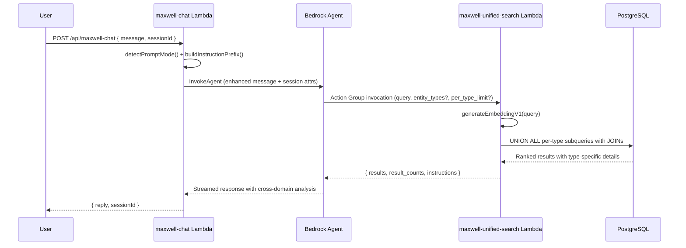
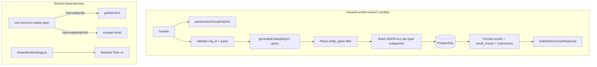

# Design Document: Maxwell Unified Search

## Overview

This feature replaces the `SearchFinancialRecords` and `SuggestStorageLocation` action groups with a single `UnifiedSearch` action group that searches across all 9 entity types in the `unified_embeddings` table. The new `cwf-maxwell-unified-search` Lambda follows the same Bedrock Action Group pattern as the existing `maxwell-expenses` and `maxwell-storage-advisor` Lambdas: it receives a Bedrock Action Group event, extracts parameters via `parseActionGroupParams`, queries the database, and returns results wrapped in `buildActionGroupResponse` with self-contained `instructions`.

### Key Design Decisions

1. **UNION ALL with per-type LIMIT for diversity quotas**: Rather than a single `ORDER BY similarity LIMIT N` query (which would let one dominant type crowd out others), the Lambda builds a UNION ALL of per-type subqueries, each with its own `LIMIT per_type_limit`. This guarantees at most `per_type_limit` results per entity type. The combined results are then sorted by similarity descending.

2. **Per-type JOIN subqueries**: Each entity type has its own subquery that joins `unified_embeddings` to the appropriate source table(s) and selects type-specific fields into a JSON `details` object. Types without a dedicated source table (`state`, `action_existing_state`, `state_space_model`) return `embedding_source` as the primary detail.

3. **Reuse existing action group patterns exactly**: Same `parseActionGroupParams` / `buildActionGroupResponse` helpers, same `sessionAttributes` org extraction, same `shared/embeddings.js` module for embedding generation via Bedrock Titan V1.

4. **Graceful handling of orphaned embeddings**: Each per-type subquery uses an `INNER JOIN` to the source table. If the source row has been deleted (orphaned embedding), the JOIN simply excludes it — no error, no special handling needed.

5. **Financial record presentation conventions preserved**: The response `instructions` field includes the same amount sign convention (positive = expense, negative = income), Philippine Peso formatting, and `referenced_records` tag guidance currently in `maxwell-expenses`.

6. **Agent configuration via OpenAPI schema + AWS CLI**: The new action group is registered with an OpenAPI schema that describes the `/unifiedSearch` endpoint. The old `SearchFinancialRecords` and `SuggestStorageLocation` action groups are removed. The system prompt is updated to reference the new tool.

## Architecture

### Request Flow



### Lambda Architecture



## Components and Interfaces

### 1. Maxwell Unified Search Lambda (`lambda/maxwell-unified-search/index.js`)

New Lambda following the exact pattern of `maxwell-expenses` and `maxwell-storage-advisor`.

**Dependencies:**
- `/opt/nodejs/db` → `getDbClient` (from cwf-common-nodejs layer)
- `/opt/nodejs/sqlUtils` → `escapeLiteral` (from cwf-common-nodejs layer)
- `./shared/embeddings.js` → `generateEmbeddingV1` (local copy, same as other action group Lambdas)

**Shared helpers** (identical to existing action group Lambdas):
- `parseActionGroupParams(event)` — extracts `{ name, value }` array into object
- `buildActionGroupResponse(actionGroup, apiPath, httpMethod, statusCode, body)` — wraps response in Bedrock Action Group envelope

**Handler flow:**

1. Extract `actionGroup`, `apiPath`, `httpMethod` from event (defaults: `UnifiedSearch`, `/unifiedSearch`, `POST`)
2. Extract `organization_id` from `event.sessionAttributes`
3. Parse parameters: `query` (required), `entity_types` (optional, comma-separated), `per_type_limit` (optional, default 3)
4. Validate: return 400 if `query` missing/empty or `organization_id` missing
5. Parse and validate `entity_types` if provided — filter out invalid values, keep valid ones
6. Generate embedding for `query` via `generateEmbeddingV1`
7. Build UNION ALL SQL: one subquery per active entity type, each with per-type JOIN and `LIMIT per_type_limit`
8. Execute query, format results with `details` object per type
9. Compute `result_counts` from returned rows
10. Return `{ results, result_counts, message, instructions }` via `buildActionGroupResponse`

**UNION ALL SQL Pattern:**

Each entity type gets a subquery like:

```sql
-- Part subquery
(SELECT
  ue.entity_type,
  ue.entity_id,
  ue.embedding_source,
  1 - (ue.embedding <=> $embedding::vector) AS similarity,
  json_build_object(
    'name', p.name,
    'description', p.description,
    'category', p.category,
    'storage_location', p.storage_location,
    'current_quantity', p.current_quantity,
    'unit', p.unit,
    'cost_per_unit', p.cost_per_unit,
    'sellable', p.sellable
  ) AS details
FROM unified_embeddings ue
JOIN parts p ON ue.entity_id = p.id AND p.organization_id = $org_id
WHERE ue.entity_type = 'part'
  AND ue.organization_id = $org_id
ORDER BY similarity DESC
LIMIT $per_type_limit)
```

All subqueries are combined with `UNION ALL` and wrapped in an outer `ORDER BY similarity DESC`.

**Entity type subquery details:**

| Entity Type | Source Table(s) | Detail Fields |
|---|---|---|
| `part` | `parts` | name, description, category, storage_location, current_quantity, unit, cost_per_unit, sellable |
| `tool` | `tools` | name, description, category, storage_location, status |
| `action` | `actions` | title, description, status, created_at, completed_at |
| `issue` | `issues` | description, issue_type, status, resolution_notes |
| `policy` | `policy` | title, description_text, status, effective_from |
| `financial_record` | `financial_records` + `state_links` + `states` + `organization_members` | description (state_text), amount, transaction_date, payment_method, created_by_name |
| `state` | (none — embedding_source only) | embedding_source as description |
| `action_existing_state` | (none — embedding_source only) | embedding_source as description |
| `state_space_model` | (none — embedding_source only) | embedding_source as description |

### 2. OpenAPI Schema (`lambda/maxwell-unified-search/openapi.json`)

Defines the `/unifiedSearch` endpoint for Bedrock Agent registration:

```json
{
  "openapi": "3.0.0",
  "info": {
    "title": "Maxwell Unified Search API",
    "version": "1.0.0",
    "description": "Cross-entity semantic search across all organization knowledge"
  },
  "paths": {
    "/unifiedSearch": {
      "post": {
        "operationId": "unifiedSearch",
        "description": "Search across all entity types (parts, tools, actions, issues, policies, financial records, observations, and models) using semantic search. This is the PRIMARY search tool — use it for ANY question requiring information from the organization's knowledge base, including expenses, inventory, actions, issues, policies, and observations. Returns results with per-type diversity to ensure balanced coverage.",
        "parameters": [
          {
            "name": "query",
            "in": "query",
            "required": true,
            "schema": { "type": "string" },
            "description": "Search text for semantic matching against all entity types"
          },
          {
            "name": "entity_types",
            "in": "query",
            "required": false,
            "schema": { "type": "string" },
            "description": "Comma-separated list of entity types to search. Valid values: part, tool, action, issue, policy, financial_record, state, action_existing_state, state_space_model. Omit to search all types."
          },
          {
            "name": "per_type_limit",
            "in": "query",
            "required": false,
            "schema": { "type": "integer", "default": 3 },
            "description": "Maximum results per entity type (default 3). Ensures diversity across types."
          }
        ],
        "responses": {
          "200": {
            "description": "Search results with type-specific details",
            "content": {
              "application/json": {
                "schema": {
                  "type": "object",
                  "properties": {
                    "results": {
                      "type": "array",
                      "items": {
                        "type": "object",
                        "properties": {
                          "entity_type": { "type": "string" },
                          "entity_id": { "type": "string" },
                          "embedding_source": { "type": "string" },
                          "similarity": { "type": "number" },
                          "details": { "type": "object" }
                        }
                      }
                    },
                    "result_counts": { "type": "object" },
                    "message": { "type": "string" },
                    "instructions": { "type": "string" }
                  }
                }
              }
            }
          }
        }
      }
    }
  }
}
```

### 3. System Prompt Update (`lambda/maxwell-chat/maxwell-instruction.txt`)

The system prompt is updated to reference the UnifiedSearch tool and remove references to the retired action groups:

```
You are Maxwell, an organizational intelligence assistant for CWF.

You are an intelligent intern: broad knowledge across many domains, but limited context about this specific organization. The people you work with are experienced professionals who don't want their time wasted. Be concise.

Your tools:
- UnifiedSearch: Searches across all entity types (parts, tools, actions, issues, policies, financial records, observations, models). Use this as your primary search tool for any question requiring organizational data.
- GetEntityObservations: Retrieves observations, photos, and metrics for a specific entity. Use session context for entityId and entityType.

Core rules:
- Show your work so users can spot where you're missing context
- Present findings and options — don't prescribe decisions
- Lead with numbers when numbers exist
- Cite sources: dates, observer names, metric values
- Display photos inline: 
- Never fabricate data
- Identify as Maxwell when asked

Follow any [Instructions: ...] block prepended to the user's message. It contains response format guidance specific to the question type.
```

### 4. Agent Configuration Updates

After deploying the Lambda and OpenAPI schema:

1. **Add UnifiedSearch action group** via AWS CLI (`update-agent-action-group`)
2. **Remove SearchFinancialRecords action group** via AWS CLI (`delete-agent-action-group`)
3. **Remove SuggestStorageLocation action group** via AWS CLI (`delete-agent-action-group`)
4. **Update agent instruction** with new system prompt via `update-agent`
5. **Prepare agent** via `prepare-agent`
6. **Create new agent version** via `create-agent-version` (to snapshot the changes)
7. **Update agent alias** to point to the new version via `update-agent-alias`

### 5. Lambda Resource Policy

The Lambda needs a resource-based policy allowing the Bedrock Agent to invoke it:

```bash
aws lambda add-permission \
  --function-name cwf-maxwell-unified-search \
  --statement-id AllowBedrockAgent \
  --action lambda:InvokeFunction \
  --principal bedrock.amazonaws.com \
  --source-arn "arn:aws:bedrock:us-west-2:131745734428:agent/*" \
  --region us-west-2
```

### 6. Response Instructions

The instructions field provides context-aware guidance for the agent:

```javascript
const instructions = results.length > 0
  ? `You are answering a question using cross-domain search results from the organization's knowledge base. Results include multiple entity types — group them by type when presenting to the user.

ENTITY TYPE PRESENTATION:
- For financial_record results: Show amounts in ₱ (Philippine Peso). AMOUNT SIGN CONVENTION: Positive amounts are EXPENSES (money going out). Negative amounts are INCOME/SALES (money coming in). Calculate totals/averages when multiple financial records are returned.
- For part results: Mention name, quantity, storage location, and cost when relevant.
- For tool results: Mention name, status, and storage location.
- For action results: Mention title, status, and completion date.
- For issue results: Mention description, type, status, and resolution.
- For policy results: Mention title and description.
- For state/observation results: Present the observation text with context.

Always mention which entity types contributed to your answer. Use ONLY the data provided.
IMPORTANT: As the LAST line of your answer, include a <referenced_records> tag containing a JSON array of entity_id values for ONLY the records you actually referenced. Example: <referenced_records>["id1","id2"]</referenced_records>`
  : 'No matching results were found. Inform the user and suggest they try different search terms.';
```

## Data Models

### Bedrock Action Group Event (Input)

```typescript
interface ActionGroupEvent {
  actionGroup: string;           // "UnifiedSearch"
  apiPath: string;               // "/unifiedSearch"
  httpMethod: string;            // "POST"
  parameters: Array<{            // Bedrock parameter format
    name: string;
    type: string;
    value: string;
  }>;
  sessionAttributes: {
    organization_id: string;     // Forwarded by maxwell-chat
    [key: string]: string;
  };
}
```

### Parsed Parameters

```typescript
interface UnifiedSearchParams {
  query: string;                 // Required: semantic search text
  entity_types?: string;         // Optional: comma-separated entity types
  per_type_limit?: number;       // Optional: max results per type (default 3)
}
```

### Valid Entity Types

```typescript
const VALID_ENTITY_TYPES = [
  'part', 'tool', 'action', 'issue', 'policy',
  'action_existing_state', 'state', 'financial_record', 'state_space_model'
];
```

### Response Body

```typescript
interface UnifiedSearchResponse {
  results: Array<{
    entity_type: string;         // One of VALID_ENTITY_TYPES
    entity_id: string;           // UUID of the source entity
    embedding_source: string;    // Text used to generate the embedding
    similarity: number;          // Cosine similarity score (0-1)
    details: object;             // Type-specific fields from source table
  }>;
  result_counts: {               // Count of results per entity type
    [entity_type: string]: number;
  };
  message: string;               // Human-readable summary
  instructions: string;          // Self-contained agent instructions
}
```

### Per-Type Detail Shapes

```typescript
// part
interface PartDetails {
  name: string;
  description: string | null;
  category: string | null;
  storage_location: string | null;
  current_quantity: number;
  unit: string | null;
  cost_per_unit: number | null;
  sellable: boolean;
}

// tool
interface ToolDetails {
  name: string;
  description: string | null;
  category: string | null;
  storage_location: string | null;
  status: string;
}

// action
interface ActionDetails {
  title: string;
  description: string | null;
  status: string;
  created_at: string;
  completed_at: string | null;
}

// issue
interface IssueDetails {
  description: string;
  issue_type: string;
  status: string;
  resolution_notes: string | null;
}

// policy
interface PolicyDetails {
  title: string;
  description_text: string;
  status: string | null;
  effective_from: string | null;
}

// financial_record
interface FinancialRecordDetails {
  description: string;           // state_text from linked state
  amount: number;
  transaction_date: string;
  payment_method: string;
  created_by_name: string;       // Resolved from organization_members
}

// state, action_existing_state, state_space_model
interface EmbeddingOnlyDetails {
  description: string;           // embedding_source text
}
```


## Correctness Properties

*A property is a characteristic or behavior that should hold true across all valid executions of a system — essentially, a formal statement about what the system should do. Properties serve as the bridge between human-readable specifications and machine-verifiable correctness guarantees.*

### Property 1: Response completeness

*For any* valid query and organization, every result object in the response shall contain all required fields (`entity_type`, `entity_id`, `embedding_source`, `similarity`, `details`), and the response shall include a non-empty `instructions` string and a `message` string.

**Validates: Requirements 1.5, 8.1**

### Property 2: Similarity ordering

*For any* set of results returned by the unified search, the similarity scores shall be in non-increasing order (each result's similarity is greater than or equal to the next result's similarity).

**Validates: Requirements 1.4, 2.3**

### Property 3: Per-type diversity quota

*For any* query and any `per_type_limit` value, the number of results for each entity type shall not exceed `per_type_limit`. Formally: for every entity type `t`, `count(results where entity_type == t) <= per_type_limit`.

**Validates: Requirements 2.2**

### Property 4: Result counts consistency

*For any* response, the `result_counts` object shall exactly match the actual counts of results grouped by `entity_type`. Formally: for every key `t` in `result_counts`, `result_counts[t] == count(results where entity_type == t)`, and every entity type present in results has a corresponding key in `result_counts`.

**Validates: Requirements 2.4**

### Property 5: Entity type filtering

*For any* `entity_types` filter string, all returned results shall have an `entity_type` that is both a member of `VALID_ENTITY_TYPES` and present in the parsed filter list. When the filter contains invalid values mixed with valid ones, only valid types shall appear in results.

**Validates: Requirements 3.2, 3.4**

### Property 6: Organization scoping

*For any* query, the generated SQL shall include the `organization_id` filter in every per-type subquery, ensuring no cross-organization data leakage.

**Validates: Requirements 1.3**

## Error Handling

### Validation Errors (400)

1. **Missing query parameter**: If `query` is missing or empty/whitespace-only, return 400 with `{ error: 'Missing required parameter: query' }`. Follows the exact pattern from `maxwell-expenses` and `maxwell-storage-advisor`.

2. **Missing organization context**: If `organization_id` is not in `sessionAttributes`, return 400 with `{ error: 'Missing organization context in session attributes' }`. Same pattern as all existing action group Lambdas.

3. **Invalid entity_types**: Invalid values in the `entity_types` parameter are silently filtered out. If all provided values are invalid, the search proceeds across all entity types (same as omitting the parameter).

### Server Errors (500)

1. **Embedding generation failure**: If `generateEmbeddingV1` throws, catch the error and return 500 with `{ error: 'Failed to generate embedding for the provided query' }`. Follows the existing pattern.

2. **Database query failure**: Any other error returns 500 with `{ error: 'Internal error performing unified search' }`. The detailed error is logged via `console.error` but not exposed to the client.

### Orphaned Embeddings

If a `unified_embeddings` row references an entity that no longer exists in its source table, the `INNER JOIN` in the per-type subquery naturally excludes it. No special error handling is needed — the result simply doesn't appear.

## Testing Strategy

### Unit Tests

Unit tests verify specific examples, edge cases, and error conditions:

1. **Parameter parsing**: Verify `parseActionGroupParams` extracts parameters correctly from Bedrock event format.

2. **Entity type parsing**: Verify comma-separated `entity_types` string is correctly parsed, invalid types are filtered out, and empty/omitted values default to all types.

3. **Per-type limit default**: Verify `per_type_limit` defaults to 3 when omitted, and is correctly parsed as integer when provided.

4. **Error handling**:
   - Missing `query` → 400 response
   - Empty/whitespace `query` → 400 response
   - Missing `organization_id` → 400 response
   - Embedding generation failure → 500 response
   - Database query failure → 500 response

5. **Per-type detail fields**: For each entity type, verify the `details` object contains the correct fields:
   - `part`: name, description, category, storage_location, current_quantity, unit, cost_per_unit, sellable
   - `tool`: name, description, category, storage_location, status
   - `action`: title, description, status, created_at, completed_at
   - `issue`: description, issue_type, status, resolution_notes
   - `policy`: title, description_text, status, effective_from
   - `financial_record`: description, amount, transaction_date, payment_method, created_by_name
   - `state`/`action_existing_state`/`state_space_model`: description (from embedding_source)

6. **Instructions content**: Verify instructions include financial record conventions (amount sign, ₱ formatting, referenced_records tag) when results are present, and suggest different search terms when no results found.

7. **System prompt**: Verify `maxwell-instruction.txt` references UnifiedSearch and does not reference SearchFinancialRecords or SuggestStorageLocation.

8. **OpenAPI schema**: Verify the schema file is valid JSON with the correct operationId, parameters, and response structure.

### Property-Based Tests

Property tests verify universal properties across all inputs using randomization. Use `fast-check` as the property-based testing library. Each test runs minimum 100 iterations.

1. **Property 1: Response completeness**
   - Generate random valid query strings and mock database results with random entity types and fields
   - Call the result formatting logic with the generated data
   - Assert every result object has all required fields: `entity_type`, `entity_id`, `embedding_source`, `similarity`, `details`
   - Assert the response includes non-empty `instructions` and `message` strings
   - Tag: **Feature: maxwell-unified-search, Property 1: Response completeness**

2. **Property 2: Similarity ordering**
   - Generate random arrays of result objects with random similarity scores
   - Apply the sorting logic
   - Assert the output array has similarity scores in non-increasing order
   - Tag: **Feature: maxwell-unified-search, Property 2: Similarity ordering**

3. **Property 3: Per-type diversity quota**
   - Generate random `per_type_limit` values (1-10) and random result sets with varying entity types
   - Apply the per-type limiting logic
   - Assert no entity type has more results than `per_type_limit`
   - Tag: **Feature: maxwell-unified-search, Property 3: Per-type diversity quota**

4. **Property 4: Result counts consistency**
   - Generate random result arrays with random entity types
   - Compute `result_counts` using the Lambda's logic
   - Assert `result_counts[t]` equals the actual count of results with `entity_type == t` for every type
   - Assert every entity type present in results has a key in `result_counts`
   - Tag: **Feature: maxwell-unified-search, Property 4: Result counts consistency**

5. **Property 5: Entity type filtering**
   - Generate random comma-separated strings mixing valid entity types with random invalid strings
   - Parse using the Lambda's entity type parsing logic
   - Assert all parsed types are members of `VALID_ENTITY_TYPES`
   - Assert no invalid types survive parsing
   - Tag: **Feature: maxwell-unified-search, Property 5: Entity type filtering**

6. **Property 6: Organization scoping**
   - Generate random organization IDs and entity type filters
   - Call the SQL-building logic
   - Assert every per-type subquery in the generated SQL contains the organization_id filter
   - Tag: **Feature: maxwell-unified-search, Property 6: Organization scoping**

### Test Configuration

- **Property Test Library**: fast-check (JavaScript)
- **Minimum Iterations**: 100 per property test
- **Test Runner**: Vitest (`npm run test:run`)
- **Mocking**: `generateEmbeddingV1` mocked to return a fixed 1536-dimension vector; database client mocked for unit tests; Bedrock Agent not invoked in tests
- **Each correctness property is implemented by a single property-based test**
- **Each property test is tagged with**: Feature: maxwell-unified-search, Property {number}: {title}
