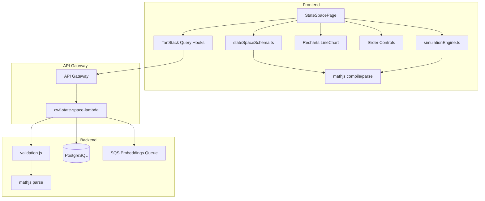
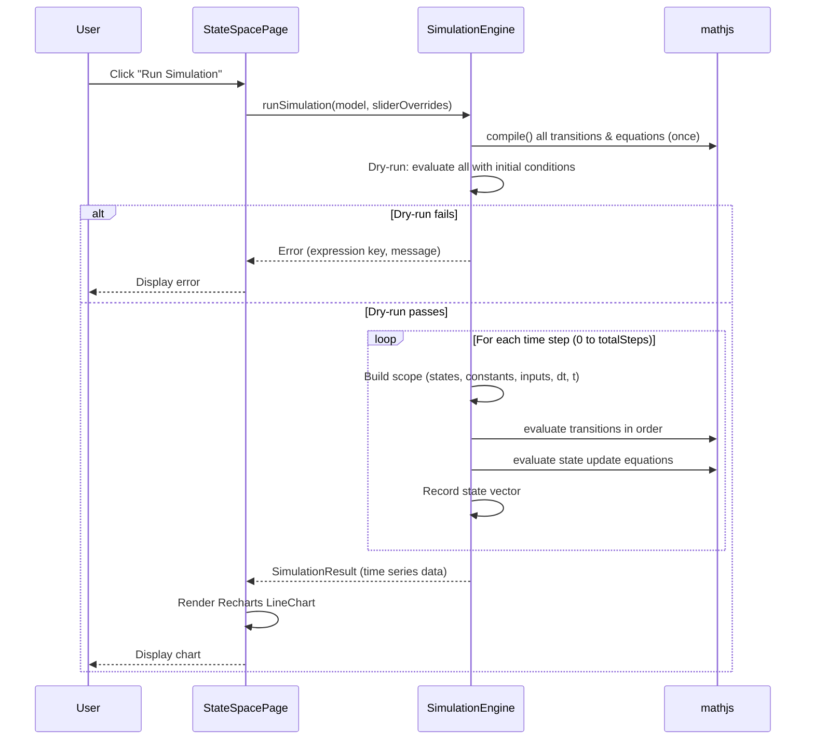
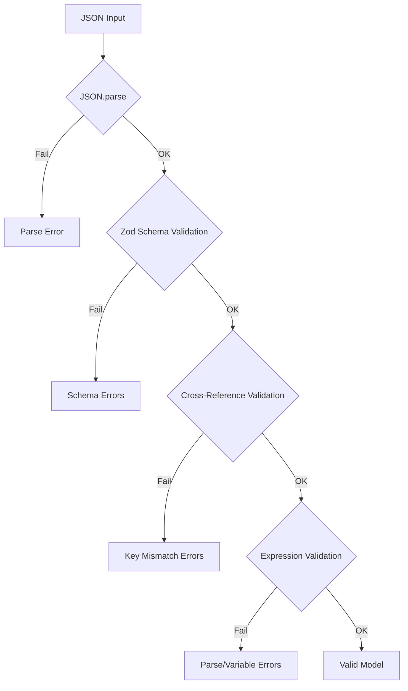

# Design Document: Nonlinear State-Space Simulator

## Overview

This feature replaces the linear A/B/C/D state-space model format with a nonlinear state-space simulator. The existing `stateSpaceSchema.ts`, `StateSpacePage.tsx`, and `validation.js` are rewritten to support a new canonical JSON format with 8 top-level sections: `model_metadata`, `model_description_prompt`, `constants`, `state_definitions`, `input_vectors`, `non_linear_transitions`, `state_update_equations`, and `simulation_config`.

The simulator runs entirely in the browser using `mathjs` compiled expressions and Forward Euler integration. The page is redesigned to display the new format sections, provide interactive sliders for initial conditions and actuator inputs, and render state trajectories on a Recharts line chart. The existing persistence infrastructure (Lambda CRUD, TanStack Query hooks, model library) stays — only the model format and validation change.

### Key Design Decisions

1. **mathjs for expression evaluation**: `mathjs` provides `compile()` for one-time parsing and `evaluate()` with scoped variables. Expressions are compiled once before the simulation loop, then evaluated per time step with an updated scope object. This avoids re-parsing on every step.
2. **Forward Euler only**: Simple `x_next = x + f(x)*dt` integration. No Runge-Kutta or adaptive stepping — keeps the browser-side engine simple and predictable.
3. **Dry-run before full simulation**: A single-step evaluation with initial conditions catches syntax errors, undefined variables, and NaN/Infinity before committing to the full loop.
4. **No migration**: Old linear-format models will fail validation. This is intentional — the formats are fundamentally different.
5. **mathjs added to Lambda**: The Lambda `validation.js` needs `mathjs` for expression syntax validation and variable reference extraction. Added to `lambda/state-space-models/package.json`.
6. **mathjs added to frontend**: `mathjs` is added to the root `package.json` for the simulation engine and frontend expression validation.
7. **Recharts reuse**: `recharts` is already installed (v3.6.0). The line chart uses `LineChart`, `Line`, `XAxis`, `YAxis`, `Tooltip`, `Legend` from recharts.
8. **Slider component**: Uses the existing `@radix-ui/react-slider` (already installed) for initial condition and actuator input sliders.

## Architecture



### Simulation Flow



### Validation Flow (Frontend & Lambda)



## Components and Interfaces

### Modified Files

| File | Change |
|------|--------|
| `src/lib/stateSpaceSchema.ts` | Rewrite: new Zod schemas for nonlinear format, cross-reference validation, expression validation via mathjs |
| `src/pages/StateSpacePage.tsx` | Heavy rewrite: remove matrix/KaTeX display, add nonlinear section display, simulation controls, Recharts chart, sliders |
| `lambda/state-space-models/shared/validation.js` | Rewrite: new validation for nonlinear format, cross-reference checks, mathjs expression parsing |
| `lambda/state-space-models/package.json` | Add `mathjs` dependency |
| `package.json` | Add `mathjs` dependency |
| `src/lib/stateSpaceSchema.test.ts` | Rewrite: unit tests for nonlinear schema |
| `src/lib/stateSpaceSchema.property.test.ts` | Rewrite: property tests with new fast-check arbitraries for nonlinear models |
| `src/components/StateSpaceModelLibrary.tsx` | Minor: display changes for new format (show state count, equation count instead of matrix dimensions) |

### New Files

| File | Purpose |
|------|---------|
| `src/lib/simulationEngine.ts` | Forward Euler simulation engine using mathjs compiled expressions |

### Unchanged Files

| File | Reason |
|------|--------|
| `src/hooks/useStateSpaceModels.ts` | Hooks are model-format-agnostic — they pass `model_definition` as opaque JSONB |
| `src/lib/stateSpaceApi.ts` | API service is format-agnostic — `StateSpaceModel` type import changes but function signatures stay |
| `lambda/state-space-models/index.js` | CRUD logic unchanged — only the `validateStateSpaceModel` call changes (same function name, new implementation) |

### Component Interfaces

#### Schema Validator (`src/lib/stateSpaceSchema.ts`)

```typescript
// Zod schemas for each section
export const modelMetadataSchema: z.ZodObject<...>;
export const constantsSchema: z.ZodRecord<...>;
export const stateDefinitionsSchema: z.ZodRecord<...>;
export const inputVectorsSchema: z.ZodObject<...>;
export const nonLinearTransitionsSchema: z.ZodRecord<...>;
export const stateUpdateEquationsSchema: z.ZodRecord<...>;
export const simulationConfigSchema: z.ZodObject<...>;
export const nonlinearModelSchema: z.ZodObject<...>;

// Inferred types
export type NonlinearModel = z.infer<typeof nonlinearModelSchema>;
// (aliased as StateSpaceModel for backward compat with stateSpaceApi.ts)
export type StateSpaceModel = NonlinearModel;

// Validation
export type ValidationResult =
  | { success: true; model: NonlinearModel }
  | { success: false; errors: string[] };

export function validateStateSpaceJson(jsonString: string): ValidationResult;
export function validateCrossReferences(model: NonlinearModel): string[];
export function validateExpressions(model: NonlinearModel): string[];
```

#### Simulation Engine (`src/lib/simulationEngine.ts`)

```typescript
export interface SimulationResult {
  timePoints: number[];       // time in days
  stateHistory: Record<string, number[]>;  // stateKey -> values at each time point
}

export interface SimulationError {
  expressionKey: string;
  timeStep: number;
  message: string;
}

export type SimulationOutcome =
  | { success: true; result: SimulationResult }
  | { success: false; error: SimulationError };

export function runSimulation(
  model: NonlinearModel,
  initialConditionOverrides?: Record<string, number>,
  actuatorOverrides?: Record<string, number>
): SimulationOutcome;
```

#### StateSpacePage Display Sections

The page renders these sections in order:
1. Model Metadata card (name, version, author, description) — same as before
2. Model Description Prompt card — same as before
3. Constants table (key, name, value, unit)
4. State Definitions table (key, id, name, unit, default_value)
5. Input Vectors section (u_actuators table, v_shocks table)
6. Non-Linear Transitions section (key + expression in monospace)
7. State Update Equations section (key + expression in monospace)
8. Simulation Config card (dt, total_days)
9. Simulation Controls: sliders panel + "Run Simulation" button
10. Recharts LineChart with legend toggle and raw/normalized view toggle


## Data Models

### Nonlinear Model JSON Schema (Canonical Format)

```typescript
interface NonlinearModel {
  model_metadata: {
    name: string;
    version: string;
    author: string;
    description: string;
  };
  model_description_prompt: string;
  constants: Record<string, {
    value: number;
    name: string;
    unit: string;
  }>;
  state_definitions: Record<string, {
    id: string;
    name: string;
    unit: string;
    default_value: number;
  }>;
  input_vectors: {
    u_actuators: Record<string, string>;  // key -> description
    v_shocks: Record<string, string>;     // key -> description
  };
  non_linear_transitions: Record<string, string>;  // key -> mathjs expression
  state_update_equations: Record<string, string>;   // key_next -> mathjs expression
  simulation_config: {
    dt: number;         // time step in hours, positive
    total_days: number; // simulation duration in days, positive
  };
}
```

### Expression Scope (available during evaluation)

At each time step, the mathjs evaluation scope contains:

| Source | Keys | Example |
|--------|------|---------|
| `state_definitions` | State variable keys | `x1`, `x2`, `temperature` |
| `constants` | Constant keys | `k1`, `alpha`, `max_temp` |
| `input_vectors.u_actuators` | Actuator keys | `turning_rate`, `water_flow` |
| `non_linear_transitions` | Transition result keys (evaluated in order) | `growth_rate`, `decay_factor` |
| Built-in | `dt`, `t` | `dt` = time step hours, `t` = current time hours |
| mathjs built-ins | Functions and constants | `exp`, `max`, `min`, `abs`, `sqrt`, `log`, `sin`, `cos`, `tan`, `pow`, `ceil`, `floor`, `round`, `pi`, `e` |

### Cross-Reference Rules

1. Every key `K` in `state_update_equations` must have a corresponding key `K` (without `_next` suffix) in `state_definitions`. E.g., `x1_next` requires `x1` in `state_definitions`.
2. Every key `K` in `state_definitions` must have a corresponding `K_next` in `state_update_equations`.
3. Every variable referenced in a `non_linear_transitions` expression must exist in: constants keys, state_definitions keys, u_actuators keys, v_shocks keys, previously declared transition keys, or built-ins (`dt`, `t`).
4. Every variable referenced in a `state_update_equations` expression must exist in: constants keys, state_definitions keys, u_actuators keys, v_shocks keys, all transition keys, or built-ins (`dt`, `t`).

### Variable Extraction Strategy

To extract variable references from a mathjs expression:
1. Parse the expression with `mathjs.parse(expr)`
2. Walk the AST and collect all `SymbolNode` names
3. Filter out mathjs built-in functions (`exp`, `max`, `min`, `abs`, `sqrt`, `log`, `sin`, `cos`, `tan`, `pow`, `ceil`, `floor`, `round`) and constants (`pi`, `e`)
4. The remaining symbols are variable references that must be resolved against the scope

### Database Impact

No database schema changes. The `model_definition` JSONB column in `state_space_models` stores the new format. The `name`, `description`, `version`, `author` columns are still extracted from `model_metadata` by the Lambda handler — this extraction logic is unchanged.

### Type Compatibility

`src/lib/stateSpaceApi.ts` imports `StateSpaceModel` from `stateSpaceSchema.ts`. The new schema exports `NonlinearModel` and aliases it as `StateSpaceModel` for backward compatibility. The `StateSpaceModelRecord.model_definition` type automatically picks up the new shape.

### Simulation Data Shape

```typescript
// Output of runSimulation — fed directly to Recharts
interface SimulationResult {
  timePoints: number[];  // [0, 0.041, 0.083, ...] in days
  stateHistory: Record<string, number[]>;  // { x1: [100, 99.5, ...], x2: [50, 50.1, ...] }
}

// Recharts data format (transformed from SimulationResult)
type ChartDataPoint = { time: number } & Record<string, number>;
// Example: [{ time: 0, x1: 100, x2: 50 }, { time: 0.041, x1: 99.5, x2: 50.1 }, ...]
```


## Test Fixture: Sapi-an 1-Ton Composting Model

The canonical test model for unit tests and validation. All 12 states are included — states with placeholder identity equations (x6, x8, x9, x10, x11) will have dynamics added in future iterations.

```json
{
  "model_metadata": {
    "name": "sapi-an-1ton-siege",
    "version": "3.0.0",
    "author": "CWF Digital Twin Team",
    "description": "Nonlinear state-space model for Sapi-an 1-ton drum composting biological siege"
  },
  "model_description_prompt": "This model simulates a 1-ton drum composting process at the Sapi-an facility. It tracks temperature, mesophilic and thermophilic microbial populations, sugar and lignin substrate consumption, nitrogen, moisture, oxygen, bio-availability, inert mass, drum capacity, and material volume over a 14-day composting cycle. The model captures nonlinear microbial growth kinetics with Gaussian temperature-dependent growth rates, Monod-type nutrient limitation, and lignin softening transitions. Operator inputs are fan duty cycle (aeration) and drum motor rotation.",
  "constants": {
    "h_m": { "value": 4800, "name": "Mesophilic Heat Generation", "unit": "J/kg" },
    "h_t": { "value": 7800, "name": "Thermophilic Heat Generation", "unit": "J/kg" },
    "C_th": { "value": 3.8, "name": "Thermal Capacity", "unit": "kJ/(kg·°C)" },
    "k_loss_ambient": { "value": 0.08, "name": "Ambient Heat Loss Coefficient", "unit": "1/hr" },
    "k_loss_active": { "value": 1.0, "name": "Active Aeration Heat Loss Coefficient", "unit": "1/hr" },
    "mu_max_m": { "value": 0.22, "name": "Max Mesophilic Growth Rate", "unit": "1/hr" },
    "mu_max_t": { "value": 0.35, "name": "Max Thermophilic Growth Rate", "unit": "1/hr" },
    "K_o": { "value": 0.1, "name": "Oxygen Half-Saturation", "unit": "kg" },
    "K_s": { "value": 8.0, "name": "Sugar Half-Saturation", "unit": "kg" },
    "K_n": { "value": 1.0, "name": "Nitrogen Half-Saturation", "unit": "kg" },
    "k_soft": { "value": 0.5, "name": "Lignin Softening Rate", "unit": "1/°C" },
    "Y_s": { "value": 0.4, "name": "Sugar Yield Coefficient", "unit": "kg/kg" },
    "Y_l": { "value": 0.3, "name": "Lignin Yield Coefficient", "unit": "kg/kg" },
    "k_evap": { "value": 0.03, "name": "Moisture Evaporation Coefficient", "unit": "kg/(hr·°C)" },
    "k_settle": { "value": 0.015, "name": "Volume Settling Coefficient", "unit": "m³/hr" },
    "t_amb": { "value": 30.0, "name": "Ambient Temperature", "unit": "°C" }
  },
  "state_definitions": {
    "x1": { "id": "t_k", "name": "Core Temperature", "unit": "°C", "default_value": 30.0 },
    "x2": { "id": "m_meso", "name": "Mesophilic Mass", "unit": "kg", "default_value": 0.8 },
    "x3": { "id": "m_thermo", "name": "Thermophilic Mass", "unit": "kg", "default_value": 0.005 },
    "x4": { "id": "s_k", "name": "Sugar Mass", "unit": "kg", "default_value": 160.0 },
    "x5": { "id": "l_k", "name": "Lignin Mass", "unit": "kg", "default_value": 350.0 },
    "x6": { "id": "n_k", "name": "Nitrogen Mass", "unit": "kg", "default_value": 18.0 },
    "x7": { "id": "w_k", "name": "Water Mass", "unit": "kg", "default_value": 500.0 },
    "x8": { "id": "o_mass", "name": "Oxygen Mass", "unit": "kg", "default_value": 2.0 },
    "x9": { "id": "alpha_k", "name": "Bio-Availability", "unit": "ratio", "default_value": 0.1 },
    "x10": { "id": "i_k", "name": "Inert Mass", "unit": "kg", "default_value": 100.0 },
    "x11": { "id": "v_drum", "name": "Drum Capacity", "unit": "m³", "default_value": 1.8 },
    "x12": { "id": "v_k", "name": "Material Volume", "unit": "m³", "default_value": 1.5 }
  },
  "input_vectors": {
    "u_actuators": {
      "u_fan": "Fan duty cycle [0,1]",
      "u_motor": "Drum motor rotation toggle [0,1]"
    },
    "v_shocks": {
      "delta_x": "AI-inferred correction vector from user observations"
    }
  },
  "non_linear_transitions": {
    "total_mass_M": "x2 + x3 + x4 + x5 + x6 + x7 + x10",
    "rho_bulk": "total_mass_M / x12",
    "phi_lim": "(x8 / (K_o + x8)) * (x4 / (K_s + x4)) * (x6 / (K_n + x6))",
    "psi_soft": "1 / (1 + exp(-k_soft * (x1 - 55)))",
    "mu_m": "mu_max_m * exp(-(x1 - 35)^2 / (2 * 64))",
    "mu_t": "mu_max_t * exp(-(x1 - 60)^2 / (2 * 100))",
    "dm": "0.02 + max(0, 0.25 * (x1 - 44))",
    "death_rate_t": "0.02 + max(0, 0.4 * (x1 - 75))",
    "k_now": "k_loss_ambient + (k_loss_active - k_loss_ambient) * u_fan"
  },
  "state_update_equations": {
    "x1_next": "max(x1 + dt * ((h_m * x2 + h_t * x3) / (C_th * rho_bulk) - k_now * u_fan * (x1 - t_amb)), t_amb)",
    "x2_next": "max(x2 + dt * (mu_m * phi_lim * x2 - dm * x2), 0.0001)",
    "x3_next": "max(x3 + dt * (mu_t * phi_lim * x3 - death_rate_t * x3), 0.005)",
    "x4_next": "max(x4 - dt * ((1 / Y_s) * mu_m * phi_lim * x2), 0)",
    "x5_next": "max(x5 - dt * ((1 / Y_l) * mu_t * phi_lim * x3 * x9 * psi_soft), 0)",
    "x6_next": "x6",
    "x7_next": "max(x7 - dt * (k_evap * u_fan * (x1 - t_amb)), 0.1)",
    "x8_next": "x8",
    "x9_next": "x9",
    "x10_next": "x10",
    "x11_next": "x11",
    "x12_next": "max(x12 - dt * (k_settle * u_motor + 0.002 * abs((1 / Y_s) * mu_m * phi_lim * x2 + (1 / Y_l) * mu_t * phi_lim * x3 * x9 * psi_soft)), 0.1)"
  },
  "simulation_config": {
    "dt": 0.05,
    "total_days": 14
  }
}
```


## Correctness Properties

*A property is a characteristic or behavior that should hold true across all valid executions of a system — essentially, a formal statement about what the system should do. Properties serve as the bridge between human-readable specifications and machine-verifiable correctness guarantees.*

### Property 1: Schema validation accepts valid nonlinear models and rejects invalid ones

*For any* well-formed `NonlinearModel` object (with all 8 required top-level sections, correct field types, positive `dt` and `total_days`), the Schema_Validator should accept it. *For any* JSON object missing required sections, having wrong field types, or containing extra/old-format fields (`state_space`, `dimensions`, `matrices`), the Schema_Validator should reject it with at least one descriptive error message.

**Validates: Requirements 1.1, 1.2, 1.3, 1.4, 1.5, 1.6, 1.7, 1.8, 1.9, 1.10, 1.11, 9.4, 10.2, 10.3**

### Property 2: Cross-reference key consistency

*For any* `NonlinearModel`, every key `K_next` in `state_update_equations` must have a corresponding key `K` in `state_definitions`, and every key `K` in `state_definitions` must have a corresponding `K_next` in `state_update_equations`. *For any* model where these sets don't match bidirectionally, the validator should return errors identifying the orphaned or missing keys.

**Validates: Requirements 2.1, 2.2, 2.3**

### Property 3: Expression parseability

*For any* `NonlinearModel` where all expression strings in `non_linear_transitions` and `state_update_equations` are valid mathjs syntax, expression validation should pass. *For any* model containing an expression with a syntax error (unbalanced parentheses, invalid operators), expression validation should fail and identify the offending expression key.

**Validates: Requirements 2.4, 2.5**

### Property 4: Variable reference resolution

*For any* `NonlinearModel` where all variables referenced in expressions exist in the valid scope (constants, state_definitions, u_actuators, v_shocks, previously declared transitions for transitions / all transitions for equations, `dt`, `t`, and mathjs built-ins), variable validation should pass. *For any* model where an expression references a variable not in any valid scope, validation should fail and identify the expression key and undefined variable name.

**Validates: Requirements 3.2, 3.3, 3.4**

### Property 5: JSON round-trip

*For any* valid `NonlinearModel` object, `JSON.parse(JSON.stringify(model))` should produce a deep-equal object. This ensures numeric precision is preserved through serialization and the JSONB storage path does not corrupt model data.

**Validates: Requirements 10.5, 7.10**

### Property 6: Forward Euler single-step correctness

*For any* valid `NonlinearModel` with constant expressions (e.g., state update equations that are simple arithmetic on known values), running the simulation for one time step should produce a next-state vector that equals the initial state plus the evaluated expressions times `dt`, matching the Forward Euler formula `x_next = x + f(x) * dt`.

**Validates: Requirements 4.1**

### Property 7: Simulation output length

*For any* valid `NonlinearModel` with `simulation_config.dt` and `simulation_config.total_days`, the simulation output should contain exactly `Math.floor((total_days * 24) / dt) + 1` time points (including the initial state at t=0), and each state variable's history array should have the same length as the time points array.

**Validates: Requirements 4.4, 4.5**

### Property 8: Initial condition overrides

*For any* valid `NonlinearModel` and any subset of state variable keys with override values, the first entry in each state's history should equal the override value if provided, or the `default_value` from `state_definitions` if not overridden.

**Validates: Requirements 4.6**

### Property 9: Dry-run catches expression errors before full simulation

*For any* `NonlinearModel` where an expression references an undefined variable or produces NaN/Infinity when evaluated with initial conditions, calling `runSimulation` should return a failure result without producing any trajectory data, and the error should identify the failing expression key.

**Validates: Requirements 5.1, 5.2, 5.3**

### Property 10: NaN/Infinity halts simulation mid-run

*For any* `NonlinearModel` where expressions are valid at t=0 but produce NaN or Infinity at some later time step (e.g., exponential blowup), the simulation should stop at the offending time step and return an error identifying the expression key and the time step where the error occurred.

**Validates: Requirements 11.5**

### Property 11: Normalization bounds

*For any* simulation result with at least two distinct values per state variable, the normalized view should map all values to the range [0, 100], where the minimum observed value maps to 0 and the maximum maps to 100. *For any* state variable with a constant value (min equals max), the normalized value should be 50 (midpoint).

**Validates: Requirements 6.4**


## Error Handling

### Frontend Validation Errors

When `validateStateSpaceJson` fails at any phase:
- Phase 1 (empty input): Return `{ success: false, errors: ['JSON input is required.'] }`
- Phase 2 (JSON parse): Return `{ success: false, errors: [syntaxError.message] }`
- Phase 3 (Zod schema): Return `{ success: false, errors: [...zodIssues] }` with paths
- Phase 4 (cross-reference): Return `{ success: false, errors: [...keyMismatchErrors] }`
- Phase 5 (expression validation): Return `{ success: false, errors: [...parseErrors, ...undefinedVarErrors] }`

All errors are collected per phase — if a phase fails, subsequent phases are skipped.

### Simulation Errors

The simulation engine returns a discriminated union:
- **Dry-run failure**: `{ success: false, error: { expressionKey, timeStep: 0, message } }`
- **Mid-simulation NaN/Infinity**: `{ success: false, error: { expressionKey, timeStep: N, message } }`
- **Success**: `{ success: true, result: { timePoints, stateHistory } }`

The page displays simulation errors in a destructive Card above the chart area, showing the expression key and time step.

### Lambda Validation Errors (400)

When `validateStateSpaceModel` fails on POST or PUT:
- Return HTTP 400 with `{ error: 'Validation failed', errors: [...allErrors] }`
- Follows the existing error response format in `index.js`
- Includes schema errors, cross-reference errors, and expression parse errors

### Existing Error Handling (Unchanged)

- 401 (missing organization_id), 404 (model not found), 409 (duplicate), 500 (unexpected) — all unchanged from the persistence spec
- Frontend toast notifications for save/delete failures — unchanged
- TanStack Query retry logic — unchanged

## Testing Strategy

### Property-Based Testing

Use `fast-check` (v4.6.0, already installed) as the property-based testing library.

Each property test must:
- Run a minimum of 100 iterations
- Reference its design document property in a comment tag
- Use `fast-check` arbitraries to generate random valid and invalid models

Tag format: **Feature: nonlinear-state-space-simulator, Property {number}: {property_text}**

Each correctness property MUST be implemented by a SINGLE property-based test.

#### Custom Arbitraries Needed

```typescript
// Generate valid identifier strings (alphanumeric, starting with letter)
function arbIdentifier(): fc.Arbitrary<string>;

// Generate valid model_metadata
function arbValidModelMetadata(): fc.Arbitrary<ModelMetadata>;

// Generate valid constants record with N entries
function arbConstants(n?: number): fc.Arbitrary<Record<string, { value: number; name: string; unit: string }>>;

// Generate valid state_definitions record with N entries
function arbStateDefinitions(n?: number): fc.Arbitrary<Record<string, { id: string; name: string; unit: string; default_value: number }>>;

// Generate valid input_vectors
function arbInputVectors(): fc.Arbitrary<{ u_actuators: Record<string, string>; v_shocks: Record<string, string> }>;

// Generate valid non_linear_transitions that only reference valid scope variables
function arbTransitions(scope: string[]): fc.Arbitrary<Record<string, string>>;

// Generate valid state_update_equations matching state_definitions keys
function arbStateUpdateEquations(stateKeys: string[], scope: string[]): fc.Arbitrary<Record<string, string>>;

// Generate valid simulation_config
function arbSimulationConfig(): fc.Arbitrary<{ dt: number; total_days: number }>;

// Compose a full valid NonlinearModel
function arbValidNonlinearModel(): fc.Arbitrary<NonlinearModel>;

// Generate invalid models via corruption strategies
function arbInvalidNonlinearModel(): fc.Arbitrary<unknown>;
```

#### Expression Generation Strategy

Generating valid mathjs expressions is non-trivial. The strategy:
1. Define a small set of expression templates: `"K1 * V1 + K2"`, `"V1 + V2 * dt"`, `"max(V1, 0)"`, `"V1 * (1 - V1 / K1)"`
2. Substitute template variables with randomly chosen scope variables and constants
3. This ensures generated expressions are always syntactically valid and reference only in-scope variables

#### Property Tests to Implement

| Property | Test File | Strategy |
|----------|-----------|----------|
| P1: Schema validation | `stateSpaceSchema.property.test.ts` | Generate valid models → pass. Generate invalid models (missing sections, wrong types, old format) → fail with errors. |
| P2: Cross-reference keys | `stateSpaceSchema.property.test.ts` | Generate models with matching keys → pass. Generate models with orphaned/missing equation keys → fail. |
| P3: Expression parseability | `stateSpaceSchema.property.test.ts` | Generate models with valid expressions → pass. Generate models with syntax errors → fail. |
| P4: Variable references | `stateSpaceSchema.property.test.ts` | Generate models with all variables in scope → pass. Generate models with undefined variables → fail. |
| P5: JSON round-trip | `stateSpaceSchema.property.test.ts` | Generate valid models → stringify → parse → deep equal. |
| P6: Forward Euler step | `simulationEngine.property.test.ts` | Generate simple models (linear expressions) → run 1 step → verify x_next = x + f(x)*dt. |
| P7: Output length | `simulationEngine.property.test.ts` | Generate valid models with various dt/total_days → verify output array lengths. |
| P8: Initial overrides | `simulationEngine.property.test.ts` | Generate models + random overrides → verify first state entry matches. |
| P9: Dry-run errors | `simulationEngine.property.test.ts` | Generate models with bad expressions → verify failure before any trajectory. |
| P10: NaN/Infinity halt | `simulationEngine.property.test.ts` | Generate models with expressions that blow up (e.g., `exp(1000 * t)`) → verify halt with error. |
| P11: Normalization | `simulationEngine.property.test.ts` | Generate random trajectories → normalize → verify [0, 100] bounds. |

### Unit Testing

Unit tests complement property tests for specific examples and edge cases:

**Schema tests (`stateSpaceSchema.test.ts`)**:
- Validate a complete example nonlinear model (composting drum example)
- Reject old linear format with `state_space.dimensions.matrices`
- Reject model with orphaned equation key (e.g., `x3_next` without `x3` in state_definitions)
- Reject model with missing equation (e.g., `x1` in state_definitions but no `x1_next`)
- Reject model with unparseable expression (e.g., `"x1 ** x2"` — invalid in mathjs)
- Reject model with undefined variable reference
- Validate empty constants/input_vectors (valid — they're optional records)
- Reject negative `dt` or `total_days`

**Simulation tests (`simulationEngine.test.ts`)**:
- Run a known 2-state linear model and verify trajectory against hand-computed values
- Verify dry-run catches division by zero
- Verify simulation stops on exponential blowup
- Verify actuator input values appear in expression scope
- Verify transition ordering (later transitions can reference earlier ones)

### Test Configuration

```typescript
// Property test configuration
import fc from 'fast-check';

fc.assert(
  fc.property(arbValidNonlinearModel(), (model) => {
    // Feature: nonlinear-state-space-simulator, Property 1: Schema validation
    const result = validateStateSpaceJson(JSON.stringify(model));
    return result.success === true;
  }),
  { numRuns: 100 }
);
```

### New Dependencies

| Package | Where | Purpose |
|---------|-------|---------|
| `mathjs` | `package.json` (frontend) | Expression compilation and evaluation for simulation engine + frontend validation |
| `mathjs` | `lambda/state-space-models/package.json` | Expression syntax validation and variable extraction in Lambda |

