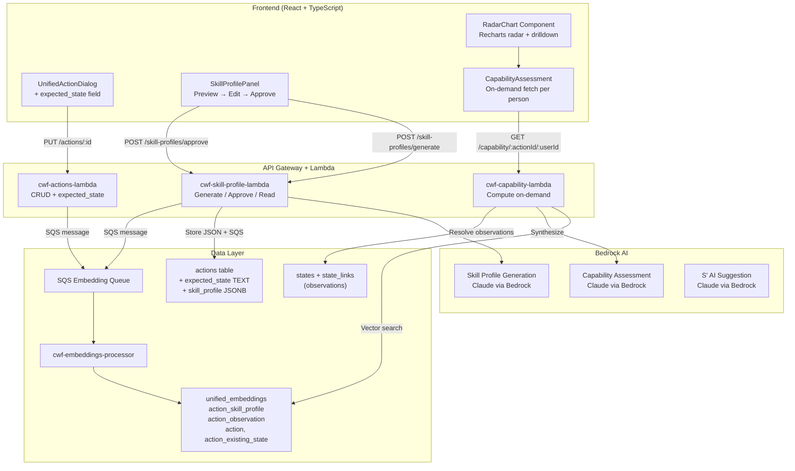
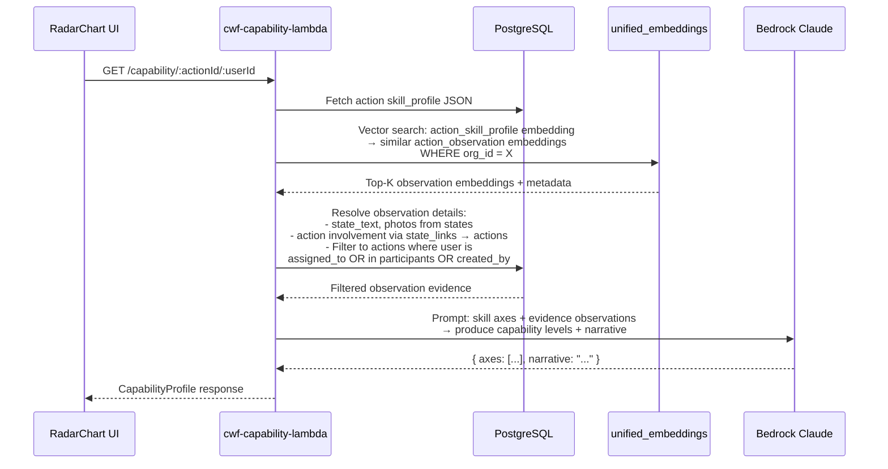
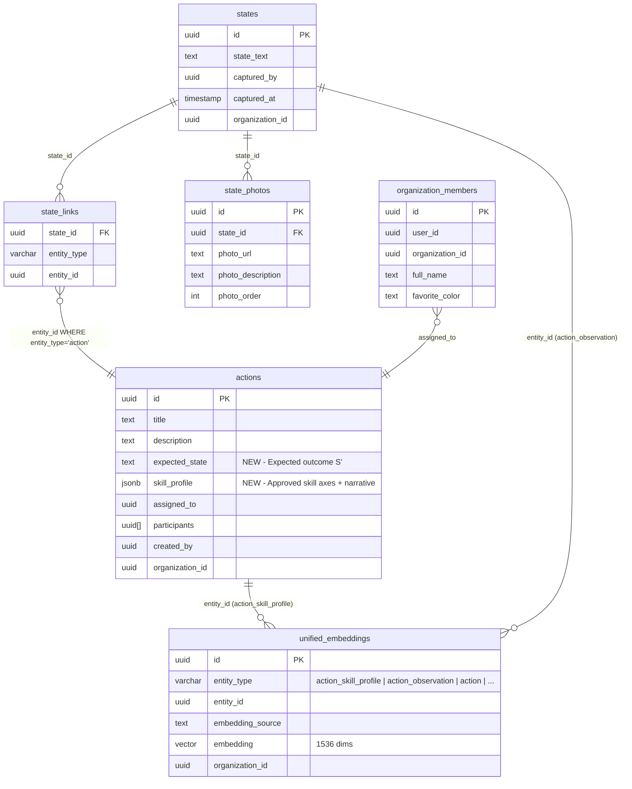

# Design Document: Observation-Based Training

## Overview

This feature adds an observation-driven skill assessment and transparency layer to CWF's action system. It introduces an `expected_state` field on actions, AI-generated skill profiles per action, on-demand capability assessment for people involved in actions, and radar chart visualization — all powered by the existing unified embeddings infrastructure and Bedrock AI.

The system follows a **transparency over recommendation** principle: it surfaces what an action demands and what each person has demonstrated, but never ranks, recommends, or blocks. Humans make assignment decisions with full context.

Key architectural decisions:
- **Skill profiles** are stored as JSON on the `actions` table and embedded in `unified_embeddings` with entity_type `action_skill_profile`
- **Capability profiles** are computed on-demand via Bedrock AI — never stored as static scores
- **Observations** (already stored as `states` linked via `state_links`) get embedded as `action_observation` in `unified_embeddings` and serve as skill evidence
- **Radar charts** render client-side using the action's skill axes with unlimited person overlays
- The system is **role-agnostic** — assigned workers, participants, and creators are all assessed identically

## Architecture



### Request Flow: Capability Assessment



## Components and Interfaces

### 1. Database Schema Changes

#### `actions` table additions

| Column | Type | Nullable | Default | Description |
|--------|------|----------|---------|-------------|
| `expected_state` | `TEXT` | YES | NULL | Expected outcome (S') for the action |
| `skill_profile` | `JSONB` | YES | NULL | Approved skill profile (axes, levels, narrative) |

No new tables are created. The `unified_embeddings` table gains two new entity_type values: `action_skill_profile` and `action_observation`.

### 2. Skill Profile JSON Schema

Stored in `actions.skill_profile`:

```json
{
  "narrative": "This action requires understanding of concrete chemistry, physical stamina for mixing and pouring, and precision in measuring water-to-cement ratios...",
  "axes": [
    { "key": "chemistry_understanding", "label": "Chemistry Understanding", "required_level": 0.7 },
    { "key": "physical_technique", "label": "Physical Technique", "required_level": 0.8 },
    { "key": "equipment_operation", "label": "Equipment Operation", "required_level": 0.6 },
    { "key": "safety_awareness", "label": "Safety Awareness", "required_level": 0.9 },
    { "key": "quality_assessment", "label": "Quality Assessment", "required_level": 0.5 }
  ],
  "generated_at": "2025-01-15T10:30:00Z",
  "approved_at": "2025-01-15T10:35:00Z",
  "approved_by": "user-uuid"
}
```

### 3. Capability Profile Response Schema

Returned by the capability Lambda (not stored):

```json
{
  "user_id": "user-uuid",
  "user_name": "John Doe",
  "action_id": "action-uuid",
  "narrative": "John has demonstrated strong physical technique across 12 relevant observations, with consistent quality in concrete work...",
  "axes": [
    {
      "key": "chemistry_understanding",
      "label": "Chemistry Understanding",
      "level": 0.4,
      "evidence_count": 3,
      "evidence": [
        {
          "observation_id": "state-uuid",
          "action_id": "past-action-uuid",
          "action_title": "Pour foundation for chicken coop",
          "text_excerpt": "Mixed cement at 3:1 ratio, good consistency...",
          "photo_urls": ["https://..."],
          "captured_at": "2025-01-10T14:00:00Z",
          "relevance_score": 0.87
        }
      ]
    }
  ],
  "total_evidence_count": 18,
  "computed_at": "2025-01-15T10:40:00Z"
}
```

### 4. New Lambda Functions

#### `cwf-skill-profile-lambda`

Handles skill profile generation and approval.

**Endpoints:**

| Method | Path | Description |
|--------|------|-------------|
| POST | `/api/skill-profiles/generate` | Generate a skill profile preview (not stored) |
| POST | `/api/skill-profiles/approve` | Approve and store a skill profile + queue embedding |
| DELETE | `/api/skill-profiles/:actionId` | Remove a skill profile from an action |

**Generate request body:**
```json
{
  "action_id": "uuid",
  "action_context": {
    "title": "Pour concrete foundation",
    "description": "Build 10x12 foundation for new storage shed",
    "expected_state": "Level, crack-free foundation cured for 7 days",
    "policy": "Follow standard concrete mixing ratios...",
    "asset_name": "Storage Shed",
    "required_tools": ["Concrete mixer", "Level", "Trowel"]
  }
}
```

**Generate response:** Returns the skill profile JSON (same schema as stored) without `approved_at`/`approved_by`. This is a preview — nothing is persisted.

**Approve request body:**
```json
{
  "action_id": "uuid",
  "skill_profile": { /* edited profile from preview */ },
  "approved_by": "user-uuid"
}
```

**Approve handler:**
1. Validates the profile structure (4-6 axes, levels in 0.0-1.0)
2. Adds `approved_at` timestamp and `approved_by`
3. Stores profile as JSONB in `actions.skill_profile`
4. Composes embedding source from the narrative + axis labels
5. Sends SQS message with `entity_type: 'action_skill_profile'`, `entity_id: action.id`

#### `cwf-capability-lambda`

Computes on-demand capability profiles.

**Endpoints:**

| Method | Path | Description |
|--------|------|-------------|
| GET | `/api/capability/:actionId/:userId` | Compute capability for one person |
| GET | `/api/capability/:actionId/organization` | Compute organization capability |

**Capability computation flow:**

1. Fetch the action's `skill_profile` JSON and its `action_skill_profile` embedding from `unified_embeddings`
2. Vector search `unified_embeddings` for `action_observation` entries similar to the skill profile embedding, scoped by `organization_id`
3. For individual: filter observations to actions where the user is `assigned_to`, in `participants`, or is `created_by`
4. For organization: no person filter — aggregate all observations
5. Resolve observation details from `states` + `state_photos` + `state_links`
6. Apply recency weighting: observations from the last 30 days get full weight, 30-90 days get 0.7x, 90-180 days get 0.4x, older get 0.2x
7. Send evidence + skill axes to Bedrock Claude with a structured prompt
8. Return the capability profile response

### 5. Frontend Components

#### `ExpectedStateField`

A new field in `UnifiedActionDialog` — a `Textarea` with label "Where we want to get to" and an AI-generate button (Sparkles icon). Positioned after the description field and before the policy field.

The AI-generate button calls the existing Maxwell AI pattern: sends the action's title + description + context to Bedrock and populates the field with a suggested S'. The user can accept, edit, or clear.

#### `SkillProfilePanel`

A collapsible panel within the action detail view. States:
- **Empty**: "Generate Skill Profile" button (disabled if no title/description/S')
- **Preview**: Shows generated profile with editable narrative and axes. "Approve" and "Discard" buttons.
- **Approved**: Shows the stored profile with axes rendered as a mini radar preview. "Regenerate" option.

#### `RadarChart`

Built with [Recharts](https://recharts.org/) `RadarChart` component (already a common React charting library).

- Action requirements polygon: dashed line, neutral color
- Person polygons: solid lines, colors from the person's `favorite_color` in `organization_members` (falling back to a palette)
- Organization polygon: dotted line, distinct color
- Gap highlighting: when a person's level is > 0.3 below the requirement, the gap area between the two polygons on that axis is filled with a semi-transparent red
- Axis labels are clickable — clicking opens a drilldown popover showing the evidence for that axis

#### `AxisDrilldown`

A popover/sheet that appears when clicking a radar chart axis. Shows:
- The person's score and the requirement level for that axis
- A list of contributing observations with:
  - Observation text excerpt
  - Thumbnail photos (using existing `getThumbnailUrl`)
  - Link to the source action
  - Relevance score
  - Capture date
- The AI's reasoning summary for the score

### 6. Embedding Pipeline Extensions

The existing SQS → `cwf-embeddings-processor` pipeline handles new entity types:

| entity_type | Source | Trigger |
|-------------|--------|---------|
| `action_skill_profile` | Skill narrative + axis labels | Skill profile approval |
| `action_observation` | State text + photo descriptions | Observation creation (already `state` type — needs new type) |

**Key change for observations:** Currently, observations are embedded as entity_type `state`. For this feature, observations linked to actions also need an `action_observation` embedding. The states Lambda will send an additional SQS message with `entity_type: 'action_observation'` when the state is linked to an action via `state_links`.

The `composeActionEmbeddingSource` function is updated to include `expected_state` in the embedding composition.

## Data Models

### Entity Relationship (New Elements)



### Data Flow: Observation → Skill Evidence

1. User captures observation on action → `states` + `state_links` (entity_type='action') created
2. States Lambda sends SQS: `{ entity_type: 'state', entity_id: state.id, ... }` (existing)
3. States Lambda sends additional SQS: `{ entity_type: 'action_observation', entity_id: state.id, ... }` (new)
4. Embeddings processor generates embedding and writes to `unified_embeddings`
5. On next radar chart render, capability Lambda finds this observation via vector similarity search

### Data Flow: Skill Profile Generation → Storage

1. User clicks "Generate Skill Profile" → frontend sends action context to skill-profile Lambda
2. Lambda calls Bedrock Claude with structured prompt → returns preview JSON
3. User reviews, edits axes/narrative, clicks "Approve"
4. Lambda stores JSON in `actions.skill_profile`, sends SQS for `action_skill_profile` embedding
5. Embeddings processor generates embedding from narrative + axis labels → `unified_embeddings`

### Migration SQL

```sql
-- Add expected_state and skill_profile columns to actions
ALTER TABLE actions ADD COLUMN IF NOT EXISTS expected_state TEXT;
ALTER TABLE actions ADD COLUMN IF NOT EXISTS skill_profile JSONB;

-- Add comments for documentation
COMMENT ON COLUMN actions.expected_state IS 'Expected outcome (S'') - where we want to get to';
COMMENT ON COLUMN actions.skill_profile IS 'AI-generated, human-approved skill requirements profile (axes, levels, narrative)';
```

No new indexes are needed — the `unified_embeddings` table already has indexes on `(entity_type, entity_id, model_version)` and the vector column for similarity search.

## Correctness Properties

*A property is a characteristic or behavior that should hold true across all valid executions of a system — essentially, a formal statement about what the system should do. Properties serve as the bridge between human-readable specifications and machine-verifiable correctness guarantees.*

### Property 1: Expected state round-trip

*For any* valid string value, storing it as `expected_state` on an action and then reading the action back should return the identical string. Actions saved without an `expected_state` should return null for that field.

**Validates: Requirements 1.3**

### Property 2: Embedding composition includes expected state

*For any* action object that has a non-empty `expected_state`, the output of `composeActionEmbeddingSource` should contain the `expected_state` text as a substring.

**Validates: Requirements 1.6**

### Property 3: Skill profile structure validity

*For any* valid action context (with at least one of title, description, or expected_state non-empty), the generated skill profile should contain a non-empty narrative string and between 4 and 6 axes, where each axis has a non-empty `key`, a non-empty `label`, and a `required_level` in the range [0.0, 1.0].

**Validates: Requirements 2.1, 2.2**

### Property 4: Profile not stored before approval

*For any* skill profile generation request, after the generate endpoint returns a preview but before the approve endpoint is called, the action's `skill_profile` column should remain null and no `action_skill_profile` entry should exist in `unified_embeddings` for that action.

**Validates: Requirements 2.5**

### Property 5: Approval stores profile and queues embedding

*For any* valid skill profile that is approved, the action's `skill_profile` JSONB column should contain the approved profile (with matching axes and narrative), and an SQS message should be sent with `entity_type: 'action_skill_profile'` and `entity_id` equal to the action's ID.

**Validates: Requirements 2.6**

### Property 6: Capability profile axes match skill profile

*For any* action with an approved skill profile and any involved person, the computed capability profile should have exactly the same axis keys as the skill profile, and each axis level should be in the range [0.0, 1.0].

**Validates: Requirements 3.1, 3.4**

### Property 7: Evidence inclusion is role-agnostic

*For any* person and any action, the set of observations retrieved as evidence should be identical regardless of whether the person is the `assigned_to`, a member of `participants`, or the `created_by` on the actions where those observations were captured. The evidence filter should include observations from all actions where the person was involved in any capacity.

**Validates: Requirements 3.3, 3.9**

### Property 8: Recency weighting

*For any* two observations with different `captured_at` timestamps where one is more recent than the other, the more recent observation should receive a weight greater than or equal to the older observation's weight. The weighting function should be monotonically non-decreasing with recency.

**Validates: Requirements 3.6**

### Property 9: No evidence yields zero scores

*For any* action with an approved skill profile and any person who has no observations on any semantically similar actions, the computed capability profile should have all axis levels equal to 0.0 and a narrative indicating no relevant evidence was found.

**Validates: Requirements 3.8**

### Property 10: Gap detection threshold

*For any* pair of requirement level and capability level where `requirement - capability > 0.3`, the gap detection function should return true (gap highlighted). For any pair where `requirement - capability <= 0.3`, it should return false.

**Validates: Requirements 4.5**

### Property 11: Observation creates action_observation embedding

*For any* observation (state) that is linked to an action via `state_links` with `entity_type='action'`, the system should send an SQS message with `entity_type: 'action_observation'` and `entity_id` equal to the state's ID, in addition to the existing `state` embedding message.

**Validates: Requirements 5.1**

### Property 12: Multi-tenant isolation

*For any* capability query (individual or organization), the observations retrieved as evidence should all have an `organization_id` matching the querying action's `organization_id`. No observations from other organizations should ever appear in the evidence set.

**Validates: Requirements 5.6, 6.6**

### Property 13: Organization profile aggregates all members

*For any* action with an approved skill profile, the organization capability profile should include evidence from observations across all organization members — the evidence set for the organization profile should be a superset of (or equal to) the union of evidence sets for all individual members.

**Validates: Requirements 6.1, 6.3**

## Error Handling

### Skill Profile Generation Errors

| Scenario | Handling |
|----------|----------|
| Action has no title, description, or expected_state | Return 400 with message "Insufficient context to generate skill profile. Add a title, description, or expected state." |
| Bedrock AI call fails or times out | Return 503 with message "AI service temporarily unavailable. Please try again." Frontend shows toast with retry option. |
| AI returns malformed profile (wrong number of axes, levels out of range) | Lambda validates and retries once with a stricter prompt. If still invalid, return 500 with message "Failed to generate valid profile." |
| Approval with invalid profile structure | Return 400 with validation errors (e.g., "axes must have 4-6 items", "levels must be between 0.0 and 1.0") |

### Capability Assessment Errors

| Scenario | Handling |
|----------|----------|
| Action has no approved skill profile | Return 404 with message "No skill profile found for this action. Generate and approve one first." |
| No skill profile embedding exists in unified_embeddings | Return 500 — this indicates a pipeline failure. Log error for investigation. |
| Person has no relevant observations | Return 200 with all axes at 0.0 and narrative "No relevant evidence found." (Not an error — valid state.) |
| Bedrock AI call fails during capability synthesis | Return 503 with message "AI service temporarily unavailable." Frontend shows cached data if available or a retry option. |
| Vector search returns no results | Return 200 with zero scores — same as no relevant observations. |

### Embedding Pipeline Errors

| Scenario | Handling |
|----------|----------|
| SQS message send fails | Log error, do not block the primary operation (fire-and-forget pattern, consistent with existing behavior). Embedding will be missing until next update triggers a retry. |
| Embeddings processor fails for action_observation | SQS retry policy handles retries. After DLQ, the observation exists but won't appear in capability searches until reprocessed. |
| Embedding dimension mismatch | Embeddings processor logs error and throws (existing behavior). SQS retries. |

### Frontend Error Handling

- All AI-dependent operations show loading states with timeout handling (30-second timeout)
- Failed capability fetches show "Unable to load capability profile" with a retry button
- Radar chart gracefully handles missing data — renders only the polygons that have data
- Skill profile preview failures show a toast with "Generation failed — try again" and don't affect the action form

## Testing Strategy

### Property-Based Tests (Vitest + fast-check)

Property-based tests use [fast-check](https://github.com/dubzzz/fast-check) with Vitest. Each property test runs a minimum of 100 iterations.

**Target properties:**
- Property 1: `composeActionEmbeddingSource` round-trip with `expected_state`
- Property 2: Embedding composition includes `expected_state`
- Property 3: Skill profile validation (structure, axes count, level ranges)
- Property 6: Capability response axes match skill profile axes
- Property 7: Evidence filter role-agnosticism
- Property 8: Recency weighting monotonicity
- Property 9: Zero scores for no evidence
- Property 10: Gap detection threshold function
- Property 12: Organization ID scoping in queries
- Property 13: Organization profile superset property

### Unit Tests (Vitest)

- `composeActionEmbeddingSource` with `expected_state` field
- Skill profile JSON validation function
- Gap detection function (threshold = 0.3)
- Recency weight calculation function
- Capability Lambda request validation
- Skill profile Lambda request validation
- Error responses for insufficient context (Requirement 2.7)
- Radar chart data transformation (API response → Recharts format)

### Integration Tests

- Skill profile generate → approve → embedding pipeline flow
- Observation creation → `action_observation` embedding generation
- Capability computation with real vector search (test database)
- Organization capability aggregation
- Multi-tenant isolation (cross-org queries return no results)

### Frontend Component Tests (Vitest + React Testing Library)

- `ExpectedStateField` renders with label and AI-generate button
- `SkillProfilePanel` state transitions (empty → preview → approved)
- `RadarChart` renders correct number of polygons
- `AxisDrilldown` shows evidence on click
- Gap highlighting appears when threshold exceeded
- Loading and error states for all AI-dependent components
