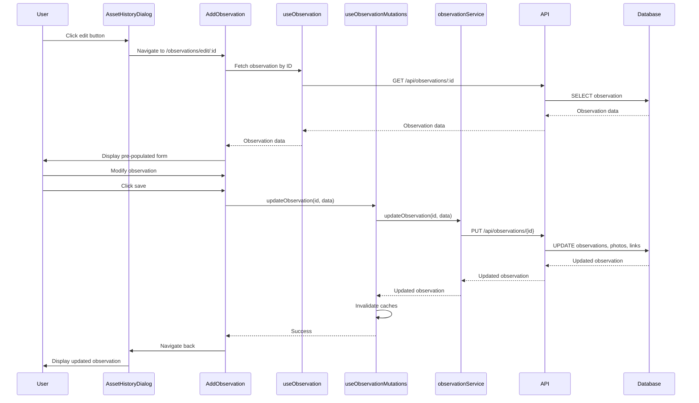

# Design Document: Observation Editing

## Overview

This feature adds edit functionality to observations displayed in the asset history dialog. The design follows the existing patterns in the CWF codebase: TanStack Query for state management, optimistic updates for responsive UI, and permission-based access control.

The implementation consists of three main components:
1. **UI Layer**: Edit button in AssetHistoryDialog and an edit dialog component
2. **Frontend State**: Mutation hook and API service method for updates
3. **Backend API**: Enhanced PUT endpoint with permission validation

The design reuses the observation creation UI pattern (AddObservation.tsx) but adapts it for editing within a dialog context.

## Architecture

### Component Structure

```
AssetHistoryDialog.tsx
├── ObservationHistoryEntry (existing)
│   ├── Edit Button (new)
│   └── onClick → navigates to /observations/edit/:id
│
AddObservation.tsx (enhanced to support edit mode)
├── Detects edit mode via URL parameter
├── Loads existing observation if editing
├── Photo upload/edit table
├── Observation text textarea
├── Captured_at datetime picker (new)
└── Save/Cancel buttons
```

**Design Decision**: Instead of creating a separate EditObservationDialog component, we enhance the existing AddObservation page to support both create and edit modes. This approach:
- Reduces code duplication
- Ensures consistent UI/UX between create and edit
- Simplifies maintenance (one component to update)
- Follows the pattern used elsewhere in the codebase (e.g., action editing)

### Data Flow



### Permission Model

Permissions are checked on the backend using the existing authorization context:

```typescript
// Permission check logic (backend)
if (userId !== observation.observed_by && !userHasAdminPermission) {
  return 403 Forbidden
}
```

The frontend shows/hides the edit button based on:
- `authContext.user_id === observation.observed_by` (creator check)
- `authContext.permissions.includes('data:write:all')` (admin check)

## Components and Interfaces

### 1. AddObservation Component Enhancement

**Purpose**: Provide a unified interface for creating and editing observations

**URL Routes**:
- Create mode: `/observations/add/:assetType/:id`
- Edit mode: `/observations/edit/:observationId`

**Mode Detection**:
```typescript
const { assetType, id, observationId } = useParams<{ 
  assetType?: string; 
  id?: string; 
  observationId?: string;
}>();
const isEditMode = !!observationId;
```

**State**:
```typescript
const [observationText, setObservationText] = useState('');
const [photos, setPhotos] = useState<Photo[]>([]);
const [capturedAt, setCapturedAt] = useState<string>(new Date().toISOString());
const [links, setLinks] = useState<ObservationLink[]>([]);

// Load existing observation in edit mode
const { data: existingObservation, isLoading } = useObservation(observationId || '', {
  enabled: isEditMode,
});

useEffect(() => {
  if (existingObservation) {
    setObservationText(existingObservation.observation_text || '');
    setPhotos(existingObservation.photos || []);
    setCapturedAt(existingObservation.observed_at);
    setLinks(existingObservation.links || []);
  }
}, [existingObservation]);
```

**Key Methods**:
- `handlePhotoUpload`: Upload new photos to S3, add to photos array (existing)
- `handlePhotoDescriptionChange`: Update photo description in state (existing)
- `handleRemovePhoto`: Remove photo from array, reorder remaining (existing)
- `handleSubmit`: Validate and call createObservation or updateObservation based on mode (enhanced)
- `handleCancel`: Navigate back to previous page (existing)

**Enhanced handleSubmit**:
```typescript
const handleSubmit = async () => {
  const hasText = observationText.trim().length > 0;
  const hasPhotos = photos.some(p => p.photo_url && !p.isUploading);
  
  if (!hasText && !hasPhotos) {
    toast({
      title: 'Validation Error',
      description: 'Please add observation text or at least one photo',
      variant: 'destructive'
    });
    return;
  }

  const data = {
    observation_text: hasText ? observationText : undefined,
    observed_at: capturedAt,
    photos: photos
      .filter(p => p.photo_url && !p.isUploading)
      .map((photo, index) => ({
        photo_url: photo.photo_url,
        photo_description: photo.photo_description,
        photo_order: index
      })),
    links: isEditMode ? links : [{
      entity_type: assetType === 'tools' ? 'tool' : 'part',
      entity_id: id!
    }]
  };

  try {
    if (isEditMode) {
      await updateObservation({ id: observationId!, data });
      toast({
        title: 'Observation updated',
        description: 'Your changes have been saved successfully.'
      });
    } else {
      await createObservation(data);
      toast({
        title: 'Observation saved',
        description: 'Your observation has been saved successfully.'
      });
    }
    navigate(-1); // Go back to previous page
  } catch (error) {
    console.error('Failed to save observation:', error);
    toast({
      title: 'Error',
      description: `Failed to ${isEditMode ? 'update' : 'save'} observation. Please try again.`,
      variant: 'destructive'
    });
  }
};
```

**New UI Elements**:
- Captured At datetime picker (using Input type="datetime-local")
- Dynamic page title: "Add Observation" vs "Edit Observation"
- Dynamic button text: "Save Observation" vs "Update Observation"

### 2. AssetHistoryDialog Enhancement

**Changes**:
```typescript
// Add edit button to observation entries
{isObservation(entry) && canEditObservation(entry) && (
  <Button
    variant="ghost"
    size="icon"
    onClick={() => navigate(`/observations/edit/${entry.id}`)}
    aria-label="Edit observation"
  >
    <Edit className="h-4 w-4" />
  </Button>
)}
```

**Permission Check Function**:
```typescript
const canEditObservation = (observation: ObservationHistoryEntry): boolean => {
  const authContext = getAuthContext(); // From auth hook
  const isCreator = authContext.user_id === observation.observed_by;
  const isAdmin = authContext.permissions?.includes('data:write:all');
  return isCreator || isAdmin;
};
```

**Navigation**: Uses React Router's `navigate` function to go to edit page instead of opening a dialog

### 3. useObservation Hook (existing)

**Purpose**: Fetch a single observation by ID

**Current Implementation**:
```typescript
export function useObservation(id: string) {
  return useQuery({
    queryKey: observationQueryKey(id),
    queryFn: () => observationService.getObservation(id),
    enabled: !!id,
  });
}
```

**No changes needed** - this hook already exists and works correctly

### 3. useObservationMutations Hook Enhancement

**Current Implementation**:
```typescript
export function useObservationMutations() {
  const queryClient = useQueryClient();

  const updateMutation = useMutation({
    mutationFn: ({ id, data }: { id: string; data: Partial<CreateObservationData> }) =>
      observationService.updateObservation(id, data),
    onSuccess: (_, variables) => {
      queryClient.invalidateQueries({ queryKey: observationsQueryKey() });
      queryClient.invalidateQueries({ queryKey: observationQueryKey(variables.id) });
    },
  });

  return {
    updateObservation: updateMutation.mutateAsync,
    isUpdating: updateMutation.isPending,
  };
}
```

**Enhancement Needed**:
Add invalidation for tool history cache:
```typescript
onSuccess: (_, variables) => {
  queryClient.invalidateQueries({ queryKey: observationsQueryKey() });
  queryClient.invalidateQueries({ queryKey: observationQueryKey(variables.id) });
  // NEW: Invalidate tool history to refresh AssetHistoryDialog
  queryClient.invalidateQueries({ queryKey: ['toolHistory'] });
},
```

### 4. Backend API Enhancement

**Current Implementation**: The PUT endpoint already exists in `lambda/observations/index.js`

**Required Changes**: Add permission validation before update

```javascript
async function updateObservation(event, id, authContext, headers) {
  const body = JSON.parse(event.body || '{}');
  const { observation_text, observed_at, photos, links } = body;
  const organizationId = authContext.organization_id;
  const userId = authContext.user_id;

  const client = await getDbClient();
  
  try {
    await client.query('BEGIN');

    // NEW: Check permissions before update
    const permissionCheckSql = `
      SELECT observed_by, organization_id
      FROM observations
      WHERE id = ${formatSqlValue(id)}::uuid
    `;
    const permissionResult = await client.query(permissionCheckSql);
    
    if (permissionResult.rows.length === 0) {
      await client.query('ROLLBACK');
      return errorResponse(404, 'Observation not found', headers);
    }
    
    const observation = permissionResult.rows[0];
    
    // Check if user is creator or has admin permission
    const isCreator = observation.observed_by === userId;
    const isAdmin = authContext.permissions?.includes('data:write:all');
    
    if (!isCreator && !isAdmin) {
      await client.query('ROLLBACK');
      return errorResponse(403, 'You do not have permission to edit this observation', headers);
    }
    
    // Verify organization match
    if (observation.organization_id !== organizationId) {
      await client.query('ROLLBACK');
      return errorResponse(403, 'Observation does not belong to your organization', headers);
    }

    // Continue with existing update logic...
    const updates = [];
    if (observation_text !== undefined) updates.push(`observation_text = ${formatSqlValue(observation_text)}`);
    if (observed_at !== undefined) updates.push(`observed_at = ${formatSqlValue(observed_at)}`);
    
    // ... rest of existing implementation
  }
}
```

## Data Models

### Observation (existing)

```typescript
interface Observation {
  id: string;
  organization_id: string;
  observation_text: string | null;
  observed_by: string;  // Cognito user ID
  observed_by_name?: string;  // Joined from organization_members
  observed_at: string;  // ISO 8601 timestamp
  created_at: string;
  updated_at: string;
  photos: ObservationPhoto[];
  links: ObservationLink[];
}
```

### ObservationHistoryEntry (existing in useToolHistory)

```typescript
interface ObservationHistoryEntry {
  id: string;
  observation_text: string | null;
  observed_at: string;
  observed_by: string;
  observed_by_name: string;
  photos: Array<{
    id: string;
    photo_url: string;
    photo_description: string | null;
    photo_order: number;
  }>;
}
```

### UpdateObservationData (new type)

```typescript
interface UpdateObservationData {
  observation_text?: string;
  observed_at?: string;
  photos?: Array<{
    photo_url: string;
    photo_description?: string;
    photo_order?: number;
  }>;
  links?: Array<{
    entity_type: string;
    entity_id: string;
  }>;
}
```

Note: Links are not editable in this feature (they remain tied to the original asset), but the type includes them for API consistency.


## Correctness Properties

A property is a characteristic or behavior that should hold true across all valid executions of a system—essentially, a formal statement about what the system should do. Properties serve as the bridge between human-readable specifications and machine-verifiable correctness guarantees.

### Property Reflection

After analyzing all acceptance criteria, the following redundancies were identified:

- **Requirements 1.2, 1.3, and 1.4** all test permission-based button visibility. These can be combined into a single comprehensive property about button visibility based on permissions.
- **Requirements 7.1, 7.2, 7.3, and 7.4** all test backend permission validation. These can be combined into a single property about permission enforcement.
- **Requirements 2.2, 2.3, and 2.4** all test dialog pre-population. These can be combined into a single property about data binding.
- **Requirements 8.2 and 8.3** both test cache invalidation. These can be combined into a single property.
- **Requirements 9.1, 9.2, and 9.3** all test optimistic update behavior. These can be combined into a single comprehensive property.

### UI Properties

Property 1: Edit button visibility based on permissions
*For any* observation in the asset history dialog, the edit button should be visible if and only if the current user is either the observation creator (user_id matches observed_by) or has admin permissions (data:write:all)
**Validates: Requirements 1.2, 1.3, 1.4**

Property 2: Navigation to edit page on button click
*For any* observation with a visible edit button, clicking the button should navigate to /observations/edit/:id with the observation's ID
**Validates: Requirements 2.1**

Property 3: Page pre-populates all observation data
*For any* observation being edited, when the edit page loads, all fields (observation_text, photos with descriptions and order, captured_at) should be pre-populated with the observation's current values
**Validates: Requirements 2.2, 2.3, 2.4**

Property 4: Observation text modification
*For any* text input in the observation text field, the page state should update to reflect the new text
**Validates: Requirements 3.1**

Property 5: Validation allows empty text with photos
*For any* observation with at least one photo, clearing the observation_text field should not prevent saving
**Validates: Requirements 3.2**

Property 6: Photo addition increases count
*For any* observation, uploading new photos should increase the total photo count by the number of photos uploaded
**Validates: Requirements 4.1**

Property 7: Photo removal decreases count
*For any* observation with photos, removing a photo should decrease the total photo count by one and remove that photo from the list
**Validates: Requirements 4.2**

Property 8: Photo description updates
*For any* photo in an observation, modifying the photo_description field should update that photo's description in the state
**Validates: Requirements 4.3**

Property 9: Photo reordering preserves new order
*For any* set of photos in an observation, reordering the photos should maintain the new order in the photo_order field
**Validates: Requirements 4.4**

Property 10: Valid datetime acceptance
*For any* valid ISO 8601 datetime string, the captured_at field should accept the value without error
**Validates: Requirements 5.1**

Property 11: Invalid datetime rejection
*For any* invalid datetime string, the captured_at field should display a validation error and prevent submission
**Validates: Requirements 5.2**

### Backend API Properties

Property 12: Observation update persistence
*For any* valid observation update request, the database should reflect the updated observation_text, observed_at, photos, and links after the request completes
**Validates: Requirements 6.2**

Property 13: Photo update transaction atomicity
*For any* observation photo update, either all photos are deleted and new photos are inserted, or no changes occur (transaction rollback on error)
**Validates: Requirements 6.3**

Property 14: Link update transaction atomicity
*For any* observation link update, either all links are deleted and new links are inserted, or no changes occur (transaction rollback on error)
**Validates: Requirements 6.4**

Property 15: Backend permission enforcement
*For any* observation update request, the backend should allow the update if and only if the requesting user is either the observation creator (user_id matches observed_by) or has admin permissions (data:write:all)
**Validates: Requirements 7.1, 7.2, 7.3, 7.4**

Property 16: Organization boundary enforcement
*For any* observation update request, the backend should reject the request with a 403 error if the observation's organization_id does not match the user's organization_id
**Validates: Requirements 6.7**

### State Management Properties

Property 17: Cache invalidation on success
*For any* successful observation update, both the observations query cache and the tool history query cache should be invalidated
**Validates: Requirements 8.2, 8.3**

Property 18: Error toast on mutation failure
*For any* failed observation update mutation, an error toast notification should be displayed to the user
**Validates: Requirements 8.4**

Property 19: Optimistic update behavior
*For any* observation update, the UI should immediately reflect the changes, revert to the previous state if the server request fails, and replace optimistic data with server response if the request succeeds
**Validates: Requirements 9.1, 9.2, 9.3, 9.5**

Property 20: Network error handling
*For any* network error during observation update, a toast notification with a retry option should be displayed
**Validates: Requirements 10.1**

Property 21: Validation error display
*For any* validation error during observation update, inline error messages should be displayed on the relevant fields
**Validates: Requirements 10.2**

Property 22: Permission error feedback
*For any* 403 permission error during observation update, a toast notification explaining the permission issue should be displayed
**Validates: Requirements 10.3**

### Dialog State Properties

Property 23: Dialog closes on successful save
*For any* successful observation update, the edit dialog should close automatically
**Validates: Requirements 11.1**

Property 24: Dialog closes on cancel without saving
*For any* cancel action in the edit dialog, the dialog should close without persisting any changes
**Validates: Requirements 11.2**

Property 25: Unsaved changes confirmation
*For any* edit dialog with unsaved changes, clicking outside the dialog should prompt for confirmation before closing
**Validates: Requirements 11.3**

Property 26: Dialog cleanup on close
*For any* dialog close action, all temporary state (uploaded photos, form data) should be cleared
**Validates: Requirements 11.5**

## Error Handling

### Frontend Error Handling

**Validation Errors**:
- Empty observation_text AND no photos → Inline error: "Please add observation text or at least one photo"
- Invalid captured_at format → Inline error: "Please enter a valid date and time"
- Photos still uploading → Disable save button, show upload progress

**API Errors**:
- 403 Forbidden → Toast: "You don't have permission to edit this observation"
- 404 Not Found → Toast: "Observation not found. It may have been deleted."
- 500 Server Error → Toast: "Failed to save changes. Please try again."
- Network Error → Toast: "Network error. Check your connection and try again." (with retry button)

**Optimistic Update Rollback**:
When a mutation fails, TanStack Query automatically reverts the optimistic update. The error toast provides user feedback.

### Backend Error Handling

**Permission Validation**:
```javascript
// Check creator or admin
if (userId !== observation.observed_by && !authContext.permissions?.includes('data:write:all')) {
  return errorResponse(403, 'You do not have permission to edit this observation', headers);
}

// Check organization boundary
if (observation.organization_id !== organizationId) {
  return errorResponse(403, 'Observation does not belong to your organization', headers);
}
```

**Transaction Rollback**:
All database operations occur within a transaction. If any operation fails, the entire transaction is rolled back:
```javascript
try {
  await client.query('BEGIN');
  // ... update operations
  await client.query('COMMIT');
} catch (error) {
  await client.query('ROLLBACK');
  throw error;
}
```

**Input Validation**:
- observation_text: Accept null or string
- observed_at: Validate ISO 8601 format
- photos: Validate array structure, photo_url required
- links: Validate entity_type and entity_id format

## Testing Strategy

### Dual Testing Approach

This feature requires both unit tests and property-based tests for comprehensive coverage:

**Unit Tests**: Focus on specific examples, edge cases, and integration points
**Property Tests**: Verify universal properties across all inputs using randomized data

Together, these approaches ensure both concrete bug detection and general correctness verification.

### Unit Testing

**Component Tests** (using React Testing Library + Vitest):

1. **EditObservationDialog**:
   - Renders with pre-populated data
   - Handles photo upload and removal
   - Validates empty observation (no text, no photos)
   - Calls updateObservation on save
   - Closes on cancel
   - Shows loading state during submission

2. **AssetHistoryDialog**:
   - Shows edit button for creator
   - Shows edit button for admin
   - Hides edit button for other users
   - Opens EditObservationDialog on button click

3. **useObservationMutations Hook**:
   - Calls observationService.updateObservation with correct parameters
   - Invalidates observations cache on success
   - Invalidates tool history cache on success
   - Handles error states

**Integration Tests**:

1. **End-to-End Edit Flow**:
   - User clicks edit button → dialog opens → user modifies data → user saves → dialog closes → history refreshes
   - Test with mock API responses

2. **Permission Scenarios**:
   - Creator can edit their observation
   - Admin can edit any observation
   - Non-creator/non-admin cannot edit

3. **Error Scenarios**:
   - Network error shows retry toast
   - 403 error shows permission toast
   - 404 error shows not found toast
   - Validation error shows inline message

### Property-Based Testing

**Configuration**: Use fast-check library for TypeScript, minimum 100 iterations per test

**Property Test 1: Edit button visibility**
```typescript
// Feature: observation-editing, Property 1: Edit button visibility based on permissions
fc.assert(
  fc.property(
    fc.record({
      observation: observationArbitrary(),
      currentUser: userArbitrary(),
    }),
    ({ observation, currentUser }) => {
      const isCreator = currentUser.id === observation.observed_by;
      const isAdmin = currentUser.permissions.includes('data:write:all');
      const shouldShowButton = isCreator || isAdmin;
      
      const { container } = render(
        <AssetHistoryDialog assetId="test" assetName="Test">
          <div>Trigger</div>
        </AssetHistoryDialog>,
        { authContext: currentUser, observations: [observation] }
      );
      
      const editButton = container.querySelector('[data-testid="edit-observation-button"]');
      expect(!!editButton).toBe(shouldShowButton);
    }
  ),
  { numRuns: 100 }
);
```

**Property Test 2: Dialog pre-population**
```typescript
// Feature: observation-editing, Property 3: Dialog pre-populates all observation data
fc.assert(
  fc.property(
    observationArbitrary(),
    (observation) => {
      const { getByLabelText, getAllByRole } = render(
        <EditObservationDialog
          observation={observation}
          open={true}
          onOpenChange={() => {}}
        />
      );
      
      const textField = getByLabelText('Observation Text');
      expect(textField.value).toBe(observation.observation_text || '');
      
      const photoRows = getAllByRole('row').slice(1); // Skip header
      expect(photoRows.length).toBe(observation.photos.length);
      
      const dateField = getByLabelText('Captured At');
      expect(dateField.value).toBe(observation.observed_at);
    }
  ),
  { numRuns: 100 }
);
```

**Property Test 3: Backend permission enforcement**
```typescript
// Feature: observation-editing, Property 15: Backend permission enforcement
fc.assert(
  fc.property(
    fc.record({
      observation: observationArbitrary(),
      requestingUser: userArbitrary(),
      updateData: updateObservationDataArbitrary(),
    }),
    async ({ observation, requestingUser, updateData }) => {
      const isCreator = requestingUser.id === observation.observed_by;
      const isAdmin = requestingUser.permissions.includes('data:write:all');
      const shouldAllow = isCreator || isAdmin;
      
      const response = await updateObservation(
        observation.id,
        updateData,
        { user_id: requestingUser.id, permissions: requestingUser.permissions }
      );
      
      if (shouldAllow) {
        expect(response.statusCode).toBe(200);
      } else {
        expect(response.statusCode).toBe(403);
      }
    }
  ),
  { numRuns: 100 }
);
```

**Property Test 4: Cache invalidation**
```typescript
// Feature: observation-editing, Property 17: Cache invalidation on success
fc.assert(
  fc.property(
    fc.record({
      observationId: fc.uuid(),
      updateData: updateObservationDataArbitrary(),
    }),
    async ({ observationId, updateData }) => {
      const queryClient = new QueryClient();
      const invalidatedKeys: string[][] = [];
      
      queryClient.invalidateQueries = jest.fn((options) => {
        invalidatedKeys.push(options.queryKey);
      });
      
      await updateObservation(observationId, updateData);
      
      expect(invalidatedKeys).toContainEqual(['observations']);
      expect(invalidatedKeys).toContainEqual(['toolHistory']);
    }
  ),
  { numRuns: 100 }
);
```

**Property Test 5: Optimistic update rollback**
```typescript
// Feature: observation-editing, Property 19: Optimistic update behavior
fc.assert(
  fc.property(
    fc.record({
      observation: observationArbitrary(),
      updateData: updateObservationDataArbitrary(),
      shouldFail: fc.boolean(),
    }),
    async ({ observation, updateData, shouldFail }) => {
      const queryClient = new QueryClient();
      
      // Set initial cache state
      queryClient.setQueryData(['observations'], [observation]);
      
      // Mock API to succeed or fail
      if (shouldFail) {
        mockApiError();
      } else {
        mockApiSuccess({ ...observation, ...updateData });
      }
      
      const { mutate } = useObservationMutations();
      await mutate({ id: observation.id, data: updateData });
      
      const finalData = queryClient.getQueryData(['observations']);
      
      if (shouldFail) {
        // Should revert to original
        expect(finalData).toEqual([observation]);
      } else {
        // Should have updated data
        expect(finalData[0]).toMatchObject(updateData);
      }
    }
  ),
  { numRuns: 100 }
);
```

### Test Generators (Arbitraries)

```typescript
const observationArbitrary = () => fc.record({
  id: fc.uuid(),
  organization_id: fc.uuid(),
  observation_text: fc.option(fc.string(), { nil: null }),
  observed_by: fc.uuid(),
  observed_by_name: fc.string(),
  observed_at: fc.date().map(d => d.toISOString()),
  photos: fc.array(fc.record({
    id: fc.uuid(),
    photo_url: fc.webUrl(),
    photo_description: fc.option(fc.string(), { nil: null }),
    photo_order: fc.nat(),
  })),
});

const userArbitrary = () => fc.record({
  id: fc.uuid(),
  permissions: fc.array(fc.constantFrom('data:read:all', 'data:write:all')),
});

const updateObservationDataArbitrary = () => fc.record({
  observation_text: fc.option(fc.string()),
  observed_at: fc.option(fc.date().map(d => d.toISOString())),
  photos: fc.option(fc.array(fc.record({
    photo_url: fc.webUrl(),
    photo_description: fc.option(fc.string()),
    photo_order: fc.nat(),
  }))),
});
```

### Edge Cases to Test

1. **Empty observation text with photos**: Should allow saving
2. **Empty observation text without photos**: Should prevent saving
3. **Non-existent observation ID**: Should return 404
4. **Cross-organization access attempt**: Should return 403
5. **Concurrent edits**: Last write wins (no conflict resolution)
6. **Photo upload failure**: Should not add failed photos to list
7. **Network timeout**: Should show retry option
8. **Invalid datetime format**: Should show validation error
9. **Very long observation text**: Should handle gracefully
10. **Large number of photos**: Should handle pagination/scrolling
