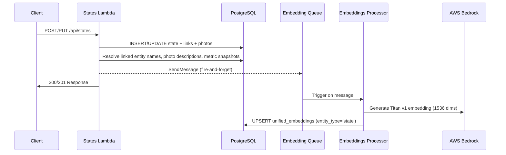
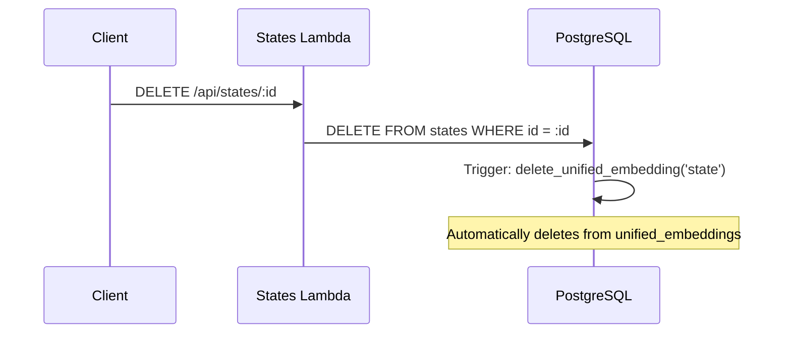

# Design Document: Observation Embeddings

## Overview

This design adds `state` as a new entity type in the unified embeddings system, enabling semantic search over field observations. Each observation gets one embedding composed from its linked entity names, observation text, photo descriptions, and metric snapshot values.

The implementation follows the established patterns from the actions Lambda and embeddings processor: the states Lambda composes the embedding source text and sends it via SQS (fire-and-forget), the embeddings processor generates the Titan v1 vector and writes to the unified_embeddings table, and a cascade delete trigger keeps the table consistent when observations are deleted.

Key design decisions (confirmed during requirements discussion):
- **One embedding per observation** — the observation is the semantic unit, not the link
- **Direct composition** — no AI cleanup, format: `{entity_name}. {state_text}. {photo_desc}. {metric}: {value unit}`
- **Pre-composed embedding_source** sent in SQS message from states Lambda (matching actions Lambda pattern)
- **entity_type = 'state'** in unified_embeddings (matches the database table name)
- **No entity type prefix** in composition text
- **No photo URLs** in embedding
- **Temporal scoring out of scope** — retrieval concern for consumers

## Architecture

### Embedding Generation Flow



### Cascade Delete Flow



### Search Flow (No Changes Required)

The unified search Lambda already handles dynamic entity_type filtering. Adding 'state' to the valid types list is the only change needed. When no entity_types filter is specified, all embeddings (including states) are returned.

## Components and Interfaces

### 1. Composition Function — `composeStateEmbeddingSource`

Added to `lambda/shared/embedding-composition.js` alongside existing compose functions.

Unlike other compose functions that receive entity data directly, the state compose function receives pre-resolved data: linked entity names (resolved from state_links → parts.name / tools.name / actions.description), photo descriptions, and metric snapshots with display names and units.

```javascript
/**
 * Compose embedding source for a state (observation)
 * 
 * States are composed from linked entity names, observation text,
 * photo descriptions, and metric snapshot values.
 * 
 * @param {Object} state - Pre-resolved state data
 * @param {string[]} [state.entity_names] - Resolved names from linked entities
 * @param {string} [state.state_text] - Observation text
 * @param {string[]} [state.photo_descriptions] - Photo descriptions (nulls pre-filtered)
 * @param {Array<{display_name: string, value: number, unit?: string}>} [state.metrics] - Metric snapshots
 * @returns {string} - Composed embedding source text
 */
function composeStateEmbeddingSource(state) {
  const parts = [];

  // Linked entity names
  if (state.entity_names && state.entity_names.length > 0) {
    parts.push(...state.entity_names);
  }

  // Observation text
  if (state.state_text) {
    parts.push(state.state_text);
  }

  // Photo descriptions (already filtered for non-null/empty)
  if (state.photo_descriptions && state.photo_descriptions.length > 0) {
    parts.push(...state.photo_descriptions);
  }

  // Metric snapshots: "Girth: 45 cm" or "Weight: 12"
  if (state.metrics && state.metrics.length > 0) {
    for (const m of state.metrics) {
      const metricStr = m.unit
        ? `${m.display_name}: ${m.value} ${m.unit}`
        : `${m.display_name}: ${m.value}`;
      parts.push(metricStr);
    }
  }

  return parts.filter(Boolean).join('. ');
}
```

### 2. States Lambda — SQS Integration

After a successful create or update transaction, the states Lambda resolves the data needed for composition and sends an SQS message. This happens after the COMMIT, using the fire-and-forget pattern (`.then()/.catch()`, not awaited).

#### Data Resolution Query

The states Lambda runs a single query after commit to gather composition data:

```sql
SELECT
  COALESCE(
    array_agg(DISTINCT
      CASE sl.entity_type
        WHEN 'part' THEN p.name
        WHEN 'tool' THEN t.name
        WHEN 'action' THEN a.description
      END
    ) FILTER (WHERE sl.id IS NOT NULL),
    ARRAY[]::text[]
  ) AS entity_names,
  COALESCE(
    array_agg(DISTINCT sp.photo_description)
    FILTER (WHERE sp.photo_description IS NOT NULL AND sp.photo_description != ''),
    ARRAY[]::text[]
  ) AS photo_descriptions,
  COALESCE(
    json_agg(
      json_build_object('display_name', m.name, 'value', ms.value, 'unit', m.unit)
    ) FILTER (WHERE ms.id IS NOT NULL),
    '[]'::json
  ) AS metrics
FROM states s
LEFT JOIN state_links sl ON sl.state_id = s.id
LEFT JOIN parts p ON sl.entity_type = 'part' AND sl.entity_id = p.id
LEFT JOIN tools t ON sl.entity_type = 'tool' AND sl.entity_id = t.id
LEFT JOIN actions a ON sl.entity_type = 'action' AND sl.entity_id = a.id
LEFT JOIN state_photos sp ON sp.state_id = s.id
LEFT JOIN metric_snapshots ms ON ms.state_id = s.id
LEFT JOIN metrics m ON ms.metric_id = m.metric_id
WHERE s.id = $1
```

#### SQS Message Send (fire-and-forget)

```javascript
// After successful commit, resolve composition data and queue embedding
resolveAndQueueEmbedding(stateId, organizationId)
  .then(() => console.log('Queued embedding for state', stateId))
  .catch(err => console.error('Failed to queue state embedding:', err));
```

### 3. Embeddings Processor — State Support

The embeddings processor needs two changes:

1. Add `'state'` to the `validTypes` array
2. Add `'state'` case to the `getEmbeddingSource` switch statement

Since the states Lambda sends pre-composed `embedding_source` in the SQS message, the processor's existing flow handles it: it checks for `embedding_source` first, and only falls back to composing from `fields` if `embedding_source` is empty.

For the fallback path (regeneration, or if `embedding_source` is missing), the processor would need to fetch state data from the database. This uses the same resolution query shown above.

```javascript
// In validTypes array:
const validTypes = ['part', 'tool', 'action', 'issue', 'policy', 'action_existing_state', 'state'];

// In getEmbeddingSource switch:
case 'state':
  return composeStateEmbeddingSource(fields);
```

### 4. Cascade Delete Trigger

Uses the existing `delete_unified_embedding()` trigger function. One new trigger on the `states` table:

```sql
CREATE TRIGGER states_delete_embedding
    AFTER DELETE ON states
    FOR EACH ROW
    EXECUTE FUNCTION delete_unified_embedding('state');
```

### 5. Unified Search — State Support

The unified search Lambda already works dynamically — it doesn't have a hardcoded list of valid entity types. When a user passes `entity_types: ['state']` or omits the filter entirely, state embeddings are included in results.

No code changes needed in the unified search Lambda. The only consideration is documentation: consumers should know that `'state'` is now a valid entity_type value.

### 6. Embeddings Regenerate — State Support (Minimal)

The regenerate Lambda's `ENTITY_CONFIG` map needs a `'state'` entry. Unlike other entities where the compose function receives a single row, the state compose function needs resolved data (entity names, photo descriptions, metrics). The regenerate handler will need to run the resolution query and pass the result to `composeStateEmbeddingSource`.

```javascript
// In ENTITY_CONFIG:
state: {
  table: 'states',
  composeFn: composeStateEmbeddingSource,
  needsResolution: true  // Flag to indicate special fetch logic
}
```

## Data Models

### SQS Message Format (State)

```typescript
interface StateEmbeddingMessage {
  entity_type: 'state';
  entity_id: string;           // State UUID
  embedding_source: string;    // Pre-composed text
  organization_id: string;     // Organization UUID
}
```

### Composition Input Shape

```typescript
interface StateCompositionInput {
  entity_names: string[];      // Resolved from state_links → parts/tools/actions
  state_text: string | null;   // Observation text
  photo_descriptions: string[]; // Non-null photo descriptions
  metrics: Array<{
    display_name: string;      // From metrics.name
    value: number;             // From metric_snapshots.value
    unit?: string;             // From metrics.unit (optional)
  }>;
}
```

### Unified Embeddings Row (State)

```typescript
{
  id: UUID,
  entity_type: 'state',
  entity_id: UUID,             // states.id
  embedding_source: string,    // e.g. "Banana Plant. Leaves yellowing at tips. Close-up of leaf damage. Girth: 45 cm"
  model_version: 'titan-v1',
  embedding: Vector(1536),
  organization_id: UUID,
  created_at: timestamp,
  updated_at: timestamp
}
```

### Example Composition

Given an observation linked to a part "Banana Plant" with:
- state_text: "Leaves yellowing at tips, possible nutrient deficiency"
- photo 1 description: "Close-up of leaf damage"
- photo 2 description: null (skipped)
- metric: Girth = 45 cm

Result: `"Banana Plant. Leaves yellowing at tips, possible nutrient deficiency. Close-up of leaf damage. Girth: 45 cm"`


## Correctness Properties

*A property is a characteristic or behavior that should hold true across all valid executions of a system — essentially, a formal statement about what the system should do. Properties serve as the bridge between human-readable specifications and machine-verifiable correctness guarantees.*

### Property 1: Composition Completeness

*For any* state with arbitrary entity names, state_text, photo descriptions (including nulls/empties), and metric snapshots (with and without units), the composed embedding source SHALL contain every non-null, non-empty component joined by ". " as separator, with metrics formatted as "{display_name}: {value} {unit}" when unit is present and "{display_name}: {value}" when unit is absent.

**Validates: Requirements 1.1, 1.2, 1.3, 1.4, 1.5, 1.6, 2.3**

### Property 2: Composition Exclusion

*For any* state composition input that includes photo URLs or entity type strings (e.g., "part", "tool", "action"), the composed embedding source SHALL NOT contain photo URL strings and SHALL NOT contain entity type prefixes before entity names.

**Validates: Requirements 1.7, 1.8**

### Property 3: One Embedding Per State (UPSERT Idempotence)

*For any* state, writing its embedding to the unified_embeddings table twice (with the same entity_type, entity_id, model_version) SHALL result in exactly one row, with the second write updating the existing row rather than creating a duplicate.

**Validates: Requirements 2.1, 2.2, 2.4**

### Property 4: SQS Message on Create/Update

*For any* successful state create or update operation, the states Lambda SHALL send exactly one SQS message containing entity_type = 'state', the state's UUID as entity_id, a non-empty embedding_source string, and the state's organization_id.

**Validates: Requirements 3.1, 3.2, 3.5**

### Property 5: Cascade Delete

*For any* state that has an associated embedding in the unified_embeddings table, deleting that state from the states table SHALL result in the associated embedding row (where entity_type = 'state' and entity_id = state.id) being deleted.

**Validates: Requirements 5.1, 5.2**

### Property 6: Organization ID on Storage

*For any* state embedding written to the unified_embeddings table, the organization_id field SHALL match the organization_id of the source state record.

**Validates: Requirements 7.1**

### Property 7: Organization Isolation on Search

*For any* semantic search query executed with a given organization_id, all returned results with entity_type = 'state' SHALL have an organization_id matching the querying user's organization_id. No state embeddings from other organizations SHALL appear in the results.

**Validates: Requirements 7.2, 7.3**

## Error Handling

### Composition Errors

1. **All fields null/empty**: `composeStateEmbeddingSource` returns empty string. The SQS message is still sent, but the embeddings processor skips generation when `embedding_source` is empty (existing behavior).
2. **Resolution query fails**: The resolution query runs after COMMIT. If it fails, the SQS message is not sent, the error is logged, and the API response is unaffected (fire-and-forget).
3. **Partial resolution**: If some linked entities have been deleted between state creation and resolution, those names resolve to NULL and are filtered out by `filter(Boolean)`.

### SQS Errors

1. **SQS send failure**: Logged and swallowed — the API response is not affected. The embedding will be missing until the next update or manual regeneration.
2. **Malformed message**: The embeddings processor validates `entity_type` and `embedding_source`. Invalid messages are logged and skipped (not retried).

### Embeddings Processor Errors

1. **Empty embedding_source**: Skipped with a log warning (existing behavior).
2. **Bedrock API failure**: Error is thrown, SQS retries the message (existing behavior).
3. **Database write failure**: Error is thrown, SQS retries the message (existing behavior).
4. **Dimension mismatch**: If Bedrock returns non-1536 dimensions, error is thrown (existing validation).

### Cascade Delete Errors

1. **Trigger failure**: If the `delete_unified_embedding` trigger fails, the DELETE on states also fails (transactional). This is the existing behavior for all entity types.
2. **No embedding exists**: The trigger's DELETE is a no-op if no matching embedding row exists. No error.

## Testing Strategy

### Property-Based Testing Configuration

- **Library**: fast-check (already available in the project's test infrastructure)
- **Minimum iterations**: 100 per property test
- **Tag format**: `Feature: observation-embeddings, Property {N}: {title}`

### Property Tests

1. **Property 1: Composition Completeness**
   - Generate random `StateCompositionInput` objects with varying numbers of entity names (0–5), optional state_text, photo descriptions (including nulls/empties), and metrics (with/without units)
   - Call `composeStateEmbeddingSource` and verify all non-null/non-empty components appear in the output, separated by ". "
   - Verify metric formatting: "{display_name}: {value} {unit}" or "{display_name}: {value}"
   - Tag: **Feature: observation-embeddings, Property 1: Composition Completeness**

2. **Property 2: Composition Exclusion**
   - Generate random composition inputs that include photo_url strings and entity_type strings
   - Call `composeStateEmbeddingSource` and verify the output does not contain any photo URLs or entity type prefixes
   - Tag: **Feature: observation-embeddings, Property 2: Composition Exclusion**

3. **Property 3: One Embedding Per State (UPSERT Idempotence)**
   - Generate random state embeddings, write each twice to unified_embeddings via the UPSERT SQL
   - Query the table and verify exactly one row per (entity_type, entity_id, model_version)
   - Tag: **Feature: observation-embeddings, Property 3: One Embedding Per State (UPSERT Idempotence)**

4. **Property 4: SQS Message on Create/Update**
   - Mock SQS client, generate random state create/update payloads
   - Execute the states Lambda handler and verify exactly one SQS message sent with correct fields
   - Tag: **Feature: observation-embeddings, Property 4: SQS Message on Create/Update**

5. **Property 5: Cascade Delete**
   - Create random states with embeddings in unified_embeddings
   - Delete the state and verify the embedding row is gone
   - Tag: **Feature: observation-embeddings, Property 5: Cascade Delete**

6. **Property 6: Organization ID on Storage**
   - Generate random states with various organization_ids
   - Process through the embedding pipeline and verify the unified_embeddings row has matching organization_id
   - Tag: **Feature: observation-embeddings, Property 6: Organization ID on Storage**

7. **Property 7: Organization Isolation on Search**
   - Create state embeddings for multiple organizations
   - Execute search with one organization's context and verify no cross-org results
   - Tag: **Feature: observation-embeddings, Property 7: Organization Isolation on Search**

### Unit Tests

Unit tests cover specific examples and edge cases not handled by property tests:

1. **Composition edge cases**
   - Empty state (all fields null/empty) returns empty string
   - State with only state_text (no links, photos, or metrics)
   - State with multiple links to same entity type
   - Metric with unit vs without unit formatting

2. **SQS error handling**
   - SQS send failure does not affect API response (mock SQS to throw)
   - Verify error is logged when SQS fails

3. **Embeddings processor**
   - Processor accepts entity_type 'state' (not skipped)
   - Processor skips empty embedding_source for state
   - Processor falls back to fields-based composition when embedding_source is missing

4. **Cascade delete**
   - Delete state with no embedding (no error)
   - Delete state with embedding (embedding removed)

5. **Search integration**
   - Search with entity_types=['state'] returns only state results
   - Search without entity_types filter includes state results
   - State results contain entity_type, entity_id, embedding_source, similarity
