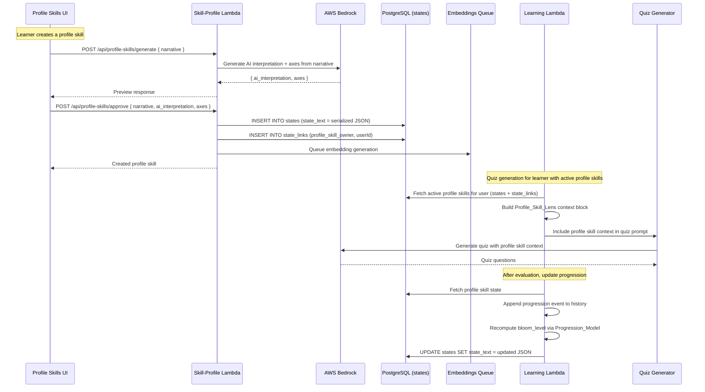

# Design Document: Profile-Level Skills

## Overview

Profile-Level Skills replaces the flat `growth_intents[]` string array in `organization_members.settings` with rich, structured skill objects stored as state records. Each Profile_Skill preserves the learner's original narrative verbatim, generates AI concept axes once at creation time, and integrates into the quiz generation layer as a Profile_Skill_Lens — a learner-specific context block injected alongside org-level lenses.

Profile skills are completely independent from growth intents and per-action skill profiles. Growth intents remain action-scoped (driving per-action axis generation on the SkillProfilePanel). Profile skills are profile-scoped meta-skills that live in the quiz generation layer as additional context, layering in concept-framed questions alongside the action's normal learning content.

The Progression_Model — the algorithm that computes a Profile_Axis's current `bloom_level` from its `progression_history` — is designed as a separate, configurable module. It factors in recency, consistency, and frequency of demonstrated levels, informed by learning science principles (spaced repetition, forgetting curve, habit formation research). The model is evolvable: the algorithm can be replaced or tuned without changing the data model.

### Key Design Decisions

1. **States table for storage**: Profile skills are stored as state records in the existing `states` table with `state_text` containing serialized JSON, following the same pattern as learning objectives, capability profiles, and financial records. No new database tables.
2. **state_links for relationships**: Each profile skill state is linked to the user via a `state_links` entry with `entity_type = 'profile_skill_owner'` and `entity_id = userId`. This enables efficient querying of a user's profile skills.
3. **unified_embeddings for search**: Each profile skill gets an embedding via the existing SQS pipeline, enabling future semantic search across profile skills.
4. **Progression_Model as pure function module**: The progression algorithm is a standalone module (`lambda/learning/progressionModel.js`) with no database dependencies — it takes a `progression_history` array and returns a computed `bloom_level`. This makes it testable, configurable, and replaceable.
5. **Profile_Skill_Lens as additive prompt context**: Profile skill context is injected as a separate prompt section in quiz generation, distinct from org-level lenses. It does not compete with or replace the existing lens selection pool.
6. **Immutability after creation**: Profile skills cannot be edited after creation. If the learner's direction changes, they create a new skill and deactivate the old one. This keeps progression history valid against a stable set of concepts.
7. **Tapering via Progression_Model**: Reinforcement frequency is reduced based on the Progression_Model's assessment of sustained mastery — not a simple threshold. The model must see repeated, time-distributed evidence before tapering.

## Architecture



### Data Flow

- **Creation**: Profile Skills UI → `POST /api/profile-skills/generate` (Bedrock generates interpretation + axes) → `POST /api/profile-skills/approve` (stores as state with state_links) → SQS embedding queue.
- **Quiz integration**: Learning Lambda fetches active profile skills for the user → builds Profile_Skill_Lens context block → injects into quiz generation prompt alongside org-level lenses.
- **Progression tracking**: After quiz evaluation, Learning Lambda fetches the profile skill state → appends a progression event to the relevant axes' `progression_history` → recomputes `bloom_level` via Progression_Model → updates the state record.
- **Display**: Profile Skills UI fetches user's profile skills via `GET /api/profile-skills` → renders narrative, axes with bloom levels, and last demonstration dates.

## Components and Interfaces

### 1. Profile Skill State Text Format

Profile skills are stored in the `states` table using a JSON-prefixed format:

```
[profile_skill] user={userId} | {serialized JSON}
```

The serialized JSON structure:

```typescript
interface ProfileSkillState {
  id: string;                    // The state record's UUID (for reference)
  original_narrative: string;    // Learner's verbatim input text
  ai_interpretation: {
    concept_label: string;       // e.g., "Extreme Ownership"
    source_attribution: string;  // e.g., "Jocko Willink, Diary of a CEO"
    learning_direction: string;  // 1-2 sentence summary
  } | null;                      // null if AI generation failed
  axes: ProfileAxis[];           // 3-5 concept axes (empty if generation failed)
  active: boolean;               // Whether included in quiz generation
  created_at: string;            // ISO 8601 timestamp
}

interface ProfileAxis {
  key: string;                   // snake_case identifier
  label: string;                 // Human-readable label
  description: string;           // Concept description
  bloom_level: number;           // Current computed level (0-5)
  progression_history: ProgressionEvent[];
}

interface ProgressionEvent {
  demonstrated_level: number;    // Bloom's level from evaluation (1-5)
  action_id: string;             // Which action the quiz was for
  state_id: string;              // The quiz knowledge state ID
  timestamp: string;             // ISO 8601 timestamp
}
```

### 2. API Endpoints (Skill-Profile Lambda)

Three new routes added to the existing `lambda/skill-profile/index.js`:

#### GET /api/profile-skills

Fetch all profile skills for the authenticated user.

```javascript
// Query: states with [profile_skill] prefix linked to user via state_links
async function handleGetProfileSkills(event, organizationId) {
  const userId = getAuthorizerContext(event)?.user_id;
  // SELECT s.id, s.state_text, s.captured_at
  // FROM states s
  // INNER JOIN state_links sl ON sl.state_id = s.id
  // WHERE sl.entity_type = 'profile_skill_owner'
  //   AND sl.entity_id = userId
  //   AND s.organization_id = organizationId
  //   AND s.state_text LIKE '[profile_skill]%'
  // ORDER BY s.captured_at DESC
  // Returns: array of parsed profile skill objects
}
```

#### POST /api/profile-skills/generate

Generate AI interpretation and axes from a narrative (preview, not stored).

```javascript
async function handleGenerateProfileSkill(event, organizationId) {
  const { narrative } = JSON.parse(event.body);
  // Validate narrative is non-empty
  // Call Bedrock with profile skill generation prompt
  // Return: { ai_interpretation, axes } for preview
}
```

**Bedrock prompt** (new prompt in skill-profile lambda):

```
You are a learning design expert. A learner has described a personal growth direction.
Your job is to extract the core concept and generate concept axes for structured learning.

LEARNER'S NARRATIVE:
{original_narrative}

INSTRUCTIONS:
1. Extract an AI interpretation with:
   - concept_label: A short name for the core concept (e.g., "Extreme Ownership")
   - source_attribution: Any referenced source, person, or origin (e.g., "Jocko Willink, Diary of a CEO"). Use "Personal insight" if no source is referenced.
   - learning_direction: 1-2 sentence summary of the growth direction

2. Generate 3-5 concept axes, each representing a distinct concept area grounded in real
   frameworks, research, or established concepts relevant to the narrative.
   Each axis has:
   - key: snake_case identifier
   - label: Human-readable label
   - description: 1-2 sentence description of the concept area

Return ONLY a JSON object:
{
  "ai_interpretation": { "concept_label": "...", "source_attribution": "...", "learning_direction": "..." },
  "axes": [{ "key": "...", "label": "...", "description": "..." }]
}
```

#### POST /api/profile-skills/approve

Store a profile skill as a state record.

```javascript
async function handleApproveProfileSkill(event, organizationId) {
  const userId = getAuthorizerContext(event)?.user_id;
  const { narrative, ai_interpretation, axes } = JSON.parse(event.body);

  // Build profile skill JSON
  const profileSkill = {
    original_narrative: narrative,
    ai_interpretation: ai_interpretation || null,
    axes: (axes || []).map(axis => ({
      ...axis,
      bloom_level: 0,
      progression_history: []
    })),
    active: true,
    created_at: new Date().toISOString()
  };

  // Compose state_text
  const stateText = `[profile_skill] user=${userId} | ${JSON.stringify(profileSkill)}`;

  // INSERT INTO states + state_links (profile_skill_owner → userId)
  // Queue embedding via SQS
  // Return created profile skill with state ID
}
```

#### PUT /api/profile-skills/:id/toggle

Toggle active/inactive status.

```javascript
async function handleToggleProfileSkill(event, organizationId) {
  const stateId = extractIdFromPath(event.path);
  // Fetch state, parse JSON, toggle active flag
  // UPDATE states SET state_text = updated JSON
  // Return updated profile skill
}
```

#### DELETE /api/profile-skills/:id

Delete a profile skill permanently.

```javascript
async function handleDeleteProfileSkill(event, organizationId) {
  const stateId = extractIdFromPath(event.path);
  // DELETE FROM states WHERE id = stateId (CASCADE handles state_links)
  // DELETE FROM unified_embeddings WHERE entity_type = 'state' AND entity_id = stateId
  // Return { deleted: true }
}
```

### 3. Progression_Model Module

`lambda/learning/progressionModel.js` — a pure function module with no database dependencies.

```javascript
/**
 * Compute the current bloom_level for a profile axis from its progression history.
 *
 * Algorithm (configurable via PROGRESSION_CONFIG):
 * 1. If no history, return 0
 * 2. Apply recency weighting: recent demonstrations count more than old ones
 * 3. Compute weighted average of demonstrated levels
 * 4. Apply consistency bonus: sustained demonstrations over time increase confidence
 * 5. Apply decay: if no recent demonstrations, level decays toward 0
 * 6. Clamp result to [0, 5]
 *
 * @param {ProgressionEvent[]} history - Full progression history for the axis
 * @param {object} config - Optional config overrides
 * @returns {number} Computed bloom_level (0-5, integer)
 */
function computeBloomLevel(history, config = PROGRESSION_CONFIG) { ... }

/**
 * Determine whether reinforcement should be tapered for this axis.
 * Tapering occurs only when the progression history shows repeated,
 * time-distributed evidence of mastery.
 *
 * @param {ProgressionEvent[]} history - Full progression history
 * @param {number} currentBloomLevel - Current computed bloom level
 * @param {object} config - Optional config overrides
 * @returns {{ shouldTaper: boolean, reinforcementProbability: number }}
 */
function computeTaperingDecision(history, currentBloomLevel, config = PROGRESSION_CONFIG) { ... }

const PROGRESSION_CONFIG = {
  // Recency: half-life in days — demonstrations older than this get half weight
  recencyHalfLifeDays: 14,

  // Consistency: minimum number of demonstrations at a level to consider it "consistent"
  consistencyThreshold: 3,

  // Consistency: minimum time span (days) over which demonstrations must be distributed
  consistencyTimeSpanDays: 21,

  // Decay: days without demonstration before level starts decaying
  decayOnsetDays: 30,

  // Decay: rate of decay per day after onset (level units per day)
  decayRatePerDay: 0.05,

  // Tapering: minimum bloom level to consider tapering
  taperingMinLevel: 3,

  // Tapering: minimum demonstrations at or above taperingMinLevel
  taperingMinDemonstrations: 5,

  // Tapering: minimum time span (days) of sustained mastery for tapering
  taperingTimeSpanDays: 42, // ~6 weeks, informed by Lally's ~66 day habit formation

  // Tapering: reinforcement probability when tapering is active (0.0 = never, 1.0 = always)
  taperingReinforcementProbability: 0.3,
};

module.exports = { computeBloomLevel, computeTaperingDecision, PROGRESSION_CONFIG };
```

### 4. Quiz Generation Integration (Learning Lambda)

Modifications to `handleQuizGenerate` in `lambda/learning/index.js`:

```javascript
// After existing lens selection, before calling generateQuizViaBedrock/generateOpenFormQuizViaBedrock:

// Fetch active profile skills for this user
const profileSkills = await fetchActiveProfileSkills(db, userIdSafe, orgIdSafe);

// Build Profile_Skill_Lens context block
let profileSkillBlock = '';
if (profileSkills.length > 0) {
  // Check tapering for each profile skill's axes
  const activeProfileSkills = profileSkills.filter(skill => {
    // At least one axis should not be fully tapered
    return skill.axes.some(axis => {
      const { shouldTaper, reinforcementProbability } = computeTaperingDecision(
        axis.progression_history, axis.bloom_level
      );
      return !shouldTaper || Math.random() < reinforcementProbability;
    });
  });

  profileSkillBlock = buildProfileSkillPromptBlock(activeProfileSkills);
}

// Pass profileSkillBlock to quiz generation functions alongside lensBlock and assetBlock
```

**Profile_Skill_Lens prompt block builder**:

```javascript
/**
 * Build the Profile_Skill_Lens context block for the quiz generation prompt.
 * Structured as a separate section distinct from org-level lenses.
 *
 * @param {Array} profileSkills - Active profile skills with axes and bloom levels
 * @returns {string} Prompt text block
 */
function buildProfileSkillPromptBlock(profileSkills) {
  if (!profileSkills || profileSkills.length === 0) return '';

  const skillBlocks = profileSkills.map((skill, i) => {
    const axesDescription = skill.axes.map(axis =>
      `    - ${axis.label} (current Bloom's level: ${axis.bloom_level}/5): ${axis.description}`
    ).join('\n');

    return `  Skill ${i + 1}: ${skill.ai_interpretation?.concept_label || 'Personal Growth Skill'}
    Narrative: ${skill.original_narrative.substring(0, 300)}
    Source: ${skill.ai_interpretation?.source_attribution || 'Personal insight'}
    Direction: ${skill.ai_interpretation?.learning_direction || 'General growth'}
    Concept Axes:
${axesDescription}`;
  }).join('\n\n');

  return `LEARNER PROFILE SKILLS (personal growth lenses — weave these concepts into questions where relevant):
${skillBlocks}

For each profile skill axis, frame questions at a depth appropriate to the learner's current Bloom's level for that axis. Lower levels (0-2) should introduce and explain the concept; higher levels (3-5) should ask for application, analysis, or synthesis of the concept in the action context.`;
}
```

### 5. Progression Update (Learning Lambda)

After quiz evaluation in `handleEvaluate`, update profile skill progression:

```javascript
// After evaluation is complete and score is available:
async function updateProfileSkillProgression(db, userId, organizationId, actionId, knowledgeStateId, demonstratedLevel) {
  const orgIdSafe = escapeLiteral(organizationId);
  const userIdSafe = escapeLiteral(userId);

  // Fetch active profile skills for this user
  const profileSkillsResult = await db.query(
    `SELECT s.id, s.state_text
     FROM states s
     INNER JOIN state_links sl ON sl.state_id = s.id
     WHERE sl.entity_type = 'profile_skill_owner'
       AND sl.entity_id = '${userIdSafe}'
       AND s.organization_id = '${orgIdSafe}'
       AND s.state_text LIKE '[profile_skill]%'`
  );

  for (const row of profileSkillsResult.rows) {
    const parsed = parseProfileSkillStateText(row.state_text);
    if (!parsed || !parsed.active) continue;

    // Create progression event
    const event = {
      demonstrated_level: demonstratedLevel,
      action_id: actionId,
      state_id: knowledgeStateId,
      timestamp: new Date().toISOString()
    };

    // Append to each axis's progression_history
    let updated = false;
    for (const axis of parsed.axes) {
      axis.progression_history.push(event);
      axis.bloom_level = computeBloomLevel(axis.progression_history);
      updated = true;
    }

    if (updated) {
      const updatedStateText = composeProfileSkillStateText(parsed, userId);
      await db.query(
        `UPDATE states SET state_text = '${escapeLiteral(updatedStateText)}'
         WHERE id = '${escapeLiteral(row.id)}' AND organization_id = '${orgIdSafe}'`
      );
    }
  }
}
```

### 6. Frontend Components

#### ProfileSkillsSection (replaces ProfileIntentsSection)

`src/components/ProfileSkillsSection.tsx` — renders on the profile settings page.

```typescript
interface ProfileSkillsSectionProps {
  userId: string;
  organizationId: string;
}

// Subcomponents:
// - ProfileSkillCard: displays a single profile skill with narrative, axes, bloom levels
// - CreateProfileSkillDialog: modal for entering narrative and previewing AI generation
// - ProfileAxisDisplay: renders an axis with bloom level indicator and last demo date
```

**Key behaviors**:
- Fetches profile skills via `useProfileSkills(userId)` hook
- "Create Profile Skill" button opens a dialog with a textarea for the narrative
- On submit, calls generate endpoint for preview, then approve to store
- Each skill card shows: original narrative (prominent), AI interpretation, axes with bloom levels
- Toggle switch for active/inactive per skill
- Delete button with confirmation
- Axes with `bloom_level === 0` show "Not yet demonstrated"
- Axes with progression history show the most recent demonstration date

#### useProfileSkills Hook

`src/hooks/useProfileSkills.ts`

```typescript
export function useProfileSkills(userId: string) {
  return useQuery({
    queryKey: profileSkillsQueryKey(userId),
    queryFn: () => apiService.get(`/profile-skills`).then(getApiData),
    enabled: !!userId,
  });
}

export function useGenerateProfileSkill() {
  return useMutation({
    mutationFn: (data: { narrative: string }) =>
      apiService.post('/profile-skills/generate', data).then(getApiData),
  });
}

export function useApproveProfileSkill() {
  const queryClient = useQueryClient();
  return useMutation({
    mutationFn: (data: { narrative: string; ai_interpretation: any; axes: any[] }) =>
      apiService.post('/profile-skills/approve', data).then(getApiData),
    onSuccess: () => {
      queryClient.invalidateQueries({ queryKey: profileSkillsQueryKey() });
    },
  });
}

export function useToggleProfileSkill() {
  const queryClient = useQueryClient();
  return useMutation({
    mutationFn: (id: string) =>
      apiService.put(`/profile-skills/${id}/toggle`).then(getApiData),
    onMutate: async (id) => {
      // Optimistic toggle of active status in cache
    },
  });
}

export function useDeleteProfileSkill() {
  const queryClient = useQueryClient();
  return useMutation({
    mutationFn: (id: string) =>
      apiService.delete(`/profile-skills/${id}`),
    onMutate: async (id) => {
      // Optimistic removal from cache
    },
  });
}
```

## Data Models

### Profile Skill State (stored in `states` table)

| Field | Value |
|-------|-------|
| `id` | UUID (auto-generated) |
| `organization_id` | User's organization |
| `state_text` | `[profile_skill] user={userId} \| {serialized JSON}` |
| `captured_by` | userId |
| `captured_at` | Creation timestamp |

### State Links (stored in `state_links` table)

| Field | Value |
|-------|-------|
| `state_id` | Profile skill state UUID |
| `entity_type` | `'profile_skill_owner'` |
| `entity_id` | userId |

### Unified Embeddings (stored in `unified_embeddings` table)

| Field | Value |
|-------|-------|
| `entity_type` | `'state'` |
| `entity_id` | Profile skill state UUID |
| `embedding_source` | Composed from narrative + concept label + axis labels |
| `organization_id` | User's organization |

### Profile Skill JSON Structure (within state_text)

```json
{
  "original_narrative": "I was listening to Diary of a CEO where Rocco the navy seal was interviewed and he talked about Extreme Ownership...",
  "ai_interpretation": {
    "concept_label": "Extreme Ownership",
    "source_attribution": "Jocko Willink, Diary of a CEO",
    "learning_direction": "Developing personal accountability and leadership through taking full ownership of outcomes in team settings"
  },
  "axes": [
    {
      "key": "ownership_mindset",
      "label": "Ownership Mindset",
      "description": "Taking full responsibility for outcomes rather than attributing failures to external factors",
      "bloom_level": 2,
      "progression_history": [
        {
          "demonstrated_level": 2,
          "action_id": "abc-123",
          "state_id": "def-456",
          "timestamp": "2025-01-15T10:30:00Z"
        }
      ]
    }
  ],
  "active": true,
  "created_at": "2025-01-10T08:00:00Z"
}
```


## Correctness Properties

*A property is a characteristic or behavior that should hold true across all valid executions of a system — essentially, a formal statement about what the system should do. Properties serve as the bridge between human-readable specifications and machine-verifiable correctness guarantees.*

### Property 1: Profile skill state_text round trip

*For any* valid userId (non-empty, no whitespace), original_narrative (non-empty string), ai_interpretation (with non-empty concept_label, source_attribution, learning_direction — or null), axes array (each with non-empty key, label, description, bloom_level in [0,5], and a progression_history array of events each with demonstrated_level in [1,5], non-empty action_id, non-empty state_id, and valid ISO timestamp), and active boolean: composing a profile skill state_text with `composeProfileSkillStateText` and then parsing it with `parseProfileSkillStateText` SHALL return an object where original_narrative exactly matches the input, ai_interpretation fields match, each axis's key/label/description/bloom_level match, each progression event's fields match, and active status matches.

**Validates: Requirements 1.2, 1.6, 3.7**

### Property 2: Profile_Skill_Lens prompt block completeness

*For any* non-empty array of profile skills (each with a non-empty original_narrative, an ai_interpretation with non-empty concept_label, and at least one axis with a non-empty label and bloom_level in [0,5]), calling `buildProfileSkillPromptBlock(profileSkills)` SHALL produce a string that contains: (a) each profile skill's concept_label, (b) each profile skill's original_narrative (or a prefix thereof), (c) each axis's label, and (d) each axis's bloom_level value. When given an empty array, it SHALL return an empty string.

**Validates: Requirements 2.2, 2.6, 2.4**

### Property 3: Progression update independence across skills

*For any* set of two or more profile skills (each with at least one axis), when a progression event is appended to all active skills' axes, each skill's axes SHALL have exactly one new progression event appended, and the progression events on one skill's axes SHALL not affect the progression events on any other skill's axes. The total number of new events across all skills SHALL equal the total number of axes across all active skills.

**Validates: Requirements 3.1, 3.8**

### Property 4: Bloom level computation reflects recency, consistency, and decay

*For any* progression history containing at least one event: (a) the computed bloom_level SHALL be in the range [0, 5], (b) a history where all demonstrations are at level N and are recent (within recencyHalfLifeDays) SHALL produce a bloom_level ≥ N-1, (c) a history where all demonstrations are old (beyond decayOnsetDays with no recent events) SHALL produce a bloom_level strictly less than the peak demonstrated level, and (d) an empty history SHALL produce bloom_level 0.

**Validates: Requirements 3.3, 3.5**

### Property 5: Tapering requires sustained mastery evidence

*For any* progression history, tapering SHALL only be triggered when: (a) the computed bloom_level is at or above `taperingMinLevel`, (b) the history contains at least `taperingMinDemonstrations` events at or above `taperingMinLevel`, and (c) those events span at least `taperingTimeSpanDays` days. A history with fewer than `taperingMinDemonstrations` high-level events, or events clustered within a short time span, SHALL NOT trigger tapering regardless of the peak demonstrated level.

**Validates: Requirements 3.9**

### Property 6: Active status filtering

*For any* set of profile skills with mixed active/inactive statuses, filtering for active profile skills SHALL return exactly those skills where `active === true`. Toggling a skill's active status and re-filtering SHALL include it if now active, or exclude it if now inactive, while preserving all other fields (narrative, axes, progression_history) unchanged.

**Validates: Requirements 5.3, 5.4**

### Property 7: Most recent demonstration date extraction

*For any* profile axis with a non-empty progression_history array, the most recent demonstration date SHALL equal the maximum timestamp value in the progression_history. For an axis with an empty progression_history, no demonstration date SHALL be returned (null or undefined).

**Validates: Requirements 4.3**

## Error Handling

### Profile Skill Creation Failures

| Scenario | Handling |
|----------|----------|
| Bedrock AI generation fails (network error, 503) | Return the preview with `ai_interpretation: null` and `axes: []`. The learner can still approve the skill with narrative only (Req 1.8). Show a retry button for axis generation. |
| Bedrock returns malformed JSON | Retry once with a stricter prompt (same pattern as existing `handleGenerate`). If second attempt fails, return `ai_interpretation: null` and `axes: []`. |
| `POST /api/profile-skills/approve` fails (DB error) | Return 500 with error message. Frontend shows toast. Narrative is not lost — it's still in the form state. |
| State insertion succeeds but SQS embedding queue fails | Log warning, return success. Embedding will be missing but can be regenerated later. Profile skill is functional without embedding. |

### Quiz Integration Failures

| Scenario | Handling |
|----------|----------|
| Profile skills DB query fails during quiz generation | Log warning, proceed with quiz generation without profile skill context. Existing lens-based quiz generation continues unchanged. |
| Profile skill state_text is malformed (parse fails) | Skip that profile skill, log warning. Other valid profile skills are still included. |
| All profile skills are inactive or fully tapered | `buildProfileSkillPromptBlock` returns empty string. Quiz generation proceeds with org-level lenses only. |

### Progression Update Failures

| Scenario | Handling |
|----------|----------|
| Profile skill fetch fails during progression update | Log error, skip progression update. Quiz evaluation result is still stored. Progression will be updated on next quiz round. |
| State update fails after computing new bloom_level | Log error. The progression event is lost for this round but the profile skill state is not corrupted (old state preserved). |
| Progression_Model computation throws (unexpected input) | Catch error, log warning, keep existing bloom_level unchanged. |

### Frontend Error Handling

| Scenario | Handling |
|----------|----------|
| Generate endpoint returns 503 (Bedrock unavailable) | Show toast "AI service temporarily unavailable. You can save your narrative and retry axis generation later." Enable approve with narrative only. |
| Toggle active fails | Optimistic update rolls back. Show toast with error. |
| Delete fails | Show toast with error. Skill remains in list. |
| Profile skills fetch fails | Show error state in ProfileSkillsSection with retry button. |

## Testing Strategy

### Property-Based Tests (Vitest + fast-check)

Property-based testing is appropriate for this feature because the core logic consists of pure functions with clear input/output behavior: composing/parsing profile skill state text, building prompt blocks, computing bloom levels from progression histories, and making tapering decisions. These functions have large input spaces (arbitrary strings, variable-length arrays of progression events with timestamps) where edge cases matter.

Each property test runs a minimum of 100 iterations. Tests are tagged with the design property they validate.

**Library**: `fast-check` (pairs with Vitest)

| Test | Property | Tag |
|------|----------|-----|
| Compose then parse profile skill state_text returns original values | Property 1 | `Feature: profile-level-skills, Property 1: Profile skill state_text round trip` |
| buildProfileSkillPromptBlock contains all required fields from each skill | Property 2 | `Feature: profile-level-skills, Property 2: Profile_Skill_Lens prompt block completeness` |
| Progression events are appended independently per skill | Property 3 | `Feature: profile-level-skills, Property 3: Progression update independence across skills` |
| computeBloomLevel output respects recency, consistency, and decay invariants | Property 4 | `Feature: profile-level-skills, Property 4: Bloom level computation reflects recency, consistency, and decay` |
| computeTaperingDecision requires sustained mastery evidence | Property 5 | `Feature: profile-level-skills, Property 5: Tapering requires sustained mastery evidence` |
| Active status filtering returns exactly active skills with all fields preserved | Property 6 | `Feature: profile-level-skills, Property 6: Active status filtering` |
| Most recent demonstration date equals max timestamp in history | Property 7 | `Feature: profile-level-skills, Property 7: Most recent demonstration date extraction` |

### Unit Tests (Vitest)

| Test | Validates |
|------|-----------|
| `parseProfileSkillStateText` returns null for non-matching strings | Req 1.6 (negative case) |
| `composeProfileSkillStateText` with null ai_interpretation produces valid state_text | Req 1.8 (error case) |
| `buildProfileSkillPromptBlock` with empty array returns empty string | Req 2.4 |
| `computeBloomLevel` with empty history returns 0 | Req 3.3 (base case) |
| `computeBloomLevel` with single recent high demonstration returns appropriate level | Req 3.3 |
| `computeTaperingDecision` with bloom_level below taperingMinLevel returns shouldTaper=false | Req 3.9 |
| `PROGRESSION_CONFIG` has all required fields with valid ranges | Req 3.10 |
| Profile skill generation prompt includes narrative text | Req 1.3 |
| Profile skill with active=false is excluded from `fetchActiveProfileSkills` query pattern | Req 5.3 |

### Integration / Component Tests (Vitest + React Testing Library)

| Test | Validates |
|------|-----------|
| ProfileSkillsSection renders on profile settings page | Req 1.1, 4.4 |
| ProfileSkillCard displays original narrative prominently | Req 1.7 |
| ProfileSkillCard displays axes with bloom level indicators | Req 4.1 |
| Axis with bloom_level 0 shows "Not yet demonstrated" | Req 4.2 |
| Axis with progression_history shows most recent date | Req 4.3 |
| Create dialog calls generate then approve endpoints | Req 1.2, 1.3, 1.4 |
| Toggle switch calls toggle endpoint and updates UI | Req 5.1, 5.3, 5.4 |
| Delete button with confirmation calls delete endpoint | Req 6.2 |
| Profile skill with null ai_interpretation renders with narrative only and retry button | Req 1.8 |
| New profile skill defaults to active=true | Req 5.2 |
