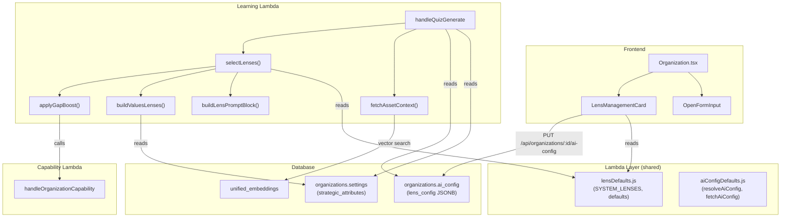

# Design Document: Question Lens System

## Overview

The Question Lens System adds diversity and depth to quiz generation by framing learning objectives through multiple "lenses" — lightweight prompt instructions that approach the same concept from different angles (failure analysis, underlying science, org values, etc.). Instead of rephrasing the same question, each quiz round selects 2–3 lenses via weighted random sampling and passes them to the Bedrock prompt as framing guidance.

The system introduces three lens sources:
1. **System Lenses** — six built-in lenses stored as constants in `lambda/shared/lensDefaults.js`
2. **Values Lenses** — auto-derived at quiz time from `organizations.settings.strategic_attributes`
3. **Custom Lenses** — org-defined lenses stored in `ai_config.lens_config.custom_lenses`

Lens selection is biased by admin-configured gap boost rules that increase specific lens weights when the organization has capability gaps on the target axis. Quiz context is enriched with cross-domain asset descriptions retrieved via vector search against skill axis embeddings in `unified_embeddings`.

The ideal answer display is removed from the `OpenFormInput` UI (retained in the payload for AI evaluation), and open-form prompt instructions are tuned for high-ceiling critical thinking expression.

**Key design decisions:**
- **No new database columns or tables.** Lens config is stored inside the existing `ai_config` JSONB column on `organizations`, extending the pattern established by the scoring-context-reduction feature.
- **No new API endpoints.** Lens config is read/written via the existing `PUT /api/organizations/:id/ai-config` endpoint by extending the payload.
- **Lens definitions as shared constants.** `lambda/shared/lensDefaults.js` is added to the Lambda layer so both the Learning Lambda and the frontend can reference the same defaults.
- **Values lenses are ephemeral.** They are derived at quiz generation time from `strategic_attributes`, never stored as lens config. This means adding/removing an org value automatically updates the lens pool.
- **Weighted random sampling without replacement** for lens selection, implemented as a simple loop that picks from a cumulative distribution and removes selected items.
- **Asset context retrieval** uses the existing `unified_embeddings` table with a vector similarity query against the skill axis embedding, filtered to `action`, `part`, `tool`, `policy` entity types.

## Architecture



## Components and Interfaces

### 1. `lambda/shared/lensDefaults.js` — Shared Lens Constants (Lambda Layer)

Added to the Lambda layer alongside `aiConfigDefaults.js`. Exports system lens definitions and resolution utilities.

```javascript
const SYSTEM_LENSES = [
  {
    key: 'failure_analysis',
    label: 'Failure Analysis',
    description: 'What could go wrong if this practice is done incorrectly or skipped?',
    defaultWeight: 0.5,
  },
  {
    key: 'underlying_science',
    label: 'Underlying Science',
    description: 'What physics, chemistry, or biology principles explain why this practice works?',
    defaultWeight: 0.5,
  },
  {
    key: 'cross_asset_comparison',
    label: 'Cross-Asset Comparison',
    description: 'How does this compare or contrast with related farm work, tools, or processes?',
    defaultWeight: 0.5,
  },
  {
    key: 'practical_tradeoffs',
    label: 'Practical Tradeoffs',
    description: 'What are the time, cost, and effort tradeoffs of different approaches?',
    defaultWeight: 0.5,
  },
  {
    key: 'root_cause_reasoning',
    label: 'Root Cause Reasoning',
    description: 'Why does this happen at a fundamental level? What is the root cause?',
    defaultWeight: 0.5,
  },
  {
    key: 'scenario_response',
    label: 'Scenario Response',
    description: 'Here is a situation — describe what you would do and why.',
    defaultWeight: 0.5,
  },
];

const LENS_CONFIG_DEFAULTS = {
  system_lens_weights: {},       // key → { weight, enabled } overrides
  custom_lenses: [],             // array of custom lens objects
  values_lens_weights: {},       // key → { weight, enabled } overrides
  gap_boost_rules: [],           // array of gap boost rule objects
};

const VALUES_LENS_DEFAULT_WEIGHT = 0.3;
const MAX_CUSTOM_LENSES = 20;
const MAX_GAP_BOOST_RULES = 10;

/**
 * Resolve the full lens config by merging stored config with defaults.
 * @param {object|null} lensConfig - Raw lens_config from ai_config JSONB
 * @returns {object} Resolved lens config with all fields guaranteed
 */
function resolveLensConfig(lensConfig) { /* ... */ }

/**
 * Build the complete lens pool (system + values + custom) with resolved weights.
 * @param {object} resolvedLensConfig - Output of resolveLensConfig
 * @param {string[]} strategicAttributes - Organization's strategic_attributes array
 * @returns {Array<{key, label, description, weight, source}>} Enabled lenses with weights
 */
function buildLensPool(resolvedLensConfig, strategicAttributes) { /* ... */ }

module.exports = {
  SYSTEM_LENSES,
  LENS_CONFIG_DEFAULTS,
  VALUES_LENS_DEFAULT_WEIGHT,
  MAX_CUSTOM_LENSES,
  MAX_GAP_BOOST_RULES,
  resolveLensConfig,
  buildLensPool,
};
```

### 2. Lens Selector — `selectLenses()` in Learning Lambda

Pure function that performs weighted random sampling without replacement.

```javascript
/**
 * Select 2–3 lenses from the pool using weighted random sampling without replacement.
 * @param {Array<{key, label, description, weight, source}>} lensPool - Enabled lenses with weights
 * @param {number|null} capabilityGap - Gap for the target axis (null if unavailable)
 * @param {Array} gapBoostRules - Admin-configured gap boost rules
 * @returns {Array<{key, label, description, source}>} Selected lenses (2–3)
 */
function selectLenses(lensPool, capabilityGap, gapBoostRules) { /* ... */ }
```

**Algorithm:**
1. Filter pool to enabled lenses with weight > 0.
2. If `capabilityGap` is not null and `gapBoostRules` is non-empty, apply gap boost (see below).
3. Determine selection count: `Math.min(pool.length, 2 + (Math.random() < 0.5 ? 1 : 0))` — randomly 2 or 3, capped by pool size.
4. Weighted random sampling without replacement:
   - Compute cumulative weights from the pool.
   - Pick a random value in `[0, totalWeight)`.
   - Find the lens whose cumulative range contains the value.
   - Remove that lens from the pool, reduce totalWeight.
   - Repeat until selection count is reached.
5. Return selected lenses.

### 3. Gap Boost — `applyGapBoost()`

```javascript
/**
 * Apply gap boost rules to lens weights.
 * Finds the highest-threshold rule that the gap meets or exceeds,
 * then multiplies the specified lens weights by the rule's multiplier.
 *
 * @param {Array<{key, weight, ...}>} lensPool - Mutable lens pool
 * @param {number} capabilityGap - Gap value for the target axis
 * @param {Array<{threshold, lens_keys, multiplier}>} rules - Gap boost rules sorted by threshold desc
 * @returns {Array} Modified lens pool with boosted weights (clamped to reasonable max)
 */
function applyGapBoost(lensPool, capabilityGap, rules) { /* ... */ }
```

**Algorithm:**
1. Sort rules by `threshold` descending.
2. Find the first rule where `capabilityGap >= rule.threshold`.
3. For each lens key in `rule.lens_keys`, multiply that lens's weight by `rule.multiplier`.
4. Return modified pool (weights are not re-normalized here; normalization happens in `selectLenses`).

### 4. Values Lens Builder — `buildValuesLenses()`

```javascript
/**
 * Build values lenses from strategic_attributes.
 * @param {string[]} strategicAttributes - e.g. ["organic", "quality", "teamwork"]
 * @param {object} valuesLensWeights - Weight overrides from lens_config
 * @returns {Array<{key, label, description, weight, source: 'values'}>}
 */
function buildValuesLenses(strategicAttributes, valuesLensWeights) { /* ... */ }
```

Each attribute becomes a lens with:
- `key`: slugified attribute (e.g., `"organic"` → `"values_organic"`)
- `label`: original attribute string
- `description`: `"How does this practice align with or reinforce the organization value: {attribute}?"`
- `weight`: override from `valuesLensWeights[key]` or `VALUES_LENS_DEFAULT_WEIGHT` (0.3)
- `source`: `'values'`

### 5. Asset Context Retriever — `fetchAssetContext()`

```javascript
/**
 * Fetch cross-domain asset context via vector similarity search.
 * @param {object} db - Database client
 * @param {string} actionId - Current action ID (excluded from results)
 * @param {string} axisKey - Target skill axis key
 * @param {string} organizationId - Organization ID for scoping
 * @returns {Promise<Array<{entity_type, entity_id, description}>>} 0–3 asset descriptions
 */
async function fetchAssetContext(db, actionId, axisKey, organizationId) { /* ... */ }
```

**SQL query:**
```sql
SELECT ue.entity_type, ue.entity_id, ue.embedding_source,
       (1 - (ue.embedding <=> (
         SELECT embedding FROM unified_embeddings
         WHERE entity_type = 'skill_axis'
           AND entity_id = $1   -- '{actionId}:{axisKey}'
         LIMIT 1
       ))) as similarity
FROM unified_embeddings ue
WHERE ue.entity_type IN ('action', 'part', 'tool', 'policy')
  AND ue.organization_id = $2
  AND NOT (ue.entity_type = 'action' AND ue.entity_id = $3)
ORDER BY similarity DESC
LIMIT 10
```

From the top 10 results, randomly select 3 (or fewer if < 3 available). Pass their `embedding_source` text to the prompt builder.

### 6. Prompt Builder — `buildLensPromptBlock()` and `buildAssetContextBlock()`

```javascript
/**
 * Build the lens instructions block for the quiz prompt.
 * @param {Array<{key, label, description, source}>} selectedLenses
 * @returns {string} Prompt text block
 */
function buildLensPromptBlock(selectedLenses) { /* ... */ }

/**
 * Build the related assets context block for the quiz prompt.
 * @param {Array<{entity_type, entity_id, description}>} assets
 * @returns {string} Prompt text block
 */
function buildAssetContextBlock(assets) { /* ... */ }
```

Example lens block output:
```
QUESTION FRAMING LENSES (use these angles to diversify question perspectives):
  1. Failure Analysis: What could go wrong if this practice is done incorrectly or skipped?
  2. Underlying Science: What physics, chemistry, or biology principles explain why this practice works?

Frame at least one question through each lens above. These are framing suggestions, not rigid constraints — the learning objective remains the primary focus.
```

Example asset context block output:
```
RELATED ASSETS (use for compare/contrast or scenario-based questions):
  1. [tool] Pruning Shears: Manual cutting tool for trimming branches and vines...
  2. [part] Organic Neem Oil: Natural pesticide derived from neem tree seeds...
  3. [action] Compost Application: Spreading decomposed organic matter on garden beds...
```

### 7. `LensManagementCard` — Frontend Component

New React component on the Organization settings page, following the `AiConfigCard` pattern.

```typescript
interface LensManagementCardProps {
  organizationId: string;
  strategicAttributes: string[];
}
```

**Sections:**
1. **System Lenses** — 6 rows, each with label, weight slider/input (0.0–1.0, step 0.1), enabled toggle.
2. **Values Lenses** — auto-populated from `strategicAttributes`, each with weight slider/input and enabled toggle. Info note: "Auto-derived from your organization values."
3. **Custom Lenses** — list of custom lenses with edit/delete, plus "Add Custom Lens" form (label input, description textarea, weight input). Max 20.
4. **Gap Boost Rules** — list of rules with threshold, target lens keys (multi-select), multiplier. Max 10.

**Data flow:**
- Reads `ai_config.lens_config` via the existing `GET /api/organizations/:id/ai-config` endpoint.
- Writes via `PUT /api/organizations/:id/ai-config` with the updated `lens_config` nested inside `ai_config`.
- Uses React Hook Form + Zod for validation, TanStack Query for fetching/mutations with optimistic updates.
- Falls back to `LENS_CONFIG_DEFAULTS` when `lens_config` is null.

### 8. `OpenFormInput` Changes

Remove the ideal answer display card (the blue-bordered `<Card>` with `<Lightbulb>` icon that shows after submission). The `idealAnswer` prop is retained for the component interface but no longer rendered. The evaluation result card (score badge + reasoning) remains unchanged.

### 9. Open-Form Prompt Tuning

Add high-ceiling instructions to `generateOpenFormQuizViaBedrock`:

```
HIGH-CEILING QUESTION DESIGN:
- Craft questions that are open-ended enough for responses ranging from basic recall to expert-level synthesis.
- Avoid questions with a single correct answer or a narrow expected response.
- Avoid yes/no framings, list-based questions, and questions that cap the learner's expression at a specific knowledge level.
- Favor questions that invite layered reasoning, multiple valid perspectives, and depth of analysis.

IDEAL ANSWER REFERENCE:
- Generate a level 4–5 reference answer that demonstrates expert-level reasoning.
- The evaluator uses this to score across the full 0–5 continuum, so the reference must represent the ceiling, not the floor.
```

## Data Models

### Lens Config (stored in `organizations.ai_config.lens_config`)

```typescript
interface LensConfig {
  system_lens_weights: Record<string, { weight: number; enabled: boolean }>;
  custom_lenses: CustomLens[];
  values_lens_weights: Record<string, { weight: number; enabled: boolean }>;
  gap_boost_rules: GapBoostRule[];
}

interface CustomLens {
  key: string;          // auto-generated slug, e.g. "custom_soil_health"
  label: string;        // 1–100 characters
  description: string;  // 1–500 characters, used as prompt instruction
  weight: number;       // 0.0–1.0
  enabled: boolean;
}

interface GapBoostRule {
  id: string;           // UUID for stable identity
  threshold: number;    // minimum capability gap (≥ 0.5)
  lens_keys: string[];  // lens keys to boost
  multiplier: number;   // 1.1–3.0
}
```

### System Lens Definition (constant, not stored)

```typescript
interface SystemLensDefinition {
  key: string;
  label: string;
  description: string;  // prompt instruction text
  defaultWeight: number; // 0.5
}
```

### Resolved Lens (runtime, used by selector)

```typescript
interface ResolvedLens {
  key: string;
  label: string;
  description: string;
  weight: number;       // resolved from config or default
  source: 'system' | 'values' | 'custom';
}
```

### Example `ai_config` JSONB (extended)

```json
{
  "max_axes": 3,
  "min_axes": 2,
  "evidence_limit": 3,
  "quiz_temperature": 0.7,
  "lens_config": {
    "system_lens_weights": {
      "failure_analysis": { "weight": 0.8, "enabled": true },
      "underlying_science": { "weight": 0.5, "enabled": true },
      "cross_asset_comparison": { "weight": 0.0, "enabled": false }
    },
    "custom_lenses": [
      {
        "key": "custom_soil_health",
        "label": "Soil Health",
        "description": "How does this practice affect long-term soil health and microbial activity?",
        "weight": 0.6,
        "enabled": true
      }
    ],
    "values_lens_weights": {
      "values_organic": { "weight": 0.4, "enabled": true }
    },
    "gap_boost_rules": [
      {
        "id": "rule-1",
        "threshold": 1.5,
        "lens_keys": ["failure_analysis", "root_cause_reasoning"],
        "multiplier": 2.0
      }
    ]
  }
}
```

## Correctness Properties

*A property is a characteristic or behavior that should hold true across all valid executions of a system — essentially, a formal statement about what the system should do. Properties serve as the bridge between human-readable specifications and machine-verifiable correctness guarantees.*

### Property 1: Weighted random selection invariants

*For any* lens pool with N enabled lenses (N ≥ 2), the `selectLenses` function SHALL return between 2 and 3 lenses (inclusive), all of which are unique (no duplicates), all of which were present in the input pool, and none of which had a weight of 0.0 or were marked as disabled.

**Validates: Requirements 1.4, 4.1, 4.2**

### Property 2: Values lens derivation from strategic attributes

*For any* array of strategic attribute strings, `buildValuesLenses` SHALL return exactly one lens per attribute, where each lens's `label` matches the original attribute string and each lens's `key` is a deterministic slug of the attribute prefixed with `values_`.

**Validates: Requirements 2.1, 2.4**

### Property 3: Lens config validation

*For any* lens config object, `resolveLensConfig` SHALL produce a valid config where all system lens weights are in [0.0, 1.0], all custom lens labels are 1–100 characters, all custom lens descriptions are 1–500 characters, all custom lens weights are in [0.0, 1.0], no two custom lenses share the same label, and the custom lenses array has at most 20 entries. Invalid or missing fields SHALL be replaced with defaults.

**Validates: Requirements 3.1, 3.6, 9.5, 9.7, 9.8**

### Property 4: Gap boost rule application

*For any* lens pool, capability gap value, and set of gap boost rules, `applyGapBoost` SHALL find the rule with the highest threshold that the gap meets or exceeds, and multiply only the weights of the lenses specified in that rule's `lens_keys` by the rule's multiplier. When no rules match or the rules array is empty, all weights SHALL remain unchanged.

**Validates: Requirements 5.4, 5.5, 5.6**

### Property 5: Asset context random selection

*For any* list of N asset results (N ≥ 0), the random asset selector SHALL return `min(3, N)` unique items, all of which are members of the original list.

**Validates: Requirements 6.4, 6.6**

### Property 6: Prompt construction includes lens instructions and asset descriptions

*For any* set of selected lenses and asset descriptions, the constructed prompt blocks SHALL contain every selected lens's description text and every asset's `embedding_source` text as substrings.

**Validates: Requirements 4.4, 6.5**

### Property 7: Selection randomness

*For any* lens pool with 4 or more enabled lenses, running `selectLenses` 20 times SHALL produce at least 2 distinct lens combinations, demonstrating that the random selection provides natural question diversity.

**Validates: Requirements 4.6**

## Error Handling

| Scenario | Behavior | Requirement |
|---|---|---|
| `lens_config` is null or missing | Use `LENS_CONFIG_DEFAULTS` — all system lenses at weight 0.5, no custom lenses, no gap boost rules | 1.2 |
| `strategic_attributes` is null or empty | Skip values lenses, proceed with system + custom only | 2.5 |
| Fewer than 2 enabled lenses in pool | Select all available (0 or 1) | 4.3 |
| `handleOrganizationCapability` fails or returns no data | Fall back to unmodified lens weights, log warning | 5.7 |
| Skill axis embedding not found in `unified_embeddings` | Skip asset context, proceed with quiz generation, log warning | 6.7 |
| Vector search query fails | Skip asset context, proceed with quiz generation, log warning | 6.7 |
| Custom lens count exceeds 20 | Reject save with validation error | 3.5 |
| Gap boost rule count exceeds 10 | Reject save with validation error | 5.8 |
| Duplicate custom lens label | Reject save with validation error | 3.6 |

## Testing Strategy

### Property-Based Tests (fast-check)

The project uses Vitest. Property-based tests will use [fast-check](https://github.com/dubzzz/fast-check) with a minimum of 100 iterations per property.

Each property test references its design document property:

```javascript
// Feature: question-lens-system, Property 1: Weighted random selection invariants
test.prop([lensPoolArb], (pool) => { /* ... */ }, { numRuns: 100 });
```

**Properties to implement:**
1. **Weighted random selection invariants** — generate random lens pools, verify count (2–3), uniqueness, membership, and exclusion of disabled/zero-weight lenses.
2. **Values lens derivation** — generate random string arrays, verify 1:1 mapping and deterministic key generation.
3. **Lens config validation** — generate random config objects (including nulls, out-of-range values, duplicates), verify resolution produces valid output.
4. **Gap boost rule application** — generate random pools, gap values, and rule sets, verify correct rule selection and multiplier application.
5. **Asset context random selection** — generate random asset lists of varying lengths, verify selection count and membership.
6. **Prompt construction** — generate random lens/asset sets, verify all descriptions appear in output.
7. **Selection randomness** — generate random pools, run selector 20 times, verify variation.

### Unit Tests (example-based)

- System lens constant has exactly 6 entries with expected keys (Req 1.1)
- Default weights are 0.5 for system lenses, 0.3 for values lenses (Req 1.2, 2.3)
- `OpenFormInput` does not render ideal answer card after submission (Req 7.1, 7.4)
- `OpenFormInput` still renders evaluation result badge and reasoning (Req 7.3)
- Open-form prompt contains high-ceiling instructions (Req 8.1, 8.2, 8.3)
- Open-form prompt instructs level 4–5 ideal answer (Req 8.4)
- `LensManagementCard` renders system, values, and custom sections (Req 9.2, 9.4, 9.10)
- `LensManagementCard` is visible only to admin/leadership roles (Req 9.1)
- Asset context query includes correct entity types and excludes current action (Req 6.2, 6.3)

### Integration Tests

- End-to-end quiz generation with lenses: verify prompt sent to Bedrock includes lens block
- Lens config persistence: save via API, reload, verify round-trip
- Gap boost with real capability data: verify multiplier is applied when gap exceeds threshold
- Asset context retrieval: verify vector search returns correct entity types
