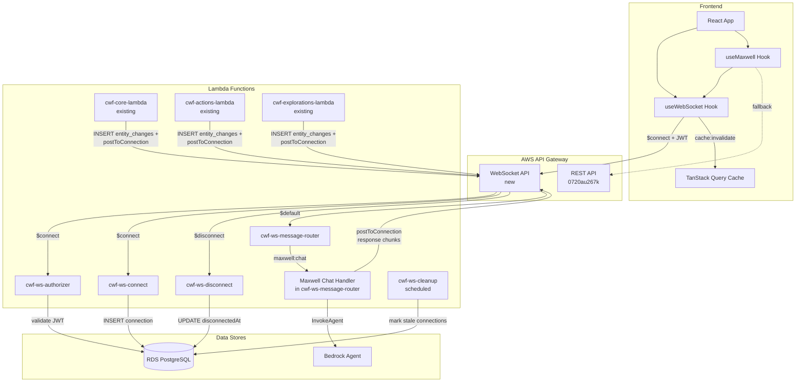
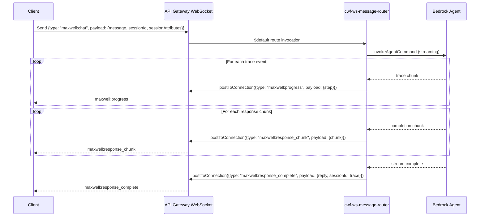
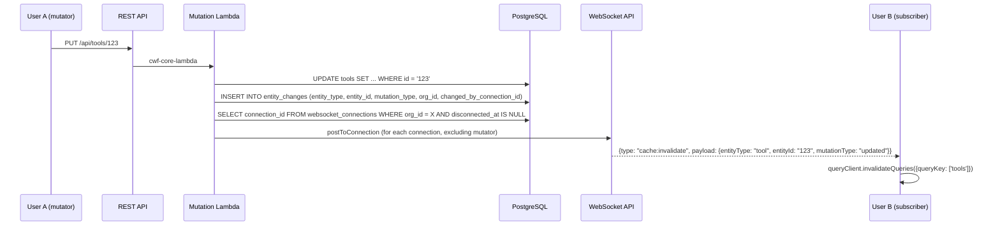

# Design Document: Real-Time WebSocket API

## Overview

This design adds a WebSocket API to CWF that solves two problems: Maxwell chat timeouts (Bedrock Agent routinely exceeds the 29-second REST API Gateway limit) and stale data across browser tabs/users (mutations by one user aren't visible to others until manual refresh).

The WebSocket API uses **AWS API Gateway WebSocket API** with three routes (`$connect`, `$disconnect`, `$default`), each backed by a Lambda function. Connection state is tracked in the existing RDS PostgreSQL database. The frontend gets a `useWebSocket` hook that manages the connection lifecycle, and the existing `useMaxwell` hook is updated to send chat messages over WebSocket with a REST fallback.

Cache invalidation works by having mutation Lambdas record entity changes in a new `entity_changes` table and broadcast `cache:invalidate` messages to all active WebSocket connections in the same organization. On reconnect, the client receives catch-up events for changes missed during disconnection.

### Key Design Decisions

| Decision | Choice | Rationale |
|----------|--------|-----------|
| Transport | API Gateway WebSocket API | Bidirectional support, native AWS integration, future features (presence, typing indicators) |
| Connection store | RDS PostgreSQL | 0.054ms query time measured, avoids introducing DynamoDB, keeps ops simple |
| Auth | Lambda authorizer on $connect | Matches existing `cwf-api-authorizer` pattern, validates Cognito JWT, extracts org context |
| Streaming | Bedrock Agent `completion` async iterator → `postToConnection` | Reuses existing maxwell-chat streaming logic, sends chunks as they arrive |
| Cache invalidation | Direct `postToConnection` from mutation Lambdas | Simple, no extra infrastructure (SNS/EventBridge), mutation Lambdas already have org context |
| Fallback | REST endpoint preserved | WebSocket is additive; if connection is down, Maxwell chat falls back to REST |

## Architecture

### System Architecture Diagram



### Request Flow: Maxwell Chat over WebSocket



### Request Flow: Cache Invalidation



## Components and Interfaces

### Lambda Functions

#### 1. cwf-ws-authorizer

**Purpose**: Validates Cognito JWT on `$connect` and extracts user/org context.

**Pattern**: Mirrors existing `cwf-api-authorizer` but adapted for WebSocket API Gateway event format. WebSocket authorizers receive the token from query string parameters (not headers), since the browser WebSocket API doesn't support custom headers.

```javascript
// Input: event.queryStringParameters.token (JWT)
// Output: IAM policy + context {organization_id, cognito_user_id, permissions}

exports.handler = async (event) => {
  const token = event.queryStringParameters?.token;
  // Verify JWT against Cognito JWKS
  // Query organization_members for org context
  // Return generatePolicy(cognitoUserId, 'Allow', resource, context)
};
```

**Key difference from REST authorizer**: Token comes from `event.queryStringParameters.token` instead of `event.authorizationToken`. The JWT verification and org lookup logic is shared via the Lambda layer.

#### 2. cwf-ws-connect

**Purpose**: Records new WebSocket connections in the database.

```javascript
// Input: event.requestContext.connectionId, event.requestContext.authorizer
// Side effect: INSERT into websocket_connections

exports.handler = async (event) => {
  const { connectionId } = event.requestContext;
  const { organization_id, cognito_user_id } = event.requestContext.authorizer;
  // INSERT INTO websocket_connections (connection_id, user_id, organization_id, connected_at)
  // Check for catch-up: query entity_changes since last disconnectedAt for this user
  // Send catch-up cache:invalidate events via postToConnection
  return { statusCode: 200 };
};
```

#### 3. cwf-ws-disconnect

**Purpose**: Marks connections as disconnected (soft delete).

```javascript
// Input: event.requestContext.connectionId
// Side effect: UPDATE websocket_connections SET disconnected_at = NOW()

exports.handler = async (event) => {
  const { connectionId } = event.requestContext;
  // UPDATE websocket_connections SET disconnected_at = NOW() WHERE connection_id = $1
  return { statusCode: 200 };
};
```

#### 4. cwf-ws-message-router

**Purpose**: Routes incoming WebSocket messages by type. Handles `maxwell:chat`, `ping`, and unknown types.

```javascript
// Input: event.body (JSON string with {type, payload, timestamp})
// Routes to appropriate handler based on type

exports.handler = async (event) => {
  const { connectionId } = event.requestContext;
  let message;
  try {
    message = JSON.parse(event.body);
  } catch {
    // Send error response
    return { statusCode: 400 };
  }

  switch (message.type) {
    case 'maxwell:chat':
      return handleMaxwellChat(connectionId, message.payload, event);
    case 'ping':
      return handlePing(connectionId, event);
    default:
      return handleUnknownType(connectionId, message.type, event);
  }
};
```

**Maxwell Chat Handler** (within message-router or as a separate module):

Reuses the existing `maxwell-chat` Lambda logic (prompt detection, instruction prefix building, Bedrock Agent invocation) but instead of collecting the full response and returning it as HTTP, it streams chunks back via `postToConnection`.

```javascript
async function handleMaxwellChat(connectionId, payload, event) {
  const { message, sessionId, sessionAttributes } = payload;
  const apiGwClient = new ApiGatewayManagementApiClient({
    endpoint: `https://${event.requestContext.domainName}/${event.requestContext.stage}`
  });

  // Build enhanced message (same logic as existing maxwell-chat Lambda)
  const enhancedMessage = buildInstructionPrefix(message) + message;

  const command = new InvokeAgentCommand({ ... });
  const response = await bedrockClient.send(command);

  for await (const chunk of response.completion) {
    if (chunk.trace) {
      await postToConnection(apiGwClient, connectionId, {
        type: 'maxwell:progress',
        payload: { step: extractTraceStep(chunk.trace) },
        timestamp: new Date().toISOString()
      });
    }
    if (chunk.chunk?.bytes) {
      const text = new TextDecoder().decode(chunk.chunk.bytes);
      reply += text;
      await postToConnection(apiGwClient, connectionId, {
        type: 'maxwell:response_chunk',
        payload: { chunk: text },
        timestamp: new Date().toISOString()
      });
    }
  }

  await postToConnection(apiGwClient, connectionId, {
    type: 'maxwell:response_complete',
    payload: { reply, sessionId: effectiveSessionId, trace: traceEvents },
    timestamp: new Date().toISOString()
  });
}
```

#### 5. cwf-ws-cleanup (EventBridge scheduled)

**Purpose**: Marks stale connections as disconnected. Runs every hour. Also deletes entity_changes records older than 7 days.

```javascript
exports.handler = async () => {
  // Mark connections older than 24h with no disconnected_at
  await queryJSON(`
    UPDATE websocket_connections 
    SET disconnected_at = NOW() 
    WHERE disconnected_at IS NULL 
    AND connected_at < NOW() - INTERVAL '24 hours'
  `);
  
  // Delete old entity_changes records
  await queryJSON(`
    DELETE FROM entity_changes 
    WHERE created_at < NOW() - INTERVAL '7 days'
  `);
};
```

### Cache Invalidation Broadcasting (in mutation Lambdas)

A shared utility function added to the `cwf-common-nodejs` Lambda layer:

```javascript
// /opt/nodejs/broadcastInvalidation.js
const { ApiGatewayManagementApiClient, PostToConnectionCommand } = require('@aws-sdk/client-apigatewaymanagementapi');
const { getDbClient } = require('/opt/nodejs/db');

const WS_ENDPOINT = process.env.WS_API_ENDPOINT; // e.g., https://abc123.execute-api.us-west-2.amazonaws.com/prod

async function broadcastInvalidation({ entityType, entityId, mutationType, organizationId, excludeConnectionId }) {
  if (!WS_ENDPOINT) return; // WebSocket not configured, skip silently
  
  const client = await getDbClient();
  try {
    // Record the change
    await client.query(`
      INSERT INTO entity_changes (entity_type, entity_id, mutation_type, organization_id, changed_by_connection_id, created_at)
      VALUES ($1, $2, $3, $4, $5, NOW())
    `, [entityType, entityId, mutationType, organizationId, excludeConnectionId]);

    // Get active connections for this org
    const { rows: connections } = await client.query(`
      SELECT connection_id FROM websocket_connections
      WHERE organization_id = $1 AND disconnected_at IS NULL
    `, [organizationId]);

    const apiGwClient = new ApiGatewayManagementApiClient({ endpoint: WS_ENDPOINT });
    const message = JSON.stringify({
      type: 'cache:invalidate',
      payload: { entityType, entityId, mutationType },
      timestamp: new Date().toISOString()
    });

    // Send to all connections except the mutator
    await Promise.allSettled(
      connections
        .filter(c => c.connection_id !== excludeConnectionId)
        .map(c => apiGwClient.send(new PostToConnectionCommand({
          ConnectionId: c.connection_id,
          Data: message
        })).catch(err => {
          if (err.statusCode === 410) {
            // Connection is gone, mark as disconnected
            return client.query(
              `UPDATE websocket_connections SET disconnected_at = NOW() WHERE connection_id = $1`,
              [c.connection_id]
            );
          }
        }))
    );
  } finally {
    client.release();
  }
}

module.exports = { broadcastInvalidation };
```

### Frontend Components

#### useWebSocket Hook

```typescript
// src/hooks/useWebSocket.ts
interface UseWebSocketReturn {
  status: 'connecting' | 'connected' | 'disconnected' | 'reconnecting';
  sendMessage: (type: string, payload: Record<string, unknown>) => void;
  subscribe: (type: string, handler: (payload: any) => void) => () => void;
  connectionId: string | null;
}

function useWebSocket(): UseWebSocketReturn {
  // 1. Get Cognito JWT token
  // 2. Connect to wss://{api-id}.execute-api.{region}.amazonaws.com/{stage}?token={jwt}
  // 3. Handle reconnection with exponential backoff (1s → 2s → 4s → ... → 30s max)
  // 4. Send ping every 5 minutes to prevent idle timeout
  // 5. Route incoming messages to subscribers by type
  // 6. Expose connection status for UI indicator
}
```

#### Updated useMaxwell Hook

The existing `useMaxwell` hook is updated to use WebSocket for sending messages and receiving streamed responses, with REST fallback:

```typescript
function useMaxwell(sessionAttributes: MaxwellSessionAttributes): UseMaxwellReturn {
  const { status, sendMessage, subscribe } = useWebSocket();
  
  const sendMessageViaWs = useCallback(async (text: string) => {
    if (status === 'connected') {
      sendMessage('maxwell:chat', { message: text, sessionId, sessionAttributes });
      // Subscribe to maxwell:response_chunk, maxwell:response_complete, maxwell:error
    } else {
      // Fallback to REST: apiService.post('/agent/maxwell-chat', ...)
    }
  }, [status, sendMessage, sessionId, sessionAttributes]);
  
  // ... same public interface: messages, isLoading, error, sessionId, sendMessage, resetSession
}
```

#### Cache Invalidation Integration

```typescript
// src/hooks/useCacheInvalidation.ts
function useCacheInvalidation() {
  const { subscribe } = useWebSocket();
  const queryClient = useQueryClient();

  useEffect(() => {
    const unsubscribe = subscribe('cache:invalidate', (payload) => {
      const { entityType, entityId, mutationType } = payload;
      
      // Map entity types to TanStack Query keys
      const queryKeyMap: Record<string, () => unknown[]> = {
        tool: () => toolsQueryKey(),
        part: () => ['parts'],  // follows existing pattern
        action: () => actionsQueryKey(),
        issue: () => issuesQueryKey(),
        mission: () => missionsQueryKey(),
        exploration: () => explorationsQueryKey(),
        experience: () => experiencesQueryKey(),
      };

      const keyFn = queryKeyMap[entityType];
      if (keyFn) {
        queryClient.invalidateQueries({ queryKey: keyFn() });
      }
    });

    return unsubscribe;
  }, [subscribe, queryClient]);
}
```

### Message Protocol

All WebSocket messages use a JSON envelope:

```typescript
interface WebSocketMessage {
  type: string;       // Message type identifier (namespaced with colon)
  payload: object;    // Type-specific data
  timestamp: string;  // ISO 8601 timestamp
}
```

#### Client → Server Messages

| Type | Payload | Description |
|------|---------|-------------|
| `maxwell:chat` | `{ message: string, sessionId?: string, sessionAttributes: object }` | Send a chat message to Maxwell |
| `ping` | `{}` | Keepalive to prevent idle timeout |

#### Server → Client Messages

| Type | Payload | Description |
|------|---------|-------------|
| `maxwell:response_chunk` | `{ chunk: string }` | Partial response text from Bedrock Agent |
| `maxwell:response_complete` | `{ reply: string, sessionId: string, trace: object[] }` | Full response with session and trace data |
| `maxwell:progress` | `{ step: string }` | Agent activity indicator ("Searching...", "Analyzing...") |
| `maxwell:error` | `{ code: string, message: string }` | Error during Maxwell processing |
| `cache:invalidate` | `{ entityType: string, entityId: string, mutationType: 'created' \| 'updated' \| 'deleted' }` | Cache invalidation event |
| `pong` | `{}` | Response to ping |
| `error` | `{ code: string, message: string }` | General error (bad message format, unknown type) |

#### Error Codes

| Code | Meaning |
|------|---------|
| `INVALID_JSON` | Message body is not valid JSON |
| `UNKNOWN_TYPE` | Message type not recognized |
| `MISSING_PAYLOAD` | Required payload fields missing |
| `MAXWELL_THROTTLED` | Bedrock Agent throttling (ThrottlingException) |
| `MAXWELL_TIMEOUT` | Bedrock Agent exceeded quota (ServiceQuotaExceededException) |
| `MAXWELL_ERROR` | General Bedrock Agent error |
| `INTERNAL_ERROR` | Unexpected server error |

## Data Models

### websocket_connections Table

```sql
CREATE TABLE websocket_connections (
  id UUID PRIMARY KEY DEFAULT gen_random_uuid(),
  connection_id VARCHAR(255) NOT NULL UNIQUE,
  user_id UUID NOT NULL,
  organization_id UUID NOT NULL REFERENCES organizations(id),
  connected_at TIMESTAMPTZ NOT NULL DEFAULT NOW(),
  disconnected_at TIMESTAMPTZ
);

CREATE INDEX idx_ws_connections_org_active 
  ON websocket_connections (organization_id) 
  WHERE disconnected_at IS NULL;

CREATE INDEX idx_ws_connections_user 
  ON websocket_connections (user_id);

CREATE INDEX idx_ws_connections_cleanup 
  ON websocket_connections (connected_at) 
  WHERE disconnected_at IS NULL;
```

**Design notes**:
- `disconnected_at IS NULL` partial indexes keep active-connection queries fast.
- Soft delete (setting `disconnected_at` instead of deleting) supports the catch-up mechanism: when a user reconnects, we query `entity_changes` since their last `disconnected_at`.
- `user_id` stores the UUID from `organization_members`, not the Cognito sub. The authorizer resolves Cognito sub → user UUID.

### entity_changes Table

```sql
CREATE TABLE entity_changes (
  id UUID PRIMARY KEY DEFAULT gen_random_uuid(),
  entity_type VARCHAR(50) NOT NULL,
  entity_id UUID NOT NULL,
  mutation_type VARCHAR(20) NOT NULL CHECK (mutation_type IN ('created', 'updated', 'deleted')),
  organization_id UUID NOT NULL REFERENCES organizations(id),
  changed_by_connection_id VARCHAR(255),
  created_at TIMESTAMPTZ NOT NULL DEFAULT NOW()
);

CREATE INDEX idx_entity_changes_catchup 
  ON entity_changes (organization_id, created_at);

CREATE INDEX idx_entity_changes_cleanup 
  ON entity_changes (created_at);
```

**Design notes**:
- `changed_by_connection_id` is nullable because mutations from REST (non-WebSocket) clients won't have a connection ID. In that case, all org connections receive the invalidation.
- The `catchup` index supports the reconnection query: `WHERE organization_id = $1 AND created_at > $2`.
- Records older than 7 days are deleted by the cleanup Lambda.

### Entity-to-Query-Key Mapping

The frontend maps `entity_type` values from `cache:invalidate` messages to TanStack Query keys:

| entity_type | Query Key | Notes |
|-------------|-----------|-------|
| `tool` | `['tools']` | Invalidates tool list |
| `part` | `['parts']` | Invalidates parts list (not yet in queryKeys.ts, will add) |
| `action` | `['actions']`, `['actions_completed']`, `['actions_all']` | Invalidates all action caches |
| `issue` | `['issues', ...]` | Invalidates with fuzzy match on prefix |
| `mission` | `['missions']` | Invalidates mission list |
| `exploration` | `['explorations']` | Invalidates exploration list |
| `experience` | `['experiences']` | Invalidates experience list |


## Correctness Properties

*A property is a characteristic or behavior that should hold true across all valid executions of a system — essentially, a formal statement about what the system should do. Properties serve as the bridge between human-readable specifications and machine-verifiable correctness guarantees.*

### Property 1: Authorizer context extraction

*For any* valid JWT token containing a Cognito sub, and any organization_members record mapping that sub to an organization, the authorizer SHALL return a policy context containing the correct `organization_id`, `cognito_user_id`, and `permissions` matching the database state. *For any* invalid token (expired, wrong issuer, malformed), the authorizer SHALL return a Deny policy.

**Validates: Requirements 1.1, 1.5**

### Property 2: Time-based cleanup retention window

*For any* set of `websocket_connections` records with varying `connected_at` timestamps and `disconnected_at` states, and *for any* set of `entity_changes` records with varying `created_at` timestamps, after running the cleanup process: (a) all connections older than 24 hours with NULL `disconnected_at` SHALL have `disconnected_at` set; (b) all connections within 24 hours or already disconnected SHALL be unchanged; (c) all entity_changes older than 7 days SHALL be deleted; (d) all entity_changes within 7 days SHALL be preserved.

**Validates: Requirements 1.4, 3.6**

### Property 3: Maxwell command construction

*For any* chat message string, optional sessionId, and sessionAttributes object (with varying entityId, entityType, entityName, policy, implementation fields), the Maxwell chat handler SHALL construct an InvokeAgentCommand where: (a) `inputText` contains the instruction prefix followed by the original message; (b) `sessionId` matches the provided sessionId or is a generated ID if none provided; (c) `sessionState.sessionAttributes` contains all provided session attributes as strings plus `organization_id` and `current_date`.

**Validates: Requirements 2.1, 2.5**

### Property 4: Streaming chunk message formatting

*For any* sequence of Bedrock Agent completion chunks (each containing optional `chunk.bytes` and optional `trace` data), the Maxwell chat handler SHALL produce: (a) one `maxwell:response_chunk` message per chunk with bytes, where the payload `chunk` field equals the decoded text; (b) one `maxwell:progress` message per trace event; (c) all messages conform to the JSON envelope format with `type`, `payload`, and `timestamp` fields.

**Validates: Requirements 2.2, 2.7**

### Property 5: Bedrock error code mapping

*For any* Bedrock Agent error, the Maxwell chat handler SHALL map it to the correct error code: ThrottlingException → `MAXWELL_THROTTLED`, ServiceQuotaExceededException → `MAXWELL_TIMEOUT`, all other errors → `MAXWELL_ERROR`. The resulting `maxwell:error` message SHALL contain both the error `code` and a non-empty `message` string.

**Validates: Requirements 2.6**

### Property 6: Organization-scoped broadcasting with mutator exclusion

*For any* set of active WebSocket connections distributed across multiple organizations, and *for any* cache invalidation event originating from a specific connection in a specific organization: (a) all active connections in the same organization (excluding the originating connection) SHALL receive the `cache:invalidate` message; (b) no connections in other organizations SHALL receive the message; (c) the originating connection SHALL NOT receive the message.

**Validates: Requirements 3.2, 6.5**

### Property 7: Reconnection catch-up completeness

*For any* set of `entity_changes` records with varying timestamps and organization IDs, and *for any* reconnecting client with a known `disconnected_at` timestamp and organization ID: (a) all entity_changes created after `disconnected_at` for the client's organization SHALL be sent as catch-up events; (b) no entity_changes created before `disconnected_at` SHALL be sent; (c) no entity_changes from other organizations SHALL be sent.

**Validates: Requirements 3.4**

### Property 8: Message envelope round-trip

*For any* message type string and payload object, serializing a WebSocket message (adding `timestamp`) and then deserializing it SHALL produce an object where: (a) `type` equals the original type; (b) `payload` deep-equals the original payload; (c) `timestamp` is a valid ISO 8601 string.

**Validates: Requirements 4.1**

### Property 9: Invalid message resilience

*For any* string that is either not valid JSON or is valid JSON but has an unrecognized `type` field or is missing required fields, the message router SHALL: (a) return an `error` message with a descriptive `code` (one of `INVALID_JSON`, `UNKNOWN_TYPE`, `MISSING_PAYLOAD`); (b) not throw an unhandled exception; (c) not close the WebSocket connection.

**Validates: Requirements 4.4**

### Property 10: Exponential backoff calculation

*For any* retry count n (where n ≥ 0), the reconnection delay SHALL equal `min(2^n * 1000, 30000)` milliseconds. The delay SHALL always be between 1000ms and 30000ms inclusive.

**Validates: Requirements 5.2**

### Property 11: Client-side message routing

*For any* incoming WebSocket message with a known type prefix (`maxwell:*` or `cache:invalidate`), the client-side router SHALL invoke the correct handler. For `cache:invalidate` messages with a valid `entityType`, the router SHALL call `queryClient.invalidateQueries()` with the correct query key for that entity type. For messages with unknown types, the router SHALL not throw.

**Validates: Requirements 5.3, 3.3**

### Property 12: Response chunk accumulation

*For any* ordered sequence of `maxwell:response_chunk` messages, the accumulated display text SHALL equal the concatenation of all `payload.chunk` values in the order received. The final accumulated text SHALL equal the `reply` field in the subsequent `maxwell:response_complete` message.

**Validates: Requirements 5.5**

## Error Handling

### Server-Side Errors

| Error Scenario | Handling | Recovery |
|----------------|----------|----------|
| JWT validation fails on $connect | Return 401, reject connection | Client retries with fresh token |
| Database unavailable during $connect | Return 500, reject connection | Client reconnects with backoff |
| Bedrock Agent ThrottlingException | Send `maxwell:error` with `MAXWELL_THROTTLED` | Client shows "Maxwell is busy" message |
| Bedrock Agent ServiceQuotaExceededException | Send `maxwell:error` with `MAXWELL_TIMEOUT` | Client shows "Maxwell took too long" message |
| Bedrock Agent generic error | Send `maxwell:error` with `MAXWELL_ERROR` | Client shows generic error, user can retry |
| `postToConnection` returns 410 (GoneException) | Mark connection as disconnected in DB | Connection is cleaned up, client reconnects |
| Invalid JSON from client | Send `error` with `INVALID_JSON` | Connection stays open, client can retry |
| Unknown message type from client | Send `error` with `UNKNOWN_TYPE` | Connection stays open, client can send valid messages |
| Database error during broadcast | Log error, skip failed connections | Other connections still receive the event |

### Client-Side Errors

| Error Scenario | Handling | Recovery |
|----------------|----------|----------|
| WebSocket connection drops | Set status to `reconnecting`, start exponential backoff | Auto-reconnect with backoff (1s → 30s max) |
| WebSocket connection fails to establish | Set status to `disconnected` | Retry with backoff; Maxwell falls back to REST |
| Token expired during connection | Close connection, refresh token, reconnect | Automatic via Cognito token refresh |
| Server sends unparseable message | Log warning, ignore message | No action needed |
| Ping timeout (no pong received) | Close connection, trigger reconnect | Auto-reconnect with backoff |

### Graceful Degradation

The system is designed so WebSocket is additive — all existing functionality works without it:

1. **Maxwell chat**: Falls back to REST `POST /api/agent/maxwell-chat` when WebSocket is disconnected. The REST endpoint remains deployed and functional.
2. **Data freshness**: Without WebSocket, data freshness reverts to the current behavior (manual refresh or TanStack Query's `staleTime` refetch). No data loss, just delayed visibility.
3. **Connection indicator**: The UI shows connection status so users know when real-time features are active.

## Testing Strategy

### Property-Based Tests (Vitest + fast-check)

Property-based tests use [fast-check](https://github.com/dubzzz/fast-check) with Vitest (the project's existing test runner). Each property test runs a minimum of 100 iterations.

| Property | Test File | What It Validates |
|----------|-----------|-------------------|
| Property 1: Authorizer context | `src/__tests__/ws-authorizer.property.test.ts` | JWT → policy context mapping |
| Property 2: Cleanup retention | `src/__tests__/ws-cleanup.property.test.ts` | Time-based record cleanup |
| Property 3: Command construction | `src/__tests__/ws-maxwell-command.property.test.ts` | Chat message → Bedrock command |
| Property 4: Chunk formatting | `src/__tests__/ws-streaming.property.test.ts` | Bedrock chunks → WebSocket messages |
| Property 5: Error code mapping | `src/__tests__/ws-error-mapping.property.test.ts` | Bedrock errors → error codes |
| Property 6: Org-scoped broadcast | `src/__tests__/ws-broadcast.property.test.ts` | Org isolation + mutator exclusion |
| Property 7: Catch-up completeness | `src/__tests__/ws-catchup.property.test.ts` | Reconnection catch-up correctness |
| Property 8: Envelope round-trip | `src/__tests__/ws-message-envelope.property.test.ts` | Serialize/deserialize identity |
| Property 9: Invalid message resilience | `src/__tests__/ws-message-router.property.test.ts` | Bad input → error response |
| Property 10: Backoff calculation | `src/__tests__/ws-backoff.property.test.ts` | Exponential backoff formula |
| Property 11: Client routing | `src/__tests__/ws-client-routing.property.test.ts` | Message type → handler dispatch |
| Property 12: Chunk accumulation | `src/__tests__/ws-chunk-accumulation.property.test.ts` | Ordered chunks → full text |

Each test is tagged with: `Feature: realtime-websocket, Property {N}: {title}`

### Unit Tests (Vitest)

- Authorizer: valid token returns Allow policy, invalid token returns Deny
- Connect handler: inserts connection record with correct fields
- Disconnect handler: sets `disconnected_at`, does not delete row
- Message router: routes `maxwell:chat` to chat handler, `ping` to pong handler
- `broadcastInvalidation`: constructs correct `cache:invalidate` message
- `useWebSocket`: connection lifecycle (connect, disconnect, reconnect)
- `useMaxwell`: WebSocket path vs REST fallback
- `useCacheInvalidation`: entity type → query key mapping

### Integration Tests

- End-to-end WebSocket connection with real Cognito token
- Maxwell chat message → Bedrock Agent → streamed response
- Mutation → entity_changes INSERT → broadcast to connected clients
- Reconnection catch-up: disconnect, mutate, reconnect, verify catch-up events
- Cleanup Lambda: verify stale connections and old entity_changes are cleaned up

### Manual Testing Checklist

- [ ] Open two browser tabs, make a mutation in one, verify the other updates
- [ ] Start a Maxwell chat, verify streaming response appears incrementally
- [ ] Kill the WebSocket connection (DevTools), verify reconnection and catch-up
- [ ] Verify connection status indicator shows correct state
- [ ] Test with expired token — verify reconnection with fresh token
- [ ] Test Maxwell chat when WebSocket is down — verify REST fallback works
