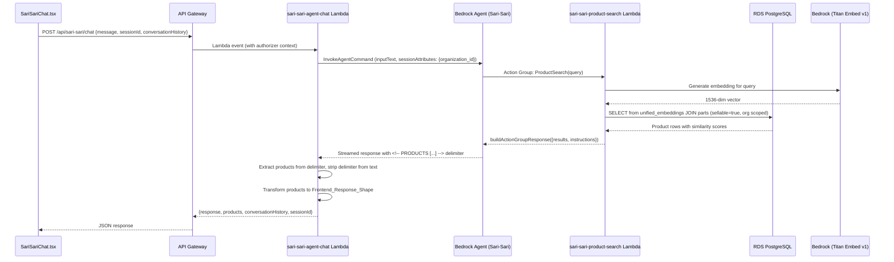

# Design Document: Sari-Sari Agent

## Overview

This design migrates the sari-sari store chat backend from a custom 5-step SearchPipeline Lambda (with fragile regex-based JSON extraction) to an AWS Bedrock Agent architecture. The new system follows the proven Maxwell pattern: a thin chat Lambda (`sari-sari-agent-chat/index.js`) that proxies requests to a Bedrock Agent, plus an action group Lambda (`sari-sari-product-search/index.js`) that performs embedding similarity search against sellable products.

The existing frontend (`SariSariChat.tsx`) remains completely unchanged — the new chat Lambda returns the exact same response shape (`{ response, products, conversationHistory, sessionId }`).

### Key Design Decisions

1. **Follow Maxwell pattern exactly**: Thin chat Lambda + action group Lambda, same `InvokeAgentCommand` flow, same session attribute forwarding for org scoping.
2. **Preserve conversational style**: The agent's system instructions replicate the current sari-sari-chat response generation prompt — brief (1-2 sentences), bilingual (English/Tagalog), natural health benefit mentions, 2-3 product selections.
3. **Delimiter-based product extraction**: The agent embeds structured product JSON in its response using `<!-- PRODUCTS [...] -->` delimiters. The chat Lambda strips this block and returns it as the `products` array. This is more reliable than the current `text.match(/\{[\s\S]*\}/)` regex approach because the delimiter is a fixed, non-LLM-generated pattern.
4. **Reuse shared infrastructure**: The action group Lambda uses `generateEmbeddingV1` from the shared embeddings module and `getDbClient`/`escapeLiteral` from the common Lambda layer, matching maxwell-storage-advisor.

## Architecture


```mermaid
sequenceDiagram
    participant FE as SariSariChat.tsx
    participant GW as API Gateway
    participant CL as sari-sari-agent-chat Lambda
    participant BA as Bedrock Agent (Sari-Sari)
    participant PS as sari-sari-product-search Lambda
    participant DB as RDS PostgreSQL
    participant BR as Bedrock (Titan Embed v1)

    FE->>GW: POST /api/sari-sari/chat {message, sessionId, conversationHistory}
    GW->>CL: Lambda event (with authorizer context)
    CL->>BA: InvokeAgentCommand (inputText, sessionAttributes: {organization_id})
    BA->>PS: Action Group: ProductSearch(query)
    PS->>BR: Generate embedding for query
    BR-->>PS: 1536-dim vector
    PS->>DB: SELECT from unified_embeddings JOIN parts (sellable=true, org scoped)
    DB-->>PS: Product rows with similarity scores
    PS-->>BA: buildActionGroupResponse({results, instructions})
    BA-->>CL: Streamed response with <!-- PRODUCTS [...] --> delimiter
    CL->>CL: Extract products from delimiter, strip delimiter from text
    CL->>CL: Transform products to Frontend_Response_Shape
    CL-->>GW: {response, products, conversationHistory, sessionId}
    GW-->>FE: JSON response
```

### Component Mapping to Maxwell

| Maxwell Component | Sari-Sari Equivalent | Notes |
|---|---|---|
| `maxwell-chat/index.js` | `sari-sari-agent-chat/index.js` | Same InvokeAgentCommand pattern, but returns `{response, products, conversationHistory, sessionId}` instead of `{reply, sessionId}` |
| `maxwell-storage-advisor/index.js` | `sari-sari-product-search/index.js` | Same `parseActionGroupParams` + `buildActionGroupResponse` pattern, but queries sellable parts instead of storage locations |
| `MAXWELL_AGENT_ID` env var | `SARI_SARI_AGENT_ID` env var | Separate Bedrock Agent |
| `MAXWELL_AGENT_ALIAS_ID` env var | `SARI_SARI_AGENT_ALIAS_ID` env var | Separate alias |

## Components and Interfaces

### 1. Sari-Sari Agent Chat Lambda (`sari-sari-agent-chat/index.js`)

Thin proxy Lambda that receives HTTP requests from the frontend and invokes the Bedrock Agent.

**Input** (from API Gateway):
```json
{
  "body": "{\"message\": \"do you have organic vegetables?\", \"sessionId\": \"session-123\", \"conversationHistory\": []}",
  "requestContext": {
    "authorizer": {
      "organization_id": "org-uuid"
    }
  }
}
```

**Processing**:
1. Validate request: `message` required, `organization_id` from authorizer context required, agent env vars required
2. Generate `sessionId` if not provided: `sari-sari-session-{timestamp}-{random}`
3. Invoke Bedrock Agent via `InvokeAgentCommand` with:
   - `agentId` / `agentAliasId` from env vars
   - `inputText`: the user's message
   - `sessionId`: effective session ID
   - `sessionState.sessionAttributes`: `{ organization_id }`
4. Collect streamed response chunks into a single string
5. Extract product JSON from `<!-- PRODUCTS [...] -->` delimiter (if present)
6. Strip the delimiter block from the response text
7. Transform each product to the frontend shape
8. Build updated `conversationHistory` (keep last 6 messages = 3 exchanges)

**Output** (to frontend):
```json
{
  "response": "We have fresh organic lettuce and kale today!",
  "products": [
    {
      "id": "uuid",
      "name": "Organic Lettuce",
      "description": "Fresh organic lettuce from the farm",
      "price": 45.00,
      "stock_level": 20,
      "in_stock": true,
      "status_label": "In stock",
      "similarity_score": 0.8921,
      "unit": "bunch",
      "image_url": "https://..."
    }
  ],
  "conversationHistory": [
    {"role": "user", "content": "do you have organic vegetables?"},
    {"role": "assistant", "content": "We have fresh organic lettuce and kale today!"}
  ],
  "sessionId": "sari-sari-session-1234567890-abc123"
}
```

**Error Responses**:
- `400`: Missing `message`
- `401`: No `organization_id` in authorizer context
- `429`: Bedrock `ThrottlingException`
- `500`: Agent not configured (missing env vars) or internal error

### 2. Sari-Sari Product Search Lambda (`sari-sari-product-search/index.js`)

Action group Lambda invoked by the Bedrock Agent to search sellable products.

**Input** (from Bedrock Agent action group):
```json
{
  "actionGroup": "ProductSearch",
  "apiPath": "/searchProducts",
  "httpMethod": "POST",
  "parameters": [
    {"name": "query", "type": "string", "value": "organic vegetables"}
  ],
  "sessionAttributes": {
    "organization_id": "org-uuid"
  }
}
```

**Processing**:
1. Parse parameters via `parseActionGroupParams(event)` → `{ query }`
2. Extract `organization_id` from `event.sessionAttributes`
3. Validate: query non-empty, organization_id present
4. Generate embedding for query via `generateEmbeddingV1(query)`
5. Execute SQL: `unified_embeddings` JOIN `parts` WHERE `sellable = true` AND `organization_id` matches, ORDER BY cosine similarity DESC, LIMIT 10
6. Format results with product fields + similarity score
7. Return via `buildActionGroupResponse` with results and instructions text

**Output** (to Bedrock Agent via action group response envelope):
```json
{
  "messageVersion": "1.0",
  "response": {
    "actionGroup": "ProductSearch",
    "apiPath": "/searchProducts",
    "httpMethod": "POST",
    "httpStatusCode": 200,
    "responseBody": {
      "application/json": {
        "body": "{\"results\": [...], \"message\": \"Found 5 products\", \"instructions\": \"...\"}"
      }
    }
  }
}
```

### 3. Bedrock Agent Configuration (Sari-Sari Agent)

**System Instructions** (derived from current sari-sari-chat response generation prompt):

```
You are a friendly store assistant for Stargazer Farm's sari-sari store.

RULES:
1. Match the customer's language — respond in English or Tagalog/Filipino based on their message
2. Be brief and direct — 1-2 sentences maximum
3. When products have health benefits (in the policy field), mention them naturally in your response
4. Select 2-3 most relevant products from search results to highlight
5. Always show prices in Philippine Pesos (₱)
6. If no products match, suggest the customer try different terms or browse available items

PRODUCT EMBEDDING FORMAT:
When you present products, you MUST embed the product data in your response using this exact format:
<!-- PRODUCTS [{"id":"...","name":"...","description":"...","policy":"...","price":0,"unit":"...","current_quantity":0,"image_url":"...","similarity_score":0.0}] -->

Place this block at the END of your response, after your conversational text.
Only include products you are actually recommending (2-3 items).
Use the exact field values from the search results — do not modify prices or quantities.
```

**Action Group**: `ProductSearch`
- API Path: `/searchProducts`
- Method: POST
- Parameter: `query` (string, required) — the search terms

### 4. Product Data Transformation

The chat Lambda transforms products from the action group format to the frontend format:

| Action Group Field | Frontend Field | Transformation |
|---|---|---|
| `id` | `id` | Direct copy |
| `name` | `name` | Direct copy |
| `description` | `description` | Direct copy |
| `price` (cost_per_unit) | `price` | `parseFloat` |
| `current_quantity` | `stock_level` | Direct copy |
| — | `in_stock` | `current_quantity > 0` |
| — | `status_label` | `current_quantity > 0 ? 'In stock' : 'Out of stock'` |
| `similarity_score` | `similarity_score` | Direct copy |
| `unit` | `unit` | Direct copy |
| `image_url` | `image_url` | Direct copy |

### 5. Product Delimiter Extraction

The chat Lambda uses a simple, deterministic extraction approach:

```javascript
function extractProducts(responseText) {
  const delimiterRegex = /<!-- PRODUCTS (\[.*?\]) -->/s;
  const match = responseText.match(delimiterRegex);
  
  if (!match) {
    return { text: responseText.trim(), products: [] };
  }
  
  const cleanText = responseText.replace(delimiterRegex, '').trim();
  
  try {
    const products = JSON.parse(match[1]);
    return { text: cleanText, products };
  } catch (e) {
    console.error('Failed to parse product JSON from delimiter:', e);
    return { text: cleanText, products: [] };
  }
}
```

This is fundamentally different from the current approach: the delimiter `<!-- PRODUCTS ... -->` is an HTML comment pattern that the LLM is instructed to produce verbatim. If parsing fails, the response degrades gracefully (text-only, no products) rather than crashing.

## Data Models

### Existing Tables (No Changes)

**`parts` table** (relevant columns):
| Column | Type | Notes |
|---|---|---|
| `id` | UUID | Primary key |
| `name` | VARCHAR | Product name |
| `description` | TEXT | Product description |
| `policy` | TEXT | Health benefits, usage notes |
| `cost_per_unit` | DECIMAL | Price in PHP |
| `unit` | VARCHAR | e.g., "bunch", "kg", "bottle" |
| `current_quantity` | INTEGER | Stock level |
| `image_url` | TEXT | S3 URL |
| `sellable` | BOOLEAN | Whether available for sale |
| `organization_id` | UUID | Multi-tenancy scope |

**`unified_embeddings` table** (relevant columns):
| Column | Type | Notes |
|---|---|---|
| `entity_type` | VARCHAR | 'part' for products |
| `entity_id` | UUID | FK to parts.id |
| `embedding` | VECTOR(1536) | Titan v1 embedding |
| `embedding_source` | TEXT | Composed text used for embedding |
| `organization_id` | UUID | Multi-tenancy scope |

### SQL Query (Product Search Lambda)

```sql
SELECT
  p.id,
  p.name,
  p.description,
  p.policy,
  p.cost_per_unit,
  p.unit,
  p.current_quantity,
  p.image_url,
  1 - (ue.embedding <=> $1::vector) AS similarity
FROM unified_embeddings ue
INNER JOIN parts p
  ON ue.entity_type = 'part'
  AND ue.entity_id = p.id
WHERE p.organization_id = $2
  AND p.sellable = true
  AND ue.embedding IS NOT NULL
ORDER BY similarity DESC
LIMIT 10
```

### Frontend Response Shape (Unchanged)

```typescript
interface ChatResponse {
  response: string;           // Agent's conversational text (delimiter stripped)
  products: Product[];        // Transformed product array
  conversationHistory: Array<{role: string, content: string}>;
  sessionId: string;
}

interface Product {
  id: string;
  name: string;
  description: string;
  price: number;              // Mapped from cost_per_unit
  stock_level: number;        // Mapped from current_quantity
  in_stock: boolean;          // Derived: current_quantity > 0
  status_label: string;       // Derived: "In stock" | "Out of stock"
  similarity_score: number;
  unit: string;
  image_url: string;
}
```

### Environment Variables

| Variable | Lambda | Description |
|---|---|---|
| `SARI_SARI_AGENT_ID` | sari-sari-agent-chat | Bedrock Agent ID |
| `SARI_SARI_AGENT_ALIAS_ID` | sari-sari-agent-chat | Bedrock Agent Alias ID |
| `BEDROCK_REGION` | both | AWS region (default: us-west-2) |
| `DB_PASSWORD` | sari-sari-product-search | RDS password (via layer) |


## Correctness Properties

*A property is a characteristic or behavior that should hold true across all valid executions of a system — essentially, a formal statement about what the system should do. Properties serve as the bridge between human-readable specifications and machine-verifiable correctness guarantees.*

### Property 1: Product search returns only sellable, organization-scoped products

*For any* organization ID and search query, all products returned by the Product Search Lambda must have `sellable = true` and belong to the queried organization. No product from a different organization or with `sellable = false` should appear in results.

**Validates: Requirements 2.2**

### Property 2: Product search result limit and field completeness

*For any* search query, the Product Search Lambda returns at most 10 results, and each result contains all required fields: id, name, description, policy, price (cost_per_unit), unit, current_quantity, image_url, and similarity_score.

**Validates: Requirements 2.3**

### Property 3: Empty query rejection

*For any* string that is empty, null, undefined, or composed entirely of whitespace, the Product Search Lambda must return a 400 error response and not execute a database query.

**Validates: Requirements 2.6**

### Property 4: Chat Lambda response shape invariant

*For any* valid chat request (with message and organization context), the Chat Lambda response body must contain exactly the fields `response` (string), `products` (array), `conversationHistory` (array), and `sessionId` (string).

**Validates: Requirements 3.4**

### Property 5: Product field transformation correctness

*For any* product object from the action group with `cost_per_unit` and `current_quantity` fields, the Chat Lambda's transformation must produce: `price` equal to `parseFloat(cost_per_unit)`, `stock_level` equal to `current_quantity`, `in_stock` equal to `current_quantity > 0`, and `status_label` equal to `"In stock"` when `current_quantity > 0` or `"Out of stock"` otherwise. All 10 frontend fields (id, name, description, price, stock_level, in_stock, status_label, similarity_score, unit, image_url) must be present.

**Validates: Requirements 3.5, 4.3**

### Property 6: Conversation history append and cap

*For any* incoming conversation history array and a new user message + assistant response pair, the output conversation history must end with the new user message followed by the assistant response, and the total length must not exceed 6 messages.

**Validates: Requirements 3.6**

### Property 7: Product delimiter extraction and stripping

*For any* response string containing a `<!-- PRODUCTS [...] -->` block with valid JSON, the extraction function must return: (1) a `text` field that does not contain the delimiter block, and (2) a `products` array that equals the parsed JSON from inside the delimiter. For any response string without the delimiter, the extraction function must return the original text unchanged and an empty products array.

**Validates: Requirements 4.2, 4.4, 4.5**

## Error Handling

### Chat Lambda Error Handling

| Condition | Status | Response | Source |
|---|---|---|---|
| Missing `message` in request body | 400 | `{ error: "message is required" }` | Input validation |
| Missing `organization_id` from authorizer | 401 | `{ error: "Unauthorized: No organization context" }` | Auth check |
| Missing `SARI_SARI_AGENT_ID` or `SARI_SARI_AGENT_ALIAS_ID` | 500 | `{ error: "Agent not configured" }` | Config check |
| Bedrock `ThrottlingException` | 429 | `{ error: "Store assistant is busy, please try again" }` | Agent invocation |
| Bedrock `ServiceQuotaExceededException` or 504 | 504 | `{ error: "Store assistant took too long to respond" }` | Agent invocation |
| Product delimiter JSON parse failure | 200 | Normal response with empty `products` array | Graceful degradation |
| Any other error | 500 | `{ error: "Internal error communicating with store assistant" }` | Catch-all |

### Product Search Lambda Error Handling

| Condition | Status | Response | Source |
|---|---|---|---|
| Empty/missing `query` parameter | 400 | `{ error: "Missing required parameter: query" }` | Input validation |
| Missing `organization_id` in session attributes | 400 | `{ error: "Missing organization context in session attributes" }` | Session check |
| Embedding generation failure | 500 | `{ error: "Failed to generate embedding for the provided query" }` | Bedrock call |
| Database query failure | 500 | `{ error: "Internal error searching for products" }` | DB query |

All error responses from both Lambdas include CORS headers (`Access-Control-Allow-Origin: *`, etc.) matching the Maxwell pattern.

## Testing Strategy

### Unit Tests

Unit tests cover specific examples, edge cases, and error conditions:

**Chat Lambda (`sari-sari-agent-chat`):**
- Missing message returns 400
- Missing organization_id returns 401
- Missing agent env vars returns 500
- ThrottlingException returns 429
- Session ID generation when not provided
- Organization_id forwarded in session attributes
- Response with no products (no delimiter) returns empty array
- Malformed delimiter JSON degrades gracefully

**Product Search Lambda (`sari-sari-product-search`):**
- Empty query returns 400
- Missing organization_id returns 400
- Embedding failure returns 500
- Database error returns 500
- Instructions text present in successful response
- Results include all required fields

**Extraction/Transformation utilities:**
- Delimiter at end of text
- Delimiter in middle of text
- Multiple delimiters (only first matched)
- No delimiter present
- Empty JSON array in delimiter
- Product with zero quantity → `in_stock: false`, `status_label: "Out of stock"`
- Product with positive quantity → `in_stock: true`, `status_label: "In stock"`
- Null/missing fields handled gracefully

### Property-Based Tests

Property-based tests verify universal properties across randomized inputs. Use `fast-check` as the PBT library for JavaScript/Node.js.

Each property test runs a minimum of 100 iterations and is tagged with the design property it validates.

**Configuration:**
- Library: `fast-check`
- Min iterations: 100 per property
- Tag format: `Feature: sari-sari-agent, Property {N}: {title}`

**Property tests to implement:**

1. **Feature: sari-sari-agent, Property 3: Empty query rejection** — Generate arbitrary whitespace-only strings (including empty string) and verify the Lambda returns a 400 response envelope.

2. **Feature: sari-sari-agent, Property 5: Product field transformation correctness** — Generate random product objects with arbitrary `cost_per_unit` (non-negative numbers) and `current_quantity` (non-negative integers), run the transformation function, and verify `price === parseFloat(cost_per_unit)`, `stock_level === current_quantity`, `in_stock === (current_quantity > 0)`, `status_label` correctness, and all 10 fields present.

3. **Feature: sari-sari-agent, Property 6: Conversation history append and cap** — Generate random conversation history arrays (0-20 messages) and a new message pair, run the history builder, and verify the output ends with the new pair and length ≤ 6.

4. **Feature: sari-sari-agent, Property 7: Product delimiter extraction and stripping** — Generate random text strings and random product arrays, embed them in the delimiter format, run extraction, and verify the text is clean and products match. Also generate strings without delimiters and verify empty products returned.

Properties 1, 2, and 4 require database/agent integration and are better validated through integration tests rather than pure property-based tests. The unit test suite covers their specific examples.
