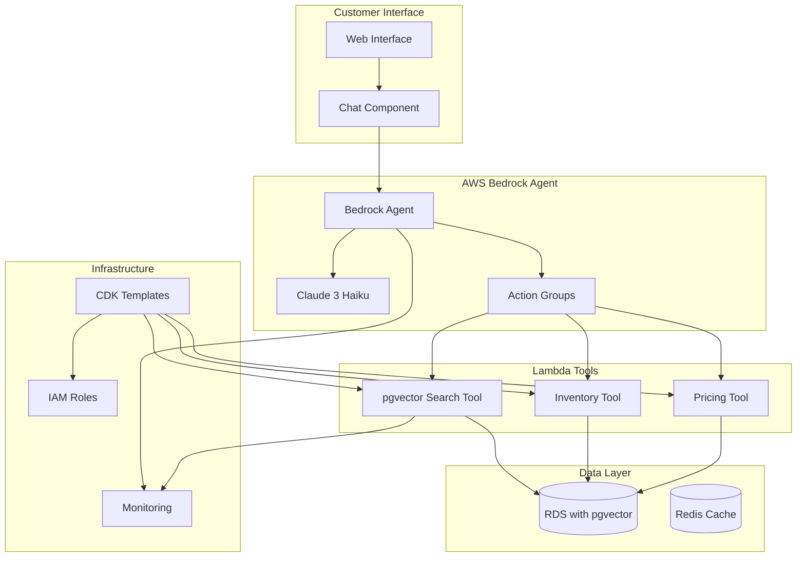
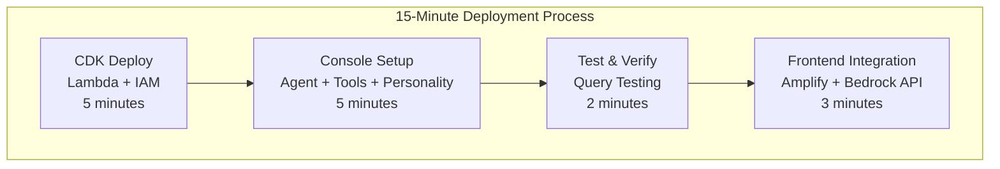

# Sari Sari Agent Design Document

## Overview

The Sari Sari Agent is a cost-effective, extensible conversational AI system that enables customers to interact with a self-serve store through text-based chat. The system integrates with existing farm inventory management and provides intelligent product recommendations, pricing calculations, and purchase assistance while maintaining operational costs under $50/month.

The architecture prioritizes modularity and extensibility, allowing future integration of voice capabilities, multilingual support, and sensor-based customer detection without requiring core system redesign.

## Architecture

### High-Level Architecture with Bedrock Agent



### Bedrock Agent Architecture

**Core Components:**

1. **AWS Bedrock Agent**: Managed AI service that orchestrates conversations
   - Uses Claude 3 Haiku for cost-effective processing
   - Handles conversation state and context management
   - Routes tool calls based on customer queries

2. **Lambda Tools**: Serverless functions that provide business capabilities
   - **pgvector Search Tool**: Semantic product search using vector embeddings
   - **Inventory Tool**: Product availability and stock management
   - **Pricing Tool**: Dynamic pricing with negotiation support

3. **Action Groups**: Define how the agent can use tools
   - Product search actions for semantic queries
   - Inventory management actions for stock checking
   - Pricing actions for cost calculations and negotiations

**Deployment Architecture:**



### Cost-Optimized AWS Architecture

**Estimated Monthly Costs:**

**MVP Configuration (Using Existing Infrastructure):**
- **AWS Lambda**: $5-10 (1M requests, 512MB, 3s avg duration)
- **Existing RDS Database**: $0 (already running - just add new tables/columns + pgvector)
- **Existing API Gateway**: $0 (already running - just add new endpoints)
- **Amazon Bedrock (Claude + Titan Embeddings)**: $12-20 (NLP + embedding generation)
- **GitHub Pages Hosting**: $0 (free static hosting)
- **CloudWatch**: $2-3 (basic monitoring)
- **Total: $19-33/month** (Still extremely cost-effective!)

**Optimized Configuration (Add Redis Later):**
- **Above MVP costs**: $15-28
- **Amazon ElastiCache (Redis)**: $15-20 (when ready for optimization)
- **Total with Redis**: $30-48/month** (Still well under budget!)

**Hybrid Configuration (Cloud + Local RTX 4060):**
- **AWS Services** (reduced): $17-27 (lower Bedrock usage, no DynamoDB)
- **Local AI Infrastructure**: $5-10 (electricity, cooling)
- **VPN/Connectivity**: $3-5 (secure connection to farm)
- **Total: $25-42/month** (Even better savings with existing RDS)

**Cost Optimization with Local AI:**
- Route 70% of simple queries to local RTX 4060
- Use cloud AI for complex negotiations and new customer interactions
- Implement intelligent caching to reduce both cloud and local compute
- Potential 30-40% cost reduction at scale

*Note: Local AI setup requires initial investment in Ollama/LM Studio setup but provides long-term cost benefits and data privacy.*

## Components and Interfaces

### Bedrock Agent Configuration

The AWS Bedrock Agent serves as the central orchestration layer, managing conversations and tool invocations.

**Agent Configuration:**
```json
{
  "agentName": "SariSariAgent",
  "modelId": "anthropic.claude-3-haiku-20240307-v1:0",
  "instruction": "You are Aling Maria, a warm and knowledgeable sari-sari store owner who loves helping customers find exactly what they need. You have a friendly, conversational personality and deep knowledge about your products.\n\nYour conversation style:\n- Always greet customers warmly and ask how you can help\n- When customers ask vague questions, ask follow-up questions to understand their needs better\n- Provide 2-3 specific product suggestions with reasons why each is perfect for their needs\n- Tell stories about your products - where they come from, how to use them, what makes them special\n- Use Filipino cultural context when appropriate (but keep it accessible)\n- Engage in friendly price negotiations while respecting your business needs\n- Suggest complementary items that would be useful\n- If something is unavailable, enthusiastically suggest alternatives and explain why they're great substitutes\n\nExample responses:\n- Instead of 'Here are noodles under 30 pesos:', say 'Ah, looking for affordable noodles! I have three perfect options for you...'\n- Instead of listing features, tell stories: 'This pancit canton is my customers' favorite because it cooks so quickly and the flavor is just right for busy families'\n- Ask engaging questions: 'Are you cooking for the family tonight? Or maybe preparing something special?'\n\nAlways be helpful, engaging, and make customers feel like they're talking to a real person who cares about their needs.",
  "actionGroups": [
    {
      "actionGroupName": "ProductSearch",
      "description": "Search for products using semantic search and return results for conversational recommendations",
      "actionGroupExecutor": {
        "lambda": "arn:aws:lambda:region:account:function:pgvector-search-tool"
      }
    },
    {
      "actionGroupName": "InventoryManagement", 
      "description": "Check product availability and get detailed product information for storytelling",
      "actionGroupExecutor": {
        "lambda": "arn:aws:lambda:region:account:function:inventory-tool"
      }
    },
    {
      "actionGroupName": "PricingCalculation",
      "description": "Calculate prices and handle friendly negotiations with personality",
      "actionGroupExecutor": {
        "lambda": "arn:aws:lambda:region:account:function:pricing-tool"
      }
    }
  ]
}
```

### Lambda Tool Interfaces

**pgvector Search Tool:**
```typescript
interface PgvectorSearchTool {
  searchProducts(query: string, filters?: SearchFilters): Promise<ConversationalSearchResult>
  getSimilarProducts(productId: string, limit?: number): Promise<Product[]>
  getProductStories(productIds: string[]): Promise<ProductStory[]>
}

interface SearchFilters {
  priceRange?: [number, number]
  category?: string
  sellableOnly?: boolean
  excludeTerms?: string[]
}

interface ConversationalSearchResult {
  products: ProductWithContext[]
  searchContext: {
    originalQuery: string
    interpretedIntent: string
    suggestedFollowUp?: string
  }
  totalFound: number
}

interface ProductWithContext {
  product: Product
  similarity: number
  relevanceReason: string // Why this product matches the customer's need
  sellingPoints: string[] // Key benefits to highlight in conversation
  complementaryItems?: string[] // Products that go well with this one
}

interface ProductStory {
  productId: string
  origin: string
  bestUses: string[]
  customerFavorites: string
  preparationTips?: string
}
```

**Inventory Tool:**
```typescript
interface InventoryTool {
  checkAvailability(productId: string): Promise<ConversationalAvailabilityInfo>
  getProductDetails(productId: string): Promise<DetailedProductInfo>
  reserveProduct(productId: string, quantity: number): Promise<ReservationResult>
  updateStock(productId: string, quantity: number): Promise<void>
  suggestAlternatives(unavailableProductId: string): Promise<AlternativeRecommendation[]>
}

interface ConversationalAvailabilityInfo {
  available: boolean
  stockLevel: number
  stockDescription: string // "plenty in stock", "only a few left", "just restocked"
  estimatedRestockDate?: Date
  alternatives?: AlternativeRecommendation[]
  upsellOpportunities?: Product[]
}

interface AlternativeRecommendation {
  product: Product
  similarityReason: string
  advantagesOverOriginal?: string[]
  priceComparison: 'cheaper' | 'similar' | 'premium'
}

interface DetailedProductInfo {
  product: Product
  freshness: string
  origin: string
  nutritionalHighlights?: string[]
  cookingTips?: string[]
  customerReviews?: string
  seasonalNotes?: string
}
```

**Pricing Tool:**
```typescript
interface PricingTool {
  calculatePrice(productId: string, quantity: number): Promise<ConversationalPriceInfo>
  evaluateNegotiation(productId: string, customerOffer: number, context: NegotiationContext): Promise<NegotiationResponse>
  applyPromotions(cart: CartItem[]): Promise<PromotionResult>
  suggestBudgetOptions(budget: number, category?: string): Promise<BudgetRecommendation[]>
}

interface ConversationalPriceInfo {
  basePrice: number
  finalPrice: number
  discounts: Discount[]
  valueProposition: string // Why this price is fair/good value
  negotiable: boolean
  minAcceptablePrice?: number
  bulkDiscountAvailable?: boolean
  seasonalPricing?: string
}

interface NegotiationContext {
  customerPersonality: 'friendly' | 'serious' | 'price-conscious' | 'quality-focused'
  previousPurchases?: number
  currentCartValue?: number
  timeOfDay: string
}

interface NegotiationResponse {
  accept: boolean
  counterOffer?: number
  reason: string
  conversationalResponse: string // Friendly response for the customer
  finalOffer: boolean
  alternativeOffers?: string[] // "Buy 2 get discount", "Bundle with X for better price"
}

interface BudgetRecommendation {
  product: Product
  whyGoodValue: string
  quantityForBudget: number
  alternativeUses?: string[]
}
```

### IAM Role Configuration

**BedrockExecutionRole:**
```json
{
  "Version": "2012-10-17",
  "Statement": [
    {
      "Effect": "Allow",
      "Action": [
        "lambda:InvokeFunction"
      ],
      "Resource": [
        "arn:aws:lambda:*:*:function:pgvector-search-tool",
        "arn:aws:lambda:*:*:function:inventory-tool", 
        "arn:aws:lambda:*:*:function:pricing-tool"
      ]
    },
    {
      "Effect": "Allow",
      "Action": [
        "bedrock:InvokeModel"
      ],
      "Resource": "arn:aws:bedrock:*::foundation-model/anthropic.claude-3-haiku-20240307-v1:0"
    }
  ]
}
```

**Lambda Execution Roles:**
```json
{
  "Version": "2012-10-17", 
  "Statement": [
    {
      "Effect": "Allow",
      "Action": [
        "rds:DescribeDBInstances",
        "rds-db:connect"
      ],
      "Resource": "*"
    },
    {
      "Effect": "Allow",
      "Action": [
        "logs:CreateLogGroup",
        "logs:CreateLogStream", 
        "logs:PutLogEvents"
      ],
      "Resource": "arn:aws:logs:*:*:*"
    }
  ]
}
```

### Agent Core

The central orchestration component that manages conversation flow, context, and business logic integration.

**Key Responsibilities:**
- Conversation state management
- Intent recognition and routing
- Business logic coordination
- Response generation

**Interface:**
```typescript
interface AgentCore {
  processMessage(sessionId: string, message: string): Promise<AgentResponse>
  initializeSession(customerId?: string): Promise<SessionInfo>
  endSession(sessionId: string): Promise<void>
}

interface AgentResponse {
  text: string
  suggestions?: string[]
  products?: ProductInfo[]
  actions?: ActionItem[]
  metadata: ResponseMetadata
}
```

### NLP Service

Provides natural language understanding with pluggable AI backends for flexibility and cost optimization.

**Supported Backends:**
- **Amazon Bedrock (Claude)** - Cloud-based, cost-effective for initial deployment
- **Local RTX 4060** - On-premises inference using Ollama/LM Studio for cost reduction at scale
- **Hybrid Mode** - Route simple queries locally, complex ones to cloud

**Key Features:**
- Intent classification (browse, inquire, purchase, negotiate, help)
- Entity extraction (product names, quantities, preferences, personality traits)
- **Product description identification** - Extract searchable product terms from natural language queries
- Context-aware response generation with personality adaptation
- Conversation memory and customer profiling
- Negotiation and upselling capabilities
- Personality framework for testing different agent behaviors
- **Semantic search integration** - Coordinate with semantic search service for product discovery

**Interface:**
```typescript
interface NLPService {
  analyzeIntent(message: string, context: ConversationContext): Promise<Intent>
  extractEntities(message: string): Promise<Entity[]>
  extractProductDescription(message: string): Promise<ProductSearchTerm>
  extractNegations(message: string): Promise<NegationFilter[]>
  generateResponse(intent: Intent, context: BusinessContext, personality: PersonalityProfile): Promise<string>
  detectCustomerPersonality(conversationHistory: Message[]): Promise<PersonalityInsights>
  suggestUpsells(currentCart: CartItem[], customerProfile: CustomerProfile): Promise<UpsellSuggestion[]>
  formatSearchResults(searchResults: Product[], originalQuery: string, negations?: NegationFilter[]): Promise<string>
}

interface ProductSearchTerm {
  extractedTerm: string
  confidence: number
  originalQuery: string
  searchType: 'characteristic' | 'name' | 'category' | 'description'
  negations?: NegationFilter[]
}

interface NegationFilter {
  negatedTerm: string
  negationType: 'characteristic' | 'ingredient' | 'category' | 'attribute'
  confidence: number
  originalPhrase: string
}

interface PersonalityProfile {
  negotiationStyle: 'friendly' | 'professional' | 'playful' | 'assertive'
  upsellAggressiveness: number // 1-10 scale
  humorLevel: number // 1-10 scale
  culturalAdaptation: string[]
  bargainingEnabled: boolean
}

interface UpsellSuggestion {
  productId: string
  reason: string
  discountOffered?: number
  bundleOpportunity?: string[]
}
```

**Local AI Integration Architecture:**


### Semantic Search Service

Provides vector-based semantic search capabilities for product discovery using natural language understanding.

**Key Responsibilities:**
- Convert product descriptions and search terms into vector embeddings
- Perform semantic similarity search across product catalog
- Maintain and update product embedding vectors
- Log search operations for analytics and improvement
- Handle embedding model updates and reindexing

**Architecture:**


**Interface:**
```typescript
interface SemanticSearchService {
  searchProducts(searchTerm: string, limit?: number, negations?: NegationFilter[], sellableOnly?: boolean): Promise<SemanticSearchResult[]>
  generateEmbedding(text: string): Promise<number[]>
  updateProductEmbeddings(products: Product[]): Promise<void>
  logSearch(searchTerm: string, results: SemanticSearchResult[], sessionId: string, negations?: NegationFilter[], sellabilityFiltered?: boolean): Promise<void>
  getSimilarProducts(productId: string, limit?: number, sellableOnly?: boolean): Promise<Product[]>
  filterNegatedProducts(products: SemanticSearchResult[], negations: NegationFilter[]): Promise<SemanticSearchResult[]>
}

interface SemanticSearchResult {
  product: Product
  similarity: number
  searchTerm: string
  timestamp: Date
}
```

**Implementation Details:**
- **Embedding Model**: Use Amazon Bedrock Titan Embeddings or local sentence-transformers
- **Vector Storage**: PostgreSQL with pgvector extension (leveraging existing RDS)
- **Similarity Metric**: Cosine similarity for semantic matching
- **Indexing Strategy**: Batch update embeddings during low-traffic periods
- **Fallback**: Text-based search when semantic search fails
- **Sellability Filtering**: ALL customer-facing searches MUST include `WHERE sellable = true` in database queries
- **Default Behavior**: `sellableOnly` parameter defaults to `true` for customer-facing operations

### Inventory Service

Integrates with existing farm inventory system with enhanced sellability controls and customer-facing product management.

**Key Responsibilities:**
- Product availability checking with sellability filtering
- Stock level monitoring for customer-facing items
- Product information retrieval with sales optimization
- Inventory updates for purchases and reservations
- Sellability toggle management for store vs. farm-only items

**Interface:**
```typescript
interface InventoryService {
  getAvailableProducts(filters?: ProductFilter): Promise<Product[]>
  getSellableProducts(filters?: ProductFilter): Promise<Product[]> // Only items marked for sale
  searchProductsSemantically(searchTerm: string, filters?: ProductFilter): Promise<SemanticSearchResult[]>
  getProductDetails(productId: string): Promise<ProductDetails>
  checkAvailability(productId: string, quantity: number): Promise<AvailabilityInfo>
  reserveItems(items: CartItem[]): Promise<ReservationResult>
  updateStock(transactions: StockTransaction[]): Promise<void>
  toggleSellability(productId: string, sellable: boolean): Promise<void>
}

interface ProductFilter {
  category?: string
  priceRange?: [number, number]
  inStock?: boolean
  sellableOnly?: boolean // New filter for customer-facing products
}
```

### Agent Personality Framework

Enables testing and deployment of different agent personalities with negotiation and upselling capabilities.

**Key Features:**
- Configurable personality profiles for A/B testing
- Customer personality detection and adaptation
- Dynamic negotiation strategies
- Upselling behavior customization
- Cultural and linguistic adaptation

**Personality Configuration:**
```typescript
interface PersonalityConfig {
  id: string
  name: string
  description: string
  hidden?: boolean // For secret/unlockable personalities
  traits: {
    friendliness: number // 1-10
    assertiveness: number // 1-10
    humor: number // 1-10
    patience: number // 1-10
    salesAggressiveness: number // 1-10
    playfulness: number // 1-10 (for cheeky/flirty personalities)
  }
  negotiationRules: {
    maxDiscount: number // Maximum % discount allowed
    minProfitMargin: number // Minimum profit margin to maintain
    bargainingRounds: number // Max negotiation rounds
    walkAwayThreshold: number // When to end negotiation
  }
  upsellBehavior: {
    frequency: number // How often to suggest upsells (1-10)
    timing: 'early' | 'mid' | 'late' | 'adaptive'
    bundlePreference: boolean
    crossSellEnabled: boolean
  }
  responsePatterns: {
    greetings: string[]
    negotiations: string[]
    upsells: string[]
    closings: string[]
    specialResponses?: string[] // For unique personality quirks
  }
  contentFilters: {
    appropriatenessLevel: 'family' | 'adult' | 'cheeky' | 'spicy'
    contextAwareness: boolean // Adapt based on time/customer
    activationTrigger?: string // Secret code or condition
  }
}
```

**Personality Matching System:**
- Real-time customer personality detection
- Dynamic personality adaptation during conversation
- Performance metrics per personality type
- **Secret personality unlocks** - Hidden personalities activated by special triggers
- **Context-aware content filtering** - Appropriate responses based on setting and customer

**Example Personality Profiles:**
- **"Professional Pat"** - Formal, efficient, business-focused
- **"Friendly Farmer"** - Warm, community-oriented, educational
- **"Bargain Betty"** - Playful negotiator, loves a good deal
- **"Smooth Seller"** - Charming, persuasive, slightly flirtatious
- **"Cheeky Charlie"** - Hidden personality with playful innuendo (unlockable)
- **"Cultural Chameleon"** - Adapts to customer's cultural background

### Price Calculator

Computes dynamic pricing with negotiation support based on inventory, demand, and business rules.

**Key Features:**
- Base pricing calculation with negotiation bounds
- Quantity discount application
- Seasonal promotion handling
- Tax and fee computation
- Dynamic negotiation pricing
- Personality-based discount authorization

**Interface:**
```typescript
interface PriceCalculator {
  calculatePrice(productId: string, quantity: number): Promise<PriceBreakdown>
  getPromotions(productIds: string[]): Promise<Promotion[]>
  applyDiscounts(cart: CartItem[], customer?: CustomerInfo): Promise<PricingResult>
  // New negotiation methods
  calculateNegotiationRange(productId: string, customerProfile: PersonalityInsights): Promise<PriceRange>
  evaluateCounterOffer(productId: string, offer: number, context: NegotiationContext): Promise<NegotiationResponse>
  suggestCounterPrice(productId: string, customerOffer: number, personality: PersonalityProfile): Promise<number>
  canAcceptOffer(productId: string, offer: number, minMargin: number): Promise<boolean>
}

interface PriceRange {
  min: number // Absolute minimum (cost + min margin)
  max: number // Listed price
  suggested: number // AI-suggested starting negotiation price
  flexibility: number // How much room for negotiation (1-10)
}

interface NegotiationResponse {
  accept: boolean
  counterOffer?: number
  reason: string
  finalOffer: boolean // Is this the final offer?
}
```

## Data Models

### Core Entities

```typescript
interface Product {
  id: string
  name: string
  description: string
  category: string
  unit: string
  basePrice: number
  stockQuantity: number
  harvestDate?: Date
  expiryDate?: Date
  nutritionalInfo?: NutritionalData
  tags: string[]
  // New field for MVP store functionality
  sellable: boolean // Toggle for customer-facing availability
}

interface ConversationSession {
  sessionId: string
  customerId?: string
  startTime: Date
  lastActivity: Date
  context: ConversationContext
  cart: CartItem[]
  status: SessionStatus
}

interface ConversationContext {
  currentIntent?: string
  entities: Record<string, any>
  conversationHistory: Message[]
  preferences: CustomerPreferences
  // Simplified for MVP
  negotiationHistory: NegotiationAttempt[]
  upsellAttempts: UpsellAttempt[]
  searchHistory: SearchAttempt[]
}

interface SearchAttempt {
  originalQuery: string
  extractedSearchTerm: string
  searchResults: SemanticSearchResult[]
  selectedProducts: string[]
  timestamp: Date
}


interface NegotiationAttempt {
  productId: string
  originalPrice: number
  customerOffer?: number
  agentCounterOffer?: number
  outcome: 'accepted' | 'rejected' | 'ongoing'
  timestamp: Date
}

interface UpsellAttempt {
  suggestedProductId: string
  context: string
  customerResponse: 'interested' | 'declined' | 'ignored'
  timestamp: Date
}

interface CartItem {
  productId: string
  quantity: number
  unitPrice: number
  reservationId?: string
}

interface Customer {
  customerId: string
  name?: string
  phone?: string
  email?: string
  preferredLanguage: string
  visitCount: number
  totalSpent: number
  favoriteCategories: string[]
  createdAt: Date
  lastVisit: Date
}

interface CustomerPreferences {
  language: string
  communicationStyle: 'formal' | 'casual'
  priceRange?: [number, number]
  favoriteCategories: string[]
  dietaryRestrictions?: string[]
}
```

### Database Schema

**Existing RDS Database Integration:**
- `Products` - Extend existing product table with new fields (sellable, bargainable, minPrice, upsellPriority)
- `Sessions` - New table for active conversation sessions
- `Customers` - New table for customer information and preferences  
- `Transactions` - New table for purchase history and analytics

- `Promotions` - New table for active discounts and offers

**Database Migration Strategy:**
```sql
-- Add essential columns to existing products table for MVP
ALTER TABLE products ADD COLUMN sellable BOOLEAN DEFAULT true;
ALTER TABLE products ADD COLUMN embedding_text TEXT; -- Enhanced product description for embeddings
ALTER TABLE products ADD COLUMN embedding_vector vector(1536); -- Vector embeddings (using pgvector)

-- Enable pgvector extension for semantic search
CREATE EXTENSION IF NOT EXISTS vector;

-- Create new tables for agent functionality
CREATE TABLE conversation_sessions (
  session_id VARCHAR(255) PRIMARY KEY,
  customer_id VARCHAR(255),
  start_time TIMESTAMP DEFAULT CURRENT_TIMESTAMP,
  last_activity TIMESTAMP DEFAULT CURRENT_TIMESTAMP,
  context JSON,
  status VARCHAR(50) DEFAULT 'active'
);

CREATE TABLE customers (
  customer_id VARCHAR(255) PRIMARY KEY,
  name VARCHAR(255),
  phone VARCHAR(50),
  email VARCHAR(255),
  preferred_language VARCHAR(10) DEFAULT 'en',
  visit_count INTEGER DEFAULT 1,
  total_spent DECIMAL(10,2) DEFAULT 0.00,
  favorite_categories JSON,
  created_at TIMESTAMP DEFAULT CURRENT_TIMESTAMP,
  last_visit TIMESTAMP DEFAULT CURRENT_TIMESTAMP
);

CREATE TABLE transactions (
  transaction_id VARCHAR(255) PRIMARY KEY,
  customer_id VARCHAR(255),
  session_id VARCHAR(255),
  items JSON,
  total_amount DECIMAL(10,2),
  payment_method VARCHAR(50),
  created_at TIMESTAMP DEFAULT CURRENT_TIMESTAMP,
  FOREIGN KEY (customer_id) REFERENCES customers(customer_id)
);

-- New table for semantic search analytics
CREATE TABLE search_logs (
  search_id VARCHAR(255) PRIMARY KEY,
  session_id VARCHAR(255),
  original_query TEXT,
  extracted_search_term TEXT,
  search_results JSON,
  selected_products JSON,
  created_at TIMESTAMP DEFAULT CURRENT_TIMESTAMP,
  FOREIGN KEY (session_id) REFERENCES conversation_sessions(session_id)
);

-- Create index for vector similarity search
CREATE INDEX products_embedding_idx ON products USING ivfflat (embedding_vector vector_cosine_ops);
```

**Connection Architecture:**
```typescript
interface DatabaseService {
  // RDS connection for persistent data
  rdsConnection: mysql.Connection | pg.Client
  // Redis for session caching
  redisClient: Redis
  
  // Product operations using existing RDS
  getProducts(filters?: ProductFilter): Promise<Product[]>
  updateProductSellability(productId: string, sellable: boolean): Promise<void>
  
  // New session management
  createSession(sessionData: ConversationSession): Promise<void>
  getSession(sessionId: string): Promise<ConversationSession>
  updateSession(sessionId: string, updates: Partial<ConversationSession>): Promise<void>
}
```

**Session Storage (MVP):**
- Store session data directly in RDS conversation_sessions table
- Simple and reliable for initial deployment

**Future Redis Cache (Optional Optimization):**
- Session state (TTL: 30 minutes)
- Product information (TTL: 5 minutes) 
- Pricing calculations (TTL: 1 minute)


## Correctness Properties

*A property is a characteristic or behavior that should hold true across all valid executions of a system-essentially, a formal statement about what the system should do. Properties serve as the bridge between human-readable specifications and machine-verifiable correctness guarantees.*

Property 28: Product description extraction reliability
*For any* customer question containing product-related terms, the Agent_Core should successfully extract a meaningful product search term
**Validates: Requirements 8.1**

Property 29: Search term logging consistency
*For any* product description extraction, the system should create a corresponding log entry with the extracted search term
**Validates: Requirements 8.2**

Property 30: Semantic search functionality
*For any* valid extracted search term, the Semantic_Search_Service should generate vector embeddings and return semantically relevant product results
**Validates: Requirements 8.3**

Property 31: Result filtering and formatting
*For any* set of semantic search results, the Agent_Core should select contextually relevant items and format them into an appropriate customer response
**Validates: Requirements 8.4**

Property 32: Search operation logging
*For any* semantic search operation performed, the system should create appropriate log entries for analytics and improvement
**Validates: Requirements 3.6**

Property 33: Negation term extraction
*For any* customer query containing negation phrases like "don't like", "no", "not", "avoid", or "without", the Agent_Core should correctly identify and extract the negated terms
**Validates: Requirements 10.1**

Property 34: Negation logging consistency
*For any* query where negated terms are identified, the system should create log entries containing both positive search intent and negation filters
**Validates: Requirements 10.2**

Property 35: Semantic negation filtering
*For any* semantic search with negation filters, the Semantic_Search_Service should exclude products that semantically match the negated characteristics
**Validates: Requirements 10.3**

Property 36: Spicy product exclusion
*For any* query expressing dislike of spicy items, the system should exclude products containing chili, hot sauce, spiced items, and other semantically similar spicy products from results
**Validates: Requirements 10.4**

Property 37: Negation explanation transparency
*For any* search where negation filtering is applied, the Agent_Core should include an explanation to the customer about what items have been excluded
**Validates: Requirements 10.5**

Property 38: Sellable products only in search results
*For any* semantic search operation, the system should only return products where the sellable field is true
**Validates: Requirements 11.1, 11.3**

Property 39: Customer-facing sellability filtering
*For any* product browsing or search operation, the Agent_Core should exclude all non-sellable items before displaying results to customers
**Validates: Requirements 11.2, 11.4**

Property 40: Sellability filter logging
*For any* search operation, the system should log whether sellability filtering was applied and how many products were excluded
**Validates: Requirements 11.5**

Property 41: Bedrock Agent tool invocation
*For any* customer query requiring product search, the Bedrock_Agent should correctly invoke the pgvector_Search_Tool with appropriate parameters
**Validates: Requirements 12.3**

Property 42: Claude model integration
*For any* customer interaction, the Bedrock_Agent should use Claude 3 Haiku model to generate contextually appropriate responses
**Validates: Requirements 12.1**

Property 43: Lambda tool execution
*For any* tool invocation from Bedrock Agent, the Lambda functions should execute successfully and return properly formatted responses
**Validates: Requirements 12.2**

Property 44: IAM permission validation
*For any* Bedrock Agent operation, the system should have appropriate IAM permissions including BedrockExecutionRole and LambdaBasicExecution
**Validates: Requirements 12.4**

Property 45: Agent configuration completeness
*For any* deployed Bedrock Agent, the configuration should include personality instructions and properly defined action groups
**Validates: Requirements 12.5**

Property 46: API functionality verification
*For any* test query like "Noodles under 30 pesos", the retrieveAndGenerate() API should return filtered results with appropriate sari-sari responses
**Validates: Requirements 12.6**

Property 47: Monitoring and tracing
*For any* agent invocation, CloudWatch and Bedrock traces should capture comprehensive logging information
**Validates: Requirements 12.7**

Property 48: Infrastructure deployment speed
*For any* CDK deployment, Lambda functions and IAM roles should be created and configured within 5 minutes
**Validates: Requirements 13.1**

Property 49: Agent creation efficiency
*For any* agent setup process, creating the agent, attaching tools, and configuring personality should complete within 5 minutes
**Validates: Requirements 13.2**

Property 50: Query response performance
*For any* test query, the system should return SQL-filtered results with sari-sari responses within 2 minutes
**Validates: Requirements 13.3**

Property 51: Frontend integration speed
*For any* Amplify integration, connecting to Bedrock API and displaying responses should complete within 3 minutes
**Validates: Requirements 13.4**

Property 52: Total deployment time
*For any* complete system deployment, the entire process should be functional within 15 minutes total
**Validates: Requirements 13.5**

Property 53: Conversational product suggestions
*For any* customer product query, the Bedrock_Agent should provide 2-3 specific product recommendations with reasons rather than just listing search results
**Validates: Requirements 12.2, 14.3**

Property 54: Follow-up question engagement
*For any* vague customer request, the agent should ask clarifying questions to better understand customer needs
**Validates: Requirements 14.2**

Property 55: Personality-driven responses
*For any* customer interaction, the agent should respond with conversational personality rather than robotic or filtered responses
**Validates: Requirements 14.1**

Property 56: Value proposition explanations
*For any* price inquiry, the agent should explain the value proposition and benefits of each suggested product
**Validates: Requirements 14.4**

Property 57: Alternative product storytelling
*For any* unavailable product, the agent should conversationally suggest alternatives with explanations of why they're good substitutes
**Validates: Requirements 14.5**

Property 58: Friendly price negotiation
*For any* price negotiation attempt, the agent should engage in friendly bargaining while maintaining business rules
**Validates: Requirements 14.6**

Property 59: Proactive product education
*For any* customer uncertainty, the agent should offer to provide more information about products, uses, or complementary items
**Validates: Requirements 14.7**

Property 60: Conversational test responses
*For any* test query like "Noodles under 30 pesos", the system should return conversational responses with specific product suggestions and reasons
**Validates: Requirements 13.3**

<function_calls>
<invoke name="prework">
<parameter name="featureName">sari-sari-agent

Property 1: Message processing reliability
*For any* text input from a customer, the Agent_Core should always return a valid response structure with appropriate content
**Validates: Requirements 1.1**

Property 2: Response display consistency
*For any* response generated by the Agent_Core, the user interface should properly render and display the text to the customer
**Validates: Requirements 1.2**

Property 3: Product availability accuracy
*For any* product availability inquiry, the Agent_Core should query the Inventory_Service and return current, accurate stock information
**Validates: Requirements 2.1**

Property 4: Product detail completeness
*For any* product detail request, the Agent_Core should provide all required information fields (description, origin, freshness, nutritional data)
**Validates: Requirements 2.2**

Property 5: Pricing calculation correctness
*For any* pricing inquiry, the Price_Calculator should compute accurate costs including applicable discounts and current market rates
**Validates: Requirements 2.3, 6.1**

Property 6: Low stock notification
*For any* product with low inventory levels, the Agent_Core should inform customers of limited availability when queried
**Validates: Requirements 2.4**

Property 7: Alternative product suggestions
*For any* out-of-stock product inquiry, the Agent_Core should suggest similar available alternatives from the inventory
**Validates: Requirements 2.5**

Property 8: Session isolation
*For any* concurrent customer sessions, the system should handle interactions independently without cross-contamination of data
**Validates: Requirements 3.3**

Property 9: Analytics logging consistency
*For any* customer interaction that begins, the system should create a timestamped log entry for analytics tracking
**Validates: Requirements 3.5**

Property 10: Default language consistency
*For any* customer interaction, the Agent_Core should respond in English as the default language
**Validates: Requirements 4.1**

Property 11: Real-time inventory synchronization
*For any* inventory level change in the farm system, the Sari_Sari_System should reflect the updated availability immediately
**Validates: Requirements 5.1**

Property 12: Purchase inventory updates
*For any* completed customer purchase, the system should immediately decrement inventory counts in the Inventory_Service
**Validates: Requirements 5.2**

Property 13: New product visibility
*For any* product added to farm inventory, the Agent_Core should include it in available product listings for customers
**Validates: Requirements 5.3**

Property 14: Product information consistency
*For any* product detail modification, the system should reflect changes in all customer-facing information immediately
**Validates: Requirements 5.4**

Property 15: Synchronization error handling
*For any* inventory synchronization failure, the system should log the error and alert farm management
**Validates: Requirements 5.5**

Property 16: Quantity discount calculation
*For any* purchase with applicable quantity discounts, the system should automatically calculate and display correct bulk pricing
**Validates: Requirements 6.2**

Property 17: Seasonal promotion application
*For any* product with active seasonal promotions, the Price_Calculator should apply appropriate discounts to eligible items
**Validates: Requirements 6.3**

Property 18: Pricing rule propagation
*For any* pricing rule change, the system should use updated calculations immediately for new customer interactions
**Validates: Requirements 6.4**

Property 19: Receipt accuracy
*For any* processed payment, the system should generate receipts with accurate itemized pricing matching the calculated totals
**Validates: Requirements 6.5**

Property 20: Cost monitoring alerts
*For any* resource usage that approaches budget limits, the system should trigger appropriate cost monitoring alerts
**Validates: Requirements 7.4**

Property 21: Plugin extensibility
*For any* new feature developed as a plugin, the Agent_Core should support integration without requiring core system modifications
**Validates: Requirements 8.1**

Property 22: Payment processor modularity
*For any* new payment method integration, the system should support addition through modular interfaces without core changes
**Validates: Requirements 8.3**

Property 23: API loose coupling
*For any* third-party service integration, the system should maintain loose coupling through well-defined API boundaries
**Validates: Requirements 8.5**

Property 24: Sellability filtering
*For any* product query from customers, the system should only return items marked as sellable in the inventory
**Validates: Enhanced inventory requirements**

Property 25: Negotiation bounds
*For any* price negotiation, the system should never accept offers below the configured minimum price for that product
**Validates: Enhanced pricing requirements**

Property 26: Personality consistency
*For any* conversation session, the agent should maintain consistent personality traits throughout the interaction
**Validates: Enhanced agent personality requirements**

Property 27: Upsell appropriateness
*For any* upsell suggestion, the system should only recommend products that are contextually relevant to the customer's current cart or interests
**Validates: Enhanced agent personality requirements**

## Error Handling

### Error Categories and Responses

**System Errors:**
- Database connectivity issues
- External service timeouts
- Memory/resource constraints

**Business Logic Errors:**
- Invalid product requests
- Insufficient inventory
- Pricing calculation failures

**User Input Errors:**
- Malformed queries
- Unsupported requests
- Session timeouts

### Error Response Strategy

```typescript
interface ErrorResponse {
  type: 'system' | 'business' | 'user'
  code: string
  message: string
  suggestions?: string[]
  fallbackActions?: string[]
}
```

**Graceful Degradation:**
- Cache fallbacks for inventory data
- Default pricing when calculation fails
- Generic responses for unrecognized intents
- Manual assistance escalation paths

## Testing Strategy

### Dual Testing Approach

The system employs both unit testing and property-based testing to ensure comprehensive coverage:

**Unit Tests:**
- Verify specific examples and edge cases
- Test integration points between components
- Validate error handling scenarios
- Ensure API contract compliance

**Property-Based Tests:**
- Verify universal properties across all inputs using **fast-check** library
- Test system behavior with generated data sets
- Validate business rules under various conditions
- Ensure correctness properties hold across all scenarios

**Property-Based Testing Configuration:**
- Minimum 100 iterations per property test
- Custom generators for business domain objects
- Shrinking enabled for minimal failing examples
- Seed-based reproducible test runs

**Testing Framework:**
- **Vitest** for unit testing
- **fast-check** for property-based testing
- **Supertest** for API integration testing
- **Playwright** for end-to-end UI testing

### Cost Monitoring and Optimization

**Real-time Cost Tracking:**
- CloudWatch custom metrics for service usage
- DynamoDB and Lambda cost monitoring
- Bedrock API usage tracking
- Automated alerts at 80% budget threshold

**Optimization Strategies:**
- Response caching to reduce AI API calls
- DynamoDB query optimization
- Lambda cold start minimization
- Efficient conversation context management

### Future Extension Points

**Voice Interface Integration:**
- WebRTC for real-time audio streaming
- Amazon Transcribe for speech-to-text
- Amazon Polly for text-to-speech
- Noise cancellation and audio processing

**Multilingual Support:**
- Amazon Translate for real-time translation
- Language detection and routing
- Localized product information
- Cultural adaptation for responses

**Sensor Integration:**
- IoT device management through AWS IoT Core
- Real-time presence detection
- Customer behavior analytics
- Automated system activation

**Advanced Features:**
- Computer vision for product recognition
- Recommendation engine based on purchase history
- Integration with payment terminals
- Mobile app companion interface

This design provides a solid foundation for the initial text-based implementation while maintaining clear extension points for future enhancements, all within the specified budget constraints.