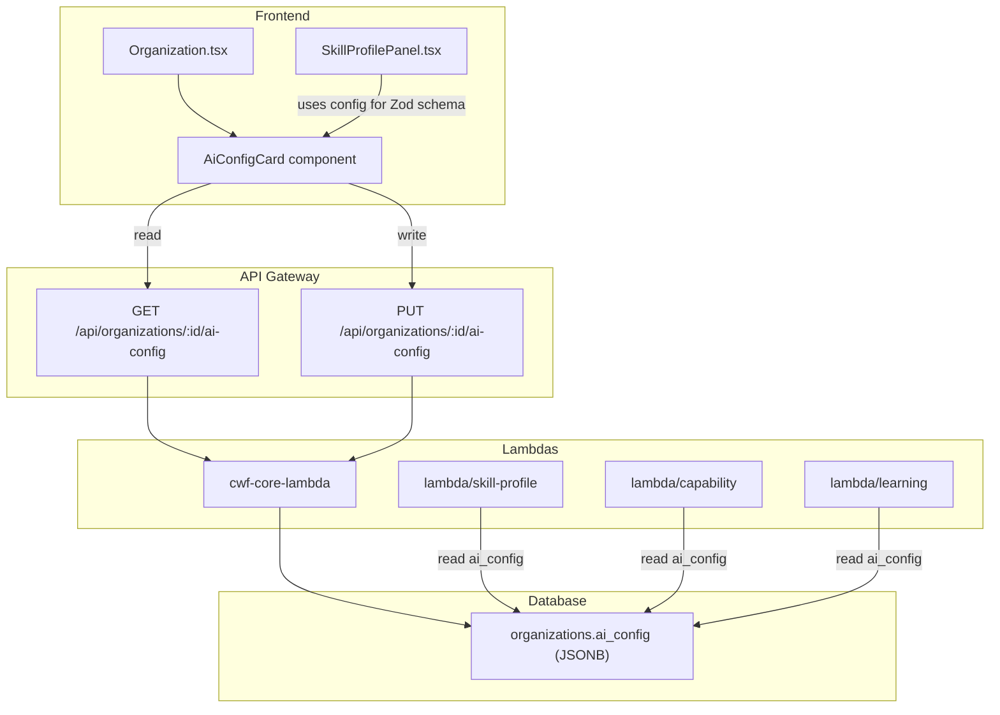

# Design Document: Scoring Context Reduction

## Overview

This feature reduces the volume of context sent to AWS Bedrock during capability scoring by making three key parameters configurable per organization: the number of skill axes per profile, the evidence limit per axis, and the Bedrock temperature for scoring/evaluation calls. It also narrows evidence retrieval to learning-objective-linked states only, eliminating raw observation noise from scoring prompts.

The system currently sends up to 25 evidence items per prompt (5 axes × 5 items). With the new defaults (3 axes × 3 items = 9 items), prompt size drops by 64%. Organizations can tune these parameters via a new AI Configuration card on the Organization settings page, stored as a JSONB column (`ai_config`) on the `organizations` table.

**Key design decisions:**
- Configuration is stored at the organization level, not per-action, keeping the model simple
- Lambdas resolve config at request time with hardcoded defaults as fallback, so existing orgs work without migration
- Existing approved profiles with more axes than the new max are not modified — backward compatibility is preserved during capability scoring
- The `PROMPT_VERSION` in `cacheUtils.js` is bumped to force recomputation of cached profiles after the evidence query changes

## Architecture



### Data Flow for Config Resolution

Each Lambda follows the same pattern:

1. Extract `organization_id` from the authorizer context
2. Query `SELECT ai_config FROM organizations WHERE id = $orgId`
3. Call `resolveAiConfig(row.ai_config)` which merges with defaults
4. Use resolved values for prompt construction, validation, query limits, and temperature

If the query fails or `ai_config` is null, defaults are used: `{ max_axes: 3, evidence_limit: 3, quiz_temperature: 0.7 }`.

## Components and Interfaces

### 1. `resolveAiConfig(aiConfig)` — Shared utility

A pure function that merges an organization's `ai_config` JSONB with hardcoded defaults. Used by all three Lambdas.

```javascript
// lambda/shared/aiConfigDefaults.js (added to cwf-common-nodejs layer)
const AI_CONFIG_DEFAULTS = {
  max_axes: 3,
  min_axes: 2,
  evidence_limit: 3,
  quiz_temperature: 0.7,
};

function resolveAiConfig(aiConfig) {
  if (!aiConfig || typeof aiConfig !== 'object') {
    return { ...AI_CONFIG_DEFAULTS };
  }
  return {
    max_axes: isValidInt(aiConfig.max_axes, 1, 6) ? aiConfig.max_axes : AI_CONFIG_DEFAULTS.max_axes,
    min_axes: isValidInt(aiConfig.min_axes, 1, 6) ? aiConfig.min_axes : AI_CONFIG_DEFAULTS.min_axes,
    evidence_limit: isValidInt(aiConfig.evidence_limit, 1, 10) ? aiConfig.evidence_limit : AI_CONFIG_DEFAULTS.evidence_limit,
    quiz_temperature: isValidFloat(aiConfig.quiz_temperature, 0.0, 1.0) ? aiConfig.quiz_temperature : AI_CONFIG_DEFAULTS.quiz_temperature,
  };
}

function isValidInt(val, min, max) {
  return Number.isInteger(val) && val >= min && val <= max;
}

function isValidFloat(val, min, max) {
  return typeof val === 'number' && !isNaN(val) && val >= min && val <= max;
}
```

**Rationale:** Centralizing config resolution in the Lambda layer ensures all Lambdas use identical defaults and validation logic. The function is pure, making it easy to test.

### 2. `fetchAiConfig(db, organizationId)` — Shared DB helper

```javascript
// lambda/shared/aiConfigDefaults.js (continued)
async function fetchAiConfig(db, organizationId) {
  try {
    const result = await db.query(
      `SELECT ai_config FROM organizations WHERE id = $1`,
      [organizationId]
    );
    return resolveAiConfig(result.rows?.[0]?.ai_config);
  } catch (err) {
    console.warn('Failed to fetch ai_config for org', organizationId, ':', err.message);
    return resolveAiConfig(null);
  }
}
```

### 3. Skill Profile Lambda Changes (`lambda/skill-profile/index.js`)

**`buildSkillProfilePrompt(ctx, strict, aiConfig)`** — Updated signature:
- Replace hardcoded `"4 to 6 axes"` with `${aiConfig.min_axes} to ${aiConfig.max_axes} axes`
- Replace strict clause `"EXACTLY 4 to 6 axes"` with `"EXACTLY ${aiConfig.min_axes} to ${aiConfig.max_axes} axes"`

**`isValidSkillProfile(profile, aiConfig)`** — Updated signature:
- Replace `profile.axes.length < 4 || profile.axes.length > 6` with `profile.axes.length < aiConfig.min_axes || profile.axes.length > aiConfig.max_axes`

**`handleGenerate`** — Fetches `aiConfig` at the start and passes it to `buildSkillProfilePrompt` and `isValidSkillProfile`.

**`handleApprove`** — Fetches `aiConfig` and passes it to `isValidSkillProfile` for incoming profile validation.

### 4. Capability Lambda Changes (`lambda/capability/index.js`)

**`handlePerAxisCapability`** — Evidence retrieval query changes:
- Add `INNER JOIN state_links sl ON sl.state_id = s.id AND sl.entity_type = 'learning_objective'` to restrict to learning-objective-linked states
- Replace `LIMIT 5` with `LIMIT ${aiConfig.evidence_limit}`

**`handleOrganizationCapability`** — Same query changes as above.

**`callBedrockForPerAxisCapability`** — Replace hardcoded `temperature: 0.3` with `temperature: aiConfig.quiz_temperature`.

**Cache version bump:** Increment `PROMPT_VERSION` in `cacheUtils.js` from `'v2'` to `'v3'` to invalidate all cached profiles, since the evidence retrieval query now returns different results.

### 5. Learning Lambda Changes (`lambda/learning/index.js`)

Three functions get configurable temperature:
- `callBedrockForCapabilityLevels`: `temperature: 0.3` → `temperature: aiConfig.quiz_temperature`
- `callBedrockForEvaluation`: `temperature: 0.3` → `temperature: aiConfig.quiz_temperature`
- `evaluateObservationViaBedrock`: `temperature: 0.3` → `temperature: aiConfig.quiz_temperature`

Functions that keep `temperature: 0.7` unchanged:
- `generateObjectivesViaBedrock`
- `generateQuizViaBedrock`
- `generateOpenFormQuizViaBedrock`

The `aiConfig` is fetched once per request in the handler and threaded through to the Bedrock call functions.

### 6. Core Lambda Changes (`lambda/core/index.js`)

Two new endpoint handlers added to the existing organizations routing:

**`GET /api/organizations/:id/ai-config`**
- Reads `ai_config` from the organizations table
- Returns resolved config (merged with defaults)
- Requires `organizations:read` permission

**`PUT /api/organizations/:id/ai-config`**
- Validates input fields against bounds
- Writes `ai_config` JSONB to the organizations table
- Requires `organizations:update` permission (leadership/admin)

### 7. Frontend Changes

**`src/components/AiConfigCard.tsx`** — New component:
- Three input fields: max axes (integer slider/input 1-6), evidence limit (integer slider/input 1-10), temperature (decimal input 0.0-1.0)
- Uses React Hook Form + Zod for validation
- Reads config on mount via `GET /api/organizations/:id/ai-config`
- Saves via `PUT /api/organizations/:id/ai-config`
- Shows defaults when no config exists

**`src/pages/Organization.tsx`** — Renders `<AiConfigCard>` after the AI Scoring Prompts card, gated by `isAdmin` (same as existing admin-only sections).

**`src/components/SkillProfilePanel.tsx`** — The Zod schema `skillProfileFormSchema` needs to use dynamic min/max from the org's ai_config instead of hardcoded `.min(4).max(6)`. The component will accept the config as a prop or read it from a shared query.

## Data Models

### Organizations Table — New Column

```sql
ALTER TABLE organizations ADD COLUMN ai_config JSONB DEFAULT NULL;
```

### AI Config Schema

```typescript
interface AiConfig {
  max_axes: number;      // integer 1-6, default 3
  min_axes: number;      // integer 1-6, default 2 (must be <= max_axes)
  evidence_limit: number; // integer 1-10, default 3
  quiz_temperature: number; // float 0.0-1.0, default 0.7
}
```

### API Request/Response

**GET /api/organizations/:id/ai-config**
```json
{
  "data": {
    "max_axes": 3,
    "min_axes": 2,
    "evidence_limit": 3,
    "quiz_temperature": 0.7
  }
}
```

**PUT /api/organizations/:id/ai-config**
```json
// Request body
{
  "max_axes": 4,
  "min_axes": 2,
  "evidence_limit": 5,
  "quiz_temperature": 0.5
}
// Response: same as GET
```

### Evidence Retrieval Query — Before and After

**Before** (in `handlePerAxisCapability`):
```sql
SELECT ue.entity_id, ue.embedding_source, s.state_text,
       (1 - (ue.embedding <=> (SELECT embedding FROM unified_embeddings WHERE entity_type = 'skill_axis' AND entity_id = $1 LIMIT 1))) as similarity
FROM unified_embeddings ue
INNER JOIN states s ON s.id::text = ue.entity_id
WHERE ue.entity_type = 'state'
  AND ue.organization_id = $2
  AND s.captured_by = $3
ORDER BY similarity DESC
LIMIT 5
```

**After**:
```sql
SELECT ue.entity_id, ue.embedding_source, s.state_text,
       (1 - (ue.embedding <=> (SELECT embedding FROM unified_embeddings WHERE entity_type = 'skill_axis' AND entity_id = $1 LIMIT 1))) as similarity
FROM unified_embeddings ue
INNER JOIN states s ON s.id::text = ue.entity_id
INNER JOIN state_links sl ON sl.state_id = s.id AND sl.entity_type = 'learning_objective'
WHERE ue.entity_type = 'state'
  AND ue.organization_id = $2
  AND s.captured_by = $3
ORDER BY similarity DESC
LIMIT $4  -- evidence_limit from ai_config
```

The key change is the `INNER JOIN state_links` which restricts results to states linked to learning objectives, and the parameterized `LIMIT` from the config.

## Correctness Properties

*A property is a characteristic or behavior that should hold true across all valid executions of a system — essentially, a formal statement about what the system should do. Properties serve as the bridge between human-readable specifications and machine-verifiable correctness guarantees.*

### Property 1: Prompt construction uses configured axis range

*For any* valid AI config with min_axes and max_axes values, calling `buildSkillProfilePrompt` (both normal and strict modes) SHALL produce a prompt string containing the configured min and max values and NOT containing the old hardcoded "4 to 6" range.

**Validates: Requirements 1.1, 1.2, 1.3**

### Property 2: Validator accepts profiles within configured range and rejects outside

*For any* valid AI config and any skill profile, `isValidSkillProfile(profile, aiConfig)` SHALL return true if and only if the profile has a valid structure AND the axis count is between `aiConfig.min_axes` and `aiConfig.max_axes` inclusive.

**Validates: Requirements 1.4, 2.1**

### Property 3: Config resolution always produces valid defaults

*For any* input to `resolveAiConfig` (including null, undefined, empty object, or partial objects with invalid field values), the returned config SHALL have `max_axes` in [1, 6], `min_axes` in [1, 6] with `min_axes <= max_axes`, `evidence_limit` in [1, 10], and `quiz_temperature` in [0.0, 1.0].

**Validates: Requirements 1.7, 3.6, 4.8**

### Property 4: Per-axis field validation is independent of axis count

*For any* skill profile where all axes have valid fields (non-empty key, non-empty label, required_level in [0, 5]) and the axis count is within the configured range, `isValidSkillProfile` SHALL return true. Conversely, *for any* profile where at least one axis has an invalid field, `isValidSkillProfile` SHALL return false regardless of axis count.

**Validates: Requirements 2.3**

### Property 5: AI config field validation enforces correct bounds

*For any* numeric value, the AI config validation SHALL accept `max_axes` if and only if it is an integer in [1, 6], `evidence_limit` if and only if it is an integer in [1, 10], and `quiz_temperature` if and only if it is a number in [0.0, 1.0].

**Validates: Requirements 4.9, 5.7, 5.8, 5.9**

### Property 6: Zero capability profile has correct structure

*For any* valid skill profile, `buildZeroCapabilityProfile(skillProfile, actionId, userId, userName)` SHALL return a profile where every axis has `level: 0`, `evidence_count: 0`, and an empty `evidence` array, and the total_evidence_count is 0.

**Validates: Requirements 3.8**

### Property 7: Evidence hash is deterministic

*For any* array of evidence state IDs and any learning completion count, calling `computeEvidenceHash` twice with the same inputs SHALL produce the same hash string. Additionally, *for any* two distinct (stateIds, completionCount) pairs, the hashes SHALL differ (with high probability).

**Validates: Requirements 3.10**

## Error Handling

| Scenario | Handling |
|---|---|
| `ai_config` column doesn't exist (pre-migration) | `fetchAiConfig` catches the query error, logs a warning, returns defaults |
| `ai_config` is null for an organization | `resolveAiConfig(null)` returns all defaults |
| `ai_config` has partial fields (e.g., only `max_axes`) | `resolveAiConfig` fills missing fields with defaults |
| `ai_config` has out-of-range values | `resolveAiConfig` replaces invalid values with defaults |
| PUT /ai-config with invalid values | Returns 400 with validation error message before writing to DB |
| Evidence query returns 0 results after join change | Existing `buildZeroCapabilityProfile` handles this — no change needed |
| Bedrock returns profile with wrong axis count | Existing retry logic triggers with stricter prompt using configured range |
| Frontend loads before ai_config API is available | Falls back to hardcoded defaults in the component |

## Testing Strategy

### Unit Tests (Example-Based)

- `resolveAiConfig` with null, empty, partial, and fully populated configs
- `buildSkillProfilePrompt` output contains configured range values
- `isValidSkillProfile` accepts/rejects profiles at boundary axis counts
- `AiConfigCard` renders three fields with correct defaults
- `AiConfigCard` is hidden for non-admin users
- Frontend Zod schema accepts/rejects at configured boundaries
- Verify `generateObjectivesViaBedrock`, `generateQuizViaBedrock`, `generateOpenFormQuizViaBedrock` still use temperature 0.7

### Property-Based Tests

Property-based tests use **fast-check** (already available in the project's Vitest setup) with a minimum of 100 iterations per property.

Each property test references its design document property:

- **Feature: scoring-context-reduction, Property 1: Prompt construction uses configured axis range** — Generate random valid configs, verify prompt output
- **Feature: scoring-context-reduction, Property 2: Validator accepts profiles within configured range** — Generate random profiles and configs, verify accept/reject
- **Feature: scoring-context-reduction, Property 3: Config resolution always produces valid defaults** — Generate arbitrary inputs (null, objects with random fields), verify output invariants
- **Feature: scoring-context-reduction, Property 4: Per-axis field validation independent of count** — Generate profiles with valid/invalid axis fields, verify validation
- **Feature: scoring-context-reduction, Property 5: AI config field validation enforces bounds** — Generate random numbers, verify accept/reject for each field
- **Feature: scoring-context-reduction, Property 6: Zero capability profile structure** — Generate random skill profiles, verify zero profile output
- **Feature: scoring-context-reduction, Property 7: Evidence hash determinism** — Generate random state ID arrays and counts, verify hash consistency

### Integration Tests

- Evidence retrieval query returns only learning-objective-linked states
- Organization-level evidence retrieval applies the same filter
- Bedrock calls use configured temperature (mocked Bedrock)
- GET/PUT /ai-config endpoints read/write correctly
- Cache invalidation works after PROMPT_VERSION bump
- Existing profiles with >3 axes still score correctly (backward compatibility)
