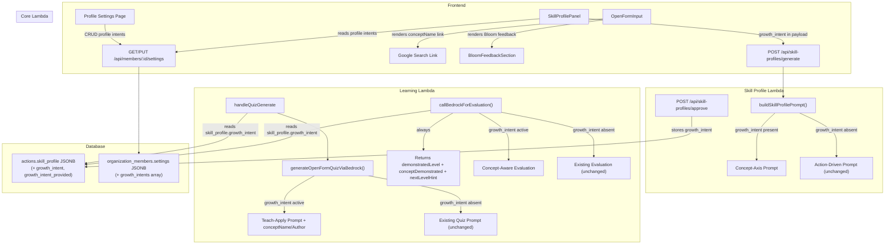

# Design Document: Self-Directed Learning

## Overview

The Self-Directed Learning feature introduces a "growth intent" mechanism that shifts learning from action-driven to learner-driven. Currently, skill profiles and quiz questions are derived entirely from the action description — the technical work task defines what the learner studies. With this feature, learners state what they want to get better at, and the system generates concept-first learning content aligned to their stated direction. The action becomes the practice context (a concrete example to apply learning to), not the learning subject itself.

The feature touches four system layers:
1. **Skill Profile Generation** — the `buildSkillProfilePrompt` function in `lambda/skill-profile/index.js` gets a conditional growth-intent prompt path that generates Concept_Axes instead of action-derived axes.
2. **Quiz Generation** — `generateOpenFormQuizViaBedrock` in `lambda/learning/index.js` gets a conditional teach-then-apply question format with `conceptName`/`conceptAuthor` fields.
3. **Evaluation** — `callBedrockForEvaluation` in `lambda/learning/index.js` receives growth intent and concept reference context, and returns structured Bloom's feedback fields (`demonstratedLevel`, `conceptDemonstrated`, `nextLevelHint`) for ALL evaluations.
4. **Frontend** — `SkillProfilePanel` gets a growth intent input field with auto-fill from profile intents; `OpenFormInput` gets a learn-more link on concept names and a structured Bloom's feedback display replacing the current badge.

**Key design decisions:**
- **No new database tables.** Per-action growth intent is stored inside the existing `skill_profile` JSONB column on `actions`. Profile intents are stored in a new `settings` JSONB column on `organization_members` (the only schema change).
- **No new API endpoints.** Growth intent flows through the existing `/api/skill-profiles/generate` and `/api/skill-profiles/approve` endpoints. Profile intents use a new lightweight endpoint on the core Lambda for reading/writing member settings.
- **Conditional prompt paths, not separate functions.** `buildSkillProfilePrompt`, `generateOpenFormQuizViaBedrock`, and `callBedrockForEvaluation` each get a conditional branch — when growth intent is present, the prompt changes; when absent, existing behavior is preserved exactly.
- **Structured Bloom's feedback applies universally.** The `demonstratedLevel`, `conceptDemonstrated`, and `nextLevelHint` fields are returned for ALL open-form evaluations (both growth-intent and action-driven), upgrading feedback for every learner.
- **Learn-more links are Google search URLs.** No external API dependency — just `https://www.google.com/search?q=` with URL-encoded concept name and author.
- **Profile intents use `organization_members.settings` JSONB.** This follows the pattern of `organizations.settings` and avoids a new table. A single `ALTER TABLE ADD COLUMN` migration adds the column.

## Architecture



## Components and Interfaces

### 1. Skill Profile Lambda — Growth Intent Prompt Path

**File:** `lambda/skill-profile/index.js`

The `handleGenerate` function accepts an optional `growth_intent` field in the request body. The `buildSkillProfilePrompt` function gets a conditional branch.

```javascript
// Extended request body
// POST /api/skill-profiles/generate
{
  action_id: string,
  action_context: { title, description, expected_state, policy, asset_name, required_tools },
  growth_intent?: string  // NEW — optional growth intent text
}
```

**`buildSkillProfilePrompt(ctx, strict, aiConfig, growthIntent)`** — extended signature:

When `growthIntent` is a non-empty string, the prompt switches to concept-axis generation:
- The action context is framed as "practice ground" rather than "learning subject"
- The AI is instructed to generate axes shaped by the growth intent, using real frameworks/research
- Each axis should represent a distinct concept area with learning objectives grounded in the growth intent
- The narrative should explain how the growth intent connects to the action context

When `growthIntent` is empty/null/undefined, the existing prompt is used unchanged.

**`handleApprove`** — stores `growth_intent` and `growth_intent_provided` in the skill profile JSONB:

```javascript
const approvedProfile = {
  ...skill_profile,
  growth_intent: body.growth_intent || null,
  growth_intent_provided: !!(body.growth_intent && body.growth_intent.trim()),
  approved_at: new Date().toISOString(),
  approved_by
};
```

### 2. Learning Lambda — Teach-Apply Question Generation

**File:** `lambda/learning/index.js`

**`handleQuizGenerate`** — reads `growth_intent` from the action's `skill_profile` JSONB and passes it to `generateOpenFormQuizViaBedrock`.

**`generateOpenFormQuizViaBedrock(action, targetAxis, objectives, questionType, bloomLevel, previousOpenFormStates, previousAnswers, lensBlock, assetBlock, growthIntent)`** — extended signature:

When `growthIntent` is present:
- The prompt switches to teach-then-apply format: "Present a concept or framework first (a short teaching moment), then ask the learner how they would apply it to their specific action context."
- The AI is instructed to generate `conceptName` and `conceptAuthor` fields alongside each question
- The ideal answer is based on the taught concept applied to the action context
- Lenses still apply — they frame the angle while the concept provides the teaching content
- Bloom's progression still applies — the depth of application scales with the Bloom's level

When `growthIntent` is absent, the existing prompt is used unchanged.

**Extended question response format:**

```javascript
{
  id: string,
  objectiveId: string,
  type: 'concept',
  questionType: string,
  bloomLevel: number,
  text: string,
  photoUrl: null,
  options: null,
  correctIndex: null,
  idealAnswer: string,
  conceptName: string | null,   // NEW — e.g. "Trust Equation"
  conceptAuthor: string | null  // NEW — e.g. "Maister"
}
```

### 3. Learning Lambda — Concept-Aware Evaluation

**File:** `lambda/learning/index.js`

**`callBedrockForEvaluation(responseText, idealAnswer, questionType, objectiveText, questionText, aiConfig, growthIntent, conceptName, conceptAuthor)`** — extended signature.

When `growthIntent` is present along with `conceptName`/`conceptAuthor`:
- The evaluation prompt includes the growth intent as context
- The evaluation prompt includes the concept reference being assessed
- The AI assesses how well the learner understood the taught concept and applied it to the action context

**Structured Bloom's feedback** — returned for ALL evaluations (growth-intent and action-driven):

```javascript
{
  score: number,           // 0.0–5.0 (unchanged)
  sufficient: boolean,     // (unchanged)
  reasoning: string,       // (unchanged)
  demonstratedLevel: number,    // NEW — integer 1–5
  conceptDemonstrated: string,  // NEW — "You showed you can..."
  nextLevelHint: string         // NEW — empty string when demonstratedLevel is 5
}
```

The `demonstratedLevel` is derived from the continuous score:
- 0.0–0.9 → 1 (Remember)
- 1.0–1.9 → 2 (Understand)
- 2.0–2.9 → 3 (Apply)
- 3.0–3.9 → 4 (Analyze)
- 4.0–5.0 → 5 (Create)

The evaluation prompt is updated to request these three additional fields. The `handleEvaluate` function stores the new fields in the state text and returns them via the evaluation-status endpoint.

### 4. Core Lambda — Member Settings Endpoint

**File:** `lambda/core/index.js`

New route handlers for reading and writing member settings:

```
GET  /api/members/:userId/settings    → returns settings JSONB
PUT  /api/members/:userId/settings    → updates settings JSONB
```

The `settings` JSONB on `organization_members` stores:

```json
{
  "growth_intents": ["I want to improve my leadership skills", "I want to learn about soil science"]
}
```

### 5. SkillProfilePanel — Growth Intent Input

**File:** `src/components/SkillProfilePanel.tsx`

The `EmptyState` sub-component is extended with a growth intent text field:

```typescript
interface EmptyStateProps {
  hasContext: boolean;
  isLoading: boolean;
  onGenerate: (growthIntent: string) => void;  // Updated signature
  profileIntents: string[];                     // From user profile
  existingIntent: string | null;                // From stored skill_profile
}
```

**UI layout (EmptyState):**
1. Growth intent textarea with label "What do you want to get better at through this work?"
2. Helper text: "Optional — describe a skill or area you'd like to develop. The action becomes your practice context."
3. If `profileIntents` exist, a dropdown/selector to choose from saved intents
4. "Generate Skill Profile" button (enabled regardless of whether intent is filled)

**Auto-fill logic:**
- If `existingIntent` is present (from a previous generation), pre-fill the field
- Else if `profileIntents` has exactly one entry, auto-fill with it
- Else if `profileIntents` has multiple entries, show a selector
- The learner can always edit, clear, or override the auto-filled value

**Data flow:**
- `useGenerateSkillProfile` mutation payload is extended with `growth_intent`
- `useApproveSkillProfile` mutation payload is extended with `growth_intent`
- The `SkillProfile` TypeScript interface is extended with `growth_intent?: string` and `growth_intent_provided?: boolean`

### 6. OpenFormInput — Learn More Link and Bloom Feedback

**File:** `src/components/OpenFormInput.tsx`

**Learn More Link:**
When `question.conceptName` is present, render it as a clickable link above or within the question text:

```typescript
function buildLearnMoreUrl(conceptName: string, conceptAuthor: string | null): string {
  const query = conceptAuthor
    ? `${conceptName} ${conceptAuthor}`
    : conceptName;
  return `https://www.google.com/search?q=${encodeURIComponent(query)}`;
}
```

Rendered as: `<a href={url} target="_blank" rel="noopener noreferrer">{conceptName}</a>` with a small external-link icon.

**Bloom Feedback Section:**
Replaces the current "Great depth" / "Keep developing" badge and reasoning text. The `EvaluationStatusItem` interface is extended:

```typescript
interface EvaluationStatusItem {
  stateId: string;
  status: 'pending' | 'evaluated' | 'error' | 'not_found' | 'unknown';
  score?: number;
  sufficient?: boolean;
  reasoning?: string;
  demonstratedLevel?: number;      // NEW
  conceptDemonstrated?: string;    // NEW
  nextLevelHint?: string;          // NEW
}
```

**BloomFeedbackSection component:**

```typescript
interface BloomFeedbackProps {
  demonstratedLevel: number;       // 1–5
  conceptDemonstrated: string;     // "You showed you can..."
  nextLevelHint: string;           // "" when level 5
  score: number;                   // 0.0–5.0
}
```

Visual layout:
1. **Bloom's level indicator** — horizontal progression showing Remember → Understand → Apply → Analyze → Create, with the demonstrated level highlighted (filled/colored) and levels above it dimmed
2. **Concept demonstrated** — the `conceptDemonstrated` text displayed below the indicator
3. **Next level hint** — when `demonstratedLevel < 5`, a subtle card showing "To reach [next level name]: [hint text]"
4. **Mastery message** — when `demonstratedLevel === 5`, an encouraging message like "Mastery-level thinking demonstrated" with a star/sparkle icon

### 7. Profile Settings — Growth Intents Management

**File:** `src/components/ProfileIntentsSection.tsx` (new component)

A section on the user profile/settings page for managing saved growth intents. Follows the pattern of other settings sections.

```typescript
interface ProfileIntentsSectionProps {
  userId: string;
  organizationId: string;
}
```

**Features:**
- List of saved growth intents with edit/delete
- "Add growth intent" input with save button
- Uses `useQuery` to fetch member settings and `useMutation` to update
- Optimistic updates via TanStack Query cache

### 8. Hooks

**`useGenerateSkillProfile`** — extended to accept `growth_intent` in the request payload.

**`useMemberSettings`** — new hook for reading/writing member settings:

```typescript
export function useMemberSettings(userId: string | undefined, organizationId: string | undefined) {
  return useQuery({
    queryKey: ['member-settings', userId, organizationId],
    queryFn: async () => {
      const result = await apiService.get(`/members/${userId}/settings`);
      return result.data;
    },
    enabled: !!(userId && organizationId),
  });
}

export function useUpdateMemberSettings() {
  const queryClient = useQueryClient();
  return useMutation({
    mutationFn: async ({ userId, settings }) => {
      return apiService.put(`/members/${userId}/settings`, { settings });
    },
    onSuccess: (_, variables) => {
      queryClient.invalidateQueries({ queryKey: ['member-settings', variables.userId] });
    },
  });
}
```

### 9. Utility Functions

**`scoreToBloomLevel(score: number): number`** — pure function for score-to-level mapping:

```typescript
export function scoreToBloomLevel(score: number): number {
  if (score >= 4.0) return 5;
  if (score >= 3.0) return 4;
  if (score >= 2.0) return 3;
  if (score >= 1.0) return 2;
  return 1;
}
```

**`bloomLevelLabel(level: number): string`** — maps level to human-readable label:

```typescript
export function bloomLevelLabel(level: number): string {
  const labels: Record<number, string> = {
    1: 'Remember',
    2: 'Understand',
    3: 'Apply',
    4: 'Analyze',
    5: 'Create',
  };
  return labels[level] ?? 'Unknown';
}
```

**`buildLearnMoreUrl(conceptName: string, conceptAuthor: string | null): string`** — constructs Google search URL.

## Data Models

### Skill Profile JSONB (extended — `actions.skill_profile`)

```typescript
interface SkillProfile {
  narrative: string;
  axes: SkillAxis[];
  generated_at: string;
  approved_at?: string;
  approved_by?: string;
  growth_intent?: string | null;          // NEW — the growth intent used at generation time
  growth_intent_provided?: boolean;       // NEW — true if learner provided a growth intent
}
```

### Quiz Question (extended)

```typescript
interface QuizQuestion {
  id: string;
  objectiveId: string;
  type: string;
  questionType: QuestionType;
  bloomLevel: number;
  text: string;
  photoUrl: string | null;
  options: QuizOption[] | null;
  correctIndex: number | null;
  idealAnswer: string | null;
  conceptName?: string | null;    // NEW — concept/framework name
  conceptAuthor?: string | null;  // NEW — concept author/researcher
}
```

### Evaluation Result (extended)

```typescript
interface EvaluationResult {
  score: number;
  sufficient: boolean;
  reasoning: string;
  demonstratedLevel: number;       // NEW — 1–5
  conceptDemonstrated: string;     // NEW — "You showed you can..."
  nextLevelHint: string;           // NEW — "" when level 5
}
```

### Member Settings JSONB (new column — `organization_members.settings`)

```typescript
interface MemberSettings {
  growth_intents?: string[];  // Array of saved growth intent strings
}
```

### Database Migration

```sql
ALTER TABLE organization_members
  ADD COLUMN IF NOT EXISTS settings JSONB DEFAULT '{}';
```

This is the only schema change. All other data is stored in existing JSONB columns.

### Example `skill_profile` JSONB (with growth intent)

```json
{
  "narrative": "This profile explores trust-building and communication frameworks through the lens of your team coordination work...",
  "axes": [
    {
      "key": "trust_building_frameworks",
      "label": "Trust Building Frameworks",
      "required_level": 3
    },
    {
      "key": "active_listening_techniques",
      "label": "Active Listening Techniques",
      "required_level": 2
    }
  ],
  "generated_at": "2025-01-15T10:00:00Z",
  "approved_at": "2025-01-15T10:05:00Z",
  "approved_by": "user-123",
  "growth_intent": "I want to improve my trust-building and communication skills",
  "growth_intent_provided": true
}
```

### Example Quiz Question (with concept reference)

```json
{
  "id": "q-abc123",
  "objectiveId": "obj-456",
  "type": "concept",
  "questionType": "application",
  "bloomLevel": 3,
  "text": "The Trust Equation (Maister) defines trust as (Credibility + Reliability + Intimacy) / Self-Orientation. Considering your team coordination work, how would you reduce self-orientation in your next interaction with a stakeholder who has concerns about the project timeline?",
  "idealAnswer": "To reduce self-orientation using the Trust Equation, I would start by...",
  "conceptName": "Trust Equation",
  "conceptAuthor": "Maister"
}
```

### Example Evaluation Result (with Bloom feedback)

```json
{
  "score": 3.2,
  "sufficient": true,
  "reasoning": "The response demonstrates application-level thinking by connecting the Trust Equation to a specific stakeholder scenario.",
  "demonstratedLevel": 4,
  "conceptDemonstrated": "You showed you can apply the Trust Equation by identifying that reducing self-orientation means leading with their priorities rather than defending your timeline.",
  "nextLevelHint": "To reach Create: design a trust-building protocol for your team that integrates the Trust Equation with another communication framework."
}
```

## Correctness Properties

*A property is a characteristic or behavior that should hold true across all valid executions of a system — essentially, a formal statement about what the system should do. Properties serve as the bridge between human-readable specifications and machine-verifiable correctness guarantees.*

### Property 1: Score-to-demonstrated-level mapping

*For any* continuous score in the range [0.0, 5.0], the `scoreToBloomLevel` function SHALL return the correct Bloom's level according to the defined mapping: 0.0–0.9 → 1, 1.0–1.9 → 2, 2.0–2.9 → 3, 3.0–3.9 → 4, 4.0–5.0 → 5. The result SHALL always be an integer in [1, 5].

**Validates: Requirements 6.8**

### Property 2: Growth intent storage round-trip

*For any* valid growth intent string (including empty string), storing it in the skill profile JSONB and reading it back SHALL preserve the original string. Additionally, the `growth_intent_provided` flag SHALL equal `true` when the growth intent is a non-empty, non-whitespace string, and `false` otherwise.

**Validates: Requirements 1.5, 1.6, 4.5**

### Property 3: Skill profile prompt construction

*For any* action context and optional growth intent string, the `buildSkillProfilePrompt` function SHALL: (a) when growth intent is non-empty, produce a prompt containing the growth intent text and concept-axis generation instructions, and (b) when growth intent is empty/null, produce a prompt that does NOT contain growth intent instructions and matches the existing action-driven format.

**Validates: Requirements 2.1, 2.2, 2.6**

### Property 4: Learn-more URL construction

*For any* concept name string and optional concept author string, the `buildLearnMoreUrl` function SHALL return a valid Google search URL where the query parameter contains the concept name, and if an author is provided, also contains the author. The URL SHALL be properly encoded (no unescaped spaces or special characters in the query parameter).

**Validates: Requirements 3.4**

### Property 5: Bloom feedback conditional display

*For any* demonstrated level in [1, 4], the Bloom feedback section SHALL display a next-level hint. *For any* demonstrated level equal to 5, the Bloom feedback section SHALL NOT display a next-level hint and SHALL instead display a mastery acknowledgment message.

**Validates: Requirements 6.4, 6.5**

### Property 6: Evaluation structured feedback validation

*For any* evaluation result with a score in [0.0, 5.0], the validation function SHALL produce a valid `demonstratedLevel` (integer 1–5), a non-empty `conceptDemonstrated` string, and a `nextLevelHint` string (non-empty when demonstratedLevel < 5, empty string when demonstratedLevel is 5).

**Validates: Requirements 5.6, 6.6**

### Property 7: Quiz prompt construction with growth intent

*For any* non-empty growth intent string and action context, the `generateOpenFormQuizViaBedrock` prompt SHALL contain teach-then-apply instructions and SHALL instruct the AI to generate `conceptName` and `conceptAuthor` fields. When growth intent is absent, the prompt SHALL NOT contain teach-then-apply instructions.

**Validates: Requirements 3.1, 3.2, 3.5**

## Error Handling

| Scenario | Behavior | Requirement |
|---|---|---|
| Growth intent is empty/null/whitespace | Fall back to existing action-driven behavior for all components (profile generation, quiz generation, evaluation) | 1.3, 2.6, 3.5, 4.6, 4.7, 5.5 |
| `organization_members.settings` column doesn't exist yet | Return empty settings `{}` — profile intents default to empty array | 4.1 |
| Profile intents array is empty | No auto-fill; growth intent field starts blank | 4.3 |
| Bedrock returns quiz question without `conceptName`/`conceptAuthor` | Default to `null` — OpenFormInput renders without learn-more link | 3.3 |
| Bedrock evaluation returns without `demonstratedLevel`/`conceptDemonstrated`/`nextLevelHint` | Derive `demonstratedLevel` from score using `scoreToBloomLevel`; use generic `conceptDemonstrated` text; generate generic `nextLevelHint` | 6.6, 6.8 |
| `conceptAuthor` is null or empty | Build learn-more URL with concept name only | 3.4 |
| Growth intent text exceeds reasonable length | Truncate to 500 characters before passing to Bedrock prompt | 1.2 |
| Member settings PUT fails | Show toast error, revert optimistic update | 4.1 |
| Skill profile JSONB doesn't have `growth_intent` field (old profiles) | Treat as no growth intent — existing behavior unchanged | 1.3 |

## Testing Strategy

### Property-Based Tests (fast-check)

The project uses Vitest with [fast-check](https://github.com/dubzzz/fast-check). Each property test runs a minimum of 100 iterations and references its design document property.

**Properties to implement:**

1. **Score-to-demonstrated-level mapping** — Generate random scores in [0.0, 5.0], verify `scoreToBloomLevel` returns the correct level per the defined ranges. Also verify the result is always an integer in [1, 5].
   - Tag: `Feature: self-directed-learning, Property 1: Score-to-demonstrated-level mapping`

2. **Growth intent storage round-trip** — Generate random growth intent strings (including empty, whitespace-only, and Unicode), verify round-trip through the storage format preserves the string and the `growth_intent_provided` flag is correct.
   - Tag: `Feature: self-directed-learning, Property 2: Growth intent storage round-trip`

3. **Skill profile prompt construction** — Generate random action contexts and optional growth intents, verify the prompt contains/excludes growth intent instructions correctly.
   - Tag: `Feature: self-directed-learning, Property 3: Skill profile prompt construction`

4. **Learn-more URL construction** — Generate random concept names and optional authors (including special characters, spaces, Unicode), verify the URL is valid and contains the encoded query.
   - Tag: `Feature: self-directed-learning, Property 4: Learn-more URL construction`

5. **Bloom feedback conditional display** — Generate random demonstrated levels in [1, 5], verify next-level hint presence/absence.
   - Tag: `Feature: self-directed-learning, Property 5: Bloom feedback conditional display`

6. **Evaluation structured feedback validation** — Generate random scores in [0.0, 5.0], verify the validation function produces valid structured feedback fields.
   - Tag: `Feature: self-directed-learning, Property 6: Evaluation structured feedback validation`

7. **Quiz prompt construction with growth intent** — Generate random growth intents and action contexts, verify teach-apply instructions presence/absence.
   - Tag: `Feature: self-directed-learning, Property 7: Quiz prompt construction with growth intent`

### Unit Tests (example-based)

- SkillProfilePanel renders growth intent field in empty state (Req 1.1)
- Growth intent field is optional — generate button enabled when blank (Req 1.2)
- Growth intent field pre-fills from stored per-action intent (Req 1.7)
- Growth intent field auto-fills from single profile intent (Req 4.3)
- Growth intent field shows selector for multiple profile intents (Req 4.3)
- OpenFormInput renders concept name as clickable learn-more link (Req 3.4)
- OpenFormInput renders Bloom feedback section instead of old badge (Req 6.1)
- Bloom level indicator highlights correct level (Req 6.2)
- Concept demonstrated text is displayed (Req 6.3)
- Mastery message shown at level 5 (Req 6.5)
- Bloom feedback applies to non-growth-intent evaluations too (Req 6.7)
- Evaluation prompt includes concept reference when growth intent active (Req 5.1)
- Evaluation prompt unchanged when no growth intent (Req 5.5)

### Integration Tests

- End-to-end skill profile generation with growth intent: verify prompt sent to Bedrock includes concept-axis instructions
- End-to-end quiz generation with growth intent: verify teach-apply format and conceptName/conceptAuthor in response
- End-to-end evaluation with structured Bloom feedback: verify demonstratedLevel, conceptDemonstrated, nextLevelHint returned
- Profile intents CRUD: save intents, reload, verify persistence
- Growth intent auto-fill: save profile intent, open SkillProfilePanel, verify auto-fill
