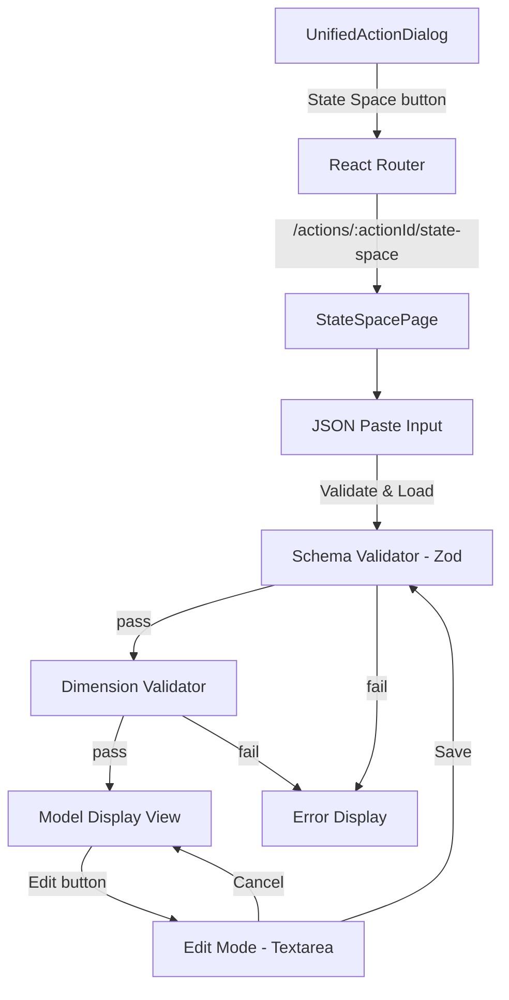
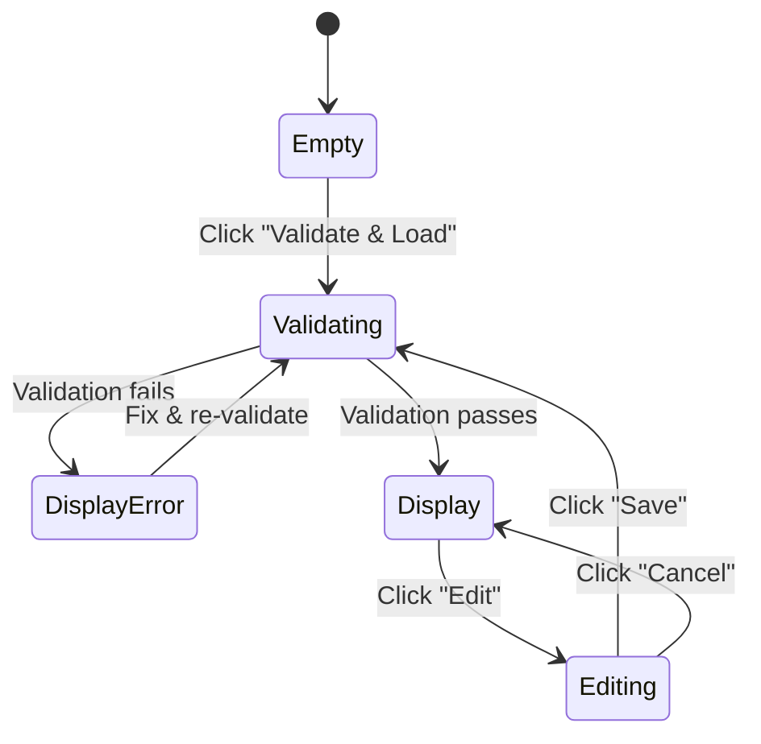

# Design Document: State Space Loader

## Overview

The State Space Loader is a frontend-only feature that adds a dedicated page for loading, validating, and editing discrete-time state-space models in JSON format. Users navigate from the existing `UnifiedActionDialog` via a "State Space" button to a new route `/actions/:actionId/state-space`. On this page, they paste a JSON model into a textarea, trigger validation (Zod schema + matrix dimension checks), and view the parsed model in a structured, readable layout. An edit mode allows modifying the loaded model with re-validation on save.

No backend persistence is involved — the model lives entirely in React component state and is lost on navigation away.

### Key Design Decisions

1. **Dedicated page over dialog**: Matrices and model metadata need screen real estate that a dialog can't provide. A full page at `/actions/:actionId/state-space` follows the existing nested-route pattern (e.g., `/combined-assets/:assetType/:id/observation`).
2. **Two-phase validation**: Zod handles structural/schema validation first, then a separate dimension validator checks matrix sizes against declared dimensions. This separation gives users clear, actionable error messages.
3. **Textarea-based editing**: Follows the `ScoringPrompts.tsx` pattern — display mode shows structured cards, edit mode shows formatted JSON in a monospace textarea with re-validation on submit.
4. **React state only**: No TanStack Query, no localStorage, no API calls. The model is ephemeral by design per the requirements.

## Architecture



### Page State Machine



The page has four states:
- **Empty**: Initial state — textarea visible, no model loaded
- **Validating**: Transient — running Zod + dimension checks
- **Display**: Model loaded and rendered in structured cards
- **Editing**: Model shown as formatted JSON in editable textarea

## Components and Interfaces

### New Files

| File | Purpose |
|------|---------|
| `src/pages/StateSpacePage.tsx` | Main page component with state machine, paste input, display, and edit mode |
| `src/lib/stateSpaceSchema.ts` | Zod schema definition + dimension validation logic |

### Modified Files

| File | Change |
|------|--------|
| `src/App.tsx` | Add protected route `/actions/:actionId/state-space` → `StateSpacePage` |
| `src/components/UnifiedActionDialog.tsx` | Add "State Space" button (visible only when `actionId` exists) |

### Component Breakdown

#### `StateSpacePage`

The main page component. Manages the page state machine (empty → display → editing).

```typescript
interface StateSpacePageProps {
  // Props from React Router via useParams
}

// Internal state
type PageMode = 'empty' | 'display' | 'editing';
```

Responsibilities:
- Extract `actionId` from route params
- Manage `pasteInput` (string), `model` (validated StateSpaceModel | null), `mode` (PageMode), `errors` (string[])
- Render paste textarea when mode is `empty`
- Render structured model display when mode is `display`
- Render editable textarea when mode is `editing`
- Trigger validation pipeline on "Validate & Load" and "Save"

#### `stateSpaceSchema.ts`

Pure validation module — no React dependencies.

```typescript
// Zod schema
export const stateSpaceModelSchema: z.ZodType<StateSpaceModel>;

// Dimension validation (runs after Zod passes)
export function validateDimensions(model: StateSpaceModel): string[];

// Combined validation entry point
export function validateStateSpaceJson(jsonString: string): 
  { success: true; model: StateSpaceModel } | 
  { success: false; errors: string[] };
```

#### UnifiedActionDialog Changes

Add a navigation button inside the dialog, conditionally rendered:

```typescript
// Only shown when actionId exists (not in creation mode)
{actionId && (
  <Tooltip>
    <TooltipTrigger asChild>
      <button
        onClick={() => navigate(`/actions/${actionId}/state-space`)}
        className="hover:opacity-80 transition-opacity"
      >
        
      </button>
    </TooltipTrigger>
    <TooltipContent>State Space</TooltipContent>
  </Tooltip>
)}
```

Uses the dormant gundam image (`public/dormant_gundam_state.png`) as a clickable graphic with a tooltip. The image is served from the Vite `public/` directory at the root path `/dormant_gundam_state.png`.

## Data Models

### StateSpaceModel (TypeScript type, inferred from Zod schema)

```typescript
interface ModelMetadata {
  model_id: string;
  version: string;
  author: string;
  description: string;
}

interface Dimensions {
  states: number;  // n — positive integer
  inputs: number;  // m — positive integer
  outputs: number; // p — positive integer
}

interface Labels {
  states: string[];   // length === n
  inputs: string[];   // length === m
  outputs: string[];  // length === p
}

type Matrix = number[][]; // 2D array of numbers

interface Matrices {
  A: Matrix; // n × n
  B: Matrix; // n × m
  C: Matrix; // p × n
  D: Matrix; // p × m
}

interface StateSpace {
  dimensions: Dimensions;
  labels: Labels;
  matrices: Matrices;
}

interface AiFlavor {
  system_prompt: string;
  intervention_guidance: Record<string, string>;
}

interface SimulationParams {
  step_size_minutes: number;
  default_run_days: number;
  spc_threshold_sigma: number;
}

interface StateSpaceModel {
  model_metadata: ModelMetadata;
  state_space: StateSpace;
  ai_flavor: AiFlavor;
  simulation_params: SimulationParams;
}
```

### Zod Schema Definition

```typescript
import * as z from 'zod';

const modelMetadataSchema = z.object({
  model_id: z.string(),
  version: z.string(),
  author: z.string(),
  description: z.string(),
});

const dimensionsSchema = z.object({
  states: z.number().int().positive(),
  inputs: z.number().int().positive(),
  outputs: z.number().int().positive(),
});

const labelsSchema = z.object({
  states: z.array(z.string()),
  inputs: z.array(z.string()),
  outputs: z.array(z.string()),
});

const matrixSchema = z.array(z.array(z.number()));

const matricesSchema = z.object({
  A: matrixSchema,
  B: matrixSchema,
  C: matrixSchema,
  D: matrixSchema,
});

const stateSpaceSchema = z.object({
  dimensions: dimensionsSchema,
  labels: labelsSchema,
  matrices: matricesSchema,
});

const aiFlavorSchema = z.object({
  system_prompt: z.string(),
  intervention_guidance: z.record(z.string(), z.string()),
});

const simulationParamsSchema = z.object({
  step_size_minutes: z.number(),
  default_run_days: z.number(),
  spc_threshold_sigma: z.number(),
});

export const stateSpaceModelSchema = z.object({
  model_metadata: modelMetadataSchema,
  state_space: stateSpaceSchema,
  ai_flavor: aiFlavorSchema,
  simulation_params: simulationParamsSchema,
});
```

### Dimension Validation Logic

After Zod validates the structure, dimension validation checks:

| Matrix | Expected Rows | Expected Cols |
|--------|--------------|---------------|
| A | n (states) | n (states) |
| B | n (states) | m (inputs) |
| C | p (outputs) | n (states) |
| D | p (outputs) | m (inputs) |

| Label Array | Expected Length |
|-------------|---------------|
| labels.states | n (dimensions.states) |
| labels.inputs | m (dimensions.inputs) |
| labels.outputs | p (dimensions.outputs) |

Additionally, each matrix row must have the same number of columns (no jagged arrays).


## Correctness Properties

*A property is a characteristic or behavior that should hold true across all valid executions of a system — essentially, a formal statement about what the system should do. Properties serve as the bridge between human-readable specifications and machine-verifiable correctness guarantees.*

### Property 1: Invalid JSON produces parse errors

*For any* string that is not syntactically valid JSON, `validateStateSpaceJson` should return a failure result containing a parse error message.

**Validates: Requirements 4.1**

### Property 2: Schema validation rejects structurally invalid models

*For any* syntactically valid JSON object that is missing any required top-level section (`model_metadata`, `state_space`, `ai_flavor`, `simulation_params`), or has wrong types for required fields (e.g., non-string `model_id`, non-positive-integer dimensions, non-array matrices), the Zod schema validator should reject it with one or more error messages.

**Validates: Requirements 4.2, 4.3, 4.4, 4.5, 4.6, 4.7, 4.8, 4.9**

### Property 3: Schema validation accepts all valid models

*For any* well-formed `StateSpaceModel` object (all required sections present, correct types, positive integer dimensions, 2D number arrays for matrices), the Zod schema validator should accept it without errors.

**Validates: Requirements 4.2, 4.3, 4.4, 4.5, 4.6, 4.7, 4.8, 4.9**

### Property 4: Dimension validation rejects mismatched models

*For any* schema-valid `StateSpaceModel` where at least one matrix has incorrect dimensions relative to the declared `dimensions` object (wrong row count, wrong column count, or jagged rows), or where any label array length does not match its corresponding dimension, `validateDimensions` should return one or more error messages identifying the mismatch.

**Validates: Requirements 5.1, 5.2, 5.3, 5.4, 5.5, 5.6, 5.7, 5.9**

### Property 5: Dimension validation accepts correctly dimensioned models

*For any* schema-valid `StateSpaceModel` where all matrices have dimensions matching the declared `dimensions` object (A is n×n, B is n×m, C is p×n, D is p×m), all rows within each matrix have equal length, and all label arrays match their declared dimension counts, `validateDimensions` should return an empty error list.

**Validates: Requirements 5.1, 5.2, 5.3, 5.4, 5.5, 5.6, 5.7, 5.9**

### Property 6: Matrix label mapping correctness

*For any* valid `StateSpaceModel`, the label assignment for each matrix should follow the state-space convention: Matrix A uses state labels for both rows and columns, Matrix B uses state labels for rows and input labels for columns, Matrix C uses output labels for rows and state labels for columns, and Matrix D uses output labels for rows and input labels for columns.

**Validates: Requirements 6.5, 6.6, 6.7, 6.8**

### Property 7: JSON format round-trip

*For any* valid `StateSpaceModel` object, formatting it as JSON with 2-space indentation, parsing the resulting string, and re-formatting should produce an identical string. All numeric values should be preserved exactly through the cycle.

**Validates: Requirements 8.1, 8.2, 8.3**

## Error Handling

### JSON Parse Errors

When `JSON.parse()` throws, catch the error and display the native parse error message (e.g., "Unexpected token at position 42"). Show this as a single error in the error list.

### Zod Validation Errors

When the Zod schema rejects the input, flatten `ZodError.issues` into a readable list. Each issue includes the path (e.g., `state_space.dimensions.states`) and the message (e.g., "Expected number, received string"). Display all issues at once so the user can fix everything in one pass.

### Dimension Validation Errors

When matrix dimensions don't match, produce specific messages like:
- "Matrix A: expected 4×4, got 4×3"
- "Matrix B: row 2 has 3 columns, expected 2 (jagged array)"
- "labels.states: expected 4 items, got 3"

### Empty Input

When the textarea is empty and the user clicks "Validate & Load", display: "JSON input is required." No validation pipeline runs.

### Edit Mode Error Recovery

When validation fails during edit mode:
- Keep the user in editing mode
- Preserve the edited textarea content (don't revert)
- Display errors above the textarea
- User can fix and re-submit or cancel to revert to the last valid model

## Testing Strategy

### Property-Based Testing

Use `fast-check` as the property-based testing library (well-supported in the TypeScript/Vitest ecosystem).

Each property test must:
- Run a minimum of 100 iterations
- Reference its design document property in a comment tag
- Use `fast-check` arbitraries to generate random valid and invalid models

Tag format: `Feature: state-space-loader, Property {number}: {property_text}`

Custom arbitraries needed:
- `arbValidDimensions()` — generates `{ states: n, inputs: m, outputs: p }` with small positive integers (1–10)
- `arbValidLabels(dims)` — generates label arrays matching dimension counts
- `arbValidMatrices(dims)` — generates correctly-dimensioned matrices with random numbers
- `arbValidStateSpaceModel()` — composes a full valid model from the above
- `arbInvalidJson()` — generates strings that are not valid JSON
- `arbMismatchedModel()` — generates schema-valid models with intentionally wrong matrix dimensions

### Unit Testing

Unit tests complement property tests for specific examples and edge cases:

- **Canonical test case**: Validate the exact JSON model from the requirements (the Sapi-an-Drum-v2.1 example)
- **Empty input**: Verify error message when textarea is empty
- **Minimal valid model**: 1 state, 1 input, 1 output (1×1 matrices)
- **Error display**: Verify multiple Zod errors are shown simultaneously
- **Dimension error messages**: Verify error messages include expected vs actual sizes
- **Edit mode round-trip**: Load model → edit → save → verify model unchanged
- **Cancel discards changes**: Load model → edit → cancel → verify original model displayed

### Component Testing

Use Vitest + React Testing Library for component-level tests:

- `StateSpacePage` renders textarea in empty state
- "Validate & Load" triggers validation
- Valid model transitions to display mode
- "Edit" button switches to editing mode
- "Cancel" reverts to display mode
- Back button navigates to `/actions/:actionId`
- "State Space" button appears in `UnifiedActionDialog` only when `actionId` exists

### Test Configuration

```typescript
// vitest.config.ts — already configured in the project
// fast-check configuration per test:
fc.assert(
  fc.property(arbValidStateSpaceModel(), (model) => {
    // property assertion
  }),
  { numRuns: 100 }
);
```
