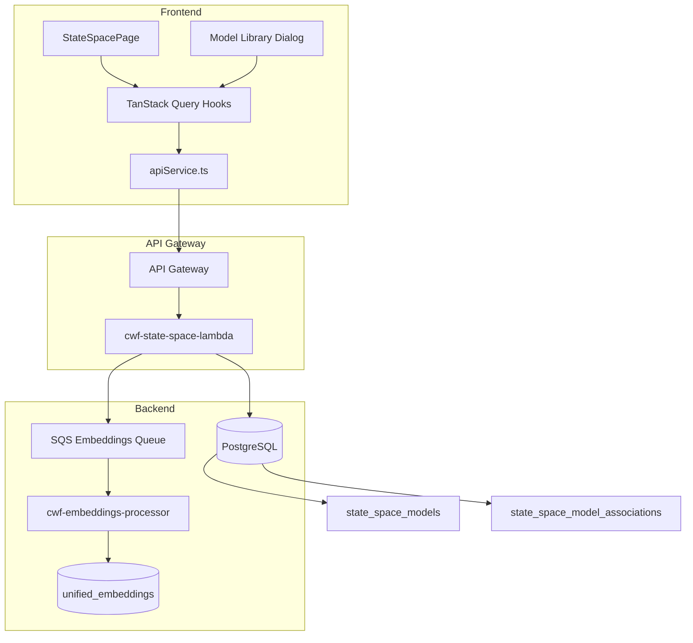
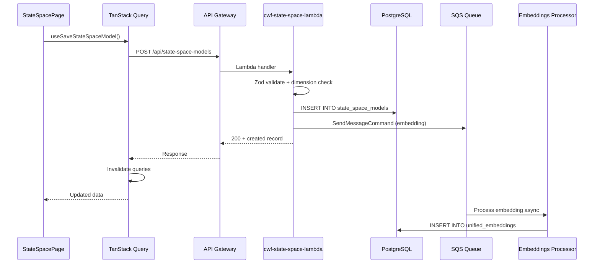
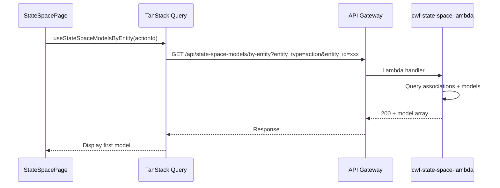

# Design Document: State Space Persistence

## Overview

This feature adds full-stack persistence for state-space models that were previously ephemeral (React state only) in the state-space-loader spec. The system stores models in PostgreSQL, serves them via a dedicated Lambda (`cwf-state-space-lambda`), integrates with the unified embeddings pipeline for semantic search, and provides a model library UI for browsing/attaching models to actions.

The architecture follows existing CWF patterns closely: the Lambda mirrors `cwf-explorations-lambda` for CRUD + associations, the embeddings integration mirrors `lambda/states/index.js` for SQS queuing, and the frontend hooks follow the `useExperiences` / `useExplorations` TanStack Query patterns.

### Key Design Decisions

1. **Dedicated Lambda (`cwf-state-space-lambda`)**: Separate from `cwf-core-lambda` because state-space models will grow into a key feature (simulation, digital twin). Follows the same pattern as `cwf-explorations-lambda`.
2. **Many-to-many associations**: `state_space_model_associations` table with `(model_id, entity_type, entity_id)` — same polymorphic pattern as `action_exploration`. UI shows single model per action for now, backend supports multiple.
3. **Zod schema update**: `model_metadata.model_id` → `name`, remove `ai_flavor` and `simulation_params`, add top-level `model_description_prompt` string. The existing `stateSpaceSchema.ts` is updated in place.
4. **Embedding source composition**: Simple concatenation of `name + description + model_description_prompt` — no separate composition function in the common layer needed since the Lambda composes it inline (the fields are already extracted columns).
5. **JSONB storage**: `model_definition` stores the complete canonical JSON. `name` and `description` are extracted as separate columns for querying and vectorization.

## Architecture



### Request Flow — Save Model



### Request Flow — Load Model by Entity



## Components and Interfaces

### New Files

| File | Purpose |
|------|---------|
| `lambda/state-space-models/index.js` | Lambda handler for all state-space model CRUD and association endpoints |
| `lambda/state-space-models/shared/validation.js` | Server-side Zod schema + dimension validation (mirrors `stateSpaceSchema.ts` logic) |
| `lambda/state-space-models/package.json` | Dependencies (zod) |
| `src/hooks/useStateSpaceModels.ts` | TanStack Query hooks for CRUD, associations, and by-entity queries |
| `src/lib/stateSpaceApi.ts` | API service functions for state-space model endpoints |
| `src/components/StateSpaceModelLibrary.tsx` | Model library dialog for browsing/searching/selecting models |
| `migrations/add-state-space-models.sql` | Database migration SQL |

### Modified Files

| File | Change |
|------|--------|
| `src/lib/stateSpaceSchema.ts` | Update Zod schema: `model_id` → `name`, remove `ai_flavor`/`simulation_params`, add `model_description_prompt` |
| `src/lib/stateSpaceSchema.test.ts` | Update tests for new schema |
| `src/pages/StateSpacePage.tsx` | Replace local state with TanStack Query hooks, add save/load, add library button |
| `src/lib/queryKeys.ts` | Add `stateSpaceModelsQueryKey` and `stateSpaceModelsByEntityQueryKey` |
| `lambda/embeddings-processor/index.js` | Add `state_space_model` to valid entity types |

### Component Interfaces

#### Lambda Handler (`lambda/state-space-models/index.js`)

Follows the `lambda/explorations/index.js` pattern:

```javascript
const { Pool } = require('pg');
const { getAuthorizerContext } = require('@cwf/authorizerContext');
const { success, error } = require('@cwf/response');
const { SQSClient, SendMessageCommand } = require('@aws-sdk/client-sqs');

// Routes:
// POST   /api/state-space-models              → createModel
// GET    /api/state-space-models              → listModels
// GET    /api/state-space-models/:id          → getModel
// PUT    /api/state-space-models/:id          → updateModel
// DELETE /api/state-space-models/:id          → deleteModel
// POST   /api/state-space-models/:id/associations    → createAssociation
// DELETE /api/state-space-models/:modelId/associations/:associationId → deleteAssociation
// GET    /api/state-space-models/by-entity    → getModelsByEntity
```

#### Server-Side Validation (`lambda/state-space-models/shared/validation.js`)

```javascript
const { z } = require('zod');

// Mirrors src/lib/stateSpaceSchema.ts for server-side validation
function validateStateSpaceModel(jsonBody) {
  // Returns: { success: true, model } | { success: false, errors: string[] }
}
```

#### TanStack Query Hooks (`src/hooks/useStateSpaceModels.ts`)

```typescript
// Query hooks
export function useStateSpaceModelsByEntity(entityType: string, entityId: string);
export function useStateSpaceModels();
export function useStateSpaceModel(modelId: string);

// Mutation hooks
export function useCreateStateSpaceModel();
export function useUpdateStateSpaceModel();
export function useDeleteStateSpaceModel();
export function useCreateModelAssociation();
export function useDeleteModelAssociation();
```

#### API Service Functions (`src/lib/stateSpaceApi.ts`)

```typescript
export async function createStateSpaceModel(data: CreateStateSpaceModelRequest);
export async function listStateSpaceModels();
export async function getStateSpaceModel(id: string);
export async function updateStateSpaceModel(id: string, data: UpdateStateSpaceModelRequest);
export async function deleteStateSpaceModel(id: string);
export async function createModelAssociation(modelId: string, entityType: string, entityId: string);
export async function deleteModelAssociation(modelId: string, associationId: string);
export async function getModelsByEntity(entityType: string, entityId: string);
```

#### Model Library Component (`src/components/StateSpaceModelLibrary.tsx`)

A dialog component accessible from `StateSpacePage`:

```typescript
interface StateSpaceModelLibraryProps {
  actionId: string;
  onSelect: (model: StateSpaceModelRecord) => void;
  open: boolean;
  onOpenChange: (open: boolean) => void;
}
```

Uses the unified search endpoint for semantic search, and `useStateSpaceModels()` for browsing the full list.

## Data Models

### Database Tables

#### `state_space_models`

```sql
CREATE TABLE state_space_models (
  id UUID PRIMARY KEY DEFAULT gen_random_uuid(),
  organization_id UUID NOT NULL REFERENCES organizations(id),
  name TEXT NOT NULL,
  description TEXT,
  version TEXT DEFAULT '1.0.0',
  author TEXT,
  model_definition JSONB NOT NULL,
  is_public BOOLEAN DEFAULT false,
  created_by UUID REFERENCES users(id),
  created_at TIMESTAMPTZ DEFAULT NOW(),
  updated_at TIMESTAMPTZ DEFAULT NOW(),
  UNIQUE (organization_id, name, author, version)
);
```

#### `state_space_model_associations`

```sql
CREATE TABLE state_space_model_associations (
  id UUID PRIMARY KEY DEFAULT gen_random_uuid(),
  model_id UUID NOT NULL REFERENCES state_space_models(id) ON DELETE CASCADE,
  entity_type TEXT NOT NULL,
  entity_id UUID NOT NULL,
  created_at TIMESTAMPTZ DEFAULT NOW(),
  UNIQUE (model_id, entity_type, entity_id)
);
```

### TypeScript Types

#### Updated Canonical JSON (Zod-inferred)

```typescript
// Updated model_metadata — name replaces model_id
interface ModelMetadata {
  name: string;
  version: string;
  author: string;
  description: string;
}

// state_space unchanged from loader spec
interface StateSpace {
  dimensions: { states: number; inputs: number; outputs: number };
  labels: { states: string[]; inputs: string[]; outputs: string[] };
  matrices: { A: number[][]; B: number[][]; C: number[][]; D: number[][] };
}

// Top-level model — ai_flavor and simulation_params removed
interface StateSpaceModel {
  model_metadata: ModelMetadata;
  state_space: StateSpace;
  model_description_prompt: string;
}
```

#### Database Record Type

```typescript
interface StateSpaceModelRecord {
  id: string;
  organization_id: string;
  name: string;
  description: string | null;
  version: string;
  author: string | null;
  model_definition: StateSpaceModel;
  is_public: boolean;
  created_by: string | null;
  created_at: string;
  updated_at: string;
}
```

#### Association Record Type

```typescript
interface StateSpaceModelAssociation {
  id: string;
  model_id: string;
  entity_type: string;
  entity_id: string;
  created_at: string;
}
```

#### API Request/Response Types

```typescript
interface CreateStateSpaceModelRequest {
  model_definition: StateSpaceModel;
  is_public?: boolean;
}

interface UpdateStateSpaceModelRequest {
  model_definition: StateSpaceModel;
  is_public?: boolean;
}

interface CreateAssociationRequest {
  entity_type: string;
  entity_id: string;
}
```

### Embedding Source Composition

The Lambda composes the embedding source inline when creating/updating a model:

```javascript
const embeddingSource = [name, description, model_description_prompt]
  .filter(s => s && s.trim())
  .join('. ');
```

This is sent via SQS to the embeddings processor with `entity_type: 'state_space_model'`.

### Query Key Structure

```typescript
// Added to src/lib/queryKeys.ts
export const stateSpaceModelsQueryKey = () => ['state_space_models'];
export const stateSpaceModelQueryKey = (id: string) => ['state_space_model', id];
export const stateSpaceModelsByEntityQueryKey = (entityType: string, entityId: string) =>
  ['state_space_models_by_entity', entityType, entityId];
```


## Correctness Properties

*A property is a characteristic or behavior that should hold true across all valid executions of a system — essentially, a formal statement about what the system should do. Properties serve as the bridge between human-readable specifications and machine-verifiable correctness guarantees.*

### Property 1: Schema validation accepts valid models and rejects invalid ones

*For any* well-formed `StateSpaceModel` object (with `model_metadata` containing `name`, `version`, `author`, `description`; valid `state_space` with matching dimensions/labels/matrices; and a non-empty `model_description_prompt` string), the Schema_Validator should accept it. *For any* JSON object missing required fields, having wrong types, or with mismatched matrix dimensions, the Schema_Validator should reject it with descriptive error messages.

**Validates: Requirements 3.1, 3.2, 3.4, 4.6**

### Property 2: Extracted columns match model_definition fields

*For any* state-space model record in the database, the `name` column should equal `model_definition.model_metadata.name` and the `description` column should equal `model_definition.model_metadata.description`.

**Validates: Requirements 1.4, 1.5**

### Property 3: Model JSONB round-trip

*For any* valid `StateSpaceModel` object, saving it to the `state_space_models` table via POST and loading it back via GET should produce a `model_definition` JSON object equivalent to the original, including preservation of all numeric precision in matrix values.

**Validates: Requirements 1.3, 4.1, 4.4, 10.1, 10.2**

### Property 4: Organization visibility rules

*For any* model belonging to organization A, a request from organization A should see it. A request from organization B should see it only if `is_public` is true. *For any* model that is not public and belongs to a different organization, GET/PUT/DELETE should return 404.

**Validates: Requirements 4.2, 4.3, 4.7, 4.8**

### Property 5: Association round-trip

*For any* valid model and entity pair, creating an association via POST and then querying via the `by-entity` endpoint should return that model in the results. Deleting the association and querying again should no longer return that model.

**Validates: Requirements 5.1, 5.2, 5.3**

### Property 6: Unique constraint enforcement

*For any* model with the same `(organization_id, name, author, version)` as an existing model, attempting to create it should fail. *For any* association with the same `(model_id, entity_type, entity_id)` as an existing association, attempting to create it should return a 409 conflict.

**Validates: Requirements 1.2, 2.2, 5.5**

### Property 7: Cascade delete removes associations

*For any* model that has one or more associations, deleting the model should result in zero associations remaining for that model_id in the associations table.

**Validates: Requirements 2.3**

### Property 8: Embedding source composition completeness

*For any* state-space model with non-empty `name`, `description`, and `model_description_prompt`, the composed embedding source should contain all three values. *For any* model where some of these fields are empty, the composed source should contain only the non-empty fields, joined by `. `.

**Validates: Requirements 8.3**

## Error Handling

### Validation Errors (400)

When the Zod schema or dimension validation fails on POST or PUT:
- Return HTTP 400 with a JSON body containing all error messages
- Error format: `{ message: "Validation failed", errors: ["field.path: error message", ...] }`
- Mirrors the existing `validateStateSpaceJson` error format from the loader spec

### Authentication Errors (401)

When `getAuthorizerContext` returns no `organization_id`:
- Return HTTP 401 with `{ message: "Organization ID not found" }`
- Follows the pattern in `lambda/explorations/index.js`

### Not Found (404)

When a model ID doesn't exist or belongs to another organization (and isn't public):
- Return HTTP 404 with `{ message: "State space model not found" }`
- Same for association creation when the parent model doesn't exist

### Conflict (409)

When a duplicate unique constraint is violated:
- Model creation with duplicate `(organization_id, name, author, version)`: Return 409 with `{ message: "A model with this name, author, and version already exists" }`
- Association creation with duplicate `(model_id, entity_type, entity_id)`: Return 409 with `{ message: "Association already exists" }`
- Detect via PostgreSQL error code `23505` (unique_violation)

### Server Errors (500)

Unexpected database or SQS errors:
- Log the full error with `console.error`
- Return HTTP 500 with `{ message: err.message }`
- SQS failures for embeddings are fire-and-forget — the model is still saved, embedding generation is retried by SQS

### Frontend Error Handling

- Save failures: Display error toast via Sonner, keep model in editor for retry
- Load failures: Display error state with retry button
- Network errors: TanStack Query's built-in retry logic (3 retries for network errors, per existing `queryClient` config)

## Testing Strategy

### Property-Based Testing

Use `fast-check` as the property-based testing library (already used in the loader spec).

Each property test must:
- Run a minimum of 100 iterations
- Reference its design document property in a comment tag
- Use `fast-check` arbitraries to generate random valid and invalid models

Tag format: `Feature: state-space-persistence, Property {number}: {property_text}`

Custom arbitraries needed:
- `arbValidModelMetadata()` — generates `{ name, version, author, description }` with random non-empty strings
- `arbValidStateSpace(dims?)` — generates valid `state_space` with matching dimensions, labels, and matrices
- `arbValidStateSpaceModel()` — composes a full valid model from the above + random `model_description_prompt`
- `arbInvalidStateSpaceModel()` — generates models with missing fields, wrong types, or mismatched dimensions
- `arbEmbeddingSourceFields()` — generates `{ name, description, model_description_prompt }` with varying emptiness

Property tests to implement:
1. **Property 1** (schema validation): Generate random valid models → validate passes. Generate random invalid models → validate fails with errors.
2. **Property 2** (extracted columns): Generate random valid models → simulate extraction → verify name/description match.
3. **Property 3** (JSONB round-trip): Generate random valid models → JSON.stringify → JSON.parse → deep equal. Focus on numeric precision in matrices.
4. **Property 8** (embedding composition): Generate random field combinations → compose → verify all non-empty fields present.

Properties 4–7 are integration/database properties best tested with integration tests against a real database or mocked pool.

### Unit Testing

Unit tests complement property tests for specific examples and edge cases:

- **Schema update verification**: Validate the canonical Sapi-an drum example with the new schema (name instead of model_id, model_description_prompt instead of ai_flavor)
- **Old schema rejection**: Verify that models with `model_id`, `ai_flavor`, or `simulation_params` as required fields are no longer required
- **Lambda routing**: Verify correct handler is called for each HTTP method + path combination
- **Auth context extraction**: Verify 401 when organization_id is missing
- **Conflict detection**: Verify 409 response on duplicate unique constraint violation (PostgreSQL error code 23505)
- **Cascade delete**: Verify associations are removed when model is deleted
- **SQS message format**: Verify the SQS message body contains correct entity_type, entity_id, embedding_source, organization_id
- **Empty embedding source**: Verify SQS message is not sent when all embedding fields are empty

### Integration Testing

For database-dependent properties (4–7), use integration tests with the actual Lambda handler and a test database:

- **CRUD round-trip**: Create → Get → Update → Get → Delete → Get (404)
- **Organization scoping**: Create model in org A, verify org B can't see it (unless public)
- **Association lifecycle**: Create model → Create association → Query by-entity → Delete association → Query by-entity (empty)
- **Cascade delete**: Create model with associations → Delete model → Verify associations gone

### Test Configuration

```typescript
// Property test configuration
import fc from 'fast-check';

fc.assert(
  fc.property(arbValidStateSpaceModel(), (model) => {
    // Feature: state-space-persistence, Property 1: Schema validation
    const result = validateStateSpaceJson(JSON.stringify(model));
    return result.success === true;
  }),
  { numRuns: 100 }
);
```

Each correctness property is implemented by a single property-based test. Unit tests handle specific examples, edge cases, and integration points.
