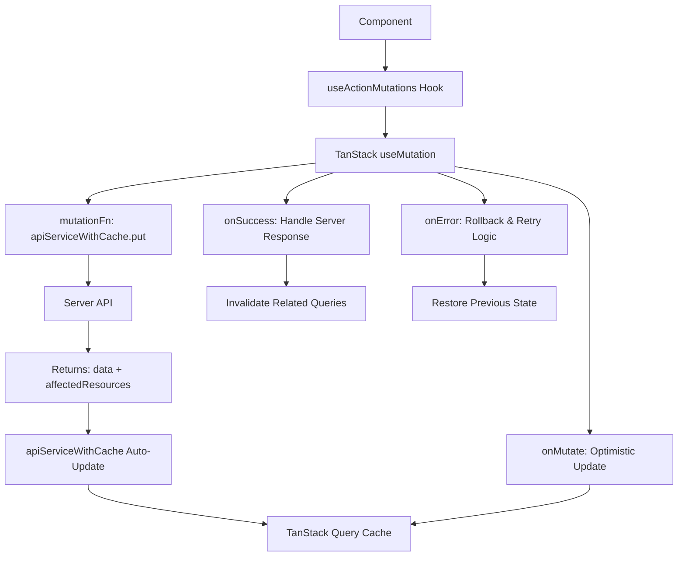

# Design Document: TanStack Actions Enhancement

## Overview

This design enhances the existing `useActionMutations.ts` hook to properly implement TanStack Query best practices for offline-first architecture. The current implementation only partially utilizes the server's `affectedResources` response and doesn't follow the patterns outlined in the ENGINEERING_GUIDE.

The enhancement will improve the `updateAction` mutation to:
- Provide proper optimistic updates for immediate UI feedback
- Handle server responses with `affectedResources` correctly
- Implement robust offline support with automatic retry
- Follow TanStack Query patterns for cache management

## Architecture

### Current State Analysis

The existing implementation has these components:
- `useActionMutations.ts` - Partial TanStack Query implementation
- `apiServiceWithCache.ts` - Handles automatic cache updates from server responses
- Server endpoint - Returns `{ data, affectedResources }` format

### Enhanced Architecture



## Components and Interfaces

### Enhanced useActionMutations Hook

```typescript
interface ActionUpdateVariables {
  id: string;
  updates: Partial<BaseAction>;
}

interface ActionUpdateResponse {
  data: BaseAction;
  affectedResources?: {
    tools?: Tool[];
    checkouts?: Checkout[];
  };
}

interface MutationContext {
  previousActions: BaseAction[] | undefined;
  previousTools?: Tool[] | undefined;
}
```

### TanStack Query Configuration

The mutation will be configured with:
- **Retry Logic**: Automatic retries for network errors, no retries for validation errors
- **Offline Support**: Mutations queue when offline, execute when online
- **Cache Updates**: Coordinated optimistic and server-driven updates

## Data Models

### Server Response Format (Existing)

```typescript
interface ServerResponse {
  data: BaseAction;
  affectedResources?: {
    tools?: Array<{
      id: string;
      name: string;
      status: string;
      is_checked_out: boolean;
      checked_out_user_id?: string;
      checked_out_to?: string;
      checked_out_date?: string;
    }>;
  };
}
```

### Debugging and Observability Models

```typescript
interface MutationDebugInfo {
  mutationId: string;
  startTime: number;
  endTime?: number;
  duration?: number;
  status: 'pending' | 'retrying' | 'failed' | 'succeeded';
  retryCount: number;
  errors: Array<{
    timestamp: number;
    error: Error;
    isRetryable: boolean;
  }>;
  rollbacks: Array<{
    timestamp: number;
    reason: string;
    affectedCaches: string[];
  }>;
  queueInfo?: {
    queuedAt: number;
    queuePosition: number;
    executedAt?: number;
  };
}

interface MutationMetrics {
  totalMutations: number;
  successfulMutations: number;
  failedMutations: number;
  averageResponseTime: number;
  retryRate: number;
  rollbackRate: number;
}
```

### Cache Update Strategy

1. **Actions Cache**: Direct optimistic update, server response handled by apiServiceWithCache
2. **Tools Cache**: Updated via affectedResources from server
3. **Checkouts Cache**: Invalidated for background refresh when tools change

## Correctness Properties

*A property is a characteristic or behavior that should hold true across all valid executions of a system-essentially, a formal statement about what the system should do. Properties serve as the bridge between human-readable specifications and machine-verifiable correctness guarantees.*

### Property 1: Optimistic Update Consistency
*For any* action update, the TanStack Query cache should immediately reflect the optimistic changes before the server responds
**Validates: Requirements 1.1**

### Property 2: Server Response Priority
*For any* server response with affected resources, the server data should take precedence over optimistic updates in the final cache state
**Validates: Requirements 2.3**

### Property 3: Tool Cache Synchronization
*For any* action update that affects tool assignments, the tools cache should reflect the correct checkout status based on server-computed data
**Validates: Requirements 1.3, 2.2**

### Property 4: Error Rollback Integrity
*For any* validation error during action update, the cache should be restored to its exact previous state without affecting unrelated resources
**Validates: Requirements 4.2, 4.4**

### Property 5: Offline Queue Persistence
*For any* action update attempted while offline, the optimistic update should persist in the UI and the mutation should queue for retry when connectivity is restored
**Validates: Requirements 3.1, 3.3**

### Property 6: Non-blocking Invalidation
*For any* action update that affects related resources, cache invalidation should not block the UI response or delay the optimistic update
**Validates: Requirements 2.5**

### Property 7: API Service Integration
*For any* action update, the mutation should use the existing apiServiceWithCache without duplicating cache update logic
**Validates: Requirements 5.1, 5.3**

### Property 8: Debug Information Completeness
*For any* mutation execution, debug information should accurately track timing, retry attempts, and state changes
**Validates: Requirements 6.1, 6.2, 6.3**

### Property 9: Mutation Status Accuracy
*For any* mutation state change, the exposed status should correctly reflect the current mutation state (pending, retrying, failed, succeeded)
**Validates: Requirements 6.4**

### Property 10: Real API Integration Consistency
*For any* action update through real Lambda endpoints, the cache state should match the server-computed affected resources exactly
**Validates: Requirements 7.2, 7.6**

### Property 11: Concurrent Mutation Coordination
*For any* set of concurrent action updates against real Lambda endpoints, the final cache state should be consistent and reflect all successful mutations without conflicts
**Validates: Requirements 7.7**

### Property 12: Performance and Timing Accuracy
*For any* action mutation against real Lambda endpoints, optimistic updates should occur immediately (< 50ms) while server response timing should be accurately reflected in debug information
**Validates: Requirements 7.8, 7.9**

## Error Handling

### Error Classification Strategy

1. **Network Errors (Retryable)**
   - Connection timeouts, DNS failures, 5xx server errors
   - Action: Queue for retry, preserve optimistic updates
   - TanStack Query handles automatic retry with exponential backoff
   - **Debug Info**: Log retry attempts, timing, and error details

2. **Validation Errors (Non-retryable)**
   - 400 Bad Request, validation failures, business rule violations
   - Action: Rollback optimistic updates, display error message
   - User must correct input before retrying
   - **Debug Info**: Log rollback reason and affected caches

3. **Authorization Errors (Special handling)**
   - 401 Unauthorized, 403 Forbidden
   - Action: Redirect to login or show permission error
   - No retry, no rollback needed
   - **Debug Info**: Log auth failure and redirect action

### Rollback Strategy

- **Optimistic Updates**: Store previous state in mutation context
- **Related Caches**: Only rollback if they were optimistically updated
- **Server Updates**: Never rollback server-driven cache updates
- **Debug Tracking**: Log all rollback events with timestamps and reasons

### Debug Logging Strategy

```typescript
// Example debug output
console.log('[TanStack Actions] Mutation started', {
  mutationId: 'action-update-123',
  actionId: 'abc-123',
  updates: { status: 'in_progress' },
  timestamp: Date.now()
});

console.log('[TanStack Actions] Retry attempt', {
  mutationId: 'action-update-123',
  attempt: 2,
  error: 'Network timeout',
  nextRetryIn: '4s',
  timestamp: Date.now()
});

console.log('[TanStack Actions] Rollback executed', {
  mutationId: 'action-update-123',
  reason: 'Validation error',
  affectedCaches: ['actions'],
  timestamp: Date.now()
});
```

## Testing Strategy

### Unit Testing Approach
- Test individual mutation lifecycle methods (onMutate, onSuccess, onError)
- Mock TanStack Query client and verify cache operations
- Test error classification and retry logic
- Verify integration with apiServiceWithCache

### Property-Based Testing Approach
- Generate random action updates and verify cache consistency
- Test offline/online scenarios with random network conditions
- Verify error handling across different error types
- Test concurrent mutations and cache coordination

**Testing Configuration:**
- Use React Testing Library with TanStack Query test utilities
- Mock network conditions for offline testing
- Minimum 100 iterations per property test
- Each property test tagged with: **Feature: tanstack-actions, Property {number}: {property_text}**

### Integration Testing
- Test with real API responses containing affectedResources
- Verify coordination between optimistic and server updates
- Test complete offline → online → retry workflows
- Validate cache state consistency across component re-renders

### Lambda Integration Testing

**Objective:** Validate the action mutation system against actual AWS Lambda endpoints to ensure production-ready reliability and catch integration issues that unit tests cannot detect.

**Test Environment Setup:**
```typescript
interface IntegrationTestConfig {
  lambdaEndpoint: string;
  testDatabase: string;
  cleanupStrategy: 'auto' | 'manual';
  timeoutMs: number;
}

interface TestActionData {
  id: string;
  title: string;
  description: string;
  status: 'pending' | 'in_progress' | 'completed';
  priority: 'low' | 'medium' | 'high';
  required_tools?: string[];
  created_at: string;
  updated_at: string;
}
```

**Integration Test Categories:**

1. **Real API Response Validation**
   - Create actions through actual Lambda endpoints
   - Verify server returns proper `affectedResources` format
   - Test that cache updates match server-computed data
   - Validate timing and performance characteristics

2. **Error Scenario Testing**
   - Trigger actual validation errors from Lambda
   - Test network timeout scenarios with real endpoints
   - Verify server error responses (500, 503) are handled correctly
   - Test malformed request handling

3. **Tool Checkout Integration**
   - Create actions that require specific tools
   - Update action status to 'completed' and verify tool checkout changes
   - Test concurrent tool assignments across multiple actions
   - Validate checkout status propagation through affected resources

4. **Offline/Online Workflow Testing**
   - Simulate network disconnection during mutation
   - Queue multiple mutations while offline
   - Restore connectivity and verify proper execution order
   - Test conflict resolution when server state changed during offline period

5. **Performance and Timing Validation**
   - Measure actual Lambda cold start and warm execution times
   - Verify optimistic updates provide immediate feedback
   - Test mutation debug information accuracy against real timing
   - Validate retry delays match expected exponential backoff

**Test Data Management:**
```typescript
interface TestDataManager {
  createTestAction(): Promise<TestActionData>;
  createTestTools(count: number): Promise<Tool[]>;
  cleanupTestData(testId: string): Promise<void>;
  setupTestEnvironment(): Promise<void>;
  teardownTestEnvironment(): Promise<void>;
}
```

**Integration Test Implementation:**
- Use actual API endpoints (staging/test environment)
- Create isolated test data with unique identifiers
- Implement automatic cleanup after each test
- Use real TanStack Query client (no mocking)
- Test against actual database with test data isolation

**Validation Criteria:**
- All mutations complete successfully with real Lambda responses
- Cache state matches server-computed affected resources exactly
- Error scenarios trigger appropriate rollback behavior
- Offline queuing and retry mechanisms work with real network conditions
- Performance metrics are within acceptable thresholds
- Debug information accurately reflects real Lambda execution timing
