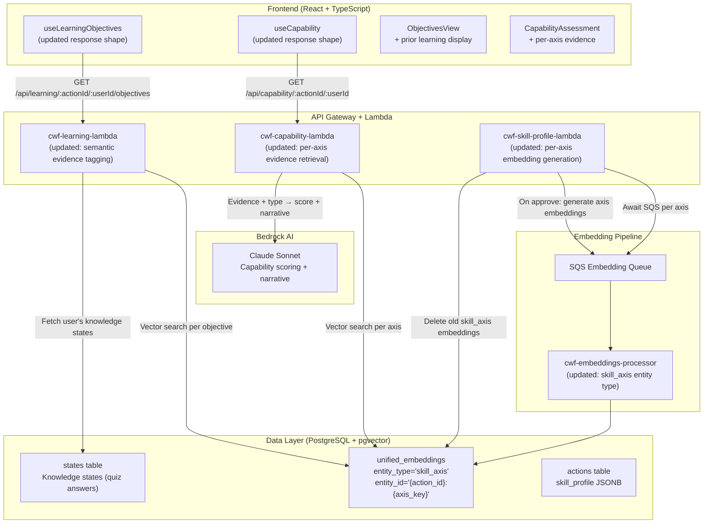
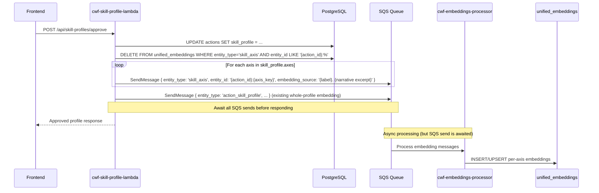
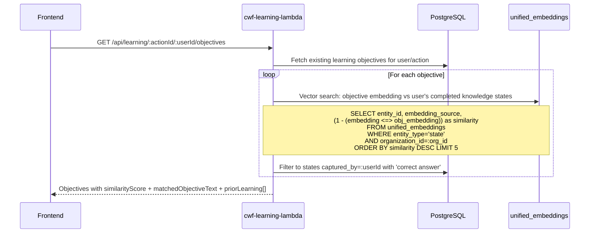
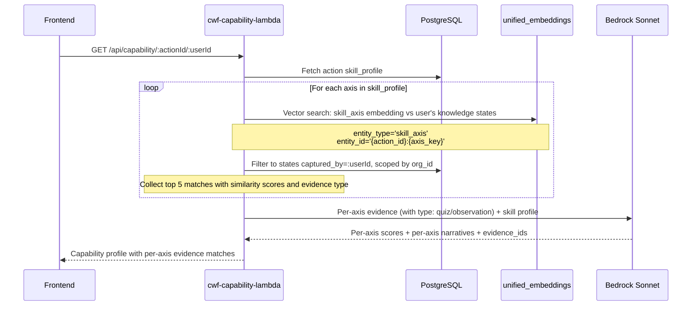
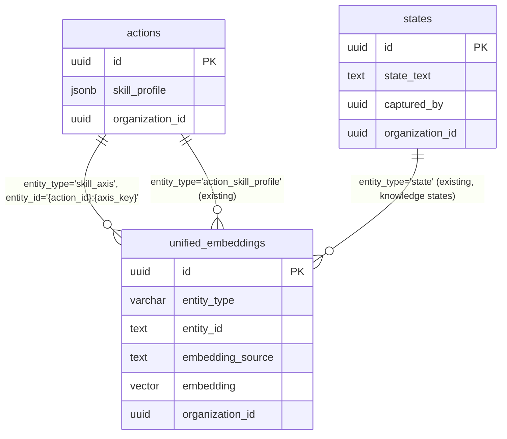

# Design Document: Transferable Learning

## Overview

Transferable Learning replaces exact-ID matching with semantic similarity for learning evidence retrieval. Currently, the `tagObjectiveEvidence` function in the learning Lambda does a simple check — "does this objective ID have a correct answer?" — which breaks when skill profiles are regenerated with new axis keys. A person who demonstrated understanding of "water chemistry testing" gets zero credit when the profile changes to "water quality testing methodology."

This spec introduces three changes to the existing system:

1. **Per-axis embeddings** — When a skill profile is approved, each axis gets its own embedding in `unified_embeddings` (entity_type `skill_axis`, entity_id `{action_id}:{axis_key}`). This replaces the single whole-profile embedding for evidence retrieval.

2. **Semantic evidence retrieval** — The capability Lambda and learning Lambda use per-axis vector similarity to find the user's most relevant prior knowledge states, regardless of which action or skill profile they originated from. Each objective gets a continuous `similarityScore` (0.0–1.0) instead of categorical tags.

3. **Transparent evidence display** — The API returns the top 5 matches per objective/axis with similarity scores and source texts, so the frontend can show users what prior learning was found and let them decide whether to skip or review.

Key design decisions:

- **Continuous similarity scores** (0.0–1.0) instead of categorical tags (`no_evidence`/`some_evidence`/`previously_correct`) — the frontend uses the raw score for UI decisions
- **Top 5 matches per objective/axis** for transparency and validation — users see what was matched and why
- **Bedrock stays for interpretation** — vector search handles retrieval, Bedrock handles reasoning and narrative generation
- **Per-axis embeddings** (entity_type `skill_axis`) instead of whole-profile embedding for targeted evidence retrieval
- **Embedding generation awaited** (not fire-and-forget) to avoid the recurring missing-embedding issue
- **Evidence scoped to current user and organization_id** for multi-tenant isolation
- **Objective status stays `not_started`** regardless of similarity — user decides whether to skip or revisit
- **Existing `action_skill_profile` embedding retained** for backward compatibility with the capability Lambda's current flow

## Architecture



### Request Flow: Skill Profile Approval with Per-Axis Embeddings



### Request Flow: Semantic Evidence Tagging for Learning Objectives



### Request Flow: Per-Axis Capability Assessment



## Components and Interfaces

### 1. Updated Lambda: `cwf-skill-profile-lambda` (handleApprove)

The existing `handleApprove` function is extended to generate per-axis embeddings.

**Changes:**

1. After storing the approved profile, delete any existing `skill_axis` embeddings for this action
2. For each axis in the profile, compose an embedding source and send an SQS message with `entity_type: 'skill_axis'` and `entity_id: '{action_id}:{axis_key}'`
3. **Await** all SQS sends (not fire-and-forget) to ensure embeddings are queued before the response returns
4. Continue sending the existing `action_skill_profile` embedding for backward compatibility

**Axis embedding source composition:**

```javascript
function composeAxisEmbeddingSource(axis, narrative) {
  const parts = [axis.label];
  if (axis.description) parts.push(axis.description);
  // Include the narrative for richer semantic context
  if (narrative) parts.push(narrative);
  return parts.join('. ');
}
```

**Entity ID format:** `{action_id}:{axis_key}` (e.g., `a1b2c3d4:water_chemistry_testing`)

This composite ID allows:
- Querying all axis embeddings for an action: `entity_id LIKE '{action_id}:%'`
- Querying a specific axis: `entity_id = '{action_id}:{axis_key}'`

### 2. Updated Lambda: `cwf-learning-lambda` (handleGetObjectives)

The existing `handleGetObjectives` function is updated to use semantic similarity instead of exact-ID matching for evidence tagging.

**Changes to evidence tagging:**

Replace the current `tagObjectiveEvidence` function (which does exact ID matching) with a vector similarity search:

1. For each objective, fetch its embedding from `unified_embeddings` (entity_type `state`, entity_id = objective state ID)
2. Search for the top 5 most similar completed knowledge states captured by the current user
3. Filter to knowledge states containing "correct answer" (completed quiz answers)
4. Return the best match's similarity score and source text

**Updated response shape per objective:**

```json
{
  "id": "state-uuid-1",
  "text": "Understand why the water-to-cement ratio affects concrete strength",
  "similarityScore": 0.87,
  "matchedObjectiveText": "Understand water chemistry ratios in concrete mixing",
  "priorLearning": [
    { "similarityScore": 0.87, "sourceText": "Understand water chemistry ratios in concrete mixing" },
    { "similarityScore": 0.72, "sourceText": "Explain how water content affects plaster setting" },
    { "similarityScore": 0.65, "sourceText": "Identify the relationship between hydration and cement curing" }
  ],
  "status": "not_started",
  "completionType": null
}
```

The `evidenceTag` field is removed in favor of `similarityScore`. The frontend uses the raw score to drive UI decisions.

**Semantic search query for each objective:**

```sql
SELECT ue.entity_id, ue.embedding_source,
       (1 - (ue.embedding <=> obj_embedding::vector)) as similarity
FROM unified_embeddings ue
INNER JOIN states s ON s.id = ue.entity_id
WHERE ue.entity_type = 'state'
  AND ue.organization_id = :org_id
  AND s.captured_by = :user_id
  AND s.state_text LIKE '%which was the correct answer%'
ORDER BY ue.embedding <=> obj_embedding::vector
LIMIT 5
```

**Optimization:** To avoid N+1 queries (one per objective), batch the objective embeddings and run a single query per batch, then distribute results by closest match.

### 3. Updated Lambda: `cwf-capability-lambda` (handleIndividualCapability)

The existing capability assessment is updated to use per-axis evidence retrieval instead of a single whole-profile search.

**Changes:**

1. For each axis in the skill profile, fetch the `skill_axis` embedding from `unified_embeddings`
2. Run a vector similarity search per axis against the user's knowledge states and observation states
3. Collect the top 5 matches per axis with similarity scores, source text, and evidence type (quiz vs observation)
4. Pass per-axis evidence to Bedrock with evidence types so the model can reason about what transfers
5. Include per-axis narratives in the response explaining what evidence supports each score

**Updated Bedrock prompt additions:**

The existing capability prompt is extended to include:
- Evidence type per item (quiz completion = Bloom's level 2 minimum, observation = varies)
- Per-axis evidence grouping instead of a flat list
- Request for per-axis narrative explaining evidence transfer

**Updated response shape per axis:**

```json
{
  "key": "water_chemistry",
  "label": "Water Chemistry Testing",
  "level": 3,
  "evidence_count": 4,
  "evidence": [
    {
      "observation_id": "state-uuid",
      "text_excerpt": "For learning objective 'Understand water-cement ratios'...",
      "similarity_score": 0.89,
      "evidence_type": "quiz",
      "source_action_title": "Concrete Foundation Work"
    }
  ],
  "axis_narrative": "Strong transfer from prior concrete work — quiz completion on water-cement ratios demonstrates Understand-level knowledge that directly applies to this axis."
}
```

**Fallback:** If no `skill_axis` embeddings exist (profile approved before this feature), fall back to the existing `action_skill_profile` whole-profile search.

### 4. Updated Lambda: `cwf-embeddings-processor`

The embeddings processor needs to accept `skill_axis` as a valid entity type.

**Changes:**

Add `'skill_axis'` to the `validTypes` array in the handler. No other changes needed — the processor already handles arbitrary entity types with pre-composed `embedding_source` from the SQS message.

```javascript
const validTypes = [
  'part', 'tool', 'action', 'issue', 'policy', 
  'action_existing_state', 'state', 'state_space_model', 
  'financial_record', 'action_skill_profile',
  'skill_axis'  // NEW
];
```

### 5. Updated Frontend Hook: `useLearningObjectives`

The `LearningObjective` interface is updated to replace `evidenceTag` with similarity-based fields.

**Updated types:**

```typescript
export interface PriorLearningMatch {
  similarityScore: number;  // 0.0–1.0
  sourceText: string;
}

export interface LearningObjective {
  id: string;
  text: string;
  similarityScore: number;           // Best match similarity (0.0–1.0)
  matchedObjectiveText: string | null; // Text of best match, or null
  priorLearning: PriorLearningMatch[]; // Top 5 matches
  status: 'not_started' | 'in_progress' | 'completed';
  completionType: 'quiz' | 'demonstrated' | null;
}
```

The `evidenceTag` field is removed. The frontend uses `similarityScore` thresholds for UI decisions:
- `similarityScore >= 0.8`: Show as "Likely covered" — optional review
- `similarityScore >= 0.5`: Show as "Related learning found" — recommended review
- `similarityScore < 0.5` or `null`: Show as "New material" — required

These thresholds are frontend-only constants, not backend logic.

### 6. Updated Frontend: `CapabilityAssessment` Component

The component is updated to display per-axis evidence matches when available.

**Changes:**

- Each axis in the capability profile can show its top evidence matches
- Evidence items display the source text excerpt, similarity score, and evidence type badge (quiz/observation)
- The axis narrative (from Bedrock) is shown in the `AxisDrilldown` sheet

### 7. Updated Frontend: `ObjectivesView` Component

The pre-quiz objectives view uses `similarityScore` and `priorLearning` to present objectives.

**Changes:**

- Objectives with high similarity scores show a "Prior learning found" indicator with the matched text
- Users can expand to see all prior learning matches for an objective
- The "required" vs "optional review" distinction uses `similarityScore` thresholds instead of `evidenceTag`

## Data Models

### New Entity in unified_embeddings: skill_axis

| Field | Value |
|-------|-------|
| `entity_type` | `'skill_axis'` |
| `entity_id` | `'{action_id}:{axis_key}'` (e.g., `'a1b2c3:water_chemistry'`) |
| `embedding_source` | Composed from axis label + description + narrative |
| `model_version` | `'titan-v1'` |
| `embedding` | 1536-dimension vector |
| `organization_id` | From the action's organization |

### Entity Relationship (New Elements)



### Data Flow: Skill Profile Approval

1. User approves skill profile via `POST /api/skill-profiles/approve`
2. Lambda stores profile as JSONB on the action
3. Lambda deletes existing `skill_axis` embeddings for this action (`entity_id LIKE '{action_id}:%'`)
4. Lambda sends SQS messages for each axis embedding (awaited)
5. Lambda sends SQS message for whole-profile embedding (existing, awaited)
6. Embeddings processor generates and stores vectors in `unified_embeddings`

### Data Flow: Semantic Evidence Tagging

1. Frontend requests objectives via `GET /api/learning/:actionId/:userId/objectives`
2. Lambda fetches each objective's embedding from `unified_embeddings`
3. Lambda runs vector similarity search against user's completed knowledge states
4. Lambda returns objectives with `similarityScore`, `matchedObjectiveText`, and `priorLearning[]`
5. Frontend uses similarity thresholds to present objectives as required/optional

### Data Flow: Per-Axis Capability Assessment

1. Frontend requests capability via `GET /api/capability/:actionId/:userId`
2. Lambda fetches `skill_axis` embeddings for each axis
3. Lambda runs per-axis vector similarity against user's states (knowledge + observations)
4. Lambda passes per-axis evidence with types to Bedrock for scoring
5. Bedrock returns per-axis scores and narratives
6. Lambda returns capability profile with per-axis evidence and narratives


## Correctness Properties

*A property is a characteristic or behavior that should hold true across all valid executions of a system — essentially, a formal statement about what the system should do. Properties serve as the bridge between human-readable specifications and machine-verifiable correctness guarantees.*

### Property 1: Completed knowledge state filtering

*For any* user ID, organization ID, and set of knowledge states with varying `captured_by` users and correctness flags, the evidence filtering function should return only states where `captured_by` matches the target user AND the state text contains "correct answer." States from other users or with incorrect answers should never appear in the results.

**Validates: Requirements 1.1, 1.5**

### Property 2: Best match extraction from similarity results

*For any* non-empty array of similarity search results (each with a similarity score in [0.0, 1.0] and a source text), the best-match extraction function should return a `similarityScore` equal to the maximum similarity value in the array and a `matchedObjectiveText` equal to the source text of that maximum-similarity result. For an empty array, `similarityScore` should be 0.0 and `matchedObjectiveText` should be null.

**Validates: Requirements 1.3, 1.4**

### Property 3: Evidence search scoped to user and organization

*For any* evidence search query, all returned results should have `organization_id` matching the querying user's organization and `captured_by` matching the target user. No states from other organizations or other users should appear in the results.

**Validates: Requirements 1.5, 2.6, 3.5**

### Property 4: Per-axis embedding message generation

*For any* valid skill profile with N axes (where 4 ≤ N ≤ 6), the approval flow should produce exactly N SQS messages with `entity_type = 'skill_axis'`, one per axis. Each message's `entity_id` should follow the format `{action_id}:{axis_key}`, and no two messages should share the same `entity_id`.

**Validates: Requirements 2.1, 4.1**

### Property 5: Top-K similarity results extraction

*For any* set of similarity search results of size M and a limit K=5, the top-K extraction function should return min(M, K) items ordered by similarity score descending. Each item should include a `similarityScore` in [0.0, 1.0] and a non-empty `sourceText`. No item outside the top K by similarity should appear in the results.

**Validates: Requirements 2.5, 3.2**

### Property 6: Similarity threshold classification

*For any* similarity score in [0.0, 1.0], the classification function should return exactly one of: `'likely_covered'` (score ≥ 0.8), `'related_learning'` (0.5 ≤ score < 0.8), or `'new_material'` (score < 0.5). The three categories should be mutually exclusive and exhaustive over the [0.0, 1.0] range.

**Validates: Requirements 3.3**

### Property 7: New objective status invariant

*For any* newly generated learning objective with any similarity score (including scores ≥ 0.8), the objective's `status` should be `'not_started'` and `completionType` should be `null`. Prior learning similarity should never cause an objective to be auto-completed.

**Validates: Requirements 3.4**

### Property 8: Axis embedding source composition

*For any* skill axis with a non-empty label, an optional description, and an optional narrative, the composed embedding source should contain the label. If the description is non-empty, the source should contain the description. If the narrative is non-empty, the source should contain the narrative. The composed source should never be empty.

**Validates: Requirements 4.2**

### Property 9: Axis entity ID round-trip

*For any* valid action ID (UUID format) and valid axis key (snake_case string), composing the entity ID as `{action_id}:{axis_key}` and then parsing it back should recover the original action ID and axis key. The `:` separator should appear exactly once in the entity ID.

**Validates: Requirements 4.1**

## Error Handling

### Skill Axis Embedding Errors

| Scenario | Handling |
|----------|----------|
| SQS send fails for one axis embedding | Log error, continue with remaining axes. Return success with warning that some embeddings may be delayed. |
| Embeddings processor fails for `skill_axis` type | SQS retry handles this automatically. Capability assessment falls back to `action_skill_profile` whole-profile search. |
| No `skill_axis` embeddings found during capability assessment | Fall back to existing `action_skill_profile` embedding search (backward compatibility). Log warning. |

### Semantic Evidence Tagging Errors

| Scenario | Handling |
|----------|----------|
| Objective has no embedding in `unified_embeddings` | Return `similarityScore: 0.0`, `matchedObjectiveText: null`, `priorLearning: []`. Log warning — embedding pipeline may still be processing. |
| Vector search returns no results for a user | Return `similarityScore: 0.0`, `matchedObjectiveText: null`, `priorLearning: []`. This is normal for new users. |
| Vector search times out | Return objectives without similarity data (graceful degradation). Log error. |

### Per-Axis Capability Assessment Errors

| Scenario | Handling |
|----------|----------|
| `skill_axis` embedding missing for one axis | Fall back to whole-profile search for that axis. Include in response with a flag indicating fallback was used. |
| All `skill_axis` embeddings missing | Fall back entirely to existing `action_skill_profile` flow. This handles profiles approved before this feature was deployed. |
| Bedrock fails to produce per-axis narratives | Use existing narrative format (single narrative for all axes). Log warning. |

### Frontend Error Handling

- If `similarityScore` is missing from the response, treat as 0.0 (new material)
- If `priorLearning` is missing or empty, show no prior learning indicator
- Graceful degradation: if the new fields are absent, fall back to the existing `evidenceTag`-based display

## Testing Strategy

### Property-Based Tests (Vitest + fast-check)

Property-based tests use [fast-check](https://github.com/dubzzz/fast-check) with Vitest. Each property test runs a minimum of 100 iterations and is tagged with its design property reference.

| Property | Target Function | Tag |
|----------|----------------|-----|
| Property 1 | `filterCompletedKnowledgeStates` | Feature: transferable-learning, Property 1: Completed knowledge state filtering |
| Property 2 | `extractBestMatch` | Feature: transferable-learning, Property 2: Best match extraction from similarity results |
| Property 3 | `scopeEvidenceQuery` | Feature: transferable-learning, Property 3: Evidence search scoped to user and organization |
| Property 4 | `buildAxisEmbeddingMessages` | Feature: transferable-learning, Property 4: Per-axis embedding message generation |
| Property 5 | `extractTopKMatches` | Feature: transferable-learning, Property 5: Top-K similarity results extraction |
| Property 6 | `classifySimilarity` | Feature: transferable-learning, Property 6: Similarity threshold classification |
| Property 7 | Objective construction logic | Feature: transferable-learning, Property 7: New objective status invariant |
| Property 8 | `composeAxisEmbeddingSource` | Feature: transferable-learning, Property 8: Axis embedding source composition |
| Property 9 | `composeAxisEntityId` / `parseAxisEntityId` | Feature: transferable-learning, Property 9: Axis entity ID round-trip |

### Unit Tests (Vitest)

- `composeAxisEmbeddingSource` with label only, label + description, label + description + narrative
- `composeAxisEntityId` with various UUID and snake_case key combinations
- `parseAxisEntityId` with valid and invalid formats
- `extractBestMatch` with empty results, single result, multiple results with ties
- `extractTopKMatches` with fewer than 5 results, exactly 5, more than 5
- `classifySimilarity` at boundary values: 0.0, 0.49, 0.5, 0.79, 0.8, 1.0
- `filterCompletedKnowledgeStates` with mixed correct/incorrect answers and multiple users
- Updated `handleGetObjectives` response shape validation
- Updated `handleIndividualCapability` per-axis evidence response validation
- Backward compatibility: capability assessment with no `skill_axis` embeddings falls back to `action_skill_profile`

### Integration Tests

- Skill profile approval → verify `skill_axis` embeddings created in `unified_embeddings` with correct entity_ids
- Skill profile re-approval → verify old `skill_axis` embeddings deleted, new ones created
- Learning objectives endpoint → verify `similarityScore` and `priorLearning` populated from real embeddings
- Capability assessment → verify per-axis evidence retrieval uses `skill_axis` embeddings
- Multi-tenant isolation: user A's knowledge states not visible in user B's evidence search
- Backward compatibility: capability assessment works with only `action_skill_profile` embedding (no `skill_axis`)

### Frontend Component Tests (Vitest + React Testing Library)

- `ObjectivesView` renders "Likely covered" indicator when `similarityScore >= 0.8`
- `ObjectivesView` renders "Related learning found" when `0.5 <= similarityScore < 0.8`
- `ObjectivesView` renders "New material" when `similarityScore < 0.5`
- `ObjectivesView` expands to show `priorLearning` matches
- `CapabilityAssessment` renders per-axis evidence with similarity scores
- `AxisDrilldown` shows axis narrative from Bedrock
- Graceful degradation: components handle missing `similarityScore` and `priorLearning` fields
