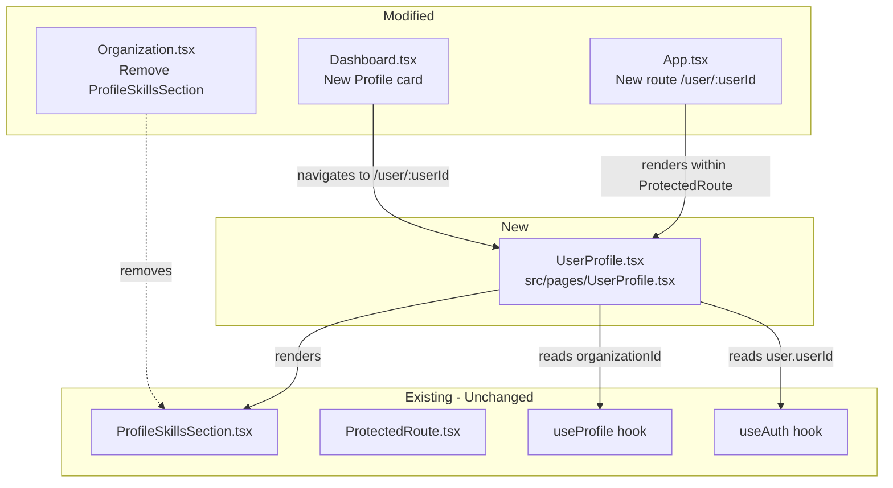

# Design Document: User Profile Page

## Overview

The User Profile Page introduces a dedicated personal hub at `/user/:userId` that consolidates user-specific content — starting with the existing ProfileSkillsSection — into a single, extensible page accessible to all authenticated users. The design reuses existing components and patterns (Settings page layout, ProtectedRoute wrapper, Dashboard navigation cards) to minimize new code while establishing a foundation for future profile sections (payroll, growth dashboards, impact metrics).

### Key Design Decisions

1. **Reuse the Settings page layout pattern** — The existing `SettingsPage` already demonstrates the header-with-back-button + single-column card stack pattern. The User Profile Page follows this same structure for visual consistency.
2. **Extract `useParams` for userId** — The page reads `userId` from the URL via React Router's `useParams`, enabling future use cases where users view other users' profiles (not just their own).
3. **Leverage `useProfile` for organization context** — Rather than introducing a new data-fetching mechanism, the page uses the existing `useProfile` hook to resolve `organizationId`, which is required by `ProfileSkillsSection`.
4. **Dashboard card positioned before Organization Settings** — The Profile card is inserted into the `menuItems` array before the "Organization Settings" entry, making it visible to all users regardless of role.

## Architecture

The feature touches four existing files and introduces one new file:



### Data Flow

1. **Dashboard → UserProfile**: User clicks Profile card → navigates to `/user/{currentUserId}`
2. **Route → Page**: React Router extracts `:userId` param → passes to `UserProfile` component
3. **Page → ProfileSkillsSection**: `UserProfile` resolves `organizationId` via `useProfile` → renders `ProfileSkillsSection` with `userId` + `organizationId` props

## Components and Interfaces

### New Component: `UserProfile` (`src/pages/UserProfile.tsx`)

```typescript
// No props — reads userId from URL params
export default function UserProfile(): JSX.Element
```

**Internal dependencies:**
- `useParams()` from `react-router-dom` — extracts `userId` from URL
- `useNavigate()` from `react-router-dom` — back navigation to dashboard
- `useProfile()` from `@/hooks/useProfile` — provides `fullName`, `organizationId`, `isLoading`
- `useAuth()` from `@/hooks/useCognitoAuth` — provides `user.userId` for document title logic
- `ProfileSkillsSection` from `@/components/ProfileSkillsSection` — existing component, receives `userId` and `organizationId`

**Rendering structure:**
```
<div className="min-h-screen bg-background">
  <header>  ← Back button + page title (first name or "Profile")
  <main>
    <section className="max-w-xl space-y-6">  ← Single-column card stack
      <ProfileSkillsSection userId={userId} organizationId={organizationId} />
      {/* Future sections added here */}
    </section>
  </main>
</div>
```

### Modified: `App.tsx` — New Route

Add a new `<Route>` entry before the catch-all:

```typescript
<Route
  path="/user/:userId"
  element={
    <ProtectedRoute>
      <UserProfile />
    </ProtectedRoute>
  }
/>
```

### Modified: `Dashboard.tsx` — Profile Navigation Card

Insert a new entry into the `menuItems` array before "Organization Settings":

```typescript
{
  title: firstName || "My Profile",       // dynamic from useProfile
  description: "View and manage your areas of focus",
  icon: User,                             // from lucide-react (already imported)
  path: `/user/${user?.userId}`,          // dynamic path
  color: "bg-purple-500"
}
```

The `User` icon is already imported in Dashboard.tsx (not currently used in menuItems but available via lucide-react). The card is unconditionally shown to all authenticated users — no role filtering needed.

### Modified: `Organization.tsx` — Remove ProfileSkillsSection

Remove:
1. The `import { ProfileSkillsSection } from '@/components/ProfileSkillsSection'` statement
2. The JSX block rendering `<ProfileSkillsSection userId={user.userId} organizationId={targetOrganization.id} />`

All other Organization page sections remain untouched.

## Data Models

No new data models are introduced. The feature relies entirely on existing data:

| Data | Source | Hook |
|------|--------|------|
| `userId` | URL parameter `:userId` | `useParams()` |
| `fullName` | Profile API (`/profiles`) | `useProfile()` |
| `organizationId` | Organization memberships API | `useProfile()` |
| `user.userId` | Cognito auth session | `useAuth()` |
| Profile skills | Skills API (within ProfileSkillsSection) | `useProfileSkills()` (internal to component) |

## Error Handling

| Scenario | Behavior |
|----------|----------|
| **Unauthenticated user** | `ProtectedRoute` redirects to `/auth` |
| **Organization context loading** | Page shows a loading spinner (Loader2 icon + "Loading profile..." text) while `useProfile().isLoading` is true |
| **Organization context unavailable** | Page displays an `Alert` with an informational message: "Organization data is required to display profile skills. Please ensure you belong to an organization." |
| **Missing userId URL param** | React Router won't match the route without `:userId`, so this results in a 404 (existing NotFound page) |
| **Profile name unavailable** | Page title falls back to "Profile"; document title falls back to "My Profile \| Asset Tracker" |
| **Dashboard name unavailable** | Profile card title falls back to "My Profile" |

## Testing Strategy

### PBT Assessment

Property-based testing is **not applicable** for this feature. The feature consists of:
- UI page composition and layout (rendering)
- Route configuration (declarative wiring)
- Component prop passing (simple data flow)
- Navigation card addition (static configuration)

There are no pure functions with meaningful input variation, no data transformations, no serialization, and no business logic with universal properties. All acceptance criteria are best validated with example-based unit tests and integration tests.

### Unit Tests (Vitest + React Testing Library)

**UserProfile page component:**
- Renders page header with back button
- Displays first name as page title when available
- Falls back to "Profile" when name is unavailable
- Sets document title to "{firstName}'s Profile | Asset Tracker"
- Falls back to "My Profile | Asset Tracker" for document title
- Renders ProfileSkillsSection with correct userId and organizationId props
- Shows loading state while organization context resolves
- Shows informational message when organization context is unavailable

**Dashboard Profile card:**
- Profile card appears in the navigation grid for all authenticated users
- Card title shows user's first name when available
- Card title falls back to "My Profile" when name unavailable
- Card navigates to `/user/{currentUserId}` on click
- Profile card appears before Organization Settings card

**Organization page:**
- ProfileSkillsSection is not rendered on the Organization page
- All other Organization sections continue to render correctly

**Route configuration:**
- `/user/:userId` route renders UserProfile within ProtectedRoute
- Unauthenticated access redirects to `/auth`

### Integration Tests

- End-to-end flow: Dashboard → click Profile card → lands on UserProfile page → ProfileSkillsSection visible
- Back button navigates to Dashboard
